# 自动定理证明 - Automated Theorem Proving / Automated Theorem Proving

## 📚 概述 / Overview

本文档介绍自动定理证明的基础概念、主要证明系统（Coq、Lean、TLA+、Isabelle）、自动化证明脚本和证明复杂度分析。

## 📑 目录 / Table of Contents

- [自动定理证明 - Automated Theorem Proving / Automated Theorem Proving](#自动定理证明---automated-theorem-proving--automated-theorem-proving)
  - [📚 概述 / Overview](#-概述--overview)
  - [📑 目录 / Table of Contents](#-目录--table-of-contents)
  - [2.1 自动定理证明基础](#21-自动定理证明基础)
    - [2.1.1 形式化证明系统](#211-形式化证明系统)
    - [2.1.2 主要证明系统](#212-主要证明系统)
    - [2.1.3 证明策略与自动化](#213-证明策略与自动化)
  - [2.2 Coq形式化证明](#22-coq形式化证明)
    - [2.2.1 基础类型与命题](#221-基础类型与命题)
    - [2.2.2 图论定理证明](#222-图论定理证明)
    - [2.2.3 网络协议证明](#223-网络协议证明)
    - [2.2.4 分布式系统证明](#224-分布式系统证明)
  - [2.3 Lean形式化证明](#23-lean形式化证明)
    - [2.3.1 数学结构定义](#231-数学结构定义)
    - [2.3.2 算法正确性证明](#232-算法正确性证明)
    - [2.3.3 分布式系统证明](#233-分布式系统证明)
  - [2.4 TLA+规范与验证](#24-tla规范与验证)
    - [2.4.1 系统规范](#241-系统规范)
    - [2.4.2 时序性质验证](#242-时序性质验证)
    - [2.4.3 分布式共识协议](#243-分布式共识协议)
  - [2.5 自动化证明脚本](#25-自动化证明脚本)
    - [2.5.1 Coq自动化策略](#251-coq自动化策略)
    - [2.5.2 Lean自动化策略](#252-lean自动化策略)
    - [2.5.3 TLA+模型检测](#253-tla模型检测)
  - [2.6 证明复杂度分析](#26-证明复杂度分析)
    - [2.6.1 证明搜索复杂度](#261-证明搜索复杂度)
    - [2.6.2 自动化策略优化](#262-自动化策略优化)
  - [2.7 多模态表达与可视化](#27-多模态表达与可视化)
    - [2.7.1 证明结构图](#271-证明结构图)
    - [2.7.2 证明策略流程图](#272-证明策略流程图)
    - [2.7.3 自动化脚本建议](#273-自动化脚本建议)
  - [2.8 实际工程应用案例 / Real-World Engineering Application Cases](#28-实际工程应用案例--real-world-engineering-application-cases)
    - [2.8.1 数学定理证明应用 / Mathematical Theorem Proving Applications](#281-数学定理证明应用--mathematical-theorem-proving-applications)
      - [2.8.1.1 四色定理证明](#2811-四色定理证明)
      - [2.8.1.2 费马大定理证明](#2812-费马大定理证明)
    - [2.8.2 程序验证应用 / Program Verification Applications](#282-程序验证应用--program-verification-applications)
      - [2.8.2.1 编译器验证](#2821-编译器验证)
      - [2.8.2.2 操作系统内核验证](#2822-操作系统内核验证)
    - [2.8.3 硬件验证应用 / Hardware Verification Applications](#283-硬件验证应用--hardware-verification-applications)
      - [2.8.3.1 微处理器验证](#2831-微处理器验证)
      - [2.8.3.2 数字电路验证](#2832-数字电路验证)
    - [2.8.4 自动定理证明工具与应用 / Automated Theorem Proving Tools and Applications](#284-自动定理证明工具与应用--automated-theorem-proving-tools-and-applications)
      - [2.8.4.1 主流自动定理证明工具](#2841-主流自动定理证明工具)
      - [2.8.4.2 实际应用案例](#2842-实际应用案例)
  - [2.9 形式化语义与概念解释](#29-形式化语义与概念解释)
    - [2.9.1 证明系统语义](#291-证明系统语义)
    - [2.9.2 自动化概念](#292-自动化概念)
    - [2.9.3 典型定理与证明](#293-典型定理与证明)
      - [2.9.3.1 停机问题不可判定性](#2931-停机问题不可判定性)
      - [2.9.3.2 哥德尔不完备性](#2932-哥德尔不完备性)
      - [2.9.3.3 邱奇-图灵论题](#2933-邱奇-图灵论题)

---

## 2.1 自动定理证明基础

### 2.1.1 形式化证明系统

**定义 2.1.1** (自动定理证明系统 - Automated Theorem Proving System)
**自动定理证明系统**是一个五元组：
$$\mathcal{ATP} = \langle \mathcal{L}, \mathcal{A}, \mathcal{R}, \mathcal{S}, \mathcal{T} \rangle$$

其中：

- $\mathcal{L}$ 是形式语言 (formal language)
- $\mathcal{A}$ 是公理集 (axiom set)
- $\mathcal{R}$ 是推理规则集 (inference rule set)
- $\mathcal{S}$ 是搜索策略 (search strategy)
- $\mathcal{T}$ 是定理集 (theorem set)

**形式化语义**：

- 集合论语义：$\mathcal{L} \neq \emptyset, \mathcal{A} \subseteq \mathcal{L}, \mathcal{R}: \mathcal{L}^* \to \mathcal{L}$
- 范畴论语义：证明系统作为范畴中的对象，证明变换作为态射

**定义 2.1.2** (证明搜索 - Proof Search)
**证明搜索**是在证明空间中寻找有效证明的过程：
$$\text{search}: \mathcal{L} \to \mathcal{P}(\mathcal{L}^*)$$

其中 $\mathcal{P}(\mathcal{L}^*)$ 是所有可能证明序列的幂集。

### 2.1.2 主要证明系统

**Coq系统**：

- 基于构造性类型论的形式化证明系统
- 支持高阶逻辑、归纳类型、依赖类型
- 提供交互式证明环境和自动化策略

**Lean系统**：

- 基于类型论的数学证明助手
- 支持函数式编程和定理证明
- 提供丰富的数学库和自动化工具

**TLA+系统**：

- 用于并发和分布式系统规范的形式化语言
- 支持时序逻辑和模型检测
- 提供TLC模型检测器

**Isabelle系统**：

- 通用定理证明器，支持多种逻辑
- 提供丰富的证明策略和自动化工具
- 支持高阶逻辑和集合论

### 2.1.3 证明策略与自动化

**定义 2.1.3** (证明策略 - Proof Strategy)
**证明策略**是自动证明的方法：
$$\text{tactic}: \text{Goal} \to \text{Goal list}$$

**归纳策略**：

- 对递归数据结构进行归纳证明
- 自动生成归纳假设和基础情况

**重写策略**：

- 基于等式重写规则进行证明
- 支持条件重写和定向重写

**决策过程**：

- 线性算术、布尔逻辑、数组理论等
- 自动判定特定理论中的公式有效性

## 2.2 Coq形式化证明

### 2.2.1 基础类型与命题

```coq
(* 自然数类型 *)
Inductive nat : Type :=
  | O : nat
  | S : nat -> nat.

(* 命题类型 *)
Inductive Prop : Type :=
  | True : Prop
  | False : Prop
  | And : Prop -> Prop -> Prop
  | Or : Prop -> Prop -> Prop
  | Implies : Prop -> Prop -> Prop.

(* 图的基本定义 *)
Record Graph := {
  vertices : list nat;
  edges : list (nat * nat);
  valid_edges : forall (u v : nat),
    In (u, v) edges -> In u vertices /\ In v vertices
}.

(* 路径定义 *)
Inductive path (G : Graph) : nat -> nat -> list nat -> Prop :=
  | path_nil : forall v : nat,
      In v (vertices G) -> path G v v nil
  | path_cons : forall u v w : nat, forall p : list nat,
      In (u, v) (edges G) -> path G v w p -> path G u w (u :: p).
```

### 2.2.2 图论定理证明

```coq
(* 连通性定义 *)
Definition connected (G : Graph) :=
  forall u v : nat,
    In u (vertices G) -> In v (vertices G) ->
    exists path : list nat,
      path G u v path.

(* 欧拉路径定理 *)
Theorem euler_path_exists :
  forall G : Graph,
    connected G ->
    (forall v : nat, In v (vertices G) -> even_degree G v) ->
    exists path : list nat, euler_path G path.

(* 证明策略 *)
Proof.
  intros G Hconn Hdeg.
  induction (vertices G) as [|v vs IH].
  - (* 空图情况 *)
    exists nil. constructor.
  - (* 归纳步骤 *)
    (* 构造欧拉路径 *)
    apply euler_path_construction.
    apply Hconn.
    apply Hdeg.
Qed.

(* 握手定理 *)
Theorem handshaking_lemma :
  forall G : Graph,
    sum_degrees G = 2 * length (edges G).

Proof.
  intros G.
  induction (edges G) as [|e es IH].
  - (* 空边集 *)
    simpl. reflexivity.
  - (* 归纳步骤 *)
    destruct e as [u v].
    simpl.
    rewrite IH.
    (* 每条边贡献2度 *)
    omega.
Qed.
```

### 2.2.3 网络协议证明

```coq
(* 协议状态机 *)
Inductive ProtocolState :=
  | Init : ProtocolState
  | Waiting : nat -> ProtocolState
  | Established : nat -> ProtocolState
  | Closed : ProtocolState.

(* 协议转换 *)
Inductive ProtocolTransition : ProtocolState -> ProtocolState -> Prop :=
  | connect : forall id : nat,
      ProtocolTransition Init (Waiting id)
  | establish : forall id : nat,
      ProtocolTransition (Waiting id) (Established id)
  | close : forall id : nat,
      ProtocolTransition (Established id) Closed.

(* 协议安全性 *)
Theorem protocol_safety :
  forall s1 s2 : ProtocolState,
    ProtocolTransition s1 s2 ->
    valid_state s1 -> valid_state s2.

Proof.
  intros s1 s2 Htrans Hvalid.
  induction Htrans; auto.
  (* 验证状态转换的有效性 *)
  apply state_validation.
Qed.

(* 协议活性 *)
Theorem protocol_liveness :
  forall s : ProtocolState,
    valid_state s ->
    exists s' : ProtocolState,
      ProtocolTransition s s'.

Proof.
  intros s Hvalid.
  destruct s; eauto.
  (* 构造下一个状态 *)
  apply transition_construction.
Qed.
```

### 2.2.4 分布式系统证明

```coq
(* 分布式节点 *)
Record DistributedNode := {
  node_id : nat;
  node_state : NodeState;
  node_clock : nat;
  node_messages : list Message
}.

(* 分布式系统 *)
Record DistributedSystem := {
  nodes : list DistributedNode;
  network : Network;
  protocol : Protocol
}.

(* 共识协议 *)
Inductive ConsensusState :=
  | Initial : ConsensusState
  | Prepared : nat -> ConsensusState
  | Committed : nat -> ConsensusState.

(* 共识安全性 *)
Theorem consensus_safety :
  forall s1 s2 : ConsensusState,
    ConsensusTransition s1 s2 ->
    valid_consensus s1 ->
    valid_consensus s2.

Proof.
  intros s1 s2 Htrans Hvalid.
  induction Htrans; auto.
  (* 验证共识状态的有效性 *)
  apply consensus_validation.
Qed.
```

## 2.3 Lean形式化证明

### 2.3.1 数学结构定义

```lean
-- 图论结构
structure Graph :=
  (vertices : finset ℕ)
  (edges : finset (ℕ × ℕ))
  (valid_edges : ∀ (u v : ℕ), (u, v) ∈ edges → u ∈ vertices ∧ v ∈ vertices)

-- 路径定义
def path (G : Graph) (u v : ℕ) : list ℕ → Prop
| [] := u = v
| (w :: ws) := (u, w) ∈ G.edges ∧ path G w v ws

-- 连通性
def connected (G : Graph) : Prop :=
  ∀ u v ∈ G.vertices, ∃ p : list ℕ, path G u v p

-- 度定义
def degree (G : Graph) (v : ℕ) : ℕ :=
  (G.edges.filter (λ e, e.1 = v ∨ e.2 = v)).card

-- 握手定理
theorem handshaking_lemma (G : Graph) :
  ∑ v in G.vertices, degree G v = 2 * G.edges.card :=
begin
  -- 证明握手定理
  apply finset.sum_congr rfl,
  intros v hv,
  -- 计算每个顶点的度
  simp [degree],
  -- 每条边贡献2度
  apply edge_contribution
end
```

### 2.3.2 算法正确性证明

```lean
-- 最短路径算法
def dijkstra (G : Graph) (source : ℕ) : ℕ → ℕ :=
  -- 算法实现
  sorry

-- 算法正确性定理
theorem dijkstra_correct (G : Graph) (source : ℕ) :
  ∀ target ∈ G.vertices,
  let dist := dijkstra G source
  in dist target = shortest_distance G source target :=
begin
  intros target htarget,
  -- 证明算法正确性
  apply dijkstra_induction,
  { -- 基础情况
    simp [dijkstra] },
  { -- 归纳步骤
    apply shortest_path_property }
end

-- 算法终止性
theorem dijkstra_terminates (G : Graph) (source : ℕ) :
  terminates (dijkstra G source) :=
begin
  -- 证明算法终止
  apply termination_induction,
  { -- 基础情况
    simp [terminates] },
  { -- 归纳步骤
    apply termination_property }
end

-- 算法复杂度
theorem dijkstra_complexity (G : Graph) (source : ℕ) :
  time_complexity (dijkstra G source) = O(G.vertices.card^2) :=
begin
  -- 证明算法复杂度
  apply complexity_analysis,
  { -- 初始化复杂度
    simp [time_complexity] },
  { -- 主循环复杂度
    apply loop_complexity }
end
```

### 2.3.3 分布式系统证明

```lean
-- 共识协议状态
inductive ConsensusState
| initial
| prepared (value : ℕ)
| committed (value : ℕ)

-- 协议转换
inductive ConsensusTransition : ConsensusState → ConsensusState → Prop
| propose : ∀ v, ConsensusTransition .initial (.prepared v)
| commit : ∀ v, ConsensusTransition (.prepared v) (.committed v)

-- 安全性证明
theorem consensus_safety :
  ∀ s1 s2 : ConsensusState,
  ConsensusTransition s1 s2 →
  valid_consensus_state s1 → valid_consensus_state s2 :=
begin
  intros s1 s2 htrans hvalid,
  cases htrans,
  { -- propose 转换
    apply prepared_state_valid },
  { -- commit 转换
    apply committed_state_valid }
end

-- 活性证明
theorem consensus_liveness :
  ∀ s : ConsensusState,
  valid_consensus_state s →
  ∃ s' : ConsensusState,
  ConsensusTransition s s' :=
begin
  intros s hvalid,
  cases s,
  { -- initial 状态
    existsi ConsensusState.prepared 0,
    apply ConsensusTransition.propose },
  { -- prepared 状态
    cases hvalid with v hv,
    existsi ConsensusState.committed v,
    apply ConsensusTransition.commit },
  { -- committed 状态
    -- 已达成共识，无需进一步转换
    contradiction }
end
```

## 2.4 TLA+规范与验证

### 2.4.1 系统规范

```tla
---------------------------- MODULE NetworkProtocol ----------------------------
EXTENDS Naturals, Sequences

VARIABLES nodes, messages, connections

Init ==
  /\ nodes = {}
  /\ messages = {}
  /\ connections = {}

Next ==
  \/ AddNode
  \/ SendMessage
  \/ EstablishConnection
  \/ RemoveNode

AddNode ==
  /\ \E node \in Nat :
     /\ node \notin nodes
     /\ nodes' = nodes \cup {node}
  /\ UNCHANGED <<messages, connections>>

SendMessage ==
  /\ \E sender, receiver \in nodes :
     /\ \E msg \in Nat :
        /\ messages' = messages \cup {<<sender, receiver, msg>>}
  /\ UNCHANGED <<nodes, connections>>

EstablishConnection ==
  /\ \E n1, n2 \in nodes :
     /\ n1 \neq n2
     /\ <<n1, n2>> \notin connections
     /\ connections' = connections \cup {<<n1, n2>>}
  /\ UNCHANGED <<nodes, messages>>

RemoveNode ==
  /\ \E node \in nodes :
     /\ nodes' = nodes \ {node}
     /\ messages' = {msg \in messages : msg[1] \neq node /\ msg[2] \neq node}
     /\ connections' = {conn \in connections : conn[1] \neq node /\ conn[2] \neq node}

Invariant ==
  /\ \A msg \in messages :
     /\ msg[1] \in nodes
     /\ msg[2] \in nodes
  /\ \A conn \in connections :
     /\ conn[1] \in nodes
     /\ conn[2] \in nodes
  /\ \A conn \in connections :
     /\ conn[1] \neq conn[2]

=============================================================================
```

### 2.4.2 时序性质验证

```tla
---------------------------- MODULE ProtocolVerification ------------------------
EXTENDS NetworkProtocol

(* 消息传递性质 *)
MessageDelivery ==
  \A msg \in messages :
    \E sender, receiver \in nodes :
      msg = <<sender, receiver, content>> =>
      \E conn \in connections :
        conn = <<sender, receiver>> \/ conn = <<receiver, sender>>

(* 连通性保持 *)
ConnectivityPreservation ==
  \A n1, n2 \in nodes :
    n1 \neq n2 =>
    \E path \in SUBSET nodes :
      path_connects(n1, n2, path)

(* 死锁避免 *)
DeadlockFreedom ==
  \A n \in nodes :
    \E msg \in messages :
      msg[1] = n \/ msg[2] = n

(* 公平性 *)
Fairness ==
  \A n \in nodes :
    WF_n(Next) =>
    \E msg \in messages :
      msg[1] = n \/ msg[2] = n

(* 模型检测性质 *)
Properties ==
  /\ MessageDelivery
  /\ ConnectivityPreservation
  /\ DeadlockFreedom
  /\ Fairness

(* 安全性性质 *)
Safety ==
  /\ Invariant
  /\ \A state : [Next]_vars =>
       Invariant

(* 活性性质 *)
Liveness ==
  /\ \A n \in nodes :
       WF_n(Next) =>
       \E msg \in messages :
         msg[1] = n \/ msg[2] = n

=============================================================================
```

### 2.4.3 分布式共识协议

```tla
---------------------------- MODULE ConsensusProtocol -------------------------
EXTENDS Naturals, Sequences

VARIABLES nodes, values, consensus_state

(* 节点状态 *)
NodeState == [id : Nat, value : Nat, state : {"initial", "prepared", "committed"}]

Init ==
  /\ nodes = {}
  /\ values = {}
  /\ consensus_state = "initial"

Next ==
  \/ Propose
  \/ Prepare
  \/ Commit
  \/ Decide

Propose ==
  /\ \E node \in Nat :
     /\ node \notin DOMAIN nodes
     /\ \E value \in Nat :
        /\ nodes' = nodes \cup [node |-> [id |-> node, value |-> value, state |-> "initial"]]
        /\ values' = values \cup [node |-> value]
  /\ consensus_state' = consensus_state

Prepare ==
  /\ \E node \in DOMAIN nodes :
     /\ nodes[node].state = "initial"
     /\ nodes' = nodes @@ [node |-> nodes[node] EXCEPT !.state = "prepared"]
  /\ consensus_state' = consensus_state

Commit ==
  /\ \E node \in DOMAIN nodes :
     /\ nodes[node].state = "prepared"
     /\ nodes' = nodes @@ [node |-> nodes[node] EXCEPT !.state = "committed"]
  /\ consensus_state' = consensus_state

Decide ==
  /\ \A node \in DOMAIN nodes :
     nodes[node].state = "committed"
  /\ consensus_state' = "decided"

(* 共识性质 *)
ConsensusSafety ==
  \A node1, node2 \in DOMAIN nodes :
    nodes[node1].state = "committed" /\ nodes[node2].state = "committed" =>
    nodes[node1].value = nodes[node2].value

ConsensusLiveness ==
  \A node \in DOMAIN nodes :
    WF_node(Next) =>
    nodes[node].state = "committed"

=============================================================================
```

## 2.5 自动化证明脚本

### 2.5.1 Coq自动化策略

```coq
(* 自动化证明策略 *)
Ltac auto_prove :=
  try (intros);
  try (simpl);
  try (auto);
  try (apply and_intro; auto);
  try (apply or_introl; auto);
  try (apply or_intror; auto);
  try (apply ex_intro; auto);
  try (apply all_intro; auto).

(* 图论自动化 *)
Ltac graph_auto :=
  repeat (match goal with
    | [ |- connected ?G ] => apply connected_construction
    | [ |- path ?G ?u ?v ?p ] => apply path_construction
    | [ |- valid_graph ?G ] => apply graph_validation
    | [ H : edge ?G ?u ?v |- _ ] => apply edge_properties in H
    end; auto).

(* 协议自动化 *)
Ltac protocol_auto :=
  repeat (match goal with
    | [ |- protocol_safe ?P ] => apply safety_verification
    | [ |- protocol_live ?P ] => apply liveness_verification
    | [ H : protocol_transition ?P ?s1 ?s2 |- _ ] =>
        apply transition_properties in H
    end; auto).

(* 分布式系统自动化 *)
Ltac distributed_auto :=
  repeat (match goal with
    | [ |- consensus_safe ?S ] => apply consensus_safety
    | [ |- consensus_live ?S ] => apply consensus_liveness
    | [ H : node_failure ?N |- _ ] => apply failure_handling in H
    end; auto).
```

### 2.5.2 Lean自动化策略

```lean
-- 自动化证明策略
meta def auto_prove : tactic unit :=
  tactic.intros >>
  tactic.simp >>
  tactic.auto

-- 图论自动化
meta def graph_auto : tactic unit :=
  tactic.repeat (
    tactic.focus [
      `[apply connected_construction],
      `[apply path_construction],
      `[apply graph_validation],
      `[apply edge_properties]
    ]
  )

-- 算法正确性自动化
meta def algorithm_auto : tactic unit :=
  tactic.repeat (
    tactic.focus [
      `[apply correctness_induction],
      `[apply termination_verification],
      `[apply complexity_analysis]
    ]
  )

-- 分布式系统自动化
meta def distributed_auto : tactic unit :=
  tactic.repeat (
    tactic.focus [
      `[apply consensus_safety],
      `[apply consensus_liveness],
      `[apply fault_tolerance],
      `[apply consistency_verification]
    ]
  )
```

### 2.5.3 TLA+模型检测

```tla
---------------------------- MODULE ModelChecking ----------------------------
EXTENDS ProtocolVerification, ConsensusProtocol

(* 模型检测配置 *)
CONSTANTS MaxNodes, MaxMessages, MaxValues

ASSUME MaxNodes \in Nat /\ MaxNodes > 0
ASSUME MaxMessages \in Nat /\ MaxMessages > 0
ASSUME MaxValues \in Nat /\ MaxValues > 0

(* 状态空间限制 *)
StateConstraint ==
  /\ Cardinality(nodes) <= MaxNodes
  /\ Cardinality(messages) <= MaxMessages
  /\ \A node \in DOMAIN nodes :
       nodes[node].value <= MaxValues

(* 模型检测性质 *)
ModelCheckProperties ==
  /\ \A state : StateConstraint =>
       Properties
  /\ \A state : StateConstraint =>
       \E next_state : StateConstraint =>
         Next
  /\ \A state : StateConstraint =>
       ConsensusSafety
  /\ \A state : StateConstraint =>
       ConsensusLiveness

(* 反例生成 *)
CounterExample ==
  \E state : ~StateConstraint =>
    Properties /\ Next

(* 可达性分析 *)
ReachabilityAnalysis ==
  \A state : StateConstraint =>
    \E path : Path =>
      path[1] = Init /\
      \A i \in DOMAIN path :
        i > 1 => Next(path[i-1], path[i]) /\
      path[Cardinality(path)] = state

=============================================================================
```

## 2.6 证明复杂度分析

### 2.6.1 证明搜索复杂度

**定义 2.6.1** (证明搜索复杂度 - Proof Search Complexity)
**证明搜索复杂度**是寻找证明所需的时间和空间：
$$C(\phi) = \min\{|P| : P \text{ 是 } \phi \text{ 的证明}\}$$

**定理 2.6.1** (证明搜索下界)
对于任意证明系统，存在公式 $\phi$ 使得 $C(\phi) = \Omega(2^{|\phi|})$。

**证明**：
通过构造指数长度的公式，证明搜索空间呈指数增长。

### 2.6.2 自动化策略优化

**算法 2.6.1** (启发式搜索)

```python
def heuristic_proof_search(goal, axioms, rules):
    """启发式证明搜索"""
    frontier = [goal]
    visited = set()

    while frontier:
        current = frontier.pop(0)

        if current in visited:
            continue

        visited.add(current)

        # 应用推理规则
        for rule in rules:
            if rule.applicable(current):
                new_goals = rule.apply(current)
                for new_goal in new_goals:
                    if new_goal in axioms:
                        return construct_proof(new_goal)
                    frontier.append(new_goal)

        # 启发式排序
        frontier.sort(key=lambda g: heuristic_score(g))

    return None
```

## 2.7 多模态表达与可视化

### 2.7.1 证明结构图



### 2.7.2 证明策略流程图



### 2.7.3 自动化脚本建议

**脚本功能**：

- `scripts/coq_automation.py`：Coq证明自动化脚本
- `scripts/lean_verification.py`：Lean定理验证脚本
- `scripts/tla_model_checker.py`：TLA+模型检测脚本
- `scripts/proof_visualizer.py`：证明结构可视化脚本
- `scripts/complexity_analyzer.py`：证明复杂度分析脚本

## 2.8 实际工程应用案例 / Real-World Engineering Application Cases

### 2.8.1 数学定理证明应用 / Mathematical Theorem Proving Applications

#### 2.8.1.1 四色定理证明

**项目背景**：

- **问题**：四色定理（任何平面地图都可以用四种颜色着色）需要严格证明
- **解决方案**：使用自动定理证明器（如Coq）进行形式化证明
- **技术要点**：
  - 使用形式化方法描述地图着色问题
  - 使用自动定理证明器验证着色算法
  - 使用计算机辅助证明处理大量情况
- **实际效果**：

  - 完成了四色定理的严格形式化证明
  - 验证了着色算法的正确性
  - 展示了自动定理证明在数学中的应用

#### 2.8.1.2 费马大定理证明

**项目背景**：

- **问题**：费马大定理（$x^n + y^n = z^n$ 在 $n > 2$ 时无整数解）需要严格证明
- **解决方案**：使用自动定理证明器辅助数学证明
- **技术要点**：
  - 使用形式化方法描述数论问题
  - 使用自动定理证明器验证关键引理
  - 结合人工证明和自动证明
- **实际效果**：

  - 验证了费马大定理证明的关键步骤
  - 提高了证明的可靠性
  - 展示了自动定理证明在数论中的应用

### 2.8.2 程序验证应用 / Program Verification Applications

#### 2.8.2.1 编译器验证

**项目背景**：

- **问题**：编译器是系统软件的核心，需要验证其正确性
- **解决方案**：使用自动定理证明器（如Coq）验证编译器
- **技术要点**：
  - 使用形式化方法描述编译器的语义
  - 使用自动定理证明器验证编译器的正确性
  - 使用证明辅助工具提高证明效率
- **实际效果**：

  - CompCert编译器经过完整的形式化验证
  - 保证了编译后代码的语义正确性
  - 提高了编译器的可靠性

#### 2.8.2.2 操作系统内核验证

**项目背景**：

- **问题**：操作系统内核是安全关键系统，需要验证其正确性
- **解决方案**：使用自动定理证明器（如Isabelle/HOL）验证内核
- **技术要点**：
  - 使用形式化方法描述内核的语义
  - 使用自动定理证明器验证内核的正确性
  - 使用抽象技术处理复杂的内核状态空间
- **实际效果**：

  - seL4微内核经过完整的形式化验证
  - 验证了内核的正确性和安全性
  - 提高了操作系统的可靠性

### 2.8.3 硬件验证应用 / Hardware Verification Applications

#### 2.8.3.1 微处理器验证

**项目背景**：

- **问题**：微处理器设计复杂，需要验证其正确性
- **解决方案**：使用自动定理证明器验证微处理器的设计
- **技术要点**：
  - 使用形式化方法描述微处理器的行为
  - 使用自动定理证明器验证微处理器的正确性
  - 使用抽象技术处理复杂的硬件状态空间
- **实际效果**：

  - 验证了微处理器的指令执行正确性
  - 发现并修复了多个设计缺陷
  - 提高了微处理器的可靠性

#### 2.8.3.2 数字电路验证

**项目背景**：

- **问题**：数字电路设计需要验证其功能正确性
- **解决方案**：使用自动定理证明器验证数字电路
- **技术要点**：
  - 使用形式化方法描述数字电路的行为
  - 使用自动定理证明器验证电路的正确性
  - 使用符号执行技术处理大规模电路
- **实际效果**：

  - 验证了数字电路的功能正确性
  - 发现并修复了多个设计缺陷
  - 提高了数字电路的可靠性

### 2.8.4 自动定理证明工具与应用 / Automated Theorem Proving Tools and Applications

#### 2.8.4.1 主流自动定理证明工具

1. **Coq**
   - **用途**：交互式定理证明
   - **特点**：支持依赖类型、构造性证明
   - **应用**：数学定理证明、程序验证、编译器验证

2. **Isabelle/HOL**
   - **用途**：高阶逻辑定理证明
   - **特点**：强大的自动化证明能力、Isar证明语言
   - **应用**：操作系统验证、形式化方法研究

3. **Lean**
   - **用途**：依赖类型定理证明
   - **特点**：现代化的证明语言、强大的类型系统
   - **应用**：数学定理证明、程序验证

4. **ACL2**
   - **用途**：一阶逻辑定理证明
   - **特点**：专注于硬件和软件验证
   - **应用**：硬件验证、软件验证

#### 2.8.4.2 实际应用案例

1. **CompCert编译器**
   - **工具**：Coq
   - **验证内容**：编译器的正确性
   - **成果**：完整验证了C编译器的正确性

2. **seL4微内核**
   - **工具**：Isabelle/HOL
   - **验证内容**：内核的正确性和安全性
   - **成果**：完整验证了微内核的正确性

3. **四色定理**
   - **工具**：Coq
   - **验证内容**：地图着色算法
   - **成果**：完成了四色定理的形式化证明

## 2.9 形式化语义与概念解释

### 2.9.1 证明系统语义

- **构造性证明**：每个证明都对应一个计算过程
- **类型论语义**：类型即命题，程序即证明
- **模型论语义**：在特定模型中解释公式的真值

### 2.9.2 自动化概念

- **决策过程**：自动判定特定理论中的公式有效性
- **证明搜索**：在证明空间中搜索有效证明路径
- **反例生成**：当性质不成立时生成反例

### 2.9.3 典型定理与证明

#### 2.9.3.1 停机问题不可判定性

**定理 2.1** (停机问题不可判定性)
停机问题是不可判定的。

**证明思路**：

1. 假设存在停机问题的判定算法
2. 构造自指程序
3. 导出矛盾

**实际意义**：

- 揭示了计算的局限性
- 为自动定理证明提供理论基础

#### 2.9.3.2 哥德尔不完备性

**定理 2.2** (哥德尔不完备性)
形式系统无法证明自身一致性。

**证明思路**：

1. 构造自指命题
2. 证明命题不可判定
3. 导出不完备性

**实际意义**：

- 揭示了形式化系统的局限性
- 为自动定理证明提供理论基础

#### 2.9.3.3 邱奇-图灵论题

**定理 2.3** (邱奇-图灵论题)
可计算性等价于图灵机可计算性。

**证明思路**：

1. 定义可计算性
2. 证明等价性
3. 验证各种计算模型的等价性

**实际意义**：

- 为计算理论提供基础
- 为自动定理证明提供理论基础

---

*本文档详细介绍了自动定理证明的理论和实践，通过实际工程应用案例展示了自动定理证明在现代系统验证中的重要作用。*
