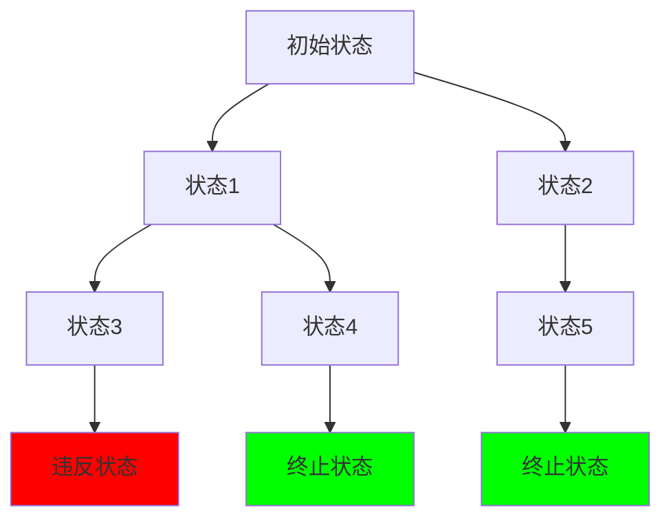
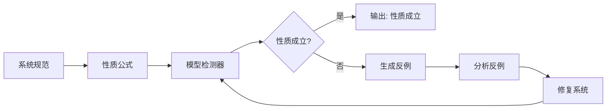
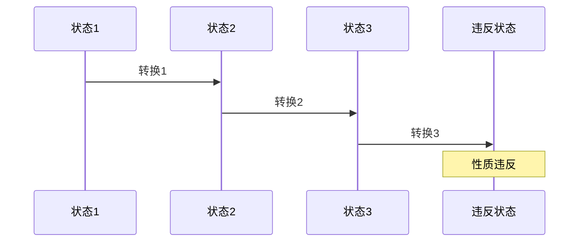

# 模型检测

## 3.1 模型检测基础

### 3.1.1 状态空间与转换系统

- **状态空间**：
  - 系统所有可能状态的集合
  - 状态变量及其取值定义状态
  - 状态空间大小决定检测复杂度
- **转换系统**：
  - 状态间的转换关系
  - 转换条件与动作
  - 初始状态集合
- **可达性**：
  - 从初始状态可达的所有状态
  - 状态空间探索的核心问题

### 3.1.2 时序逻辑

- **线性时序逻辑(LTL)**：
  - 描述系统行为的时序性质
  - 支持未来时间操作符
  - 语法：$\varphi ::= p | \neg \varphi | \varphi \land \varphi | \varphi \lor \varphi | X \varphi | F \varphi | G \varphi | \varphi U \varphi$
- **计算树逻辑(CTL)**：
  - 描述状态树上的性质
  - 支持路径量词和时序操作符
  - 语法：$\varphi ::= p | \neg \varphi | \varphi \land \varphi | EX \varphi | EF \varphi | EG \varphi | E[\varphi U \varphi] | A[\varphi U \varphi]$

## 3.2 模型检测算法

### 3.2.1 显式状态检测

```python
# 显式状态模型检测
class ExplicitModelChecker:
    def __init__(self, initial_states, transitions):
        self.initial_states = initial_states
        self.transitions = transitions
        self.reachable_states = set()
    
    def explore_states(self):
        """探索可达状态空间"""
        frontier = self.initial_states.copy()
        self.reachable_states.update(frontier)
        
        while frontier:
            current_state = frontier.pop()
            for next_state in self.transitions.get(current_state, []):
                if next_state not in self.reachable_states:
                    self.reachable_states.add(next_state)
                    frontier.add(next_state)
    
    def check_invariant(self, invariant):
        """检查不变性质"""
        self.explore_states()
        for state in self.reachable_states:
            if not invariant(state):
                return False, state  # 返回反例
        return True, None
    
    def check_ltl(self, formula):
        """检查LTL公式"""
        # 构建Büchi自动机
        buchi_automaton = self.build_buchi_automaton(formula)
        # 检查语言非空性
        return self.check_language_empty(buchi_automaton)
```

### 3.2.2 符号模型检测

```python
# 符号模型检测
class SymbolicModelChecker:
    def __init__(self, state_vars, transition_relation):
        self.state_vars = state_vars
        self.transition_relation = transition_relation
        self.bdd_manager = None
    
    def build_bdd(self, formula):
        """构建BDD表示"""
        # 将公式转换为BDD
        bdd = self.bdd_manager.make_node(formula)
        return bdd
    
    def image_computation(self, states_bdd):
        """计算后继状态"""
        # 使用BDD计算后继状态
        next_states = self.bdd_manager.apply(
            states_bdd, 
            self.transition_relation, 
            'and'
        )
        return self.bdd_manager.exists(next_states, self.state_vars)
    
    def check_ctl(self, formula):
        """检查CTL公式"""
        if formula.type == 'EX':
            return self.check_ex(formula.subformula)
        elif formula.type == 'EF':
            return self.check_ef(formula.subformula)
        elif formula.type == 'EG':
            return self.check_eg(formula.subformula)
        elif formula.type == 'EU':
            return self.check_eu(formula.left, formula.right)
    
    def check_ef(self, phi):
        """检查EF phi"""
        # 计算满足phi的状态集合
        phi_states = self.build_bdd(phi)
        # 计算可达性
        reachable = self.compute_reachability(phi_states)
        return reachable
```

### 3.2.3 有界模型检测

```python
# 有界模型检测
class BoundedModelChecker:
    def __init__(self, system, bound):
        self.system = system
        self.bound = bound
    
    def unroll_transition_relation(self, k):
        """展开k步转换关系"""
        formula = []
        for i in range(k):
            step_formula = self.system.transition_relation(i, i+1)
            formula.append(step_formula)
        return ' && '.join(formula)
    
    def check_safety_property(self, property_formula):
        """检查安全性质"""
        for k in range(self.bound + 1):
            # 构建k步展开公式
            path_formula = self.unroll_transition_relation(k)
            # 添加性质违反条件
            violation = f"!({property_formula})"
            # 检查可满足性
            if self.check_satisfiability(path_formula + " && " + violation):
                return False, k  # 返回反例长度
        return True, None
    
    def check_ltl_property(self, ltl_formula):
        """检查LTL性质"""
        # 将LTL转换为Büchi自动机
        buchi = self.ltl_to_buchi(ltl_formula)
        # 构建产品自动机
        product = self.build_product_automaton(buchi)
        # 检查可接受路径
        return self.check_accepting_path(product, self.bound)
```

## 3.3 反例生成与分析

### 3.3.1 反例构造

```python
# 反例生成器
class CounterexampleGenerator:
    def __init__(self, model_checker):
        self.model_checker = model_checker
    
    def generate_safety_counterexample(self, property_formula):
        """生成安全性质反例"""
        # 找到违反性质的状态
        violation_state = self.find_violation_state(property_formula)
        # 构造到违反状态的路径
        path = self.find_path_to_state(violation_state)
        return Counterexample(path, violation_state)
    
    def generate_ltl_counterexample(self, ltl_formula):
        """生成LTL反例"""
        # 构建Büchi自动机
        buchi = self.ltl_to_buchi(ltl_formula)
        # 找到反例路径
        counterexample_path = self.find_counterexample_path(buchi)
        return LTLCounterexample(counterexample_path, ltl_formula)
    
    def analyze_counterexample(self, counterexample):
        """分析反例"""
        analysis = {
            'type': counterexample.type,
            'length': len(counterexample.path),
            'violation_point': counterexample.violation_point,
            'suggestions': self.generate_suggestions(counterexample)
        }
        return analysis
```

### 3.3.2 反例最小化

```python
# 反例最小化
class CounterexampleMinimizer:
    def __init__(self):
        self.minimization_techniques = [
            'state_minimization',
            'transition_minimization',
            'loop_minimization'
        ]
    
    def minimize_counterexample(self, counterexample):
        """最小化反例"""
        minimized = counterexample.copy()
        
        for technique in self.minimization_techniques:
            minimized = self.apply_minimization(minimized, technique)
        
        return minimized
    
    def state_minimization(self, counterexample):
        """状态最小化"""
        # 移除冗余状态
        essential_states = self.find_essential_states(counterexample)
        return self.reconstruct_path(essential_states)
    
    def transition_minimization(self, counterexample):
        """转换最小化"""
        # 找到最短路径
        shortest_path = self.find_shortest_path(
            counterexample.start_state,
            counterexample.end_state
        )
        return shortest_path
```

## 3.4 高级模型检测技术

### 3.4.1 抽象精化

```python
# 抽象精化模型检测
class AbstractionRefinement:
    def __init__(self, concrete_system):
        self.concrete_system = concrete_system
        self.abstraction = None
    
    def create_abstraction(self, abstraction_function):
        """创建抽象系统"""
        abstract_states = set()
        abstract_transitions = {}
        
        for concrete_state in self.concrete_system.states:
            abstract_state = abstraction_function(concrete_state)
            abstract_states.add(abstract_state)
            
            for next_state in self.concrete_system.transitions[concrete_state]:
                abstract_next = abstraction_function(next_state)
                if abstract_state not in abstract_transitions:
                    abstract_transitions[abstract_state] = set()
                abstract_transitions[abstract_state].add(abstract_next)
        
        self.abstraction = AbstractSystem(abstract_states, abstract_transitions)
        return self.abstraction
    
    def check_property_on_abstraction(self, property_formula):
        """在抽象系统上检查性质"""
        model_checker = ModelChecker(self.abstraction)
        result = model_checker.check_property(property_formula)
        
        if result.holds:
            return True, None  # 性质在具体系统上也成立
        else:
            # 检查反例是否真实
            if self.check_counterexample_spurious(result.counterexample):
                return self.refine_abstraction(result.counterexample)
            else:
                return False, result.counterexample
    
    def refine_abstraction(self, spurious_counterexample):
        """精化抽象"""
        # 找到导致虚假反例的状态
        problematic_states = self.find_problematic_states(spurious_counterexample)
        # 细化这些状态的抽象
        refined_abstraction = self.refine_states(problematic_states)
        return self.check_property_on_abstraction(property_formula)
```

### 3.4.2 组合模型检测

```python
# 组合模型检测
class CompositionalModelChecker:
    def __init__(self, components):
        self.components = components
        self.composition_rules = []
    
    def add_composition_rule(self, rule):
        """添加组合规则"""
        self.composition_rules.append(rule)
    
    def check_compositional_property(self, property_formula):
        """检查组合性质"""
        # 分解性质为组件性质
        component_properties = self.decompose_property(property_formula)
        
        # 检查每个组件的性质
        component_results = {}
        for component, prop in component_properties.items():
            result = self.check_component_property(component, prop)
            component_results[component] = result
        
        # 组合结果
        return self.combine_results(component_results, property_formula)
    
    def decompose_property(self, global_property):
        """分解全局性质为组件性质"""
        decomposition = {}
        for component in self.components:
            local_property = self.extract_local_property(global_property, component)
            decomposition[component] = local_property
        return decomposition
    
    def combine_results(self, component_results, global_property):
        """组合组件结果"""
        # 使用组合规则组合结果
        combined_result = self.apply_composition_rules(component_results)
        return combined_result
```

## 3.5 多模态表达与可视化

### 3.5.1 状态空间图



### 3.5.2 模型检测流程图



### 3.5.3 反例可视化



## 3.6 自动化脚本建议

### 3.6.1 模型检测脚本

- **`scripts/model_checker.py`**：通用模型检测器
- **`scripts/ltl_checker.py`**：LTL性质检测器
- **`scripts/ctl_checker.py`**：CTL性质检测器
- **`scripts/counterexample_generator.py`**：反例生成器

### 3.6.2 可视化脚本

- **`scripts/state_space_visualizer.py`**：状态空间可视化
- **`scripts/counterexample_visualizer.py`**：反例可视化
- **`scripts/property_checker.py`**：性质检查可视化

## 3.7 形式化语义与概念解释

### 3.7.1 模型检测语义

- **状态语义**：每个状态对应系统的一个配置
- **转换语义**：状态转换对应系统行为
- **性质语义**：时序逻辑公式在状态序列上的解释

### 3.7.2 检测算法概念

- **可达性分析**：计算从初始状态可达的所有状态
- **不动点计算**：使用不动点算法计算满足性质的状态集合
- **语言包含**：检查自动机语言包含关系

### 3.7.3 典型定理与证明

- **Kleene不动点定理**：单调函数在完全格上有最小不动点
- **Büchi自动机等价性**：LTL公式与Büchi自动机等价
- **模型检测复杂性**：CTL模型检测为P-完全问题

---

如需本分支更深层检测算法、抽象技术或组合验证方法，请继续指定！
