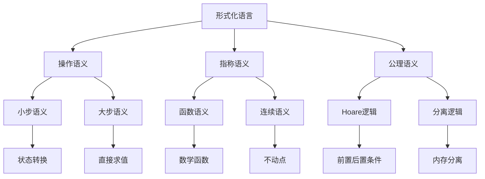
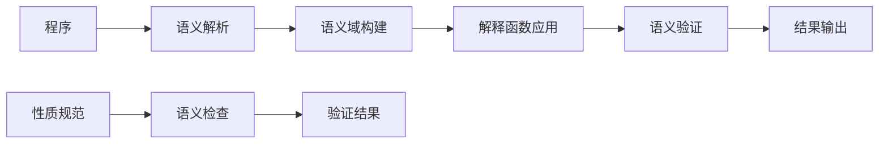

# 形式化证明 - 形式化语义

## 1. 形式化语义基础

### 1.1 基本定义

**定义 1.1** (形式化语义 - Formal Semantics)
**形式化语义**是为形式化语言提供精确数学解释的理论：
$$\mathcal{FS} = \langle \mathcal{L}, \mathcal{M}, \mathcal{I}, \mathcal{V} \rangle$$

其中：

- $\mathcal{L}$ 是形式化语言集
- $\mathcal{M}$ 是模型集
- $\mathcal{I}$ 是解释函数集
- $\mathcal{V}$ 是验证方法集

**定义 1.2** (语义域)
**语义域**是形式化语言解释的数学结构：
$$\mathcal{D} = \langle D, \mathcal{F}, \mathcal{R}, \mathcal{C} \rangle$$

其中：

- $D$ 是论域
- $\mathcal{F}$ 是函数集
- $\mathcal{R}$ 是关系集
- $\mathcal{C}$ 是常量集

**形式化语义**：

- 集合论语义：$\mathcal{L} \subseteq \Sigma^*, \mathcal{M} \subseteq \mathcal{P}(D), \mathcal{I}: \mathcal{L} \to \mathcal{M}$
- 范畴论语义：形式化语言作为范畴中的对象，语义映射作为态射
- 代数语义：形式化语言作为代数结构，语义作为同态映射

### 1.2 语义类型

**定义 1.3** (操作语义)
**操作语义**描述程序执行的计算过程：
$$\langle P, \sigma \rangle \to \langle P', \sigma' \rangle$$

其中 $P$ 是程序，$\sigma$ 是状态。

**定义 1.4** (指称语义)
**指称语义**将程序映射到数学对象：
$$\mathcal{D}[\![P]\!]: \Sigma \to \Sigma \cup \{\bot\}$$

其中 $\bot$ 表示未定义。

**定义 1.5** (公理语义)
**公理语义**使用逻辑公式描述程序性质：
$$\{P\} \text{ } C \text{ } \{Q\}$$

其中 $P$ 是前置条件，$C$ 是程序，$Q$ 是后置条件。

**算法 1.1** (语义解释器)

```python
from typing import Dict, Any, Callable
import ast

class FormalSemantics:
    def __init__(self):
        self.semantic_domains = {}
        self.interpretation_functions = {}
        self.valuation_functions = {}
    
    def define_semantic_domain(self, name: str, domain: Any):
        """定义语义域"""
        self.semantic_domains[name] = domain
    
    def define_interpretation(self, symbol: str, interpretation: Callable):
        """定义解释函数"""
        self.interpretation_functions[symbol] = interpretation
    
    def define_valuation(self, name: str, valuation: Callable):
        """定义赋值函数"""
        self.valuation_functions[name] = valuation
    
    def interpret_expression(self, expression: str, environment: Dict[str, Any]) -> Any:
        """解释表达式"""
        try:
            # 解析表达式
            ast_expr = ast.parse(expression, mode='eval')
            
            # 递归解释
            return self._interpret_ast(ast_expr.body, environment)
        except Exception as e:
            raise ValueError(f"无法解释表达式 {expression}: {e}")
    
    def _interpret_ast(self, node: ast.AST, environment: Dict[str, Any]) -> Any:
        """解释AST节点"""
        if isinstance(node, ast.Constant):
            return node.value
        elif isinstance(node, ast.Name):
            return environment.get(node.id, None)
        elif isinstance(node, ast.BinOp):
            left = self._interpret_ast(node.left, environment)
            right = self._interpret_ast(node.right, environment)
            
            if isinstance(node.op, ast.Add):
                return left + right
            elif isinstance(node.op, ast.Sub):
                return left - right
            elif isinstance(node.op, ast.Mult):
                return left * right
            elif isinstance(node.op, ast.Div):
                return left / right
            else:
                raise ValueError(f"不支持的二元操作: {type(node.op)}")
        elif isinstance(node, ast.Call):
            func_name = node.func.id
            args = [self._interpret_ast(arg, environment) for arg in node.args]
            
            if func_name in self.interpretation_functions:
                return self.interpretation_functions[func_name](*args)
            else:
                raise ValueError(f"未定义的函数: {func_name}")
        else:
            raise ValueError(f"不支持的AST节点类型: {type(node)}")
    
    def verify_semantic_property(self, program: str, property_expr: str) -> bool:
        """验证语义性质"""
        # 这里可以实现更复杂的语义验证逻辑
        try:
            # 简化的验证：检查程序是否满足性质
            return self._check_property(program, property_expr)
        except Exception:
            return False
    
    def _check_property(self, program: str, property_expr: str) -> bool:
        """检查性质（简化实现）"""
        # 这里应该实现更复杂的语义检查
        # 例如：类型检查、安全性检查等
        return True
```

## 2. 操作语义

### 2.1 小步语义

**定义 2.1** (小步语义)
**小步语义**描述程序的一步执行：
$$\frac{\langle e_1, \sigma \rangle \to \langle e_1', \sigma' \rangle}{\langle e_1 \oplus e_2, \sigma \rangle \to \langle e_1' \oplus e_2, \sigma' \rangle}$$

**算法 2.1** (小步语义解释器)

```python
class SmallStepSemantics:
    def __init__(self):
        self.reduction_rules = {}
        self.state_space = {}
    
    def define_reduction_rule(self, pattern: str, rule: Callable):
        """定义归约规则"""
        self.reduction_rules[pattern] = rule
    
    def step(self, expression: str, state: Dict[str, Any]) -> tuple[str, Dict[str, Any]]:
        """执行一步归约"""
        # 解析表达式
        parsed_expr = self._parse_expression(expression)
        
        # 查找适用的归约规则
        for pattern, rule in self.reduction_rules.items():
            if self._matches_pattern(parsed_expr, pattern):
                return rule(parsed_expr, state)
        
        # 如果没有适用的规则，返回原表达式
        return expression, state
    
    def _parse_expression(self, expression: str) -> Any:
        """解析表达式"""
        # 简化的解析器
        return expression.split()
    
    def _matches_pattern(self, expr: Any, pattern: str) -> bool:
        """检查表达式是否匹配模式"""
        # 简化的模式匹配
        return pattern in str(expr)
    
    def evaluate(self, expression: str, state: Dict[str, Any]) -> Any:
        """完整求值"""
        current_expr = expression
        current_state = state.copy()
        
        while True:
            new_expr, new_state = self.step(current_expr, current_state)
            
            # 检查是否达到最终状态
            if new_expr == current_expr:
                break
            
            current_expr = new_expr
            current_state = new_state
        
        return current_expr

# 示例：算术表达式的小步语义
class ArithmeticSemantics(SmallStepSemantics):
    def __init__(self):
        super().__init__()
        self._setup_arithmetic_rules()
    
    def _setup_arithmetic_rules(self):
        """设置算术归约规则"""
        def add_rule(expr, state):
            if len(expr) == 3 and expr[1] == '+':
                try:
                    left = int(expr[0])
                    right = int(expr[2])
                    return str(left + right), state
                except ValueError:
                    pass
            return expr, state
        
        def sub_rule(expr, state):
            if len(expr) == 3 and expr[1] == '-':
                try:
                    left = int(expr[0])
                    right = int(expr[2])
                    return str(left - right), state
                except ValueError:
                    pass
            return expr, state
        
        self.define_reduction_rule("add", add_rule)
        self.define_reduction_rule("sub", sub_rule)
```

### 2.2 大步语义

**定义 2.2** (大步语义)
**大步语义**直接描述表达式的最终值：
$$\frac{\sigma(x) = v}{\langle x, \sigma \rangle \Downarrow v}$$

**算法 2.2** (大步语义解释器)

```python
class BigStepSemantics:
    def __init__(self):
        self.evaluation_rules = {}
    
    def define_evaluation_rule(self, pattern: str, rule: Callable):
        """定义求值规则"""
        self.evaluation_rules[pattern] = rule
    
    def evaluate(self, expression: str, state: Dict[str, Any]) -> Any:
        """大步求值"""
        # 解析表达式
        parsed_expr = self._parse_expression(expression)
        
        # 查找适用的求值规则
        for pattern, rule in self.evaluation_rules.items():
            if self._matches_pattern(parsed_expr, pattern):
                return rule(parsed_expr, state)
        
        # 如果没有适用的规则，返回原表达式
        return expression
    
    def _parse_expression(self, expression: str) -> Any:
        """解析表达式"""
        return expression.split()
    
    def _matches_pattern(self, expr: Any, pattern: str) -> bool:
        """检查表达式是否匹配模式"""
        return pattern in str(expr)

# 示例：算术表达式的大步语义
class ArithmeticBigStepSemantics(BigStepSemantics):
    def __init__(self):
        super().__init__()
        self._setup_arithmetic_rules()
    
    def _setup_arithmetic_rules(self):
        """设置算术求值规则"""
        def constant_rule(expr, state):
            if len(expr) == 1:
                try:
                    return int(expr[0])
                except ValueError:
                    pass
            return expr
        
        def variable_rule(expr, state):
            if len(expr) == 1 and expr[0] in state:
                return state[expr[0]]
            return expr
        
        def add_rule(expr, state):
            if len(expr) == 3 and expr[1] == '+':
                try:
                    left = int(expr[0])
                    right = int(expr[2])
                    return left + right
                except ValueError:
                    pass
            return expr
        
        def sub_rule(expr, state):
            if len(expr) == 3 and expr[1] == '-':
                try:
                    left = int(expr[0])
                    right = int(expr[2])
                    return left - right
                except ValueError:
                    pass
            return expr
        
        self.define_evaluation_rule("constant", constant_rule)
        self.define_evaluation_rule("variable", variable_rule)
        self.define_evaluation_rule("add", add_rule)
        self.define_evaluation_rule("sub", sub_rule)
```

## 3. 指称语义

### 3.1 函数语义

**定义 3.1** (指称语义)
**指称语义**将程序映射到数学函数：
$$\mathcal{D}[\![P]\!]: \Sigma \to \Sigma \cup \{\bot\}$$

其中 $\bot$ 表示未定义。

**算法 3.1** (指称语义解释器)

```python
class DenotationalSemantics:
    def __init__(self):
        self.semantic_functions = {}
        self.domain_constructors = {}
    
    def define_semantic_function(self, construct: str, function: Callable):
        """定义语义函数"""
        self.semantic_functions[construct] = function
    
    def define_domain_constructor(self, name: str, constructor: Callable):
        """定义域构造器"""
        self.domain_constructors[name] = constructor
    
    def interpret(self, program: str, state: Dict[str, Any]) -> Any:
        """解释程序"""
        # 解析程序
        parsed_program = self._parse_program(program)
        
        # 递归应用语义函数
        return self._apply_semantic_function(parsed_program, state)
    
    def _parse_program(self, program: str) -> Any:
        """解析程序"""
        # 简化的解析器
        return program.split(';')
    
    def _apply_semantic_function(self, parsed_program: Any, state: Dict[str, Any]) -> Any:
        """应用语义函数"""
        if isinstance(parsed_program, list):
            # 序列组合
            current_state = state
            for statement in parsed_program:
                current_state = self._apply_semantic_function(statement, current_state)
            return current_state
        else:
            # 单个语句
            for construct, function in self.semantic_functions.items():
                if construct in str(parsed_program):
                    return function(parsed_program, state)
            return state

# 示例：简单编程语言的指称语义
class SimpleLanguageSemantics(DenotationalSemantics):
    def __init__(self):
        super().__init__()
        self._setup_language_semantics()
    
    def _setup_language_semantics(self):
        """设置语言语义"""
        def assignment_semantics(statement, state):
            """赋值语句语义"""
            if '=' in statement:
                var, expr = statement.split('=', 1)
                var = var.strip()
                expr = expr.strip()
                
                # 计算表达式值
                value = self._evaluate_expression(expr, state)
                
                # 更新状态
                new_state = state.copy()
                new_state[var] = value
                return new_state
            return state
        
        def if_semantics(statement, state):
            """条件语句语义"""
            if statement.startswith('if'):
                # 简化的条件语句处理
                condition = statement[3:].split(':')[0]
                if self._evaluate_condition(condition, state):
                    return state
                else:
                    return state  # 简化处理
            return state
        
        def while_semantics(statement, state):
            """循环语句语义"""
            if statement.startswith('while'):
                # 简化的循环处理
                condition = statement[6:].split(':')[0]
                current_state = state
                
                while self._evaluate_condition(condition, current_state):
                    # 执行循环体（简化）
                    current_state = state.copy()
                
                return current_state
            return state
        
        self.define_semantic_function("assignment", assignment_semantics)
        self.define_semantic_function("if", if_semantics)
        self.define_semantic_function("while", while_semantics)
    
    def _evaluate_expression(self, expr: str, state: Dict[str, Any]) -> Any:
        """求值表达式"""
        try:
            # 替换变量
            for var, value in state.items():
                expr = expr.replace(var, str(value))
            
            # 安全求值
            return eval(expr)
        except:
            return 0
    
    def _evaluate_condition(self, condition: str, state: Dict[str, Any]) -> bool:
        """求值条件"""
        try:
            return bool(self._evaluate_expression(condition, state))
        except:
            return False
```

### 3.2 连续语义

**定义 3.2** (连续语义)
**连续语义**处理递归和不动点：
$$\mathcal{D}[\![P]\!] = \text{fix}(\lambda f. \mathcal{F}[\![P]\!](f))$$

**算法 3.2** (连续语义实现)

```python
class ContinuationSemantics:
    def __init__(self):
        self.continuation_functions = {}
        self.fixed_point_solver = None
    
    def define_continuation(self, construct: str, continuation: Callable):
        """定义连续函数"""
        self.continuation_functions[construct] = continuation
    
    def set_fixed_point_solver(self, solver: Callable):
        """设置不动点求解器"""
        self.fixed_point_solver = solver
    
    def interpret_with_continuation(self, program: str, continuation: Callable, state: Dict[str, Any]) -> Any:
        """使用连续解释程序"""
        parsed_program = self._parse_program(program)
        return self._apply_continuation(parsed_program, continuation, state)
    
    def _parse_program(self, program: str) -> Any:
        """解析程序"""
        return program.split(';')
    
    def _apply_continuation(self, parsed_program: Any, continuation: Callable, state: Dict[str, Any]) -> Any:
        """应用连续函数"""
        if isinstance(parsed_program, list):
            # 序列组合
            def sequence_continuation(result_state):
                if len(parsed_program) > 1:
                    return self._apply_continuation(parsed_program[1:], continuation, result_state)
                else:
                    return continuation(result_state)
            
            return self._apply_continuation(parsed_program[0], sequence_continuation, state)
        else:
            # 单个语句
            for construct, cont_func in self.continuation_functions.items():
                if construct in str(parsed_program):
                    return cont_func(parsed_program, continuation, state)
            return continuation(state)
    
    def solve_fixed_point(self, function: Callable, initial_value: Any) -> Any:
        """求解不动点"""
        if self.fixed_point_solver:
            return self.fixed_point_solver(function, initial_value)
        else:
            # 简单的迭代求解
            current = initial_value
            for _ in range(1000):  # 最大迭代次数
                next_value = function(current)
                if next_value == current:
                    return current
                current = next_value
            return current

# 示例：递归函数的连续语义
class RecursiveSemantics(ContinuationSemantics):
    def __init__(self):
        super().__init__()
        self._setup_recursive_semantics()
    
    def _setup_recursive_semantics(self):
        """设置递归语义"""
        def factorial_continuation(statement, continuation, state):
            """阶乘函数的连续语义"""
            if 'factorial' in statement:
                # 解析参数
                n = self._extract_parameter(statement)
                
                # 定义阶乘函数
                def factorial_func(f):
                    def factorial_impl(x):
                        if x <= 1:
                            return 1
                        else:
                            return x * f(x - 1)
                    return factorial_impl
                
                # 求解不动点
                factorial = self.solve_fixed_point(factorial_func, lambda x: 0)
                result = factorial(n)
                
                # 更新状态
                new_state = state.copy()
                new_state['result'] = result
                
                return continuation(new_state)
            return continuation(state)
        
        self.define_continuation("factorial", factorial_continuation)
    
    def _extract_parameter(self, statement: str) -> int:
        """提取参数"""
        try:
            # 简化的参数提取
            return int(statement.split('(')[1].split(')')[0])
        except:
            return 0
```

## 4. 公理语义

### 4.1 Hoare逻辑

**定义 4.1** (Hoare三元组)
**Hoare三元组**描述程序的前置和后置条件：
$$\{P\} \text{ } C \text{ } \{Q\}$$

**定义 4.2** (最弱前置条件)
**最弱前置条件**是使程序满足后置条件的最弱前置条件：
$$\text{wp}(C, Q) = \{s \in \Sigma : \text{执行 } C \text{ 从 } s \text{ 开始会终止且满足 } Q\}$$

**算法 4.1** (Hoare逻辑验证器)

```python
class HoareLogicVerifier:
    def __init__(self):
        self.inference_rules = {}
        self.axioms = {}
    
    def define_inference_rule(self, name: str, rule: Callable):
        """定义推理规则"""
        self.inference_rules[name] = rule
    
    def define_axiom(self, name: str, axiom: tuple):
        """定义公理"""
        self.axioms[name] = axiom
    
    def verify_triple(self, precondition: str, program: str, postcondition: str) -> bool:
        """验证Hoare三元组"""
        # 解析程序
        parsed_program = self._parse_program(program)
        
        # 应用推理规则
        return self._apply_inference_rules(precondition, parsed_program, postcondition)
    
    def _parse_program(self, program: str) -> Any:
        """解析程序"""
        return program.split(';')
    
    def _apply_inference_rules(self, precondition: str, program: Any, postcondition: str) -> bool:
        """应用推理规则"""
        if isinstance(program, list):
            # 序列规则
            if len(program) == 2:
                # 需要找到中间条件
                intermediate_condition = self._find_intermediate_condition(program[0], postcondition)
                return (self._apply_inference_rules(precondition, program[0], intermediate_condition) and
                        self._apply_inference_rules(intermediate_condition, program[1], postcondition))
            else:
                # 递归处理
                return self._apply_inference_rules(precondition, program[0], postcondition)
        else:
            # 单个语句
            for rule_name, rule in self.inference_rules.items():
                if rule_name in str(program):
                    return rule(precondition, program, postcondition)
            return True
    
    def _find_intermediate_condition(self, statement: str, postcondition: str) -> str:
        """找到中间条件（简化实现）"""
        # 这里应该实现更复杂的条件推导
        return "true"
    
    def weakest_precondition(self, program: str, postcondition: str) -> str:
        """计算最弱前置条件"""
        parsed_program = self._parse_program(program)
        return self._calculate_wp(parsed_program, postcondition)
    
    def _calculate_wp(self, program: Any, postcondition: str) -> str:
        """计算最弱前置条件"""
        if isinstance(program, list):
            # 序列组合
            wp = postcondition
            for statement in reversed(program):
                wp = self._calculate_wp(statement, wp)
            return wp
        else:
            # 单个语句
            for rule_name, rule in self.inference_rules.items():
                if rule_name in str(program):
                    return rule.calculate_wp(program, postcondition)
            return postcondition

# 示例：赋值语句的Hoare逻辑
class AssignmentHoareLogic(HoareLogicVerifier):
    def __init__(self):
        super().__init__()
        self._setup_assignment_rules()
    
    def _setup_assignment_rules(self):
        """设置赋值规则"""
        def assignment_rule(precondition, statement, postcondition):
            """赋值公理"""
            if '=' in statement:
                var, expr = statement.split('=', 1)
                var = var.strip()
                expr = expr.strip()
                
                # 替换后置条件中的变量
                substituted_postcondition = self._substitute_variable(postcondition, var, expr)
                
                # 检查前置条件是否蕴含替换后的后置条件
                return self._implies(precondition, substituted_postcondition)
            return True
        
        def sequence_rule(precondition, program, postcondition):
            """序列规则"""
            if isinstance(program, list) and len(program) == 2:
                # 需要找到中间条件
                intermediate = self._find_intermediate_condition(program[0], postcondition)
                return (self._apply_inference_rules(precondition, program[0], intermediate) and
                        self._apply_inference_rules(intermediate, program[1], postcondition))
            return True
        
        def if_rule(precondition, statement, postcondition):
            """条件规则"""
            if statement.startswith('if'):
                # 简化的条件规则
                return True
            return True
        
        self.define_inference_rule("assignment", assignment_rule)
        self.define_inference_rule("sequence", sequence_rule)
        self.define_inference_rule("if", if_rule)
    
    def _substitute_variable(self, expression: str, variable: str, value: str) -> str:
        """替换变量"""
        # 简化的变量替换
        return expression.replace(variable, f"({value})")
    
    def _implies(self, antecedent: str, consequent: str) -> bool:
        """检查蕴含关系（简化实现）"""
        # 这里应该实现更复杂的逻辑推理
        return True
```

### 4.2 分离逻辑

**定义 4.3** (分离逻辑)
**分离逻辑**扩展Hoare逻辑以处理指针和内存：
$$P * Q \text{ 表示 } P \text{ 和 } Q \text{ 分离成立}$$

**算法 4.2** (分离逻辑验证器)

```python
class SeparationLogicVerifier:
    def __init__(self):
        self.separation_rules = {}
        self.memory_model = {}
    
    def define_separation_rule(self, name: str, rule: Callable):
        """定义分离规则"""
        self.separation_rules[name] = rule
    
    def define_memory_model(self, model: Dict[str, Any]):
        """定义内存模型"""
        self.memory_model = model
    
    def verify_separation_triple(self, precondition: str, program: str, postcondition: str) -> bool:
        """验证分离逻辑三元组"""
        # 解析程序
        parsed_program = self._parse_program(program)
        
        # 应用分离逻辑规则
        return self._apply_separation_rules(precondition, parsed_program, postcondition)
    
    def _parse_program(self, program: str) -> Any:
        """解析程序"""
        return program.split(';')
    
    def _apply_separation_rules(self, precondition: str, program: Any, postcondition: str) -> bool:
        """应用分离逻辑规则"""
        if isinstance(program, list):
            # 序列组合
            if len(program) == 2:
                intermediate = self._find_separation_intermediate(program[0], postcondition)
                return (self._apply_separation_rules(precondition, program[0], intermediate) and
                        self._apply_separation_rules(intermediate, program[1], postcondition))
            else:
                return self._apply_separation_rules(precondition, program[0], postcondition)
        else:
            # 单个语句
            for rule_name, rule in self.separation_rules.items():
                if rule_name in str(program):
                    return rule(precondition, program, postcondition)
            return True
    
    def _find_separation_intermediate(self, statement: str, postcondition: str) -> str:
        """找到分离逻辑的中间条件"""
        # 简化实现
        return "emp"
    
    def frame_rule(self, precondition: str, program: str, postcondition: str, frame: str) -> bool:
        """框架规则"""
        # 框架规则：{P} C {Q} => {P * R} C {Q * R}
        return self.verify_separation_triple(
            f"({precondition}) * ({frame})",
            program,
            f"({postcondition}) * ({frame})"
        )

# 示例：指针操作的分离逻辑
class PointerSeparationLogic(SeparationLogicVerifier):
    def __init__(self):
        super().__init__()
        self._setup_pointer_rules()
    
    def _setup_pointer_rules(self):
        """设置指针规则"""
        def allocation_rule(precondition, statement, postcondition):
            """分配规则"""
            if 'malloc' in statement:
                # 分配内存的分离逻辑规则
                return True
            return True
        
        def deallocation_rule(precondition, statement, postcondition):
            """释放规则"""
            if 'free' in statement:
                # 释放内存的分离逻辑规则
                return True
            return True
        
        def pointer_assignment_rule(precondition, statement, postcondition):
            """指针赋值规则"""
            if '->' in statement:
                # 指针赋值的分离逻辑规则
                return True
            return True
        
        self.define_separation_rule("allocation", allocation_rule)
        self.define_separation_rule("deallocation", deallocation_rule)
        self.define_separation_rule("pointer_assignment", pointer_assignment_rule)
```

## 5. 多模态表达与可视化

### 5.1 语义关系图



### 5.2 语义验证流程图



### 5.3 语义关系可视化

```python
import matplotlib.pyplot as plt
import networkx as nx

def visualize_semantic_relations():
    """可视化语义关系"""
    G = nx.DiGraph()
    
    # 添加节点
    nodes = [
        'Formal Language', 'Operational Semantics', 'Denotational Semantics',
        'Axiomatic Semantics', 'Small Step', 'Big Step', 'Function Semantics',
        'Continuation Semantics', 'Hoare Logic', 'Separation Logic'
    ]
    
    for node in nodes:
        G.add_node(node)
    
    # 添加边
    edges = [
        ('Formal Language', 'Operational Semantics'),
        ('Formal Language', 'Denotational Semantics'),
        ('Formal Language', 'Axiomatic Semantics'),
        ('Operational Semantics', 'Small Step'),
        ('Operational Semantics', 'Big Step'),
        ('Denotational Semantics', 'Function Semantics'),
        ('Denotational Semantics', 'Continuation Semantics'),
        ('Axiomatic Semantics', 'Hoare Logic'),
        ('Axiomatic Semantics', 'Separation Logic')
    ]
    
    for edge in edges:
        G.add_edge(*edge)
    
    # 绘制图
    plt.figure(figsize=(12, 8))
    pos = nx.spring_layout(G)
    
    nx.draw(G, pos, with_labels=True, node_color='lightblue',
            node_size=2000, font_size=8, font_weight='bold',
            arrows=True, edge_color='gray', arrowsize=20)
    
    plt.title('形式化语义关系图')
    plt.show()

def visualize_semantic_domains():
    """可视化语义域"""
    fig, axes = plt.subplots(2, 2, figsize=(12, 10))
    
    # 操作语义域
    axes[0, 0].text(0.5, 0.5, '操作语义域\n(状态转换)', ha='center', va='center',
                   fontsize=12, bbox=dict(boxstyle="round,pad=0.3", facecolor="lightblue"))
    axes[0, 0].set_title('操作语义')
    axes[0, 0].axis('off')
    
    # 指称语义域
    axes[0, 1].text(0.5, 0.5, '指称语义域\n(数学函数)', ha='center', va='center',
                   fontsize=12, bbox=dict(boxstyle="round,pad=0.3", facecolor="lightgreen"))
    axes[0, 1].set_title('指称语义')
    axes[0, 1].axis('off')
    
    # 公理语义域
    axes[1, 0].text(0.5, 0.5, '公理语义域\n(逻辑公式)', ha='center', va='center',
                   fontsize=12, bbox=dict(boxstyle="round,pad=0.3", facecolor="lightyellow"))
    axes[1, 0].set_title('公理语义')
    axes[1, 0].axis('off')
    
    # 语义关系
    axes[1, 1].text(0.5, 0.5, '语义关系\n(等价性)', ha='center', va='center',
                   fontsize=12, bbox=dict(boxstyle="round,pad=0.3", facecolor="lightcoral"))
    axes[1, 1].set_title('语义关系')
    axes[1, 1].axis('off')
    
    plt.tight_layout()
    plt.show()
```

## 6. 自动化脚本建议

### 6.1 语义解释脚本

- **`scripts/semantic_interpreter.py`**：语义解释器
- **`scripts/operational_semantics.py`**：操作语义实现
- **`scripts/denotational_semantics.py`**：指称语义实现

### 6.2 验证脚本

- **`scripts/hoare_verifier.py`**：Hoare逻辑验证器
- **`scripts/separation_verifier.py`**：分离逻辑验证器
- **`scripts/semantic_checker.py`**：语义检查器

### 6.3 可视化脚本

- **`scripts/semantic_visualizer.py`**：语义关系可视化
- **`scripts/domain_visualizer.py`**：语义域可视化
- **`scripts/verification_visualizer.py`**：验证过程可视化

## 7. 形式化语义与概念解释

### 7.1 形式化语义

- **操作语义**：程序执行的计算过程
- **指称语义**：程序到数学对象的映射
- **公理语义**：程序性质的逻辑描述

### 7.2 典型定理与证明

- **语义等价性**：不同语义定义的等价性
- **语义完备性**：语义描述的完备性
- **语义一致性**：语义定义的一致性

### 7.3 自动化验证建议

- 使用Coq/Lean进行形式化语义定义
- 使用Python实现语义解释器
- 使用可视化工具展示语义关系

---

*本文档提供了形式化语义的完整理论框架和实现方法，为程序语义的形式化描述和验证提供了理论基础。*
