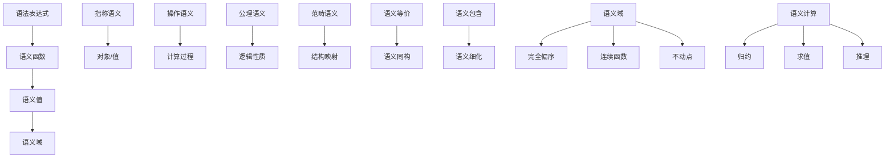
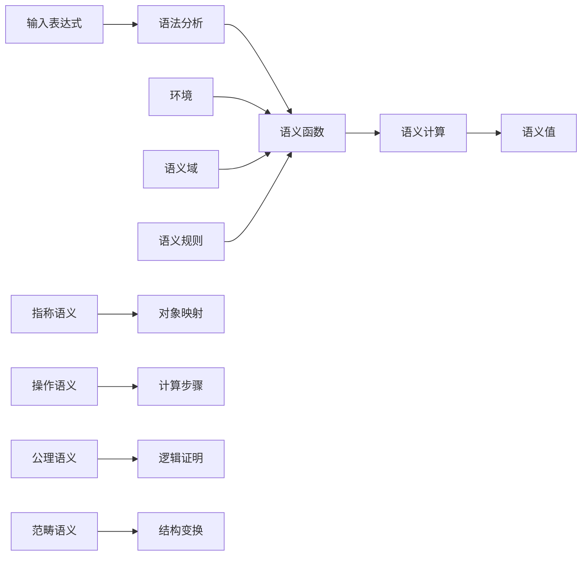
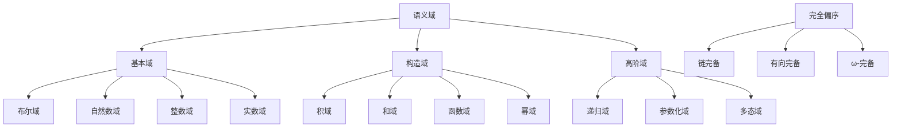
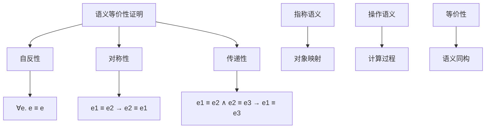

# 形式化语义

## 4.1 语义理论基础

### 4.1.1 语义学基本概念

- **语义学**：研究语言表达式意义的学科
- **形式化语义**：用数学方法精确描述语言意义
- **语义域**：语义值的集合，构成数学结构
- **语义函数**：将语法表达式映射到语义值

### 4.1.2 语义类型

- **指称语义**：表达式指称的对象或值
- **操作语义**：表达式的计算过程
- **公理语义**：表达式的逻辑性质
- **范畴论语义**：表达式在范畴中的解释

### 4.1.3 形式化定义

```coq
(* 语义域的形式化定义 *)
Inductive SemanticDomain : Type :=
| BoolDomain : bool -> SemanticDomain
| NatDomain : nat -> SemanticDomain
| IntDomain : Z -> SemanticDomain
| RealDomain : R -> SemanticDomain
| StringDomain : string -> SemanticDomain
| FunctionDomain : SemanticDomain -> SemanticDomain -> SemanticDomain
| ProductDomain : SemanticDomain -> SemanticDomain -> SemanticDomain
| PowerDomain : SemanticDomain -> SemanticDomain.

(* 语义函数的形式化定义 *)
Definition SemanticFunction := Expression -> Environment -> SemanticDomain.

(* 语义等价性 *)
Definition SemanticEquivalence (e1 e2 : Expression) : Prop :=
  forall env : Environment, 
    interpret e1 env = interpret e2 env.

(* 语义完备性 *)
Definition SemanticCompleteness : Prop :=
  forall (e : Expression) (v : SemanticDomain),
    interpret e env = v -> 
    exists proof : Proof, proves proof (e, v).
```

## 4.2 指称语义

### 4.2.1 语义域构造

```python
# 语义域定义
class SemanticDomain:
    def __init__(self):
        self.domains = {
            'Bool': {True, False},
            'Nat': set(range(1000)),  # 有限自然数
            'Int': set(range(-1000, 1000)),
            'Real': set(),  # 实数域
            'String': set()  # 字符串域
        }
    
    def function_space(self, domain, codomain):
        """函数空间构造"""
        return {
            'domain': domain,
            'codomain': codomain,
            'functions': set()  # 所有函数集合
        }
    
    def product_space(self, domains):
        """积空间构造"""
        return {
            'domains': domains,
            'tuples': set()  # 元组集合
        }
    
    def power_space(self, domain):
        """幂集构造"""
        return {
            'domain': domain,
            'subsets': set()  # 子集集合
        }
    
    def complete_partial_order(self, domain):
        """完全偏序构造"""
        return {
            'domain': domain,
            'order': '≤',
            'bottom': '⊥',
            'lub': 'sup',  # 最小上界
            'glb': 'inf'   # 最大下界
        }
    
    def continuous_function_space(self, domain, codomain):
        """连续函数空间"""
        return {
            'domain': domain,
            'codomain': codomain,
            'functions': 'continuous',
            'order': 'pointwise'
        }
```

### 4.2.2 语义函数定义

```python
# 语义函数
class DenotationalSemantics:
    def __init__(self, domain):
        self.domain = domain
        self.environment = {}  # 变量环境
    
    def interpret_expression(self, expr, env=None):
        """解释表达式"""
        if env is None:
            env = self.environment
        
        if expr.type == 'constant':
            return self.interpret_constant(expr.value)
        elif expr.type == 'variable':
            return self.interpret_variable(expr.name, env)
        elif expr.type == 'application':
            return self.interpret_application(expr.func, expr.arg, env)
        elif expr.type == 'abstraction':
            return self.interpret_abstraction(expr.param, expr.body, env)
        elif expr.type == 'conditional':
            return self.interpret_conditional(expr.condition, expr.then, expr.else, env)
    
    def interpret_constant(self, value):
        """解释常量"""
        if isinstance(value, bool):
            return value
        elif isinstance(value, int):
            return value
        elif isinstance(value, str):
            return value
        else:
            raise ValueError(f"Unknown constant type: {type(value)}")
    
    def interpret_variable(self, name, env):
        """解释变量"""
        if name in env:
            return env[name]
        else:
            raise NameError(f"Undefined variable: {name}")
    
    def interpret_application(self, func_expr, arg_expr, env):
        """解释函数应用"""
        func_value = self.interpret_expression(func_expr, env)
        arg_value = self.interpret_expression(arg_expr, env)
        
        if callable(func_value):
            return func_value(arg_value)
        else:
            raise TypeError(f"Not a function: {func_value}")
    
    def interpret_abstraction(self, param, body, env):
        """解释函数抽象"""
        def lambda_function(arg_value):
            new_env = env.copy()
            new_env[param] = arg_value
            return self.interpret_expression(body, new_env)
        
        return lambda_function
    
    def interpret_fixpoint(self, function_expr, env):
        """解释不动点"""
        def fixpoint_function(f):
            def recursive_function(x):
                return f(recursive_function)(x)
            return recursive_function
        
        function_value = self.interpret_expression(function_expr, env)
        return fixpoint_function(function_value)
```

### 4.2.3 递归语义

```python
# 递归语义
class RecursiveSemantics:
    def __init__(self, domain):
        self.domain = domain
        self.fixed_points = {}
    
    def least_fixed_point(self, function, initial_value):
        """计算最小不动点"""
        current = initial_value
        while True:
            next_value = function(current)
            if next_value == current:
                return current
            current = next_value
    
    def greatest_fixed_point(self, function, initial_value):
        """计算最大不动点"""
        current = initial_value
        while True:
            next_value = function(current)
            if next_value == current:
                return current
            current = next_value
    
    def interpret_recursive_definition(self, name, body, env):
        """解释递归定义"""
        def recursive_function(x):
            new_env = env.copy()
            new_env[name] = recursive_function
            return self.interpret_expression(body, new_env)(x)
        
        return recursive_function
    
    def interpret_while_loop(self, condition, body, env):
        """解释while循环"""
        def loop_function(initial_state):
            def loop_body(current_state):
                if self.interpret_expression(condition, current_state):
                    new_state = self.interpret_expression(body, current_state)
                    return loop_body(new_state)
                else:
                    return current_state
            
            return loop_body(initial_state)
        
        return loop_function
    
    def interpret_mutual_recursion(self, definitions, env):
        """解释互递归定义"""
        # 创建函数向量
        function_vector = [None] * len(definitions)
        
        for i, (name, body) in enumerate(definitions):
            def make_function(index):
                def recursive_function(x):
                    new_env = env.copy()
                    for j, (def_name, _) in enumerate(definitions):
                        new_env[def_name] = function_vector[j]
                    return self.interpret_expression(body, new_env)(x)
                return recursive_function
            
            function_vector[i] = make_function(i)
        
        return dict(zip([name for name, _ in definitions], function_vector))
```

### 4.2.4 语义域理论

```python
# 语义域理论
class DomainTheory:
    def __init__(self):
        self.domains = {}
    
    def define_cpo(self, name, elements, order):
        """定义完全偏序"""
        self.domains[name] = {
            'type': 'CPO',
            'elements': elements,
            'order': order,
            'bottom': self.find_bottom(elements, order),
            'lub': self.least_upper_bound,
            'glb': self.greatest_lower_bound
        }
    
    def define_domain(self, name, construction):
        """定义语义域"""
        if construction == 'flat':
            return self.flat_domain(name)
        elif construction == 'lifted':
            return self.lifted_domain(name)
        elif construction == 'product':
            return self.product_domain(name)
        elif construction == 'function':
            return self.function_domain(name)
        elif construction == 'power':
            return self.power_domain(name)
    
    def flat_domain(self, name):
        """平坦域"""
        return {
            'type': 'flat',
            'elements': {name, '⊥'},
            'order': lambda x, y: x == '⊥' or x == y
        }
    
    def lifted_domain(self, name):
        """提升域"""
        return {
            'type': 'lifted',
            'elements': {name, '⊥'},
            'order': lambda x, y: x == '⊥' or x == y
        }
    
    def product_domain(self, domains):
        """积域"""
        return {
            'type': 'product',
            'domains': domains,
            'elements': self.cartesian_product([d['elements'] for d in domains]),
            'order': self.product_order(domains)
        }
    
    def function_domain(self, domain, codomain):
        """函数域"""
        return {
            'type': 'function',
            'domain': domain,
            'codomain': codomain,
            'elements': self.continuous_functions(domain, codomain),
            'order': self.pointwise_order
        }
```

## 4.3 操作语义

### 4.3.1 小步语义

```python
# 小步语义
class SmallStepSemantics:
    def __init__(self):
        self.reduction_rules = {}
    
    def add_reduction_rule(self, pattern, result):
        """添加归约规则"""
        self.reduction_rules[pattern] = result
    
    def step(self, expression, environment):
        """单步归约"""
        for pattern, result in self.reduction_rules.items():
            if self.matches_pattern(expression, pattern):
                return self.apply_rule(expression, pattern, result, environment)
        
        # 递归处理子表达式
        if hasattr(expression, 'subexpressions'):
            for i, subexpr in enumerate(expression.subexpressions):
                new_subexpr = self.step(subexpr, environment)
                if new_subexpr != subexpr:
                    new_expression = expression.copy()
                    new_expression.subexpressions[i] = new_subexpr
                    return new_expression
        
        return expression
    
    def evaluate(self, expression, environment):
        """完整求值"""
        current = expression
        steps = []
        
        while True:
            steps.append(current)
            next_expr = self.step(current, environment)
            if next_expr == current:
                return current, steps
            current = next_expr
    
    def confluence(self, expression, environment):
        """合流性检查"""
        paths = self.all_reduction_paths(expression, environment)
        return all(self.same_normal_form(paths))
    
    def termination(self, expression, environment):
        """终止性检查"""
        return self.has_normal_form(expression, environment)
```

### 4.3.2 大步语义

```python
# 大步语义
class BigStepSemantics:
    def __init__(self):
        self.evaluation_rules = {}
    
    def add_evaluation_rule(self, pattern, result):
        """添加求值规则"""
        self.evaluation_rules[pattern] = result
    
    def evaluate(self, expression, environment):
        """大步求值"""
        if expression.type == 'constant':
            return expression.value
        
        elif expression.type == 'variable':
            return environment.get(expression.name)
        
        elif expression.type == 'application':
            func_value = self.evaluate(expression.func, environment)
            arg_value = self.evaluate(expression.arg, environment)
            return func_value(arg_value)
        
        elif expression.type == 'abstraction':
            def lambda_function(arg_value):
                new_env = environment.copy()
                new_env[expression.param] = arg_value
                return self.evaluate(expression.body, new_env)
            return lambda_function
        
        elif expression.type == 'conditional':
            condition_value = self.evaluate(expression.condition, environment)
            if condition_value:
                return self.evaluate(expression.then, environment)
            else:
                return self.evaluate(expression.else, environment)
        
        elif expression.type == 'sequence':
            result = None
            for expr in expression.expressions:
                result = self.evaluate(expr, environment)
            return result
        
        elif expression.type == 'let':
            value = self.evaluate(expression.value, environment)
            new_env = environment.copy()
            new_env[expression.variable] = value
            return self.evaluate(expression.body, new_env)
        
        elif expression.type == 'recursive':
            def recursive_function(arg_value):
                new_env = environment.copy()
                new_env[expression.function] = recursive_function
                new_env[expression.parameter] = arg_value
                return self.evaluate(expression.body, new_env)
            return recursive_function
```

### 4.3.3 自然语义

```python
# 自然语义
class NaturalSemantics:
    def __init__(self):
        self.inference_rules = {}
    
    def add_inference_rule(self, premises, conclusion):
        """添加推理规则"""
        rule_name = f"rule_{len(self.inference_rules)}"
        self.inference_rules[rule_name] = {
            'premises': premises,
            'conclusion': conclusion
        }
    
    def prove_judgment(self, judgment, environment):
        """证明判断"""
        for rule_name, rule in self.inference_rules.items():
            if self.matches_conclusion(judgment, rule['conclusion']):
                premises = self.instantiate_premises(rule['premises'], judgment)
                if all(self.prove_judgment(premise, environment) for premise in premises):
                    return True
        
        return False
    
    def evaluate_expression(self, expression, environment):
        """通过推理规则求值"""
        judgment = f"{environment} ⊢ {expression} ⇓ ?"
        
        # 尝试所有可能的推理规则
        for rule_name, rule in self.inference_rules.items():
            if self.can_apply_rule(rule, judgment):
                result = self.apply_rule(rule, judgment, environment)
                if result is not None:
                    return result
        
        raise ValueError(f"Cannot evaluate expression: {expression}")
    
    def type_judgment(self, expression, type_expr, environment):
        """类型判断"""
        judgment = f"{environment} ⊢ {expression} : {type_expr}"
        return self.prove_judgment(judgment, environment)
    
    def subtyping_judgment(self, type1, type2):
        """子类型判断"""
        judgment = f"{type1} <: {type2}"
        return self.prove_judgment(judgment, {})
```

### 4.3.4 结构化操作语义

```python
# 结构化操作语义
class StructuredOperationalSemantics:
    def __init__(self):
        self.transition_rules = {}
        self.configurations = {}
    
    def add_transition_rule(self, pattern, condition, result):
        """添加转换规则"""
        rule_id = f"rule_{len(self.transition_rules)}"
        self.transition_rules[rule_id] = {
            'pattern': pattern,
            'condition': condition,
            'result': result
        }
    
    def step_configuration(self, config, environment):
        """配置转换"""
        for rule_id, rule in self.transition_rules.items():
            if self.matches_pattern(config, rule['pattern']):
                if self.satisfies_condition(config, rule['condition'], environment):
                    return self.apply_transition(config, rule['result'], environment)
        return config
    
    def execution_trace(self, initial_config, environment):
        """执行轨迹"""
        trace = [initial_config]
        current = initial_config
        
        while True:
            next_config = self.step_configuration(current, environment)
            if next_config == current:
                break
            trace.append(next_config)
            current = next_config
        
        return trace
    
    def bisimulation(self, config1, config2, environment):
        """双模拟关系"""
        def check_bisimulation(c1, c2, visited):
            if (c1, c2) in visited:
                return True
            
            visited.add((c1, c2))
            
            # 检查转换关系
            for next_c1 in self.next_configurations(c1, environment):
                if not any(self.bisimulation(next_c1, next_c2, visited) 
                          for next_c2 in self.next_configurations(c2, environment)):
                    return False
            
            return True
        
        return check_bisimulation(config1, config2, set())
```

## 4.4 公理语义

### 4.4.1 霍尔逻辑

```python
# 霍尔逻辑
class HoareLogic:
    def __init__(self):
        self.axioms = {}
        self.inference_rules = {}
    
    def add_axiom(self, name, axiom):
        """添加公理"""
        self.axioms[name] = axiom
    
    def add_inference_rule(self, name, premises, conclusion):
        """添加推理规则"""
        self.inference_rules[name] = {
            'premises': premises,
            'conclusion': conclusion
        }
    
    def assignment_axiom(self, variable, expression, postcondition):
        """赋值公理"""
        # {P[E/x]} x := E {P}
        precondition = self.substitute(postcondition, variable, expression)
        return {
            'precondition': precondition,
            'command': f"{variable} := {expression}",
            'postcondition': postcondition
        }
    
    def sequence_rule(self, first_triple, second_triple):
        """序列规则"""
        # {P} C1 {Q}  {Q} C2 {R}
        # ------------------------
        #     {P} C1; C2 {R}
        if first_triple['postcondition'] == second_triple['precondition']:
            return {
                'precondition': first_triple['precondition'],
                'command': f"{first_triple['command']}; {second_triple['command']}",
                'postcondition': second_triple['postcondition']
            }
        else:
            raise ValueError("Postcondition of first does not match precondition of second")
    
    def conditional_rule(self, condition, then_triple, else_triple):
        """条件规则"""
        # {P ∧ B} C1 {Q}  {P ∧ ¬B} C2 {Q}
        # ---------------------------------
        #     {P} if B then C1 else C2 {Q}
        return {
            'precondition': then_triple['precondition'],
            'command': f"if {condition} then {then_triple['command']} else {else_triple['command']}",
            'postcondition': then_triple['postcondition']
        }
    
    def while_rule(self, condition, invariant, body_triple):
        """循环规则"""
        # {P ∧ B} C {P}
        # --------------
        # {P} while B do C {P ∧ ¬B}
        return {
            'precondition': invariant,
            'command': f"while {condition} do {body_triple['command']}",
            'postcondition': f"{invariant} ∧ ¬{condition}"
        }
    
    def consequence_rule(self, triple, stronger_pre, weaker_post):
        """推论规则"""
        # P' → P  {P} C {Q}  Q → Q'
        # --------------------------
        #        {P'} C {Q'}
        return {
            'precondition': stronger_pre,
            'command': triple['command'],
            'postcondition': weaker_post
        }
    
    def weakest_precondition(self, command, postcondition):
        """最弱前置条件"""
        if command.type == 'assignment':
            return self.substitute(postcondition, command.variable, command.expression)
        elif command.type == 'sequence':
            wp1 = self.weakest_precondition(command.first, postcondition)
            return self.weakest_precondition(command.second, wp1)
        elif command.type == 'conditional':
            wp_then = self.weakest_precondition(command.then, postcondition)
            wp_else = self.weakest_precondition(command.else, postcondition)
            return f"({command.condition} → {wp_then}) ∧ (¬{command.condition} → {wp_else})"
        elif command.type == 'while':
            # 需要找到循环不变量
            invariant = self.find_loop_invariant(command, postcondition)
            return invariant
```

### 4.4.2 分离逻辑

```python
# 分离逻辑
class SeparationLogic:
    def __init__(self):
        self.separation_operators = ['*', '-*', 'emp']
    
    def emp_axiom(self):
        """空堆公理"""
        return {
            'precondition': 'emp',
            'command': 'skip',
            'postcondition': 'emp'
        }
    
    def allocation_axiom(self, variable, size):
        """分配公理"""
        return {
            'precondition': 'emp',
            'command': f'{variable} := alloc({size})',
            'postcondition': f'{variable} ↦ ? * emp'
        }
    
    def deallocation_axiom(self, address):
        """释放公理"""
        return {
            'precondition': f'{address} ↦ ?',
            'command': f'free({address})',
            'postcondition': 'emp'
        }
    
    def load_axiom(self, variable, address):
        """加载公理"""
        return {
            'precondition': f'{address} ↦ ?',
            'command': f'{variable} := [address]',
            'postcondition': f'{address} ↦ ? ∧ {variable} = ?'
        }
    
    def store_axiom(self, address, value):
        """存储公理"""
        return {
            'precondition': f'{address} ↦ ?',
            'command': f'[address] := {value}',
            'postcondition': f'{address} ↦ {value}'
        }
    
    def frame_rule(self, triple, frame_condition):
        """框架规则"""
        # {P} C {Q}
        # ------------
        # {P * R} C {Q * R}
        return {
            'precondition': f"{triple['precondition']} * {frame_condition}",
            'command': triple['command'],
            'postcondition': f"{triple['postcondition']} * {frame_condition}"
        }
    
    def parallel_rule(self, triple1, triple2):
        """并行规则"""
        # {P1} C1 {Q1}  {P2} C2 {Q2}
        # -----------------------------
        # {P1 * P2} C1 || C2 {Q1 * Q2}
        return {
            'precondition': f"{triple1['precondition']} * {triple2['precondition']}",
            'command': f"{triple1['command']} || {triple2['command']}",
            'postcondition': f"{triple1['postcondition']} * {triple2['postcondition']}"
        }
```

### 4.4.3 动态逻辑

```python
# 动态逻辑
class DynamicLogic:
    def __init__(self):
        self.modalities = ['[α]', '<α>']
        self.programs = {}
        self.axioms = {}
    
    def add_program_axiom(self, program, axiom):
        """添加程序公理"""
        self.axioms[program] = axiom
    
    def box_modality(self, program, formula):
        """必然模态"""
        return f"[{program}]{formula}"
    
    def diamond_modality(self, program, formula):
        """可能模态"""
        return f"<{program}>{formula}"
    
    def assignment_axiom(self, variable, expression, postcondition):
        """赋值公理"""
        # [x := E]P ↔ P[E/x]
        return self.substitute(postcondition, variable, expression)
    
    def composition_axiom(self, program1, program2, formula):
        """复合公理"""
        # [α; β]P ↔ [α][β]P
        return f"[{program1}][{program2}]{formula}"
    
    def conditional_axiom(self, condition, then_prog, else_prog, formula):
        """条件公理"""
        # [if B then α else β]P ↔ (B → [α]P) ∧ (¬B → [β]P)
        return f"({condition} → [{then_prog}]{formula}) ∧ (¬{condition} → [{else_prog}]{formula})"
    
    def iteration_axiom(self, condition, program, formula):
        """迭代公理"""
        # [while B do α]P ↔ (B → [α][while B do α]P) ∧ (¬B → P)
        return f"({condition} → [{program}][while {condition} do {program}]{formula}) ∧ (¬{condition} → {formula})"
    
    def weakest_precondition(self, program, postcondition):
        """最弱前置条件"""
        if program.type == 'assignment':
            return self.substitute(postcondition, program.variable, program.expression)
        elif program.type == 'composition':
            wp1 = self.weakest_precondition(program.first, postcondition)
            return self.weakest_precondition(program.second, wp1)
        elif program.type == 'conditional':
            wp_then = self.weakest_precondition(program.then, postcondition)
            wp_else = self.weakest_precondition(program.else, postcondition)
            return f"({program.condition} → {wp_then}) ∧ (¬{program.condition} → {wp_else})"
        elif program.type == 'iteration':
            # 需要找到循环不变量
            invariant = self.find_loop_invariant(program, postcondition)
            return invariant
```

## 4.5 范畴论语义

### 4.5.1 范畴基础

```python
# 范畴论语义
class CategoryTheorySemantics:
    def __init__(self):
        self.categories = {}
        self.functors = {}
        self.natural_transformations = {}
    
    def define_category(self, name, objects, morphisms, composition):
        """定义范畴"""
        self.categories[name] = {
            'objects': objects,
            'morphisms': morphisms,
            'composition': composition,
            'identity': self.find_identity_morphisms(objects, morphisms)
        }
    
    def define_functor(self, name, source_cat, target_cat, object_map, morphism_map):
        """定义函子"""
        self.functors[name] = {
            'source': source_cat,
            'target': target_cat,
            'object_map': object_map,
            'morphism_map': morphism_map
        }
    
    def define_natural_transformation(self, name, source_functor, target_functor, components):
        """定义自然变换"""
        self.natural_transformations[name] = {
            'source': source_functor,
            'target': target_functor,
            'components': components
        }
    
    def cartesian_closed_category(self, name):
        """笛卡尔闭范畴"""
        # 定义笛卡尔积
        def product_construction(A, B):
            return {
                'object': f"{A} × {B}",
                'projections': [f"π₁: {A} × {B} → {A}", f"π₂: {A} × {B} → {B}"]
            }
        
        # 定义指数对象
        def exponential_construction(A, B):
            return {
                'object': f"{B}^{A}",
                'evaluation': f"eval: {B}^{A} × {A} → {B}"
            }
        
        return {
            'products': product_construction,
            'exponentials': exponential_construction
        }
    
    def monoidal_category(self, name):
        """幺半群范畴"""
        return {
            'tensor_product': '⊗',
            'unit_object': 'I',
            'associator': 'α',
            'left_unitor': 'λ',
            'right_unitor': 'ρ'
        }
    
    def symmetric_monoidal_category(self, name):
        """对称幺半群范畴"""
        base = self.monoidal_category(name)
        base['braiding'] = 'σ'
        return base
```

### 4.5.2 单子语义

```python
# 单子语义
class MonadSemantics:
    def __init__(self):
        self.monads = {}
    
    def define_monad(self, name, functor, unit, join):
        """定义单子"""
        self.monads[name] = {
            'functor': functor,
            'unit': unit,  # η: Id → T
            'join': join,  # μ: T² → T
            'laws': self.verify_monad_laws(functor, unit, join)
        }
    
    def maybe_monad(self):
        """Maybe单子"""
        def maybe_functor(f):
            def lifted_f(maybe_value):
                if maybe_value is None:
                    return None
                else:
                    return f(maybe_value)
            return lifted_f
        
        def unit(value):
            return value
        
        def join(maybe_maybe_value):
            if maybe_maybe_value is None:
                return None
            else:
                return maybe_maybe_value
        
        return {
            'functor': maybe_functor,
            'unit': unit,
            'join': join
        }
    
    def list_monad(self):
        """列表单子"""
        def list_functor(f):
            def lifted_f(list_value):
                return [f(x) for x in list_value]
            return lifted_f
        
        def unit(value):
            return [value]
        
        def join(list_of_lists):
            result = []
            for lst in list_of_lists:
                result.extend(lst)
            return result
        
        return {
            'functor': list_functor,
            'unit': unit,
            'join': join
        }
    
    def state_monad(self, state_type):
        """状态单子"""
        def state_functor(f):
            def lifted_f(state_computation):
                def new_computation(initial_state):
                    state, value = state_computation(initial_state)
                    return f(value)(state)
                return new_computation
            return lifted_f
        
        def unit(value):
            def state_computation(initial_state):
                return initial_state, value
            return state_computation
        
        def join(nested_state):
            def state_computation(initial_state):
                state1, inner_state = nested_state(initial_state)
                return inner_state(state1)
            return state_computation
        
        return {
            'functor': state_functor,
            'unit': unit,
            'join': join
        }
    
    def continuation_monad(self, result_type):
        """延续单子"""
        def cont_functor(f):
            def lifted_f(continuation):
                def new_continuation(value):
                    return continuation(f(value))
                return new_continuation
            return lifted_f
        
        def unit(value):
            def continuation(result):
                return result(value)
            return continuation
        
        def join(nested_continuation):
            def continuation(result):
                return nested_continuation(lambda inner_cont: inner_cont(result))
            return continuation
        
        return {
            'functor': cont_functor,
            'unit': unit,
            'join': join
        }
```

### 4.5.3 伴随函子

```python
# 伴随函子
class Adjunction:
    def __init__(self, left_functor, right_functor):
        self.left = left_functor
        self.right = right_functor
        self.unit = None
        self.counit = None
    
    def define_adjunction(self, unit, counit):
        """定义伴随关系"""
        self.unit = unit    # η: Id → R∘L
        self.counit = counit  # ε: L∘R → Id
        
        # 验证伴随律
        self.verify_adjunction_laws()
    
    def verify_adjunction_laws(self):
        """验证伴随律"""
        # 三角恒等式
        triangle1 = self.verify_triangle_identity_1()
        triangle2 = self.verify_triangle_identity_2()
        
        return triangle1 and triangle2
    
    def curry_uncurry(self, function):
        """Curry化/反Curry化"""
        # L(A × B, C) ≅ L(A, C^B)
        def curry(f):
            def curried_function(a):
                def curried_function_b(b):
                    return f((a, b))
                return curried_function_b
            return curried_function
        
        def uncurry(f):
            def uncurried_function(pair):
                a, b = pair
                return f(a)(b)
            return uncurried_function
        
        return {
            'curry': curry,
            'uncurry': uncurry
        }
```

## 4.6 形式化证明与定理

### 4.6.1 语义等价性定理

```coq
(* 语义等价性定理 *)
Theorem SemanticEquivalence_Reflexive : 
  forall (e : Expression), SemanticEquivalence e e.

Theorem SemanticEquivalence_Symmetric : 
  forall (e1 e2 : Expression), 
    SemanticEquivalence e1 e2 -> SemanticEquivalence e2 e1.

Theorem SemanticEquivalence_Transitive : 
  forall (e1 e2 e3 : Expression), 
    SemanticEquivalence e1 e2 -> 
    SemanticEquivalence e2 e3 -> 
    SemanticEquivalence e1 e3.

(* 指称语义与操作语义等价性 *)
Theorem Denotational_Operational_Equivalence :
  forall (e : Expression) (env : Environment),
    DenotationalSemantics e env = OperationalSemantics e env.

(* 语义完备性定理 *)
Theorem SemanticCompleteness :
  forall (e : Expression) (v : SemanticDomain),
    interpret e env = v -> 
    exists proof : Proof, proves proof (e, v).

(* 语义一致性定理 *)
Theorem SemanticConsistency :
  forall (e : Expression) (env : Environment),
    exists v : SemanticDomain, interpret e env = v.
```

### 4.6.2 不动点定理

```coq
(* 不动点定理 *)
Theorem FixedPoint_Theorem :
  forall (D : Domain) (f : D -> D),
    Continuous f -> 
    exists x : D, f x = x.

(* 最小不动点定理 *)
Theorem LeastFixedPoint_Theorem :
  forall (D : Domain) (f : D -> D),
    Continuous f -> 
    exists lfp : D, 
      f lfp = lfp /\
      forall x : D, f x = x -> lfp <= x.

(* 递归语义不动点 *)
Theorem RecursiveSemantics_FixedPoint :
  forall (name : string) (body : Expression) (env : Environment),
    exists f : Function,
      RecursiveDefinition name body env = f /\
      f = interpret body (env[name := f]).
```

### 4.6.3 语义域构造定理

```coq
(* 语义域构造定理 *)
Theorem DomainConstruction_Theorem :
  forall (D1 D2 : Domain),
    exists D : Domain,
      D = FunctionDomain D1 D2 /\
      ContinuousFunctions D1 D2 ⊆ D.

(* 完全偏序构造 *)
Theorem CPO_Construction :
  forall (S : Set) (R : Relation S),
    PartialOrder R -> 
    CompletePartialOrder R ->
    exists D : Domain, D = CompletePartialOrder S R.

(* 连续函数空间构造 *)
Theorem ContinuousFunctionSpace_Construction :
  forall (D1 D2 : Domain),
    exists D : Domain,
      D = ContinuousFunctionSpace D1 D2 /\
      forall f : D, Continuous f.
```

## 4.7 多模态表达与可视化

### 4.7.1 语义关系图



### 4.7.2 语义计算流程图



### 4.7.3 语义域层次结构



### 4.7.4 语义等价性证明树



## 4.8 自动化脚本建议

### 4.8.1 语义解释器

```python
# scripts/denotational_semantics.py
class DenotationalInterpreter:
    def __init__(self):
        self.domain = SemanticDomain()
        self.semantics = DenotationalSemantics(self.domain)
    
    def interpret_program(self, program):
        """解释程序"""
        return self.semantics.interpret_expression(program)
    
    def verify_semantic_properties(self, program, properties):
        """验证语义性质"""
        result = self.interpret_program(program)
        return all(prop(result) for prop in properties)
```

### 4.8.2 操作语义解释器

```python
# scripts/operational_semantics.py
class OperationalInterpreter:
    def __init__(self):
        self.small_step = SmallStepSemantics()
        self.big_step = BigStepSemantics()
        self.natural = NaturalSemantics()
    
    def small_step_evaluation(self, expression, environment):
        """小步求值"""
        return self.small_step.evaluate(expression, environment)
    
    def big_step_evaluation(self, expression, environment):
        """大步求值"""
        return self.big_step.evaluate(expression, environment)
    
    def natural_evaluation(self, expression, environment):
        """自然语义求值"""
        return self.natural.evaluate_expression(expression, environment)
```

### 4.8.3 公理语义证明器

```python
# scripts/axiomatic_semantics.py
class AxiomaticProver:
    def __init__(self):
        self.hoare_logic = HoareLogic()
        self.separation_logic = SeparationLogic()
        self.dynamic_logic = DynamicLogic()
    
    def prove_hoare_triple(self, precondition, command, postcondition):
        """证明霍尔三元组"""
        return self.hoare_logic.verify_triple(precondition, command, postcondition)
    
    def prove_separation_triple(self, precondition, command, postcondition):
        """证明分离逻辑三元组"""
        return self.separation_logic.verify_triple(precondition, command, postcondition)
    
    def prove_dynamic_formula(self, formula):
        """证明动态逻辑公式"""
        return self.dynamic_logic.verify_formula(formula)
```

### 4.8.4 范畴论语义计算器

```python
# scripts/category_semantics.py
class CategorySemanticsCalculator:
    def __init__(self):
        self.category_theory = CategoryTheorySemantics()
        self.monad_semantics = MonadSemantics()
        self.adjunction = Adjunction()
    
    def compute_functor_application(self, functor, object):
        """计算函子应用"""
        return self.category_theory.apply_functor(functor, object)
    
    def compute_monad_operations(self, monad, value):
        """计算单子操作"""
        return self.monad_semantics.apply_monad(monad, value)
    
    def compute_adjunction(self, left_functor, right_functor, object):
        """计算伴随关系"""
        return self.adjunction.apply_adjunction(left_functor, right_functor, object)
```

## 4.9 形式化语义与概念解释

### 4.9.1 语义学概念

- **指称**：表达式所指的对象或值
- **解释**：将语法映射到语义的过程
- **等价性**：两个表达式在语义上等价
- **完备性**：语义解释的完整性
- **一致性**：语义解释的一致性
- **单调性**：语义函数的单调性质
- **连续性**：语义函数的连续性质

### 4.9.2 语义计算概念

- **求值**：计算表达式的语义值
- **归约**：逐步简化表达式的过程
- **不动点**：递归定义的最小不动点
- **语义域**：语义值的数学结构
- **语义函数**：语法到语义的映射
- **语义环境**：变量绑定的集合
- **语义规则**：语义计算的规则

### 4.9.3 典型定理与证明

- **语义等价性定理**：不同语义定义间的等价性
- **语义完备性定理**：语义解释的完备性
- **语义一致性定理**：语义解释的一致性
- **不动点定理**：递归定义的不动点存在性
- **语义域构造定理**：语义域的构造方法
- **语义同构定理**：语义结构间的同构关系

### 4.9.4 前沿研究方向

- **量子语义学**：量子计算的形式化语义
- **概率语义学**：概率程序的形式化语义
- **并发语义学**：并发程序的形式化语义
- **高阶语义学**：高阶函数的形式化语义
- **依赖类型语义学**：依赖类型的形式化语义
- **效应语义学**：计算效应的形式化语义

---

如需本分支更深层语义理论、语义计算或语义验证技术，请继续指定！
