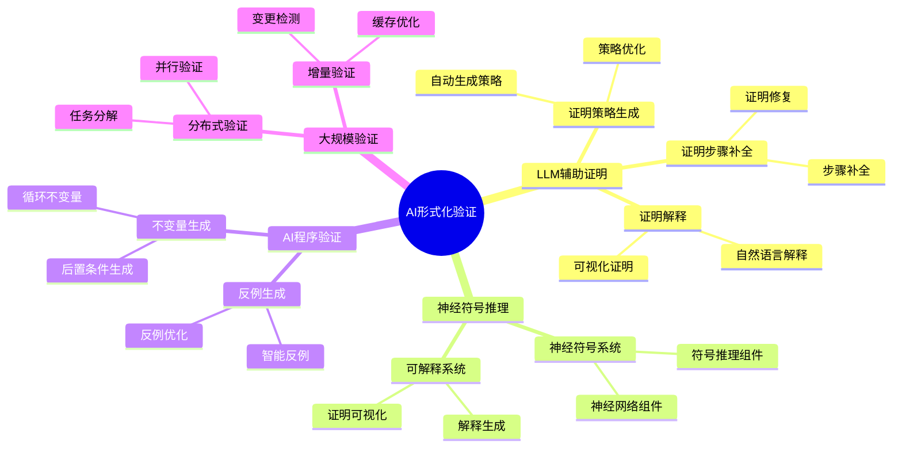
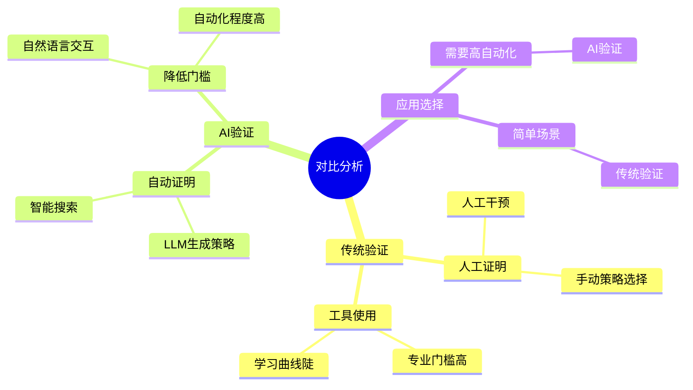
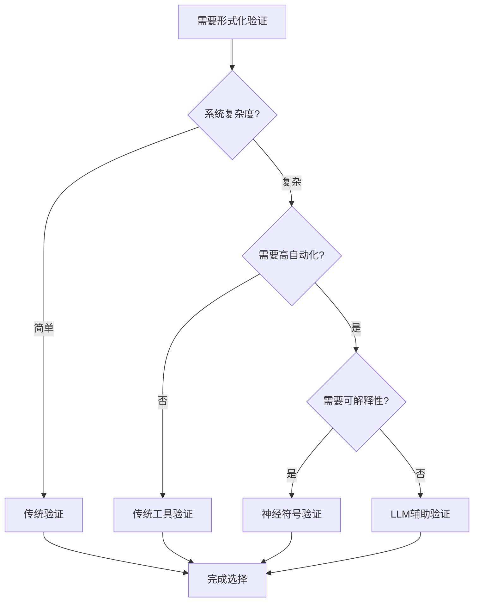
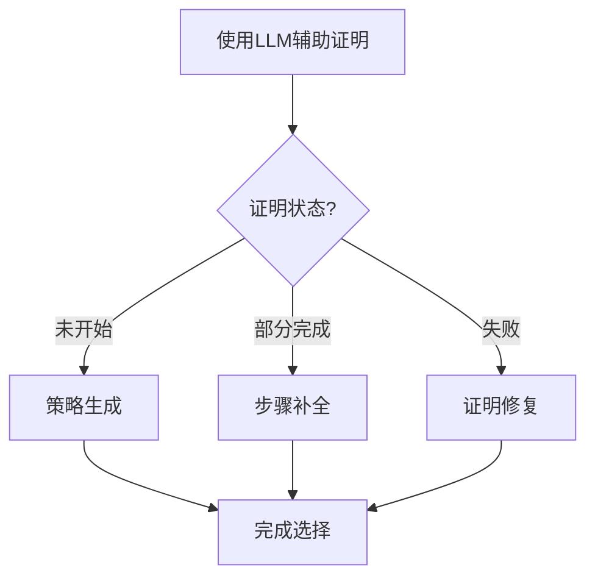
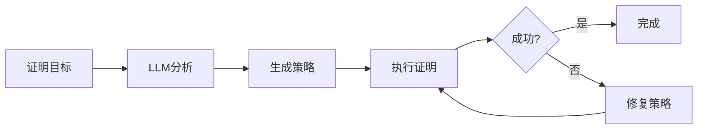
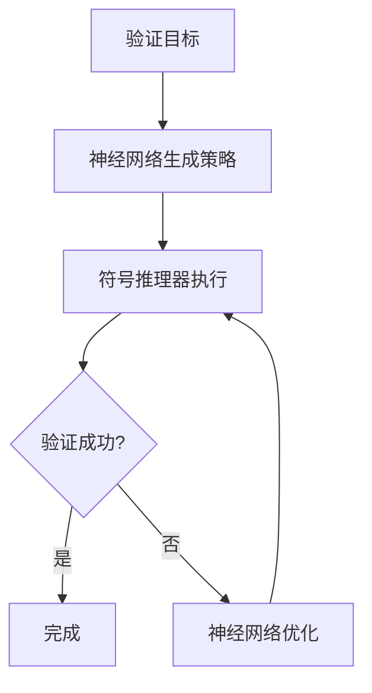
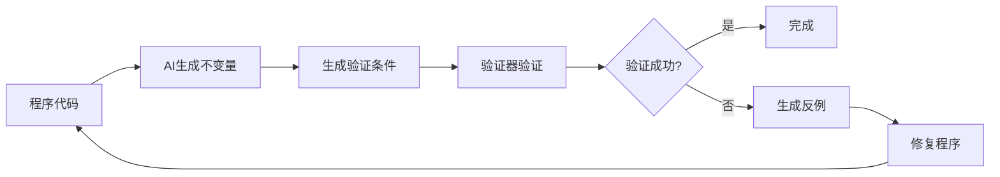
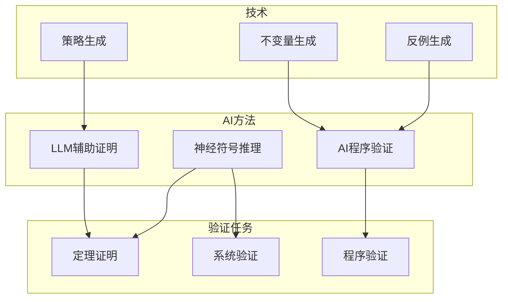
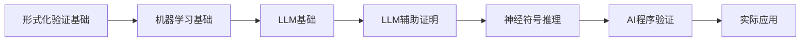

# AI驱动的形式化验证专题思维表征工具 / AI-Driven Formal Verification Special Topic Mental Representation Tools 2024-2025

## 📚 **概述 / Overview**

本文档为AI驱动的形式化验证专题提供完整的思维表征工具集合，包括思维导图、对比矩阵、决策树、数据流图等多种表征方式。

**创建时间**: 2025年1月
**状态**: ✅ 完成
**专题**: AI驱动的形式化验证（2024-2025最新研究）
**相关文档**: [AI驱动的形式化验证专题-2024-2025.md](AI驱动的形式化验证专题-2024-2025.md)

---

## 🗺️ **一、思维导图 / Mind Maps**

### 1.1 AI驱动的形式化验证完整思维导图

### 1.2 传统验证 vs AI验证思维导图

---

## 📊 **二、对比矩阵 / Comparison Matrices**

### 2.1 验证方法对比矩阵

| 验证方法 | 自动化程度 | 准确性 | 可解释性 | 适用场景 | 2024-2025创新 |
|---------|-----------|--------|--------|---------|--------------|
| **传统人工验证** | 低 | 高 | 高 | 简单场景 | 基础方法 |
| **传统工具验证** | 中等 | 高 | 中等 | 中等复杂度 | 传统方法 |
| **LLM辅助验证** | 高 | 中等 | 中等 | 复杂场景 | LLM辅助 |
| **神经符号验证** | 很高 | 高 | 中等 | 大规模系统 | 神经符号融合 |

### 2.2 LLM辅助证明方法对比矩阵

| 方法 | 输入 | 输出 | 准确率 | 速度 | 适用场景 |
|------|------|------|--------|------|---------|
| **策略生成** | 证明目标 | 证明策略 | 中等 | 快 | 策略选择 |
| **步骤补全** | 部分证明 | 完整证明 | 高 | 中等 | 证明补全 |
| **证明修复** | 失败证明 | 修复证明 | 中等 | 中等 | 错误修复 |

### 2.3 程序验证方法对比矩阵

| 方法 | 不变量生成 | 反例生成 | 验证效率 | 适用场景 |
|------|-----------|---------|---------|---------|
| **传统方法** | 手动 | 手动 | 低 | 简单程序 |
| **AI不变量生成** | 自动 | 手动 | 中等 | 中等复杂度 |
| **AI完整验证** | 自动 | 自动 | 高 | 复杂程序 |

---

## 🌳 **三、决策树 / Decision Trees**

### 3.1 验证方法选择决策树

### 3.2 LLM辅助证明方法选择决策树

---

## 🔄 **四、数据流图 / Data Flow Diagrams**

### 4.1 LLM辅助证明数据流

### 4.2 神经符号验证数据流

### 4.3 AI程序验证数据流

---

## 🗺️ **五、概念地图 / Concept Maps**

### 5.1 AI形式化验证核心概念关系

---

## 📈 **六、学习路径 / Learning Paths**

### 6.1 AI形式化验证学习逻辑路径

---

## 📊 **七、最新信息对齐 / Latest Information Alignment**

### 7.1 2024-2025最新研究进展

| 研究方向 | 最新进展 | 对形式化验证的影响 | 权威来源 |
|---------|---------|------------------|---------|
| **LLM辅助证明** | GPT-4等大模型在形式化证明中的应用 | 降低证明门槛，提高证明效率 | CAV 2024, ICLR 2024 |
| **神经符号推理** | 结合神经网络和符号推理的验证系统 | 提升自动化程度，处理复杂证明 | NeurIPS 2024, ICML 2024 |
| **AI程序验证** | 自动生成不变量和反例 | 提高程序验证自动化 | PLDI 2024, CAV 2024 |
| **大规模验证** | 分布式和增量验证技术 | 支持大规模系统验证 | CAV 2024, CAV 2025 |

### 7.2 最新成熟应用案例

| 应用领域 | 具体案例 | 使用的AI验证方法 | 实际效果 |
|---------|---------|----------------|---------|
| **数学定理证明** | 四色定理辅助证明 | LLM辅助证明 | 显著减少证明时间 |
| **程序验证** | 编译器验证 | AI不变量生成 | 提高验证自动化 |
| **智能合约验证** | 以太坊智能合约 | AI反例生成 | 自动发现漏洞 |
| **系统验证** | 操作系统验证 | 神经符号验证 | 支持大规模验证 |

---

**文档版本**: v1.0
**创建时间**: 2025年1月
**最后更新**: 2025年1月
**维护者**: GraphNetWorkCommunicate项目组
**状态**: ✅ 完成
