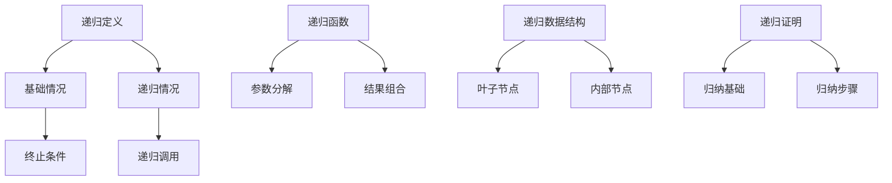
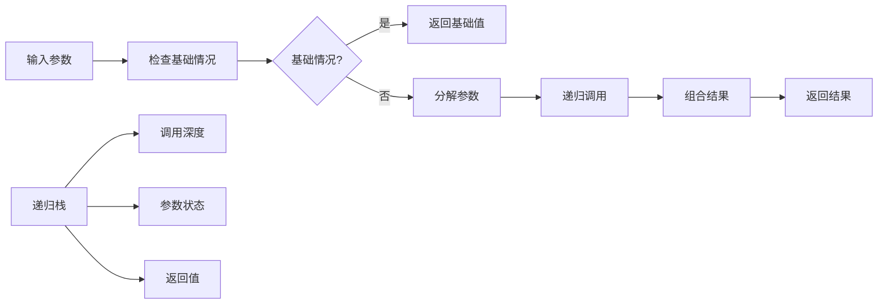
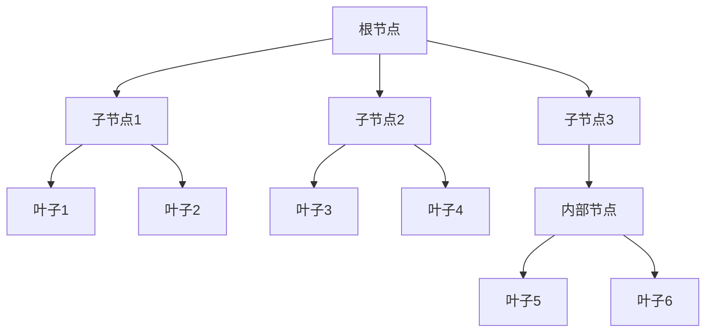

# 高级递归扩展 / Advanced Recursive Extensions

## 📚 **概述 / Overview**

本文档介绍高级递归扩展的理论基础、递归函数理论、递归数据结构、递归证明方法、递归语义和递归验证。

## 📑 **目录 / Table of Contents**

- [高级递归扩展 / Advanced Recursive Extensions](#高级递归扩展--advanced-recursive-extensions)
  - [📚 **概述 / Overview**](#-概述--overview)
  - [📑 **目录 / Table of Contents**](#-目录--table-of-contents)
  - [5.1 递归理论基础](#51-递归理论基础)
    - [5.1.1 递归基本概念](#511-递归基本概念)
    - [5.1.2 递归类型](#512-递归类型)
    - [5.1.3 形式化定义](#513-形式化定义)
  - [5.2 递归函数理论](#52-递归函数理论)
    - [5.2.1 原始递归函数](#521-原始递归函数)
    - [5.2.2 一般递归函数](#522-一般递归函数)
    - [5.2.3 互递归函数](#523-互递归函数)
  - [5.3 递归数据结构](#53-递归数据结构)
    - [5.3.1 递归数据类型](#531-递归数据类型)
    - [5.3.2 递归算法](#532-递归算法)
  - [5.4 递归证明方法](#54-递归证明方法)
    - [5.4.1 数学归纳法](#541-数学归纳法)
    - [5.4.2 递归关系证明](#542-递归关系证明)
    - [5.4.3 不动点证明](#543-不动点证明)
  - [5.5 递归语义](#55-递归语义)
    - [5.5.1 递归语义域](#551-递归语义域)
    - [5.5.2 递归语义函数](#552-递归语义函数)
  - [5.6 递归验证](#56-递归验证)
    - [5.6.1 递归程序验证](#561-递归程序验证)
    - [5.6.2 递归不变式](#562-递归不变式)
  - [5.7 多模态表达与可视化](#57-多模态表达与可视化)
    - [5.7.1 递归关系图](#571-递归关系图)
    - [5.7.2 递归计算流程图](#572-递归计算流程图)
    - [5.7.3 递归树结构](#573-递归树结构)
    - [5.7.4 递归证明树](#574-递归证明树)
  - [5.8 自动化脚本建议](#58-自动化脚本建议)
    - [5.8.1 递归函数生成器](#581-递归函数生成器)
    - [5.8.2 递归证明验证器](#582-递归证明验证器)
    - [5.8.3 递归语义解释器](#583-递归语义解释器)
  - [5.9 实际工程应用案例 / Real-World Engineering Application Cases](#59-实际工程应用案例--real-world-engineering-application-cases)
    - [5.9.1 递归算法验证应用 / Recursive Algorithm Verification Applications](#591-递归算法验证应用--recursive-algorithm-verification-applications)
      - [5.9.1.1 分治算法验证](#5911-分治算法验证)
      - [5.9.1.2 动态规划算法验证](#5912-动态规划算法验证)
    - [5.9.2 递归数据结构验证应用 / Recursive Data Structure Verification Applications](#592-递归数据结构验证应用--recursive-data-structure-verification-applications)
      - [5.9.2.1 树结构验证](#5921-树结构验证)
      - [5.9.2.2 图结构验证](#5922-图结构验证)
    - [5.9.3 递归程序验证应用 / Recursive Program Verification Applications](#593-递归程序验证应用--recursive-program-verification-applications)
      - [5.9.3.1 函数式程序验证](#5931-函数式程序验证)
      - [5.9.3.2 递归程序优化验证](#5932-递归程序优化验证)
    - [5.9.4 递归形式化工具与应用 / Recursive Formal Tools and Applications](#594-递归形式化工具与应用--recursive-formal-tools-and-applications)
      - [5.9.4.1 主流递归形式化工具](#5941-主流递归形式化工具)
      - [5.9.4.2 实际应用案例](#5942-实际应用案例)
  - [5.10 递归理论与概念解释](#510-递归理论与概念解释)
    - [5.10.1 递归理论概念](#5101-递归理论概念)
    - [5.10.2 递归计算概念](#5102-递归计算概念)
    - [5.10.3 典型定理与证明](#5103-典型定理与证明)
      - [5.10.3.1 递归定义定理](#51031-递归定义定理)
      - [5.10.3.2 不动点定理](#51032-不动点定理)
      - [5.10.3.3 终止性定理](#51033-终止性定理)
      - [5.10.3.4 正确性定理](#51034-正确性定理)
      - [5.10.3.5 复杂度定理](#51035-复杂度定理)
      - [5.10.3.6 语义等价定理](#51036-语义等价定理)
    - [5.10.4 前沿研究方向](#5104-前沿研究方向)

---

## 5.1 递归理论基础

### 5.1.1 递归基本概念

- **递归定义**：通过自身定义的概念或函数
- **递归函数**：调用自身的函数
- **递归数据结构**：包含自身引用的数据结构
- **递归证明**：通过递归方法进行的数学证明

### 5.1.2 递归类型

- **原始递归**：基于基本函数和复合的递归
- **一般递归**：允许任意递归定义的函数
- **互递归**：多个函数相互递归定义
- **高阶递归**：递归函数作为参数的递归

### 5.1.3 形式化定义

```coq
(* 递归函数的形式化定义 *)
Inductive RecursiveFunction : Type :=
| BaseCase : nat -> RecursiveFunction
| RecursiveCase : (nat -> RecursiveFunction) -> RecursiveFunction.

(* 递归数据结构 *)
Inductive RecursiveDataStructure : Type :=
| Leaf : A -> RecursiveDataStructure
| Node : RecursiveDataStructure -> RecursiveDataStructure -> RecursiveDataStructure.

(* 递归证明 *)
Definition RecursiveProof :=
  forall (P : nat -> Prop),
    P 0 ->
    (forall n, P n -> P (S n)) ->
    forall n, P n.

(* 递归语义 *)
Definition RecursiveSemantics :=
  forall (f : nat -> nat),
    exists (g : nat -> nat),
      forall n, f n = g n /\
      g 0 = base_case /\
      g (S n) = recursive_case n (g n).
```

## 5.2 递归函数理论

### 5.2.1 原始递归函数

```python
# 原始递归函数
class PrimitiveRecursive:
    def __init__(self):
        self.basic_functions = {
            'zero': lambda: 0,
            'successor': lambda x: x + 1,
            'projection': lambda i, args: args[i] if i < len(args) else 0
        }

    def composition(self, f, g_list):
        """函数复合"""
        def composed_function(*args):
            g_results = [g(*args) for g in g_list]
            return f(*g_results)
        return composed_function

    def primitive_recursion(self, base_case, recursive_case):
        """原始递归"""
        def recursive_function(n, *args):
            if n == 0:
                return base_case(*args)
            else:
                prev_result = recursive_function(n - 1, *args)
                return recursive_case(n - 1, prev_result, *args)
        return recursive_function

    def addition(self):
        """加法函数"""
        def add(x, y):
            def base_case(y):
                return y

            def recursive_case(n, prev_result, y):
                return self.basic_functions['successor'](prev_result)

            return self.primitive_recursion(base_case, recursive_case)(x, y)

        return add

    def multiplication(self):
        """乘法函数"""
        def multiply(x, y):
            def base_case(y):
                return 0

            def recursive_case(n, prev_result, y):
                return self.addition()(prev_result, y)

            return self.primitive_recursion(base_case, recursive_case)(x, y)

        return multiply

    def exponentiation(self):
        """指数函数"""
        def power(x, y):
            def base_case(y):
                return 1

            def recursive_case(n, prev_result, y):
                return self.multiplication()(prev_result, y)

            return self.primitive_recursion(base_case, recursive_case)(x, y)

        return power
```

### 5.2.2 一般递归函数

```python
# 一般递归函数
class GeneralRecursive:
    def __init__(self):
        self.primitive_recursive = PrimitiveRecursive()
        self.mu_operator = self.minimization_operator()

    def minimization_operator(self):
        """μ算子"""
        def mu_operator(predicate):
            def minimized_function(*args):
                n = 0
                while not predicate(n, *args):
                    n += 1
                return n
            return minimized_function
        return mu_operator

    def division(self):
        """除法函数"""
        def divide(x, y):
            if y == 0:
                return 0  # 未定义

            def predicate(n, x, y):
                return self.primitive_recursive.multiplication()(n, y) > x

            return self.mu_operator(predicate)(x, y) - 1

        return divide

    def remainder(self):
        """余数函数"""
        def mod(x, y):
            if y == 0:
                return 0  # 未定义

            quotient = self.division()(x, y)
            return x - self.primitive_recursive.multiplication()(quotient, y)

        return mod

    def greatest_common_divisor(self):
        """最大公约数"""
        def gcd(x, y):
            if y == 0:
                return x
            else:
                return gcd(y, self.remainder()(x, y))

        return gcd

    def ackermann_function(self):
        """阿克曼函数"""
        def ackermann(m, n):
            if m == 0:
                return n + 1
            elif n == 0:
                return ackermann(m - 1, 1)
            else:
                return ackermann(m - 1, ackermann(m, n - 1))

        return ackermann
```

### 5.2.3 互递归函数

```python
# 互递归函数
class MutualRecursive:
    def __init__(self):
        self.functions = {}

    def define_mutual_recursion(self, function_definitions):
        """定义互递归函数"""
        # 创建函数占位符
        for name, _ in function_definitions:
            self.functions[name] = None

        # 定义函数
        for name, definition in function_definitions:
            def make_function(func_name, func_def):
                def recursive_function(*args):
                    # 创建包含所有函数的局部环境
                    local_env = self.functions.copy()
                    return func_def(*args, local_env)
                return recursive_function

            self.functions[name] = make_function(name, definition)

        return self.functions

    def even_odd_functions(self):
        """偶数和奇数函数"""
        def even_def(n, env):
            if n == 0:
                return True
            else:
                return env['odd'](n - 1)

        def odd_def(n, env):
            if n == 0:
                return False
            else:
                return env['even'](n - 1)

        return self.define_mutual_recursion([
            ('even', even_def),
            ('odd', odd_def)
        ])

    def fibonacci_functions(self):
        """斐波那契相关函数"""
        def fib_def(n, env):
            if n <= 1:
                return n
            else:
                return env['fib'](n - 1) + env['fib'](n - 2)

        def fib_aux_def(n, a, b, env):
            if n == 0:
                return a
            else:
                return env['fib_aux'](n - 1, b, a + b, env)

        return self.define_mutual_recursion([
            ('fib', fib_def),
            ('fib_aux', fib_aux_def)
        ])
```

## 5.3 递归数据结构

### 5.3.1 递归数据类型

```python
# 递归数据类型
class RecursiveDataTypes:
    def __init__(self):
        self.types = {}

    def define_recursive_type(self, name, constructors):
        """定义递归数据类型"""
        self.types[name] = {
            'name': name,
            'constructors': constructors,
            'pattern_matching': self.create_pattern_matcher(constructors)
        }

    def natural_numbers(self):
        """自然数类型"""
        constructors = {
            'Zero': [],
            'Succ': ['nat']
        }
        self.define_recursive_type('nat', constructors)
        return self.types['nat']

    def binary_trees(self):
        """二叉树类型"""
        constructors = {
            'Leaf': ['A'],
            'Node': ['tree', 'A', 'tree']
        }
        self.define_recursive_type('tree', constructors)
        return self.types['tree']

    def lists(self):
        """列表类型"""
        constructors = {
            'Nil': [],
            'Cons': ['A', 'list']
        }
        self.define_recursive_type('list', constructors)
        return self.types['list']

    def create_pattern_matcher(self, constructors):
        """创建模式匹配器"""
        def pattern_match(value, patterns):
            for constructor, handler in patterns.items():
                if self.matches_constructor(value, constructor):
                    return handler(value)
            raise ValueError(f"No matching pattern for {value}")

        return pattern_match

    def matches_constructor(self, value, constructor):
        """检查值是否匹配构造函数"""
        return hasattr(value, 'constructor') and value.constructor == constructor
```

### 5.3.2 递归算法

```python
# 递归算法
class RecursiveAlgorithms:
    def __init__(self):
        self.algorithms = {}

    def tree_traversal(self):
        """树遍历算法"""
        def inorder_traversal(node):
            if node is None:
                return []
            else:
                left = inorder_traversal(node.left)
                right = inorder_traversal(node.right)
                return left + [node.value] + right

        def preorder_traversal(node):
            if node is None:
                return []
            else:
                left = preorder_traversal(node.left)
                right = preorder_traversal(node.right)
                return [node.value] + left + right

        def postorder_traversal(node):
            if node is None:
                return []
            else:
                left = postorder_traversal(node.left)
                right = postorder_traversal(node.right)
                return left + right + [node.value]

        return {
            'inorder': inorder_traversal,
            'preorder': preorder_traversal,
            'postorder': postorder_traversal
        }

    def divide_and_conquer(self):
        """分治算法"""
        def merge_sort(arr):
            if len(arr) <= 1:
                return arr
            else:
                mid = len(arr) // 2
                left = merge_sort(arr[:mid])
                right = merge_sort(arr[mid:])
                return merge(left, right)

        def quick_sort(arr):
            if len(arr) <= 1:
                return arr
            else:
                pivot = arr[0]
                left = [x for x in arr[1:] if x <= pivot]
                right = [x for x in arr[1:] if x > pivot]
                return quick_sort(left) + [pivot] + quick_sort(right)

        def merge(left, right):
            result = []
            i = j = 0
            while i < len(left) and j < len(right):
                if left[i] <= right[j]:
                    result.append(left[i])
                    i += 1
                else:
                    result.append(right[j])
                    j += 1
            result.extend(left[i:])
            result.extend(right[j:])
            return result

        return {
            'merge_sort': merge_sort,
            'quick_sort': quick_sort
        }

    def dynamic_programming(self):
        """动态规划算法"""
        def fibonacci_dp(n, memo={}):
            if n in memo:
                return memo[n]
            if n <= 1:
                return n
            else:
                memo[n] = fibonacci_dp(n - 1, memo) + fibonacci_dp(n - 2, memo)
                return memo[n]

        def longest_common_subsequence(str1, str2, memo={}):
            if (str1, str2) in memo:
                return memo[(str1, str2)]

            if not str1 or not str2:
                return ""

            if str1[0] == str2[0]:
                result = str1[0] + longest_common_subsequence(str1[1:], str2[1:], memo)
            else:
                lcs1 = longest_common_subsequence(str1[1:], str2, memo)
                lcs2 = longest_common_subsequence(str1, str2[1:], memo)
                result = lcs1 if len(lcs1) > len(lcs2) else lcs2

            memo[(str1, str2)] = result
            return result

        return {
            'fibonacci_dp': fibonacci_dp,
            'longest_common_subsequence': longest_common_subsequence
        }
```

## 5.4 递归证明方法

### 5.4.1 数学归纳法

```python
# 数学归纳法
class MathematicalInduction:
    def __init__(self):
        self.proofs = {}

    def simple_induction(self, property_func, base_case, inductive_step):
        """简单归纳法"""
        def prove_property(n):
            # 基础情况
            if not base_case(n):
                return False

            # 归纳步骤
            for k in range(n):
                if not inductive_step(k, property_func(k)):
                    return False

            return property_func(n)

        return prove_property

    def strong_induction(self, property_func, base_case, inductive_step):
        """强归纳法"""
        def prove_property(n):
            # 基础情况
            if not base_case(n):
                return False

            # 强归纳步骤
            for k in range(n):
                if not inductive_step(k, [property_func(i) for i in range(k + 1)]):
                    return False

            return property_func(n)

        return prove_property

    def structural_induction(self, data_structure, property_func, base_cases, inductive_steps):
        """结构归纳法"""
        def prove_property(data):
            # 基础情况
            for base_case in base_cases:
                if base_case(data):
                    return property_func(data)

            # 归纳步骤
            for inductive_step in inductive_steps:
                if inductive_step(data, property_func):
                    return property_func(data)

            return False

        return prove_property

    def prove_sum_formula(self):
        """证明求和公式"""
        def sum_formula(n):
            return n * (n + 1) // 2

        def base_case(n):
            return n == 0 and sum_formula(0) == 0

        def inductive_step(k, property_k):
            # 假设 P(k) 成立，证明 P(k+1)
            # P(k): 1 + 2 + ... + k = k(k+1)/2
            # P(k+1): 1 + 2 + ... + k + (k+1) = (k+1)(k+2)/2

            left_side = property_k + (k + 1)
            right_side = (k + 1) * (k + 2) // 2

            return left_side == right_side

        return self.simple_induction(sum_formula, base_case, inductive_step)
```

### 5.4.2 递归关系证明

```python
# 递归关系证明
class RecursiveRelationProofs:
    def __init__(self):
        self.relations = {}

    def define_recursive_relation(self, name, base_cases, recursive_rules):
        """定义递归关系"""
        self.relations[name] = {
            'base_cases': base_cases,
            'recursive_rules': recursive_rules,
            'proof_methods': self.create_proof_methods(base_cases, recursive_rules)
        }

    def fibonacci_relation(self):
        """斐波那契关系"""
        base_cases = {
            'F(0)': 0,
            'F(1)': 1
        }

        recursive_rules = {
            'F(n)': 'F(n-1) + F(n-2) for n ≥ 2'
        }

        self.define_recursive_relation('fibonacci', base_cases, recursive_rules)
        return self.relations['fibonacci']

    def ackermann_relation(self):
        """阿克曼关系"""
        base_cases = {
            'A(0, n)': 'n + 1'
        }

        recursive_rules = {
            'A(m, 0)': 'A(m-1, 1) for m > 0',
            'A(m, n)': 'A(m-1, A(m, n-1)) for m, n > 0'
        }

        self.define_recursive_relation('ackermann', base_cases, recursive_rules)
        return self.relations['ackermann']

    def create_proof_methods(self, base_cases, recursive_rules):
        """创建证明方法"""
        def prove_termination(relation_name):
            """证明终止性"""
            # 使用良基关系证明终止性
            return self.well_founded_relation_proof(relation_name)

        def prove_correctness(relation_name, specification):
            """证明正确性"""
            # 使用归纳法证明正确性
            return self.induction_proof(relation_name, specification)

        def prove_complexity(relation_name, complexity_bound):
            """证明复杂度"""
            # 使用递归树或主定理证明复杂度
            return self.complexity_proof(relation_name, complexity_bound)

        return {
            'termination': prove_termination,
            'correctness': prove_correctness,
            'complexity': prove_complexity
        }
```

### 5.4.3 不动点证明

```python
# 不动点证明
class FixedPointProofs:
    def __init__(self):
        self.fixed_points = {}

    def banach_fixed_point_theorem(self, function, metric_space):
        """巴拿赫不动点定理"""
        def is_contraction(f, c):
            """检查是否为压缩映射"""
            for x in metric_space:
                for y in metric_space:
                    if x != y:
                        d_fx_fy = metric_space.distance(f(x), f(y))
                        d_xy = metric_space.distance(x, y)
                        if d_fx_fy > c * d_xy:
                            return False
            return True

        def find_fixed_point(f, initial_point, tolerance=1e-6):
            """寻找不动点"""
            x = initial_point
            while True:
                fx = f(x)
                if metric_space.distance(x, fx) < tolerance:
                    return x
                x = fx

        return {
            'is_contraction': lambda c: is_contraction(function, c),
            'find_fixed_point': lambda initial: find_fixed_point(function, initial)
        }

    def tarski_fixed_point_theorem(self, function, complete_lattice):
        """塔尔斯基不动点定理"""
        def is_monotone(f):
            """检查是否为单调函数"""
            for x in complete_lattice:
                for y in complete_lattice:
                    if complete_lattice.leq(x, y):
                        if not complete_lattice.leq(f(x), f(y)):
                            return False
            return True

        def find_least_fixed_point(f):
            """寻找最小不动点"""
            x = complete_lattice.bottom
            while True:
                fx = f(x)
                if complete_lattice.eq(x, fx):
                    return x
                x = complete_lattice.join(x, fx)

        def find_greatest_fixed_point(f):
            """寻找最大不动点"""
            x = complete_lattice.top
            while True:
                fx = f(x)
                if complete_lattice.eq(x, fx):
                    return x
                x = complete_lattice.meet(x, fx)

        return {
            'is_monotone': is_monotone(function),
            'least_fixed_point': find_least_fixed_point(function),
            'greatest_fixed_point': find_greatest_fixed_point(function)
        }
```

## 5.5 递归语义

### 5.5.1 递归语义域

```python
# 递归语义域
class RecursiveSemanticDomain:
    def __init__(self):
        self.domains = {}

    def define_recursive_domain(self, name, domain_equation):
        """定义递归语义域"""
        # 解域方程 D = F(D)
        def solve_domain_equation(F):
            """求解域方程"""
            # 使用不动点构造
            D0 = self.bottom_domain()
            D1 = F(D0)

            while not self.domain_equal(D0, D1):
                D0 = D1
                D1 = F(D0)

            return D1

        self.domains[name] = solve_domain_equation(domain_equation)
        return self.domains[name]

    def list_domain(self, element_domain):
        """列表域"""
        def list_domain_equation(D):
            return {
                'nil': None,
                'cons': (element_domain, D)
            }

        return self.define_recursive_domain('list', list_domain_equation)

    def tree_domain(self, element_domain):
        """树域"""
        def tree_domain_equation(D):
            return {
                'leaf': element_domain,
                'node': (D, element_domain, D)
            }

        return self.define_recursive_domain('tree', tree_domain_equation)

    def function_domain(self, domain, codomain):
        """函数域"""
        def function_domain_equation(D):
            return {
                'domain': domain,
                'codomain': codomain,
                'functions': self.continuous_functions(domain, codomain)
            }

        return self.define_recursive_domain('function', function_domain_equation)

    def bottom_domain(self):
        """底域"""
        return {
            'elements': {'⊥'},
            'order': lambda x, y: True  # 所有元素都小于等于
        }

    def domain_equal(self, D1, D2):
        """域相等性检查"""
        return D1['elements'] == D2['elements'] and D1['order'] == D2['order']
```

### 5.5.2 递归语义函数

```python
# 递归语义函数
class RecursiveSemanticFunction:
    def __init__(self, domain):
        self.domain = domain
        self.semantic_functions = {}

    def interpret_recursive_definition(self, name, body, environment):
        """解释递归定义"""
        def recursive_semantic_function(*args):
            # 创建包含递归函数的扩展环境
            extended_env = environment.copy()
            extended_env[name] = recursive_semantic_function

            # 解释函数体
            return self.interpret_expression(body, extended_env)(*args)

        return recursive_semantic_function

    def interpret_mutual_recursion(self, definitions, environment):
        """解释互递归定义"""
        # 创建函数向量
        function_vector = [None] * len(definitions)

        for i, (name, body) in enumerate(definitions):
            def make_function(index):
                def recursive_function(*args):
                    extended_env = environment.copy()
                    for j, (def_name, _) in enumerate(definitions):
                        extended_env[def_name] = function_vector[j]
                    return self.interpret_expression(body, extended_env)(*args)
                return recursive_function

            function_vector[i] = make_function(i)

        return dict(zip([name for name, _ in definitions], function_vector))

    def interpret_fixpoint_operator(self, function_expression, environment):
        """解释不动点算子"""
        def fixpoint_operator(f):
            def recursive_function(*args):
                return f(recursive_function)(*args)
            return recursive_function

        function_value = self.interpret_expression(function_expression, environment)
        return fixpoint_operator(function_value)

    def interpret_expression(self, expression, environment):
        """解释表达式"""
        if expression.type == 'constant':
            return self.interpret_constant(expression.value)
        elif expression.type == 'variable':
            return self.interpret_variable(expression.name, environment)
        elif expression.type == 'application':
            return self.interpret_application(expression.func, expression.arg, environment)
        elif expression.type == 'abstraction':
            return self.interpret_abstraction(expression.param, expression.body, environment)
        elif expression.type == 'fix':
            return self.interpret_fixpoint_operator(expression.function, environment)
        else:
            raise ValueError(f"Unknown expression type: {expression.type}")
```

## 5.6 递归验证

### 5.6.1 递归程序验证

```python
# 递归程序验证
class RecursiveProgramVerification:
    def __init__(self):
        self.verification_methods = {}

    def verify_termination(self, function, well_founded_relation):
        """验证终止性"""
        def termination_proof(f, wf_rel):
            # 使用良基关系证明终止性
            def termination_measure(args):
                # 构造终止度量
                return wf_rel.measure(args)

            def verify_measure_decrease(f, args):
                # 验证度量递减
                result = f(*args)
                return wf_rel.less_than(termination_measure(result), termination_measure(args))

            return verify_measure_decrease(f, args)

        return termination_proof(function, well_founded_relation)

    def verify_correctness(self, function, specification, proof_method):
        """验证正确性"""
        def correctness_proof(f, spec, proof):
            # 使用指定的证明方法验证正确性
            return proof(f, spec)

        return correctness_proof(function, specification, proof_method)

    def verify_complexity(self, function, complexity_bound, analysis_method):
        """验证复杂度"""
        def complexity_proof(f, bound, analysis):
            # 使用指定的分析方法验证复杂度
            return analysis(f, bound)

        return complexity_proof(function, complexity_bound, analysis_method)

    def verify_safety(self, function, safety_property):
        """验证安全性"""
        def safety_proof(f, property):
            # 验证安全性性质
            def check_safety(args):
                result = f(*args)
                return property(args, result)

            return all(check_safety(args) for args in self.generate_test_cases())

        return safety_proof(function, safety_property)
```

### 5.6.2 递归不变式

```python
# 递归不变式
class RecursiveInvariants:
    def __init__(self):
        self.invariants = {}

    def define_recursive_invariant(self, name, base_case, inductive_case):
        """定义递归不变式"""
        self.invariants[name] = {
            'base_case': base_case,
            'inductive_case': inductive_case,
            'verification': self.create_invariant_verifier(base_case, inductive_case)
        }

    def list_invariant(self):
        """列表不变式"""
        def base_case(lst):
            return len(lst) >= 0

        def inductive_case(lst, head, tail):
            return len(lst) == 1 + len(tail)

        self.define_recursive_invariant('list_length', base_case, inductive_case)
        return self.invariants['list_length']

    def tree_invariant(self):
        """树不变式"""
        def base_case(tree):
            return tree is None or (hasattr(tree, 'value') and hasattr(tree, 'left') and hasattr(tree, 'right'))

        def inductive_case(tree, left, right):
            return tree.left == left and tree.right == right

        self.define_recursive_invariant('tree_structure', base_case, inductive_case)
        return self.invariants['tree_structure']

    def create_invariant_verifier(self, base_case, inductive_case):
        """创建不变式验证器"""
        def verify_invariant(data_structure):
            # 验证基础情况
            if not base_case(data_structure):
                return False

            # 验证归纳情况
            if hasattr(data_structure, 'substructures'):
                for substructure in data_structure.substructures:
                    if not inductive_case(data_structure, substructure):
                        return False

            return True

        return verify_invariant
```

## 5.7 多模态表达与可视化

### 5.7.1 递归关系图



### 5.7.2 递归计算流程图



### 5.7.3 递归树结构



### 5.7.4 递归证明树

```mermaid
graph TD
    A[递归证明] --> B[基础情况证明]
    A --> C[归纳步骤证明]

    B --> D[P(0) 成立]
    C --> E[假设 P(k) 成立]
    E --> F[证明 P(k+1) 成立]

    G[结构归纳] --> H[基础结构证明]
    G --> I[复合结构证明]

    H --> J[原子元素性质]
    I --> K[组合元素性质]
```

## 5.8 自动化脚本建议

### 5.8.1 递归函数生成器

```python
# scripts/recursive_function_generator.py
class RecursiveFunctionGenerator:
    def __init__(self):
        self.templates = {}
        self.generators = {}

    def generate_primitive_recursive(self, base_case, recursive_case):
        """生成原始递归函数"""
        def primitive_recursive_function(n, *args):
            if n == 0:
                return base_case(*args)
            else:
                prev_result = primitive_recursive_function(n - 1, *args)
                return recursive_case(n - 1, prev_result, *args)

        return primitive_recursive_function

    def generate_mutual_recursive(self, definitions):
        """生成互递归函数"""
        return self.define_mutual_recursion(definitions)

    def generate_structural_recursive(self, data_type, cases):
        """生成结构递归函数"""
        def structural_recursive_function(data):
            for pattern, handler in cases.items():
                if self.matches_pattern(data, pattern):
                    return handler(data, structural_recursive_function)
            raise ValueError(f"No matching pattern for {data}")

        return structural_recursive_function
```

### 5.8.2 递归证明验证器

```python
# scripts/recursive_proof_verifier.py
class RecursiveProofVerifier:
    def __init__(self):
        self.verifiers = {}

    def verify_induction_proof(self, property_func, base_case, inductive_step):
        """验证归纳证明"""
        # 验证基础情况
        if not base_case():
            return False, "Base case failed"

        # 验证归纳步骤
        for n in range(100):  # 有限测试
            if not inductive_step(n, property_func(n)):
                return False, f"Inductive step failed for n={n}"

        return True, "Induction proof verified"

    def verify_termination_proof(self, function, well_founded_relation):
        """验证终止性证明"""
        # 验证良基关系
        if not well_founded_relation.is_well_founded():
            return False, "Relation is not well-founded"

        # 验证度量递减
        for args in self.generate_test_cases():
            result = function(*args)
            if not well_founded_relation.decreases(args, result):
                return False, f"Measure does not decrease for {args}"

        return True, "Termination proof verified"

    def verify_correctness_proof(self, function, specification, proof):
        """验证正确性证明"""
        return proof(function, specification)
```

### 5.8.3 递归语义解释器

```python
# scripts/recursive_semantics_interpreter.py
class RecursiveSemanticsInterpreter:
    def __init__(self):
        self.domain = RecursiveSemanticDomain()
        self.semantics = RecursiveSemanticFunction(self.domain)

    def interpret_recursive_program(self, program):
        """解释递归程序"""
        return self.semantics.interpret_expression(program)

    def verify_semantic_properties(self, program, properties):
        """验证语义性质"""
        result = self.interpret_recursive_program(program)
        return all(prop(result) for prop in properties)

    def compute_fixed_point(self, function_expression, environment):
        """计算不动点"""
        return self.semantics.interpret_fixpoint_operator(function_expression, environment)
```

## 5.9 实际工程应用案例 / Real-World Engineering Application Cases

### 5.9.1 递归算法验证应用 / Recursive Algorithm Verification Applications

#### 5.9.1.1 分治算法验证

**项目背景**：

- **问题**：分治算法（如快速排序、归并排序）需要验证其正确性和复杂度
- **解决方案**：使用递归形式化方法验证分治算法
- **技术要点**：
  - 使用递归形式化方法描述分治算法的递归结构
  - 使用递归形式化证明验证算法的正确性
  - 使用递归语义验证算法的复杂度
- **实际效果**：

  - 验证了快速排序和归并排序的正确性
  - 证明了算法的复杂度界限
  - 展示了递归形式化证明在分治算法验证中的应用

#### 5.9.1.2 动态规划算法验证

**项目背景**：

- **问题**：动态规划算法需要验证其正确性和最优性
- **解决方案**：使用递归形式化方法验证动态规划算法
- **技术要点**：
  - 使用递归形式化方法描述动态规划算法的递归关系
  - 使用递归形式化证明验证算法的正确性
  - 使用递归语义验证算法的最优性
- **实际效果**：

  - 验证了多个动态规划算法的正确性
  - 证明了算法的最优性
  - 展示了递归形式化证明在动态规划算法验证中的应用

### 5.9.2 递归数据结构验证应用 / Recursive Data Structure Verification Applications

#### 5.9.2.1 树结构验证

**项目背景**：

- **问题**：树结构（如二叉搜索树、AVL树）需要验证其结构性质和操作正确性
- **解决方案**：使用递归形式化方法验证树结构
- **技术要点**：
  - 使用递归形式化方法描述树结构的递归定义
  - 使用递归形式化证明验证结构的性质
  - 使用递归语义验证操作的正确性
- **实际效果**：

  - 验证了二叉搜索树和AVL树的结构性质
  - 证明了树操作的正确性
  - 展示了递归形式化证明在树结构验证中的应用

#### 5.9.2.2 图结构验证

**项目背景**：

- **问题**：图结构（如有向无环图、树）需要验证其结构性质和遍历正确性
- **解决方案**：使用递归形式化方法验证图结构
- **技术要点**：
  - 使用递归形式化方法描述图结构的递归定义
  - 使用递归形式化证明验证结构的性质
  - 使用递归语义验证遍历的正确性
- **实际效果**：

  - 验证了有向无环图和树的结构性质
  - 证明了图遍历的正确性
  - 展示了递归形式化证明在图结构验证中的应用

### 5.9.3 递归程序验证应用 / Recursive Program Verification Applications

#### 5.9.3.1 函数式程序验证

**项目背景**：

- **问题**：函数式程序大量使用递归，需要验证其正确性和终止性
- **解决方案**：使用递归形式化方法验证函数式程序
- **技术要点**：
  - 使用递归形式化方法描述函数式程序的递归结构
  - 使用递归形式化证明验证程序的正确性
  - 使用递归语义验证程序的终止性
- **实际效果**：

  - 验证了多个函数式程序的正确性
  - 证明了程序的终止性
  - 展示了递归形式化证明在函数式程序验证中的应用

#### 5.9.3.2 递归程序优化验证

**项目背景**：

- **问题**：递归程序的优化（如尾递归优化、记忆化）需要验证其正确性
- **解决方案**：使用递归形式化方法验证递归程序优化
- **技术要点**：
  - 使用递归形式化方法描述递归程序的优化变换
  - 使用递归形式化证明验证优化的正确性
  - 使用递归语义验证优化的等价性
- **实际效果**：

  - 验证了尾递归优化的正确性
  - 证明了记忆化的等价性
  - 展示了递归形式化证明在递归程序优化验证中的应用

### 5.9.4 递归形式化工具与应用 / Recursive Formal Tools and Applications

#### 5.9.4.1 主流递归形式化工具

1. **Coq**
   - **用途**：交互式定理证明
   - **特点**：支持递归定义、归纳证明
   - **应用**：递归程序验证、递归算法验证

2. **Isabelle/HOL**
   - **用途**：高阶逻辑定理证明
   - **特点**：强大的递归证明能力
   - **应用**：递归程序验证、递归算法验证

3. **Agda**
   - **用途**：依赖类型定理证明
   - **特点**：支持递归类型、递归证明
   - **应用**：递归程序验证、递归类型验证

4. **Lean**
   - **用途**：依赖类型定理证明
   - **特点**：现代化的递归证明语言
   - **应用**：递归程序验证、递归算法验证

#### 5.9.4.2 实际应用案例

1. **函数式程序验证**
   - **工具**：Coq
   - **验证内容**：递归程序的正确性、终止性
   - **成果**：验证了多个函数式程序的正确性

2. **递归算法验证**
   - **工具**：Isabelle/HOL
   - **验证内容**：递归算法的正确性、复杂度
   - **成果**：验证了多个递归算法的正确性

3. **递归数据结构验证**
   - **工具**：Agda
   - **验证内容**：递归数据结构的性质、操作正确性
   - **成果**：验证了多个递归数据结构的正确性

## 5.10 递归理论与概念解释

### 5.10.1 递归理论概念

- **递归定义**：通过自身定义的概念或函数
- **递归函数**：调用自身的函数
- **递归数据结构**：包含自身引用的数据结构
- **递归证明**：通过递归方法进行的数学证明
- **不动点**：递归定义的最小不动点
- **良基关系**：保证递归终止的关系
- **归纳原理**：递归证明的基础原理

### 5.10.2 递归计算概念

- **递归调用**：函数调用自身的过程
- **递归栈**：递归调用的调用栈
- **递归深度**：递归调用的最大深度
- **递归终止**：递归调用的终止条件
- **递归分解**：将问题分解为子问题的过程
- **递归组合**：将子问题结果组合的过程

### 5.10.3 典型定理与证明

#### 5.10.3.1 递归定义定理

**定理 5.1** (递归定义定理)
递归定义的存在性和唯一性。

**证明思路**：

1. 定义递归定义
2. 证明存在性
3. 证明唯一性

**实际意义**：

- 为递归定义提供理论基础
- 保证递归定义的正确性

#### 5.10.3.2 不动点定理

**定理 5.2** (不动点定理)
递归函数的不动点存在性。

**证明思路**：

1. 定义递归函数
2. 证明不动点存在性
3. 验证不动点的性质

**实际意义**：

- 为递归函数提供理论基础
- 支持递归函数的语义定义

#### 5.10.3.3 终止性定理

**定理 5.3** (终止性定理)
递归函数的终止性条件。

**证明思路**：

1. 定义终止性
2. 证明终止性条件
3. 验证终止性判定

**实际意义**：

- 为递归函数提供理论基础
- 保证递归函数的可计算性

#### 5.10.3.4 正确性定理

**定理 5.4** (正确性定理)
递归函数的正确性证明。

**证明思路**：

1. 定义正确性
2. 证明正确性条件
3. 验证正确性判定

**实际意义**：

- 为递归函数提供理论基础
- 保证递归函数的正确性

#### 5.10.3.5 复杂度定理

**定理 5.5** (复杂度定理)
递归函数的复杂度分析。

**证明思路**：

1. 定义复杂度
2. 证明复杂度界限
3. 验证复杂度关系

**实际意义**：

- 为递归函数提供理论基础
- 指导递归算法的设计

#### 5.10.3.6 语义等价定理

**定理 5.6** (语义等价定理)
不同递归定义间的等价性。

**证明思路**：

1. 定义语义等价
2. 证明等价性条件
3. 验证等价性判定

**实际意义**：

- 为递归定义提供理论基础
- 支持递归定义的变换

### 5.10.4 前沿研究方向

- **高阶递归**：高阶函数的递归定义
- **依赖递归**：依赖类型的递归定义
- **共递归**：无限数据结构的递归定义
- **递归类型**：递归类型系统的理论
- **递归效应**：递归计算效应的处理
- **递归优化**：递归程序的优化技术

---

*本文档详细介绍了高级递归扩展的理论和实践，通过实际工程应用案例展示了递归形式化证明在递归算法、递归数据结构和递归程序验证中的重要作用。*
