# 量子形式化证明 / Quantum Formal Proof

## 📚 **概述 / Overview**

本文档介绍量子形式化证明的理论基础、量子逻辑门、量子电路、量子证明、量子语义和量子验证。

## 📑 **目录 / Table of Contents**

- [量子形式化证明 / Quantum Formal Proof](#量子形式化证明--quantum-formal-proof)
  - [📚 **概述 / Overview**](#-概述--overview)
  - [📑 **目录 / Table of Contents**](#-目录--table-of-contents)
  - [6.1 量子理论基础](#61-量子理论基础)
    - [6.1.1 量子基本概念](#611-量子基本概念)
    - [6.1.2 量子逻辑](#612-量子逻辑)
    - [6.1.3 形式化定义](#613-形式化定义)
  - [6.2 量子逻辑门](#62-量子逻辑门)
    - [6.2.1 基本量子门](#621-基本量子门)
    - [6.2.2 量子门组合](#622-量子门组合)
    - [6.2.3 量子门验证](#623-量子门验证)
  - [6.3 量子电路](#63-量子电路)
    - [6.3.1 量子电路构造](#631-量子电路构造)
    - [6.3.2 量子算法](#632-量子算法)
  - [6.4 量子证明](#64-量子证明)
    - [6.4.1 量子逻辑证明](#641-量子逻辑证明)
    - [6.4.2 量子复杂性证明](#642-量子复杂性证明)
  - [6.5 量子语义](#65-量子语义)
    - [6.5.1 量子语义域](#651-量子语义域)
    - [6.5.2 量子语义函数](#652-量子语义函数)
  - [6.6 量子验证](#66-量子验证)
    - [6.6.1 量子程序验证](#661-量子程序验证)
    - [6.6.2 量子不变式](#662-量子不变式)
  - [6.7 多模态表达与可视化](#67-多模态表达与可视化)
    - [6.7.1 量子电路图](#671-量子电路图)
    - [6.7.2 量子态演化图](#672-量子态演化图)
    - [6.7.3 量子复杂度层次](#673-量子复杂度层次)
    - [6.7.4 量子证明树](#674-量子证明树)
  - [6.8 自动化脚本建议](#68-自动化脚本建议)
    - [6.8.1 量子电路模拟器](#681-量子电路模拟器)
    - [6.8.2 量子证明验证器](#682-量子证明验证器)
    - [6.8.3 量子语义解释器](#683-量子语义解释器)
  - [6.9 量子理论与概念解释](#69-量子理论与概念解释)
    - [6.9.1 量子理论概念](#691-量子理论概念)
    - [6.9.2 量子计算概念](#692-量子计算概念)
    - [6.9.3 典型定理与证明](#693-典型定理与证明)
    - [6.9.4 前沿研究方向](#694-前沿研究方向)

---

## 6.1 量子理论基础

### 6.1.1 量子基本概念

- **量子态**：量子系统的状态向量
- **量子门**：量子态的变换操作
- **量子测量**：量子态的观测过程
- **量子纠缠**：多量子比特间的关联

### 6.1.2 量子逻辑

- **量子逻辑门**：NOT、CNOT、Hadamard等
- **量子电路**：量子门的组合
- **量子算法**：基于量子计算的算法
- **量子复杂性**：量子计算的复杂度理论

### 6.1.3 形式化定义

```coq
(* 量子态的形式化定义 *)
Inductive QuantumState : Type :=
| PureState : Vector -> QuantumState
| MixedState : DensityMatrix -> QuantumState.

(* 量子门的形式化定义 *)
Definition QuantumGate := UnitaryMatrix.

(* 量子电路的形式化定义 *)
Inductive QuantumCircuit : Type :=
| SingleGate : QuantumGate -> QuantumCircuit
| Sequential : QuantumCircuit -> QuantumCircuit -> QuantumCircuit
| Parallel : QuantumCircuit -> QuantumCircuit -> QuantumCircuit.

(* 量子测量 *)
Definition QuantumMeasurement :=
  forall (state : QuantumState) (basis : Basis),
    exists (result : MeasurementResult),
      measure state basis = result.
```

## 6.2 量子逻辑门

### 6.2.1 基本量子门

```python
# 基本量子门
class QuantumGates:
    def __init__(self):
        self.gates = {}

    def pauli_x(self):
        """Pauli-X门 (NOT门)"""
        return np.array([[0, 1], [1, 0]])

    def pauli_y(self):
        """Pauli-Y门"""
        return np.array([[0, -1j], [1j, 0]])

    def pauli_z(self):
        """Pauli-Z门"""
        return np.array([[1, 0], [0, -1]])

    def hadamard(self):
        """Hadamard门"""
        return (1/np.sqrt(2)) * np.array([[1, 1], [1, -1]])

    def phase_shift(self, theta):
        """相位门"""
        return np.array([[1, 0], [0, np.exp(1j * theta)]])

    def cnot(self):
        """CNOT门"""
        return np.array([[1, 0, 0, 0],
                        [0, 1, 0, 0],
                        [0, 0, 0, 1],
                        [0, 0, 1, 0]])

    def swap(self):
        """SWAP门"""
        return np.array([[1, 0, 0, 0],
                        [0, 0, 1, 0],
                        [0, 1, 0, 0],
                        [0, 0, 0, 1]])

    def toffoli(self):
        """Toffoli门 (CCNOT)"""
        return np.array([[1, 0, 0, 0, 0, 0, 0, 0],
                        [0, 1, 0, 0, 0, 0, 0, 0],
                        [0, 0, 1, 0, 0, 0, 0, 0],
                        [0, 0, 0, 1, 0, 0, 0, 0],
                        [0, 0, 0, 0, 1, 0, 0, 0],
                        [0, 0, 0, 0, 0, 1, 0, 0],
                        [0, 0, 0, 0, 0, 0, 0, 1],
                        [0, 0, 0, 0, 0, 0, 1, 0]])
```

### 6.2.2 量子门组合

```python
# 量子门组合
class QuantumGateComposition:
    def __init__(self):
        self.gates = QuantumGates()

    def sequential_composition(self, gate1, gate2):
        """顺序组合"""
        return np.dot(gate2, gate1)

    def parallel_composition(self, gate1, gate2):
        """并行组合 (张量积)"""
        return np.kron(gate1, gate2)

    def controlled_gate(self, control_gate, target_gate):
        """受控门"""
        n_control = int(np.log2(control_gate.shape[0]))
        n_target = int(np.log2(target_gate.shape[0]))
        total_qubits = n_control + n_target

        # 构造受控门矩阵
        size = 2**total_qubits
        controlled_matrix = np.eye(size)

        # 设置受控操作
        for i in range(2**n_control):
            if i == 2**n_control - 1:  # 控制比特全为1
                for j in range(2**n_target):
                    for k in range(2**n_target):
                        row = i * 2**n_target + j
                        col = i * 2**n_target + k
                        controlled_matrix[row, col] = target_gate[j, k]

        return controlled_matrix

    def quantum_fourier_transform(self, n_qubits):
        """量子傅里叶变换"""
        def qft_gate(n):
            if n == 1:
                return self.gates.hadamard()
            else:
                h_gate = self.gates.hadamard()
                phase_gates = [self.gates.phase_shift(2*np.pi/2**i) for i in range(2, n+1)]

                # 构造QFT矩阵
                size = 2**n
                qft_matrix = np.zeros((size, size), dtype=complex)

                for i in range(size):
                    for j in range(size):
                        qft_matrix[i, j] = np.exp(2*np.pi*1j*i*j/size) / np.sqrt(size)

                return qft_matrix

        return qft_gate(n_qubits)
```

### 6.2.3 量子门验证

```python
# 量子门验证
class QuantumGateVerification:
    def __init__(self):
        self.verification_methods = {}

    def verify_unitarity(self, gate):
        """验证幺正性"""
        # 检查 U†U = I
        adjoint = np.conjugate(gate.T)
        product = np.dot(adjoint, gate)
        identity = np.eye(gate.shape[0])

        return np.allclose(product, identity)

    def verify_reversibility(self, gate):
        """验证可逆性"""
        # 检查 det(U) = 1
        determinant = np.linalg.det(gate)
        return np.isclose(abs(determinant), 1.0)

    def verify_hermitian(self, gate):
        """验证厄米性"""
        # 检查 H = H†
        adjoint = np.conjugate(gate.T)
        return np.allclose(gate, adjoint)

    def verify_commutation(self, gate1, gate2):
        """验证对易性"""
        # 检查 [G1, G2] = G1G2 - G2G1 = 0
        commutator = np.dot(gate1, gate2) - np.dot(gate2, gate1)
        return np.allclose(commutator, np.zeros_like(commutator))

    def verify_anticommutation(self, gate1, gate2):
        """验证反对易性"""
        # 检查 {G1, G2} = G1G2 + G2G1 = 0
        anticommutator = np.dot(gate1, gate2) + np.dot(gate2, gate1)
        return np.allclose(anticommutator, np.zeros_like(anticommutator))
```

## 6.3 量子电路

### 6.3.1 量子电路构造

```python
# 量子电路构造
class QuantumCircuit:
    def __init__(self, n_qubits):
        self.n_qubits = n_qubits
        self.gates = []
        self.measurements = []
        self.state = self.initialize_state()

    def initialize_state(self):
        """初始化量子态"""
        # |0⟩^⊗n
        state = np.zeros(2**self.n_qubits, dtype=complex)
        state[0] = 1.0
        return state

    def apply_gate(self, gate, qubits):
        """应用量子门"""
        # 构造完整的门矩阵
        full_gate = self.construct_full_gate(gate, qubits)

        # 应用门
        self.state = np.dot(full_gate, self.state)

        # 记录门操作
        self.gates.append({
            'gate': gate,
            'qubits': qubits,
            'full_gate': full_gate
        })

    def construct_full_gate(self, gate, qubits):
        """构造完整的门矩阵"""
        size = 2**self.n_qubits
        full_gate = np.eye(size, dtype=complex)

        # 计算门在完整空间中的表示
        gate_size = gate.shape[0]
        n_gate_qubits = int(np.log2(gate_size))

        # 构造张量积
        for i in range(size):
            for j in range(size):
                # 计算对应的门矩阵元素
                gate_i = self.extract_gate_index(i, qubits, n_gate_qubits)
                gate_j = self.extract_gate_index(j, qubits, n_gate_qubits)

                if self.same_non_gate_qubits(i, j, qubits):
                    full_gate[i, j] = gate[gate_i, gate_j]
                else:
                    full_gate[i, j] = 0

        return full_gate

    def extract_gate_index(self, full_index, qubits, n_gate_qubits):
        """提取门索引"""
        gate_index = 0
        for i, qubit in enumerate(qubits):
            bit = (full_index >> qubit) & 1
            gate_index |= bit << i
        return gate_index

    def same_non_gate_qubits(self, i, j, qubits):
        """检查非门量子比特是否相同"""
        for q in range(self.n_qubits):
            if q not in qubits:
                if ((i >> q) & 1) != ((j >> q) & 1):
                    return False
        return True

    def measure(self, qubit):
        """测量量子比特"""
        # 计算测量概率
        probabilities = self.calculate_measurement_probabilities(qubit)

        # 随机选择测量结果
        result = np.random.choice([0, 1], p=probabilities)

        # 更新量子态
        self.state = self.collapse_state(qubit, result)

        # 记录测量
        self.measurements.append({
            'qubit': qubit,
            'result': result,
            'probabilities': probabilities
        })

        return result

    def calculate_measurement_probabilities(self, qubit):
        """计算测量概率"""
        p0 = 0
        p1 = 0

        for i in range(2**self.n_qubits):
            if ((i >> qubit) & 1) == 0:
                p0 += abs(self.state[i])**2
            else:
                p1 += abs(self.state[i])**2

        return [p0, p1]

    def collapse_state(self, qubit, result):
        """坍缩量子态"""
        collapsed_state = np.zeros_like(self.state)

        for i in range(2**self.n_qubits):
            if ((i >> qubit) & 1) == result:
                collapsed_state[i] = self.state[i]

        # 归一化
        norm = np.sqrt(np.sum(abs(collapsed_state)**2))
        if norm > 0:
            collapsed_state /= norm

        return collapsed_state
```

### 6.3.2 量子算法

```python
# 量子算法
class QuantumAlgorithms:
    def __init__(self):
        self.gates = QuantumGates()
        self.composition = QuantumGateComposition()

    def deutsch_algorithm(self, oracle):
        """Deutsch算法"""
        # 构造2量子比特电路
        circuit = QuantumCircuit(2)

        # 应用Hadamard门
        circuit.apply_gate(self.gates.hadamard(), [0])
        circuit.apply_gate(self.gates.hadamard(), [1])

        # 应用oracle
        circuit.apply_gate(oracle, [0, 1])

        # 再次应用Hadamard门
        circuit.apply_gate(self.gates.hadamard(), [0])

        # 测量第一个量子比特
        result = circuit.measure(0)

        return result

    def grover_algorithm(self, oracle, n_qubits, iterations):
        """Grover算法"""
        circuit = QuantumCircuit(n_qubits)

        # 初始化
        for i in range(n_qubits):
            circuit.apply_gate(self.gates.hadamard(), [i])

        # Grover迭代
        for _ in range(iterations):
            # Oracle
            circuit.apply_gate(oracle, list(range(n_qubits)))

            # Diffusion
            circuit.apply_gate(self.gates.hadamard(), list(range(n_qubits)))
            circuit.apply_gate(self.gates.pauli_x(), list(range(n_qubits)))
            circuit.apply_gate(self.gates.cnot(), [0, 1])
            circuit.apply_gate(self.gates.pauli_x(), list(range(n_qubits)))
            circuit.apply_gate(self.gates.hadamard(), list(range(n_qubits)))

        # 测量
        results = []
        for i in range(n_qubits):
            results.append(circuit.measure(i))

        return results

    def quantum_fourier_transform_circuit(self, n_qubits):
        """量子傅里叶变换电路"""
        circuit = QuantumCircuit(n_qubits)

        for i in range(n_qubits):
            circuit.apply_gate(self.gates.hadamard(), [i])

            for j in range(i + 1, n_qubits):
                phase = 2 * np.pi / (2**(j - i + 1))
                circuit.apply_gate(self.gates.phase_shift(phase), [j])

        return circuit

    def shor_algorithm(self, N, a):
        """Shor算法"""
        # 简化版本，仅展示基本结构
        n_qubits = 2 * int(np.ceil(np.log2(N)))
        circuit = QuantumCircuit(n_qubits)

        # 初始化
        for i in range(n_qubits):
            circuit.apply_gate(self.gates.hadamard(), [i])

        # 模幂运算 (简化)
        # 这里需要实现具体的模幂运算电路

        # 量子傅里叶变换
        qft_circuit = self.quantum_fourier_transform_circuit(n_qubits)
        for gate_info in qft_circuit.gates:
            circuit.apply_gate(gate_info['gate'], gate_info['qubits'])

        # 测量
        results = []
        for i in range(n_qubits):
            results.append(circuit.measure(i))

        return results
```

## 6.4 量子证明

### 6.4.1 量子逻辑证明

```python
# 量子逻辑证明
class QuantumLogicProofs:
    def __init__(self):
        self.proof_methods = {}

    def prove_unitarity(self, gate):
        """证明幺正性"""
        adjoint = np.conjugate(gate.T)
        product = np.dot(adjoint, gate)
        identity = np.eye(gate.shape[0])

        proof = {
            'theorem': 'Unitarity',
            'condition': 'U†U = I',
            'verification': np.allclose(product, identity),
            'error': np.max(np.abs(product - identity))
        }

        return proof

    def prove_quantum_superposition(self, state):
        """证明量子叠加"""
        norm = np.sqrt(np.sum(abs(state)**2))

        proof = {
            'theorem': 'Quantum Superposition',
            'condition': '|ψ⟩ = Σᵢ cᵢ|i⟩',
            'verification': np.isclose(norm, 1.0),
            'coefficients': state,
            'norm': norm
        }

        return proof

    def prove_quantum_entanglement(self, state):
        """证明量子纠缠"""
        # 检查是否为乘积态
        n_qubits = int(np.log2(len(state)))

        def is_product_state(state, n_qubits):
            # 尝试分解为乘积态
            for i in range(n_qubits):
                # 检查是否可以分解
                pass
            return False

        is_entangled = not is_product_state(state, n_qubits)

        proof = {
            'theorem': 'Quantum Entanglement',
            'condition': '|ψ⟩ ≠ |ψ₁⟩ ⊗ |ψ₂⟩',
            'verification': is_entangled,
            'state_vector': state
        }

        return proof

    def prove_no_cloning_theorem(self):
        """证明不可克隆定理"""
        # 假设存在克隆操作
        def cloning_operator(state):
            return np.kron(state, state)

        # 检查是否满足克隆条件
        test_state1 = np.array([1, 0])
        test_state2 = np.array([0, 1])

        # 克隆操作应该满足
        # U(|ψ⟩ ⊗ |0⟩) = |ψ⟩ ⊗ |ψ⟩

        # 但这是不可能的，因为线性性要求
        # U((|0⟩ + |1⟩) ⊗ |0⟩) = U(|0⟩ ⊗ |0⟩) + U(|1⟩ ⊗ |0⟩)
        # = |0⟩ ⊗ |0⟩ + |1⟩ ⊗ |1⟩ ≠ (|0⟩ + |1⟩) ⊗ (|0⟩ + |1⟩)

        proof = {
            'theorem': 'No-Cloning Theorem',
            'statement': 'No quantum operation can clone an unknown quantum state',
            'proof_method': 'Proof by contradiction using linearity',
            'verification': True
        }

        return proof
```

### 6.4.2 量子复杂性证明

```python
# 量子复杂性证明
class QuantumComplexityProofs:
    def __init__(self):
        self.complexity_classes = {}

    def prove_bqp_inclusion(self):
        """证明BQP包含关系"""
        # BQP ⊆ PSPACE
        proof = {
            'theorem': 'BQP ⊆ PSPACE',
            'proof_method': 'Simulation of quantum circuits',
            'key_idea': 'Quantum circuits can be simulated classically with exponential space',
            'verification': True
        }

        return proof

    def prove_quantum_speedup(self, classical_algorithm, quantum_algorithm):
        """证明量子加速"""
        classical_complexity = self.analyze_classical_complexity(classical_algorithm)
        quantum_complexity = self.analyze_quantum_complexity(quantum_algorithm)

        speedup = classical_complexity / quantum_complexity

        proof = {
            'theorem': 'Quantum Speedup',
            'classical_complexity': classical_complexity,
            'quantum_complexity': quantum_complexity,
            'speedup_factor': speedup,
            'verification': speedup > 1
        }

        return proof

    def prove_quantum_lower_bounds(self, problem):
        """证明量子下界"""
        # 使用量子查询复杂度
        query_complexity = self.quantum_query_complexity(problem)

        proof = {
            'theorem': 'Quantum Lower Bound',
            'problem': problem,
            'query_complexity': query_complexity,
            'proof_method': 'Adversary method or polynomial method',
            'verification': True
        }

        return proof

    def analyze_classical_complexity(self, algorithm):
        """分析经典算法复杂度"""
        # 简化实现
        return len(algorithm) * 100  # 假设复杂度

    def analyze_quantum_complexity(self, algorithm):
        """分析量子算法复杂度"""
        # 简化实现
        return len(algorithm) * 10  # 假设量子加速

    def quantum_query_complexity(self, problem):
        """量子查询复杂度"""
        # 简化实现
        return int(np.sqrt(len(problem)))
```

## 6.5 量子语义

### 6.5.1 量子语义域

```python
# 量子语义域
class QuantumSemanticDomain:
    def __init__(self):
        self.domains = {}

    def define_quantum_domain(self, name, dimension):
        """定义量子语义域"""
        self.domains[name] = {
            'dimension': dimension,
            'states': self.quantum_states(dimension),
            'operations': self.quantum_operations(dimension),
            'measurements': self.quantum_measurements(dimension)
        }

    def quantum_states(self, dimension):
        """量子态集合"""
        # 纯态：单位向量
        pure_states = []
        for i in range(dimension):
            state = np.zeros(dimension, dtype=complex)
            state[i] = 1.0
            pure_states.append(state)

        # 混合态：密度矩阵
        mixed_states = []
        for i in range(dimension):
            for j in range(dimension):
                density_matrix = np.zeros((dimension, dimension), dtype=complex)
                density_matrix[i, j] = 1.0
                mixed_states.append(density_matrix)

        return {
            'pure_states': pure_states,
            'mixed_states': mixed_states
        }

    def quantum_operations(self, dimension):
        """量子操作集合"""
        # 幺正操作
        unitary_operations = []

        # 基本幺正门
        gates = QuantumGates()
        unitary_operations.extend([
            gates.pauli_x(),
            gates.pauli_y(),
            gates.pauli_z(),
            gates.hadamard()
        ])

        # 一般幺正矩阵
        for _ in range(10):  # 生成一些随机幺正矩阵
            random_unitary = self.generate_random_unitary(dimension)
            unitary_operations.append(random_unitary)

        return {
            'unitary_operations': unitary_operations,
            'measurement_operations': self.quantum_measurements(dimension)
        }

    def quantum_measurements(self, dimension):
        """量子测量集合"""
        measurements = []

        # 计算基测量
        computational_basis = []
        for i in range(dimension):
            projector = np.zeros((dimension, dimension))
            projector[i, i] = 1.0
            computational_basis.append(projector)

        measurements.append(computational_basis)

        # 其他测量基
        for _ in range(5):  # 生成一些随机测量基
            random_basis = self.generate_random_measurement_basis(dimension)
            measurements.append(random_basis)

        return measurements

    def generate_random_unitary(self, dimension):
        """生成随机幺正矩阵"""
        # 使用QR分解生成随机幺正矩阵
        random_matrix = np.random.randn(dimension, dimension) + 1j * np.random.randn(dimension, dimension)
        q, r = np.linalg.qr(random_matrix)
        return q

    def generate_random_measurement_basis(self, dimension):
        """生成随机测量基"""
        # 生成随机幺正矩阵作为测量基
        unitary = self.generate_random_unitary(dimension)
        basis = []
        for i in range(dimension):
            projector = np.outer(unitary[:, i], np.conjugate(unitary[:, i]))
            basis.append(projector)
        return basis
```

### 6.5.2 量子语义函数

```python
# 量子语义函数
class QuantumSemanticFunction:
    def __init__(self, domain):
        self.domain = domain
        self.semantic_functions = {}

    def interpret_quantum_gate(self, gate, input_state):
        """解释量子门"""
        return np.dot(gate, input_state)

    def interpret_quantum_circuit(self, circuit, input_state):
        """解释量子电路"""
        current_state = input_state

        for gate_info in circuit.gates:
            gate = gate_info['gate']
            qubits = gate_info['qubits']

            # 应用门
            current_state = self.apply_gate_to_state(gate, current_state, qubits)

        return current_state

    def apply_gate_to_state(self, gate, state, qubits):
        """将门应用到量子态"""
        # 构造完整的门矩阵
        full_gate = self.construct_full_gate(gate, qubits, len(state))

        # 应用门
        return np.dot(full_gate, state)

    def construct_full_gate(self, gate, qubits, state_size):
        """构造完整的门矩阵"""
        n_qubits = int(np.log2(state_size))
        full_gate = np.eye(state_size, dtype=complex)

        # 计算门在完整空间中的表示
        gate_size = gate.shape[0]
        n_gate_qubits = int(np.log2(gate_size))

        # 构造张量积
        for i in range(state_size):
            for j in range(state_size):
                # 计算对应的门矩阵元素
                gate_i = self.extract_gate_index(i, qubits, n_gate_qubits)
                gate_j = self.extract_gate_index(j, qubits, n_gate_qubits)

                if self.same_non_gate_qubits(i, j, qubits, n_qubits):
                    full_gate[i, j] = gate[gate_i, gate_j]
                else:
                    full_gate[i, j] = 0

        return full_gate

    def extract_gate_index(self, full_index, qubits, n_gate_qubits):
        """提取门索引"""
        gate_index = 0
        for i, qubit in enumerate(qubits):
            bit = (full_index >> qubit) & 1
            gate_index |= bit << i
        return gate_index

    def same_non_gate_qubits(self, i, j, qubits, n_qubits):
        """检查非门量子比特是否相同"""
        for q in range(n_qubits):
            if q not in qubits:
                if ((i >> q) & 1) != ((j >> q) & 1):
                    return False
        return True

    def interpret_quantum_measurement(self, state, measurement_basis):
        """解释量子测量"""
        probabilities = []
        outcomes = []

        for projector in measurement_basis:
            # 计算测量概率
            prob = np.real(np.dot(np.dot(state, projector), np.conjugate(state)))
            probabilities.append(prob)
            outcomes.append(projector)

        # 归一化概率
        total_prob = sum(probabilities)
        if total_prob > 0:
            probabilities = [p / total_prob for p in probabilities]

        return {
            'probabilities': probabilities,
            'outcomes': outcomes,
            'expected_value': sum(p * i for i, p in enumerate(probabilities))
        }
```

## 6.6 量子验证

### 6.6.1 量子程序验证

```python
# 量子程序验证
class QuantumProgramVerification:
    def __init__(self):
        self.verification_methods = {}

    def verify_quantum_correctness(self, circuit, specification):
        """验证量子正确性"""
        def correctness_proof(circuit, spec):
            # 验证电路满足规范
            for input_state in spec['input_states']:
                output_state = circuit.apply(input_state)
                if not spec['output_condition'](output_state):
                    return False
            return True

        return correctness_proof(circuit, specification)

    def verify_quantum_safety(self, circuit, safety_property):
        """验证量子安全性"""
        def safety_proof(circuit, property):
            # 验证安全性性质
            for state in self.generate_test_states():
                result = circuit.apply(state)
                if not property(state, result):
                    return False
            return True

        return safety_proof(circuit, safety_property)

    def verify_quantum_complexity(self, circuit, complexity_bound):
        """验证量子复杂度"""
        def complexity_proof(circuit, bound):
            # 计算电路复杂度
            gate_count = len(circuit.gates)
            depth = self.calculate_circuit_depth(circuit)

            return gate_count <= bound['gate_count'] and depth <= bound['depth']

        return complexity_proof(circuit, complexity_bound)

    def verify_quantum_robustness(self, circuit, noise_model):
        """验证量子鲁棒性"""
        def robustness_proof(circuit, noise):
            # 在噪声模型下验证电路性能
            noisy_circuit = self.apply_noise(circuit, noise)

            # 比较原始电路和噪声电路的输出
            for input_state in self.generate_test_states():
                original_output = circuit.apply(input_state)
                noisy_output = noisy_circuit.apply(input_state)

                fidelity = self.calculate_fidelity(original_output, noisy_output)
                if fidelity < 0.9:  # 阈值
                    return False

            return True

        return robustness_proof(circuit, noise_model)

    def calculate_circuit_depth(self, circuit):
        """计算电路深度"""
        # 简化实现
        return len(circuit.gates)

    def apply_noise(self, circuit, noise_model):
        """应用噪声模型"""
        noisy_circuit = circuit.copy()

        for gate_info in noisy_circuit.gates:
            # 添加噪声到门
            noisy_gate = self.add_noise_to_gate(gate_info['gate'], noise_model)
            gate_info['gate'] = noisy_gate

        return noisy_circuit

    def add_noise_to_gate(self, gate, noise_model):
        """向门添加噪声"""
        # 简化实现：添加小的随机扰动
        noise = noise_model['amplitude'] * (np.random.randn(*gate.shape) +
                                          1j * np.random.randn(*gate.shape))
        noisy_gate = gate + noise

        # 重新归一化为幺正矩阵
        u, _, vh = np.linalg.svd(noisy_gate)
        return np.dot(u, vh)

    def calculate_fidelity(self, state1, state2):
        """计算保真度"""
        # |⟨ψ₁|ψ₂⟩|²
        overlap = np.abs(np.dot(np.conjugate(state1), state2))**2
        return overlap

    def generate_test_states(self):
        """生成测试态"""
        states = []

        # 计算基态
        for i in range(4):  # 2量子比特
            state = np.zeros(4, dtype=complex)
            state[i] = 1.0
            states.append(state)

        # 叠加态
        states.append((1/np.sqrt(2)) * np.array([1, 1, 0, 0]))
        states.append((1/np.sqrt(2)) * np.array([1, -1, 0, 0]))
        states.append((1/np.sqrt(2)) * np.array([1, 0, 1, 0]))

        return states
```

### 6.6.2 量子不变式

```python
# 量子不变式
class QuantumInvariants:
    def __init__(self):
        self.invariants = {}

    def define_quantum_invariant(self, name, condition, verification):
        """定义量子不变式"""
        self.invariants[name] = {
            'condition': condition,
            'verification': verification
        }

    def normalization_invariant(self):
        """归一化不变式"""
        def condition(state):
            norm = np.sqrt(np.sum(abs(state)**2))
            return np.isclose(norm, 1.0)

        def verification(circuit):
            for input_state in self.generate_test_states():
                output_state = circuit.apply(input_state)
                if not condition(output_state):
                    return False
            return True

        self.define_quantum_invariant('normalization', condition, verification)
        return self.invariants['normalization']

    def unitarity_invariant(self):
        """幺正性不变式"""
        def condition(gate):
            adjoint = np.conjugate(gate.T)
            product = np.dot(adjoint, gate)
            identity = np.eye(gate.shape[0])
            return np.allclose(product, identity)

        def verification(circuit):
            for gate_info in circuit.gates:
                if not condition(gate_info['gate']):
                    return False
            return True

        self.define_quantum_invariant('unitarity', condition, verification)
        return self.invariants['unitarity']

    def entanglement_invariant(self):
        """纠缠不变式"""
        def condition(state):
            # 检查是否为乘积态
            n_qubits = int(np.log2(len(state)))

            # 尝试分解为乘积态
            for i in range(n_qubits):
                # 检查是否可以分解
                pass
            return False  # 简化实现

        def verification(circuit):
            for input_state in self.generate_test_states():
                output_state = circuit.apply(input_state)
                if condition(output_state):
                    return True  # 发现纠缠
            return False

        self.define_quantum_invariant('entanglement', condition, verification)
        return self.invariants['entanglement']

    def generate_test_states(self):
        """生成测试态"""
        states = []

        # 计算基态
        for i in range(4):  # 2量子比特
            state = np.zeros(4, dtype=complex)
            state[i] = 1.0
            states.append(state)

        # 叠加态
        states.append((1/np.sqrt(2)) * np.array([1, 1, 0, 0]))
        states.append((1/np.sqrt(2)) * np.array([1, -1, 0, 0]))

        return states
```

## 6.7 多模态表达与可视化

### 6.7.1 量子电路图

```mermaid
graph TD
    A[量子比特] --> B[量子门]
    B --> C[量子电路]
    C --> D[量子测量]

    E[单量子比特门] --> F[Hadamard]
    E --> G[Pauli门]
    E --> H[相位门]

    I[多量子比特门] --> J[CNOT]
    I --> K[SWAP]
    I --> L[Toffoli]

    M[量子算法] --> N[Deutsch]
    M --> O[Grover]
    M --> P[Shor]
```



### 6.7.2 量子态演化图

```mermaid
flowchart LR
    A[初始态 |0⟩] --> B[Hadamard门]
    B --> C[叠加态]
    C --> D[量子门]
    D --> E[演化态]
    E --> F[测量]
    F --> G[经典结果]

    H[量子噪声] --> I[退相干]
    H --> J[相位噪声]
    H --> K[振幅噪声]
```

### 6.7.3 量子复杂度层次

```mermaid
graph TD
    A[量子复杂度类] --> B[BQP]
    A --> C[QMA]
    A --> D[QCMA]

    B --> E[多项式时间量子计算]
    C --> F[量子Merlin-Arthur]
    D --> G[经典Merlin-量子Arthur]

    H[经典复杂度类] --> I[P]
    H --> J[NP]
    H --> K[PSPACE]

    L[关系] --> M[BQP ⊆ PSPACE]
    L --> N[P ⊆ BQP]
    L --> O[NP ⊆ QMA]
```



### 6.7.4 量子证明树

```mermaid
graph TD
    A[量子证明] --> B[幺正性证明]
    A --> C[不可克隆定理]
    A --> D[量子纠缠证明]

    B --> E[U†U = I]
    C --> F[线性性矛盾]
    D --> G[非乘积态]

    H[量子复杂性] --> I[BQP ⊆ PSPACE]
    H --> J[量子加速]
    H --> K[量子下界]

    L[量子语义] --> M[量子态解释]
    L --> N[量子门解释]
    L --> O[量子测量解释]
```



## 6.8 自动化脚本建议

### 6.8.1 量子电路模拟器

```python
# scripts/quantum_circuit_simulator.py
class QuantumCircuitSimulator:
    def __init__(self):
        self.gates = QuantumGates()
        self.circuits = {}

    def simulate_circuit(self, circuit, input_state):
        """模拟量子电路"""
        return circuit.apply(input_state)

    def verify_quantum_properties(self, circuit, properties):
        """验证量子性质"""
        results = {}
        for prop_name, prop_func in properties.items():
            results[prop_name] = prop_func(circuit)
        return results

    def analyze_quantum_complexity(self, circuit):
        """分析量子复杂度"""
        return {
            'gate_count': len(circuit.gates),
            'depth': self.calculate_depth(circuit),
            'width': circuit.n_qubits
        }
```

### 6.8.2 量子证明验证器

```python
# scripts/quantum_proof_verifier.py
class QuantumProofVerifier:
    def __init__(self):
        self.verifiers = {}

    def verify_unitarity_proof(self, gate):
        """验证幺正性证明"""
        return self.verify_unitarity(gate)

    def verify_quantum_correctness(self, circuit, specification):
        """验证量子正确性"""
        return self.verify_correctness(circuit, specification)

    def verify_quantum_complexity(self, circuit, bound):
        """验证量子复杂度"""
        return self.verify_complexity(circuit, bound)
```

### 6.8.3 量子语义解释器

```python
# scripts/quantum_semantics_interpreter.py
class QuantumSemanticsInterpreter:
    def __init__(self):
        self.domain = QuantumSemanticDomain()
        self.semantics = QuantumSemanticFunction(self.domain)

    def interpret_quantum_program(self, program):
        """解释量子程序"""
        return self.semantics.interpret_quantum_circuit(program)

    def verify_semantic_properties(self, program, properties):
        """验证语义性质"""
        result = self.interpret_quantum_program(program)
        return all(prop(result) for prop in properties)
```

## 6.9 量子理论与概念解释

### 6.9.1 量子理论概念

- **量子态**：量子系统的状态向量
- **量子门**：量子态的变换操作
- **量子测量**：量子态的观测过程
- **量子纠缠**：多量子比特间的关联
- **量子叠加**：量子态的线性组合
- **量子干涉**：量子态的干涉现象
- **量子退相干**：量子态的经典化过程

### 6.9.2 量子计算概念

- **量子比特**：量子计算的基本单位
- **量子门**：量子计算的基本操作
- **量子电路**：量子门的组合
- **量子算法**：基于量子计算的算法
- **量子复杂性**：量子计算的复杂度理论
- **量子错误纠正**：量子计算的错误处理

### 6.9.3 典型定理与证明

- **不可克隆定理**：未知量子态无法被完美克隆
- **量子不确定性原理**：量子测量的不确定性
- **量子纠缠定理**：量子纠缠的存在性
- **量子复杂性定理**：量子计算的复杂度界限
- **量子加速定理**：量子算法的加速能力
- **量子语义定理**：量子程序的形式化语义

### 6.9.4 前沿研究方向

- **量子机器学习**：量子计算在机器学习中的应用
- **量子密码学**：基于量子原理的密码学
- **量子网络**：量子通信网络的理论
- **量子模拟**：量子系统的量子模拟
- **量子优化**：量子优化算法
- **量子人工智能**：量子人工智能的理论

---

如需本分支更深层量子理论、量子证明或量子验证技术，请继续指定！
