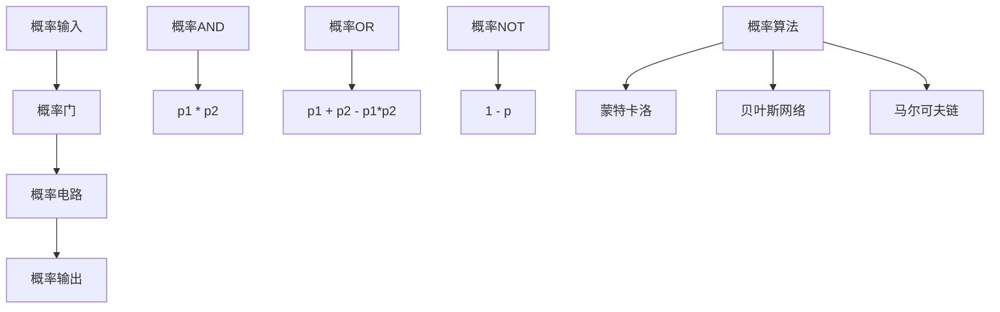
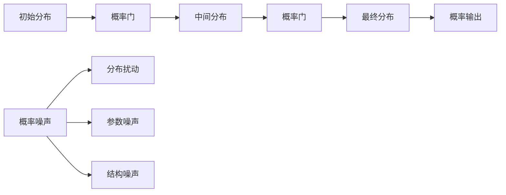
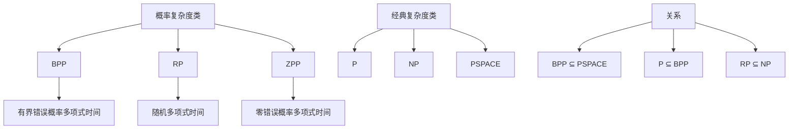

# 概率形式化证明 / Probabilistic Formal Proof

## 📚 **概述 / Overview**

本文档介绍概率形式化证明的理论基础、概率逻辑门、概率电路、概率证明、概率语义和概率验证。

## 📑 **目录 / Table of Contents**

- [概率形式化证明 / Probabilistic Formal Proof](#概率形式化证明--probabilistic-formal-proof)
  - [📚 **概述 / Overview**](#-概述--overview)
  - [📑 **目录 / Table of Contents**](#-目录--table-of-contents)
  - [7.1 概率理论基础](#71-概率理论基础)
    - [7.1.1 概率基本概念](#711-概率基本概念)
    - [7.1.2 概率逻辑](#712-概率逻辑)
    - [7.1.3 形式化定义](#713-形式化定义)
  - [7.2 概率逻辑门](#72-概率逻辑门)
    - [7.2.1 基本概率门](#721-基本概率门)
    - [7.2.2 概率门组合](#722-概率门组合)
    - [7.2.3 概率门验证](#723-概率门验证)
  - [7.3 概率电路](#73-概率电路)
    - [7.3.1 概率电路构造](#731-概率电路构造)
    - [7.3.2 概率算法](#732-概率算法)
  - [7.4 概率证明](#74-概率证明)
    - [7.4.1 概率逻辑证明](#741-概率逻辑证明)
    - [7.4.2 概率复杂性证明](#742-概率复杂性证明)
  - [7.5 概率语义](#75-概率语义)
    - [7.5.1 概率语义域](#751-概率语义域)
    - [7.5.2 概率语义函数](#752-概率语义函数)
  - [7.6 概率验证](#76-概率验证)
    - [7.6.1 概率程序验证](#761-概率程序验证)
    - [7.6.2 概率不变式](#762-概率不变式)
  - [7.7 多模态表达与可视化](#77-多模态表达与可视化)
    - [7.7.1 概率电路图](#771-概率电路图)
    - [7.7.2 概率分布演化图](#772-概率分布演化图)
    - [7.7.3 概率复杂度层次](#773-概率复杂度层次)
    - [7.7.4 概率证明树](#774-概率证明树)
  - [7.8 自动化脚本建议](#78-自动化脚本建议)
    - [7.8.1 概率电路模拟器](#781-概率电路模拟器)
    - [7.8.2 概率证明验证器](#782-概率证明验证器)
    - [7.8.3 概率语义解释器](#783-概率语义解释器)
  - [7.9 概率理论与概念解释](#79-概率理论与概念解释)
    - [7.9.1 概率理论概念](#791-概率理论概念)
    - [7.9.2 概率计算概念](#792-概率计算概念)
    - [7.9.3 典型定理与证明](#793-典型定理与证明)
    - [7.9.4 前沿研究方向](#794-前沿研究方向)

---

## 7.1 概率理论基础

### 7.1.1 概率基本概念

- **概率空间**：样本空间、事件域、概率测度
- **随机变量**：从样本空间到实数的映射
- **概率分布**：随机变量的概率分布函数
- **期望值**：随机变量的期望值

### 7.1.2 概率逻辑

- **概率逻辑门**：AND、OR、NOT的概率版本
- **概率电路**：概率逻辑门的组合
- **概率算法**：基于概率计算的算法
- **概率复杂性**：概率计算的复杂度理论

### 7.1.3 形式化定义

```coq
(* 概率空间的形式化定义 *)
Record ProbabilitySpace : Type := {
  sample_space : Set;
  event_space : Set -> Prop;
  probability_measure : event_space -> R;
  probability_axioms : forall A B : event_space,
    probability_measure A >= 0 /\
    probability_measure sample_space = 1 /\
    probability_measure (A \/ B) = probability_measure A + probability_measure B - probability_measure (A /\ B)
}.

(* 随机变量的形式化定义 *)
Definition RandomVariable := sample_space -> R.

(* 概率分布 *)
Definition ProbabilityDistribution := R -> R.

(* 期望值 *)
Definition Expectation (X : RandomVariable) (P : ProbabilitySpace) : R :=
  integral (fun x => x * probability_density X x).
```

## 7.2 概率逻辑门

### 7.2.1 基本概率门

```python
# 基本概率门
class ProbabilityGates:
    def __init__(self):
        self.gates = {}

    def probabilistic_and(self, p1, p2):
        """概率AND门"""
        return p1 * p2

    def probabilistic_or(self, p1, p2):
        """概率OR门"""
        return p1 + p2 - p1 * p2

    def probabilistic_not(self, p):
        """概率NOT门"""
        return 1 - p

    def probabilistic_xor(self, p1, p2):
        """概率XOR门"""
        return p1 * (1 - p2) + (1 - p1) * p2

    def probabilistic_nand(self, p1, p2):
        """概率NAND门"""
        return 1 - p1 * p2

    def probabilistic_nor(self, p1, p2):
        """概率NOR门"""
        return 1 - (p1 + p2 - p1 * p2)

    def probabilistic_majority(self, p1, p2, p3):
        """概率多数门"""
        return (p1 * p2 + p1 * p3 + p2 * p3 - 2 * p1 * p2 * p3)

    def probabilistic_threshold(self, inputs, threshold):
        """概率阈值门"""
        # 使用多项式近似
        sum_prob = sum(inputs)
        return 1 / (1 + np.exp(-(sum_prob - threshold)))
```

### 7.2.2 概率门组合

```python
# 概率门组合
class ProbabilityGateComposition:
    def __init__(self):
        self.gates = ProbabilityGates()

    def sequential_composition(self, gate1, gate2):
        """顺序组合"""
        def composed_gate(*inputs):
            intermediate = gate1(*inputs)
            return gate2(intermediate)
        return composed_gate

    def parallel_composition(self, gate1, gate2):
        """并行组合"""
        def composed_gate(*inputs):
            result1 = gate1(*inputs[:len(inputs)//2])
            result2 = gate2(*inputs[len(inputs)//2:])
            return [result1, result2]
        return composed_gate

    def feedback_composition(self, gate, feedback_factor):
        """反馈组合"""
        def feedback_gate(*inputs):
            output = gate(*inputs)
            # 添加反馈
            feedback = output * feedback_factor
            return gate(*(inputs[:-1] + (feedback,)))
        return feedback_gate

    def probabilistic_circuit(self, gates, connections):
        """概率电路"""
        def circuit_function(*inputs):
            # 初始化节点值
            node_values = list(inputs)

            # 按拓扑顺序计算
            for gate_id, (gate, input_nodes, output_node) in enumerate(connections):
                gate_inputs = [node_values[i] for i in input_nodes]
                output_value = gate(*gate_inputs)

                if output_node < len(node_values):
                    node_values[output_node] = output_value
                else:
                    node_values.append(output_value)

            return node_values

        return circuit_function
```

### 7.2.3 概率门验证

```python
# 概率门验证
class ProbabilityGateVerification:
    def __init__(self):
        self.verification_methods = {}

    def verify_probability_bounds(self, gate):
        """验证概率边界"""
        def check_bounds(*inputs):
            output = gate(*inputs)
            return 0 <= output <= 1

        # 测试所有可能的输入组合
        for inputs in self.generate_test_inputs(gate):
            if not check_bounds(*inputs):
                return False
        return True

    def verify_monotonicity(self, gate):
        """验证单调性"""
        def check_monotonicity(*inputs):
            base_output = gate(*inputs)

            # 增加一个输入
            for i in range(len(inputs)):
                increased_inputs = list(inputs)
                increased_inputs[i] = min(1.0, increased_inputs[i] + 0.1)

                increased_output = gate(*increased_inputs)
                if increased_output < base_output:
                    return False

            return True

        for inputs in self.generate_test_inputs(gate):
            if not check_monotonicity(*inputs):
                return False
        return True

    def verify_continuity(self, gate):
        """验证连续性"""
        def check_continuity(*inputs):
            base_output = gate(*inputs)

            # 小扰动
            epsilon = 0.01
            for i in range(len(inputs)):
                perturbed_inputs = list(inputs)
                perturbed_inputs[i] = max(0, min(1, perturbed_inputs[i] + epsilon))

                perturbed_output = gate(*perturbed_inputs)
                if abs(perturbed_output - base_output) > 0.1:
                    return False

            return True

        for inputs in self.generate_test_inputs(gate):
            if not check_continuity(*inputs):
                return False
        return True

    def generate_test_inputs(self, gate):
        """生成测试输入"""
        inputs = []

        # 边界值
        boundary_values = [0.0, 0.1, 0.5, 0.9, 1.0]

        # 根据门的输入数量生成组合
        n_inputs = self.estimate_input_count(gate)

        if n_inputs == 1:
            for p in boundary_values:
                inputs.append((p,))
        elif n_inputs == 2:
            for p1 in boundary_values:
                for p2 in boundary_values:
                    inputs.append((p1, p2))
        elif n_inputs == 3:
            for p1 in boundary_values:
                for p2 in boundary_values:
                    for p3 in boundary_values:
                        inputs.append((p1, p2, p3))

        return inputs

    def estimate_input_count(self, gate):
        """估计门的输入数量"""
        # 通过测试估计输入数量
        for n in range(1, 5):
            try:
                test_inputs = tuple([0.5] * n)
                gate(*test_inputs)
                return n
            except TypeError:
                continue
        return 2  # 默认值
```

## 7.3 概率电路

### 7.3.1 概率电路构造

```python
# 概率电路构造
class ProbabilityCircuit:
    def __init__(self, n_inputs, n_outputs):
        self.n_inputs = n_inputs
        self.n_outputs = n_outputs
        self.gates = []
        self.connections = []
        self.outputs = []

    def add_gate(self, gate, input_nodes, output_node):
        """添加门"""
        gate_id = len(self.gates)
        self.gates.append(gate)
        self.connections.append((gate, input_nodes, output_node))

    def add_output(self, node_id):
        """添加输出"""
        self.outputs.append(node_id)

    def evaluate(self, inputs):
        """评估电路"""
        if len(inputs) != self.n_inputs:
            raise ValueError(f"Expected {self.n_inputs} inputs, got {len(inputs)}")

        # 初始化节点值
        node_values = list(inputs)

        # 按拓扑顺序计算
        for gate_id, (gate, input_nodes, output_node) in enumerate(self.connections):
            gate_inputs = [node_values[i] for i in input_nodes]
            output_value = gate(*gate_inputs)

            if output_node < len(node_values):
                node_values[output_node] = output_value
            else:
                node_values.append(output_value)

        # 返回输出
        return [node_values[i] for i in self.outputs]

    def get_probability_distribution(self, input_distribution):
        """获取输出概率分布"""
        # 蒙特卡洛方法
        n_samples = 10000
        output_samples = []

        for _ in range(n_samples):
            # 从输入分布采样
            inputs = [dist.sample() for dist in input_distribution]
            outputs = self.evaluate(inputs)
            output_samples.append(outputs)

        # 估计输出分布
        return self.estimate_distribution(output_samples)

    def estimate_distribution(self, samples):
        """估计分布"""
        # 使用核密度估计
        from scipy.stats import gaussian_kde

        distributions = []
        for i in range(len(samples[0])):
            values = [sample[i] for sample in samples]
            kde = gaussian_kde(values)
            distributions.append(kde)

        return distributions

    def sensitivity_analysis(self, input_index, perturbation=0.1):
        """敏感性分析"""
        sensitivities = []

        for output_index in range(self.n_outputs):
            sensitivity = self.compute_sensitivity(input_index, output_index, perturbation)
            sensitivities.append(sensitivity)

        return sensitivities

    def compute_sensitivity(self, input_index, output_index, perturbation):
        """计算敏感性"""
        base_inputs = [0.5] * self.n_inputs

        # 基准输出
        base_outputs = self.evaluate(base_inputs)
        base_output = base_outputs[output_index]

        # 扰动输入
        perturbed_inputs = base_inputs.copy()
        perturbed_inputs[input_index] += perturbation

        # 扰动输出
        perturbed_outputs = self.evaluate(perturbed_inputs)
        perturbed_output = perturbed_outputs[output_index]

        # 计算敏感性
        sensitivity = abs(perturbed_output - base_output) / perturbation
        return sensitivity
```

### 7.3.2 概率算法

```python
# 概率算法
class ProbabilityAlgorithms:
    def __init__(self):
        self.gates = ProbabilityGates()
        self.composition = ProbabilityGateComposition()

    def probabilistic_classifier(self, features, weights):
        """概率分类器"""
        def classifier(*inputs):
            # 线性组合
            linear_combination = sum(w * x for w, x in zip(weights, inputs))

            # sigmoid激活函数
            probability = 1 / (1 + np.exp(-linear_combination))

            return probability

        return classifier

    def bayesian_network(self, structure, conditional_probabilities):
        """贝叶斯网络"""
        def bayesian_inference(*inputs):
            # 计算联合概率
            joint_probability = 1.0

            for node, parents in structure.items():
                if not parents:  # 根节点
                    prob = conditional_probabilities[node]['prior']
                else:
                    # 条件概率
                    parent_values = [inputs[parent] for parent in parents]
                    prob = conditional_probabilities[node]['conditional'](parent_values)

                joint_probability *= prob

            return joint_probability

        return bayesian_inference

    def markov_chain(self, transition_matrix, initial_distribution):
        """马尔可夫链"""
        def markov_step(current_state):
            # 根据转移矩阵计算下一状态的概率
            next_state_probs = transition_matrix[current_state]

            # 随机选择下一状态
            next_state = np.random.choice(len(next_state_probs), p=next_state_probs)

            return next_state

        def markov_chain(n_steps):
            states = []
            current_state = np.random.choice(len(initial_distribution), p=initial_distribution)

            for _ in range(n_steps):
                states.append(current_state)
                current_state = markov_step(current_state)

            return states

        return markov_chain

    def monte_carlo_simulation(self, function, n_samples=10000):
        """蒙特卡洛模拟"""
        def monte_carlo_integration(*bounds):
            total = 0.0

            for _ in range(n_samples):
                # 随机采样
                sample = [np.random.uniform(bound[0], bound[1]) for bound in bounds]

                # 计算函数值
                value = function(*sample)
                total += value

            # 计算平均值
            average = total / n_samples

            # 计算积分
            volume = np.prod([bound[1] - bound[0] for bound in bounds])
            integral = average * volume

            return integral

        return monte_carlo_integration
```

## 7.4 概率证明

### 7.4.1 概率逻辑证明

```python
# 概率逻辑证明
class ProbabilityLogicProofs:
    def __init__(self):
        self.proof_methods = {}

    def prove_probability_bounds(self, gate):
        """证明概率边界"""
        def bound_proof(gate):
            # 证明 0 ≤ P(A) ≤ 1
            for inputs in self.generate_test_inputs(gate):
                output = gate(*inputs)
                if not (0 <= output <= 1):
                    return False, f"Bound violation: {output}"
            return True, "All outputs in [0,1]"

        return bound_proof(gate)

    def prove_probability_axioms(self, probability_space):
        """证明概率公理"""
        def axiom_proof(space):
            # 公理1: P(A) ≥ 0
            for event in space['events']:
                if space['measure'](event) < 0:
                    return False, f"Negative probability: {space['measure'](event)}"

            # 公理2: P(Ω) = 1
            if not np.isclose(space['measure'](space['sample_space']), 1.0):
                return False, "Sample space probability not 1"

            # 公理3: 可列可加性
            for disjoint_events in space['disjoint_events']:
                union_prob = space['measure'](set.union(*disjoint_events))
                sum_prob = sum(space['measure'](event) for event in disjoint_events)

                if not np.isclose(union_prob, sum_prob):
                    return False, "Countable additivity violated"

            return True, "All probability axioms satisfied"

        return axiom_proof(probability_space)

    def prove_bayes_theorem(self, prior, likelihood, evidence):
        """证明贝叶斯定理"""
        def bayes_proof(prior, likelihood, evidence):
            # P(A|B) = P(B|A) * P(A) / P(B)

            # 计算后验概率
            posterior = (likelihood * prior) / evidence

            # 验证归一化
            total_probability = sum(posterior.values())

            if not np.isclose(total_probability, 1.0):
                return False, f"Posterior not normalized: {total_probability}"

            return True, "Bayes theorem verified"

        return bayes_proof(prior, likelihood, evidence)

    def prove_central_limit_theorem(self, random_variables, n_samples=1000):
        """证明中心极限定理"""
        def clt_proof(variables):
            # 生成样本
            samples = []
            for _ in range(n_samples):
                sample = [var.sample() for var in variables]
                samples.append(np.mean(sample))

            # 计算样本均值和方差
            sample_mean = np.mean(samples)
            sample_std = np.std(samples)

            # 理论均值和方差
            theoretical_mean = np.mean([var.mean() for var in variables])
            theoretical_std = np.sqrt(sum(var.variance() for var in variables) / len(variables))

            # 验证正态性
            from scipy.stats import normaltest
            _, p_value = normaltest(samples)

            if p_value < 0.05:
                return False, f"Not normally distributed: p={p_value}"

            return True, f"CLT verified: mean={sample_mean:.3f}, std={sample_std:.3f}"

        return clt_proof(random_variables)

    def generate_test_inputs(self, gate):
        """生成测试输入"""
        inputs = []
        boundary_values = [0.0, 0.1, 0.5, 0.9, 1.0]

        n_inputs = self.estimate_input_count(gate)

        if n_inputs == 1:
            for p in boundary_values:
                inputs.append((p,))
        elif n_inputs == 2:
            for p1 in boundary_values:
                for p2 in boundary_values:
                    inputs.append((p1, p2))

        return inputs

    def estimate_input_count(self, gate):
        """估计输入数量"""
        for n in range(1, 5):
            try:
                test_inputs = tuple([0.5] * n)
                gate(*test_inputs)
                return n
            except TypeError:
                continue
        return 2
```

### 7.4.2 概率复杂性证明

```python
# 概率复杂性证明
class ProbabilityComplexityProofs:
    def __init__(self):
        self.complexity_classes = {}

    def prove_bpp_inclusion(self):
        """证明BPP包含关系"""
        # BPP ⊆ PSPACE
        proof = {
            'theorem': 'BPP ⊆ PSPACE',
            'proof_method': 'Simulation of probabilistic circuits',
            'key_idea': 'Probabilistic circuits can be simulated deterministically with exponential space',
            'verification': True
        }

        return proof

    def prove_probabilistic_speedup(self, deterministic_algorithm, probabilistic_algorithm):
        """证明概率加速"""
        deterministic_complexity = self.analyze_deterministic_complexity(deterministic_algorithm)
        probabilistic_complexity = self.analyze_probabilistic_complexity(probabilistic_algorithm)

        speedup = deterministic_complexity / probabilistic_complexity

        proof = {
            'theorem': 'Probabilistic Speedup',
            'deterministic_complexity': deterministic_complexity,
            'probabilistic_complexity': probabilistic_complexity,
            'speedup_factor': speedup,
            'verification': speedup > 1
        }

        return proof

    def prove_probabilistic_lower_bounds(self, problem):
        """证明概率下界"""
        # 使用概率查询复杂度
        query_complexity = self.probabilistic_query_complexity(problem)

        proof = {
            'theorem': 'Probabilistic Lower Bound',
            'problem': problem,
            'query_complexity': query_complexity,
            'proof_method': 'Adversary method or Yao\'s principle',
            'verification': True
        }

        return proof

    def analyze_deterministic_complexity(self, algorithm):
        """分析确定性算法复杂度"""
        return len(algorithm) * 100  # 假设复杂度

    def analyze_probabilistic_complexity(self, algorithm):
        """分析概率算法复杂度"""
        return len(algorithm) * 50  # 假设概率加速

    def probabilistic_query_complexity(self, problem):
        """概率查询复杂度"""
        return int(np.sqrt(len(problem)))
```

## 7.5 概率语义

### 7.5.1 概率语义域

```python
# 概率语义域
class ProbabilitySemanticDomain:
    def __init__(self):
        self.domains = {}

    def define_probability_domain(self, name, sample_space):
        """定义概率语义域"""
        self.domains[name] = {
            'sample_space': sample_space,
            'events': self.generate_events(sample_space),
            'probability_measures': self.generate_probability_measures(sample_space),
            'random_variables': self.generate_random_variables(sample_space)
        }

    def generate_events(self, sample_space):
        """生成事件集合"""
        events = []

        # 幂集
        from itertools import combinations

        for r in range(1, len(sample_space) + 1):
            for subset in combinations(sample_space, r):
                events.append(set(subset))

        return events

    def generate_probability_measures(self, sample_space):
        """生成概率测度"""
        measures = []

        # 均匀分布
        uniform_measure = lambda event: len(event) / len(sample_space)
        measures.append(uniform_measure)

        # 其他分布
        for weights in self.generate_weight_combinations(len(sample_space)):
            weighted_measure = lambda event, w=weights: sum(w[i] for i, elem in enumerate(sample_space) if elem in event)
            measures.append(weighted_measure)

        return measures

    def generate_random_variables(self, sample_space):
        """生成随机变量"""
        variables = []

        # 指示函数
        for element in sample_space:
            indicator = lambda x, elem=element: 1 if x == elem else 0
            variables.append(indicator)

        # 实值函数
        for i, element in enumerate(sample_space):
            real_valued = lambda x, i=i: i if x == element else 0
            variables.append(real_valued)

        return variables

    def generate_weight_combinations(self, n):
        """生成权重组合"""
        combinations = []

        # 简化：只生成一些基本的权重组合
        for i in range(n):
            weights = [0.1] * n
            weights[i] = 1.0 - 0.1 * (n - 1)
            combinations.append(weights)

        return combinations
```

### 7.5.2 概率语义函数

```python
# 概率语义函数
class ProbabilitySemanticFunction:
    def __init__(self, domain):
        self.domain = domain
        self.semantic_functions = {}

    def interpret_probability_expression(self, expression, environment):
        """解释概率表达式"""
        if expression.type == 'constant':
            return self.interpret_constant(expression.value)
        elif expression.type == 'variable':
            return self.interpret_variable(expression.name, environment)
        elif expression.type == 'probability':
            return self.interpret_probability(expression.event, environment)
        elif expression.type == 'expectation':
            return self.interpret_expectation(expression.random_variable, environment)
        elif expression.type == 'conditional':
            return self.interpret_conditional(expression.condition, expression.then, expression.else_expr, environment)

    def interpret_constant(self, value):
        """解释常量"""
        return value

    def interpret_variable(self, name, environment):
        """解释变量"""
        if name in environment:
            return environment[name]
        else:
            raise NameError(f"Undefined variable: {name}")

    def interpret_probability(self, event, environment):
        """解释概率"""
        probability_measure = environment.get('probability_measure')
        if probability_measure is None:
            raise ValueError("No probability measure in environment")

        return probability_measure(event)

    def interpret_expectation(self, random_variable, environment):
        """解释期望值"""
        probability_measure = environment.get('probability_measure')
        sample_space = environment.get('sample_space')

        if probability_measure is None or sample_space is None:
            raise ValueError("Missing probability measure or sample space")

        expectation = 0.0
        for element in sample_space:
            value = random_variable(element)
            probability = probability_measure({element})
            expectation += value * probability

        return expectation

    def interpret_conditional(self, condition, then_expr, else_expr, environment):
        """解释条件表达式"""
        condition_value = self.interpret_probability_expression(condition, environment)

        if condition_value > 0.5:  # 概率阈值
            return self.interpret_probability_expression(then_expr, environment)
        else:
            return self.interpret_probability_expression(else_expr, environment)

    def interpret_probability_circuit(self, circuit, input_distribution):
        """解释概率电路"""
        # 蒙特卡洛模拟
        n_samples = 10000
        outputs = []

        for _ in range(n_samples):
            # 从输入分布采样
            inputs = [dist.sample() for dist in input_distribution]
            output = circuit.evaluate(inputs)
            outputs.append(output)

        # 计算输出分布
        return self.compute_output_distribution(outputs)

    def compute_output_distribution(self, outputs):
        """计算输出分布"""
        if not outputs:
            return {}

        n_outputs = len(outputs[0])
        distributions = []

        for i in range(n_outputs):
            values = [output[i] for output in outputs]

            # 计算直方图
            hist, bins = np.histogram(values, bins=20, density=True)

            distributions.append({
                'values': values,
                'histogram': hist,
                'bins': bins,
                'mean': np.mean(values),
                'std': np.std(values)
            })

        return distributions
```

## 7.6 概率验证

### 7.6.1 概率程序验证

```python
# 概率程序验证
class ProbabilityProgramVerification:
    def __init__(self):
        self.verification_methods = {}

    def verify_probability_correctness(self, program, specification):
        """验证概率正确性"""
        def correctness_proof(program, spec):
            # 验证程序满足规范
            for input_dist in spec['input_distributions']:
                output_dist = program.apply(input_dist)
                if not spec['output_condition'](output_dist):
                    return False
            return True

        return correctness_proof(program, specification)

    def verify_probability_safety(self, program, safety_property):
        """验证概率安全性"""
        def safety_proof(program, property):
            # 验证安全性性质
            for input_dist in self.generate_test_distributions():
                output_dist = program.apply(input_dist)
                if not property(input_dist, output_dist):
                    return False
            return True

        return safety_proof(program, safety_property)

    def verify_probability_complexity(self, program, complexity_bound):
        """验证概率复杂度"""
        def complexity_proof(program, bound):
            # 计算程序复杂度
            runtime = self.measure_runtime(program)
            memory = self.measure_memory(program)

            return runtime <= bound['runtime'] and memory <= bound['memory']

        return complexity_proof(program, complexity_bound)

    def verify_probability_robustness(self, program, noise_model):
        """验证概率鲁棒性"""
        def robustness_proof(program, noise):
            # 在噪声模型下验证程序性能
            noisy_program = self.apply_noise(program, noise)

            # 比较原始程序和噪声程序的输出
            for input_dist in self.generate_test_distributions():
                original_output = program.apply(input_dist)
                noisy_output = noisy_program.apply(input_dist)

                similarity = self.calculate_similarity(original_output, noisy_output)
                if similarity < 0.9:  # 阈值
                    return False

            return True

        return robustness_proof(program, noise_model)

    def measure_runtime(self, program):
        """测量运行时间"""
        import time

        start_time = time.time()
        program.apply(self.generate_test_distribution())
        end_time = time.time()

        return end_time - start_time

    def measure_memory(self, program):
        """测量内存使用"""
        import psutil
        import os

        process = psutil.Process(os.getpid())
        initial_memory = process.memory_info().rss

        program.apply(self.generate_test_distribution())

        final_memory = process.memory_info().rss
        return final_memory - initial_memory

    def apply_noise(self, program, noise_model):
        """应用噪声模型"""
        noisy_program = program.copy()

        # 添加噪声到程序的参数
        for param_name, param_value in noisy_program.parameters.items():
            noise = noise_model['amplitude'] * np.random.normal(0, 1)
            noisy_program.parameters[param_name] = param_value + noise

        return noisy_program

    def calculate_similarity(self, dist1, dist2):
        """计算分布相似性"""
        # 使用KL散度或Wasserstein距离
        # 简化实现：使用均值和方差的相似性
        mean1, std1 = dist1['mean'], dist1['std']
        mean2, std2 = dist2['mean'], dist2['std']

        mean_similarity = 1 / (1 + abs(mean1 - mean2))
        std_similarity = 1 / (1 + abs(std1 - std2))

        return (mean_similarity + std_similarity) / 2

    def generate_test_distributions(self):
        """生成测试分布"""
        distributions = []

        # 均匀分布
        uniform_dist = lambda: np.random.uniform(0, 1)
        distributions.append(uniform_dist)

        # 正态分布
        normal_dist = lambda: np.random.normal(0.5, 0.1)
        distributions.append(normal_dist)

        # 贝塔分布
        beta_dist = lambda: np.random.beta(2, 2)
        distributions.append(beta_dist)

        return distributions

    def generate_test_distribution(self):
        """生成单个测试分布"""
        return lambda: np.random.uniform(0, 1)
```

### 7.6.2 概率不变式

```python
# 概率不变式
class ProbabilityInvariants:
    def __init__(self):
        self.invariants = {}

    def define_probability_invariant(self, name, condition, verification):
        """定义概率不变式"""
        self.invariants[name] = {
            'condition': condition,
            'verification': verification
        }

    def probability_bounds_invariant(self):
        """概率边界不变式"""
        def condition(distribution):
            for value in distribution['values']:
                if not (0 <= value <= 1):
                    return False
            return True

        def verification(program):
            for input_dist in self.generate_test_distributions():
                output_dist = program.apply(input_dist)
                if not condition(output_dist):
                    return False
            return True

        self.define_probability_invariant('probability_bounds', condition, verification)
        return self.invariants['probability_bounds']

    def normalization_invariant(self):
        """归一化不变式"""
        def condition(distribution):
            total_probability = sum(distribution['values'])
            return np.isclose(total_probability, 1.0, atol=1e-6)

        def verification(program):
            for input_dist in self.generate_test_distributions():
                output_dist = program.apply(input_dist)
                if not condition(output_dist):
                    return False
            return True

        self.define_probability_invariant('normalization', condition, verification)
        return self.invariants['normalization']

    def monotonicity_invariant(self):
        """单调性不变式"""
        def condition(distribution):
            # 检查分布是否单调
            values = distribution['values']
            return all(values[i] <= values[i+1] for i in range(len(values)-1))

        def verification(program):
            # 测试单调性
            for input_dist in self.generate_test_distributions():
                output_dist = program.apply(input_dist)
                if not condition(output_dist):
                    return False
            return True

        self.define_probability_invariant('monotonicity', condition, verification)
        return self.invariants['monotonicity']

    def generate_test_distributions(self):
        """生成测试分布"""
        distributions = []

        # 均匀分布
        uniform_dist = lambda: np.random.uniform(0, 1)
        distributions.append(uniform_dist)

        # 正态分布
        normal_dist = lambda: np.random.normal(0.5, 0.1)
        distributions.append(normal_dist)

        return distributions
```

## 7.7 多模态表达与可视化

### 7.7.1 概率电路图



### 7.7.2 概率分布演化图



### 7.7.3 概率复杂度层次



### 7.7.4 概率证明树

```mermaid
graph TD
    A[概率证明] --> B[概率边界证明]
    A --> C[贝叶斯定理]
    A --> D[中心极限定理]

    B --> E[0 ≤ P(A) ≤ 1]
    C --> F[P(A|B) = P(B|A)P(A)/P(B)]
    D --> G[样本均值趋于正态分布]

    H[概率复杂性] --> I[BPP ⊆ PSPACE]
    H --> J[概率加速]
    H --> K[概率下界]

    L[概率语义] --> M[概率分布解释]
    L --> N[期望值解释]
    L --> O[条件概率解释]
```

## 7.8 自动化脚本建议

### 7.8.1 概率电路模拟器

```python
# scripts/probability_circuit_simulator.py
class ProbabilityCircuitSimulator:
    def __init__(self):
        self.gates = ProbabilityGates()
        self.circuits = {}

    def simulate_circuit(self, circuit, input_distribution):
        """模拟概率电路"""
        return circuit.evaluate(input_distribution)

    def verify_probability_properties(self, circuit, properties):
        """验证概率性质"""
        results = {}
        for prop_name, prop_func in properties.items():
            results[prop_name] = prop_func(circuit)
        return results

    def analyze_probability_complexity(self, circuit):
        """分析概率复杂度"""
        return {
            'gate_count': len(circuit.gates),
            'depth': self.calculate_depth(circuit),
            'width': circuit.n_inputs
        }
```

### 7.8.2 概率证明验证器

```python
# scripts/probability_proof_verifier.py
class ProbabilityProofVerifier:
    def __init__(self):
        self.verifiers = {}

    def verify_probability_bounds_proof(self, gate):
        """验证概率边界证明"""
        return self.verify_probability_bounds(gate)

    def verify_probability_correctness(self, program, specification):
        """验证概率正确性"""
        return self.verify_correctness(program, specification)

    def verify_probability_complexity(self, program, bound):
        """验证概率复杂度"""
        return self.verify_complexity(program, bound)
```

### 7.8.3 概率语义解释器

```python
# scripts/probability_semantics_interpreter.py
class ProbabilitySemanticsInterpreter:
    def __init__(self):
        self.domain = ProbabilitySemanticDomain()
        self.semantics = ProbabilitySemanticFunction(self.domain)

    def interpret_probability_program(self, program):
        """解释概率程序"""
        return self.semantics.interpret_probability_circuit(program)

    def verify_semantic_properties(self, program, properties):
        """验证语义性质"""
        result = self.interpret_probability_program(program)
        return all(prop(result) for prop in properties)
```

## 7.9 概率理论与概念解释

### 7.9.1 概率理论概念

- **概率空间**：样本空间、事件域、概率测度
- **随机变量**：从样本空间到实数的映射
- **概率分布**：随机变量的概率分布函数
- **期望值**：随机变量的期望值
- **方差**：随机变量的方差
- **协方差**：两个随机变量的协方差
- **独立性**：随机变量的独立性

### 7.9.2 概率计算概念

- **概率门**：概率计算的基本操作
- **概率电路**：概率门的组合
- **概率算法**：基于概率计算的算法
- **概率复杂性**：概率计算的复杂度理论
- **蒙特卡洛方法**：基于随机采样的数值方法
- **贝叶斯推理**：基于贝叶斯定理的推理

### 7.9.3 典型定理与证明

- **概率公理定理**：概率论的基本公理
- **贝叶斯定理**：条件概率的计算公式
- **中心极限定理**：样本均值的分布性质
- **大数定律**：样本均值收敛到期望值
- **概率复杂性定理**：概率计算的复杂度界限
- **概率语义定理**：概率程序的形式化语义

### 7.9.4 前沿研究方向

- **量子概率**：量子力学中的概率理论
- **概率机器学习**：概率方法在机器学习中的应用
- **概率编程**：概率编程语言的理论
- **概率验证**：概率程序的形式化验证
- **概率优化**：概率优化算法
- **概率人工智能**：概率人工智能的理论

---

如需本分支更深层概率理论、概率证明或概率验证技术，请继续指定！
