# 并发形式化证明 / Concurrent Formal Proof

## 📚 **概述 / Overview**

本文档介绍并发形式化证明的理论基础、并发逻辑、并发证明方法、并发语义和并发验证。

## 📑 **目录 / Table of Contents**

- [并发形式化证明 / Concurrent Formal Proof](#并发形式化证明--concurrent-formal-proof)
  - [📚 **概述 / Overview**](#-概述--overview)
  - [📑 **目录 / Table of Contents**](#-目录--table-of-contents)
  - [8.1 并发理论基础](#81-并发理论基础)
    - [8.1.1 并发基本概念](#811-并发基本概念)
    - [8.1.2 并发模型](#812-并发模型)
    - [8.1.3 形式化定义](#813-形式化定义)
  - [8.2 并发逻辑](#82-并发逻辑)
    - [8.2.1 并发时序逻辑](#821-并发时序逻辑)
    - [8.2.2 并发分离逻辑](#822-并发分离逻辑)
  - [8.3 并发证明方法](#83-并发证明方法)
    - [8.3.1 不变式证明](#831-不变式证明)
    - [8.3.2 时序逻辑证明](#832-时序逻辑证明)
    - [8.3.3 并发分离逻辑证明](#833-并发分离逻辑证明)
  - [8.4 并发语义](#84-并发语义)
    - [8.4.1 并发操作语义](#841-并发操作语义)
    - [8.4.2 并发指称语义](#842-并发指称语义)
    - [8.4.3 并发范畴语义](#843-并发范畴语义)
  - [8.5 并发验证](#85-并发验证)
    - [8.5.1 并发程序验证](#851-并发程序验证)
    - [8.5.2 并发不变式](#852-并发不变式)
  - [8.6 多模态表达与可视化](#86-多模态表达与可视化)
    - [8.6.1 并发系统结构图](#861-并发系统结构图)
    - [8.6.2 Petri网示意图](#862-petri网示意图)
    - [8.6.3 并发时序逻辑证明树](#863-并发时序逻辑证明树)
    - [8.6.4 并发执行轨迹](#864-并发执行轨迹)
  - [8.7 自动化脚本建议](#87-自动化脚本建议)
    - [8.7.1 并发模型检查器](#871-并发模型检查器)
    - [8.7.2 并发证明验证器](#872-并发证明验证器)
    - [8.7.3 并发语义解释器](#873-并发语义解释器)
  - [8.8 并发理论与概念解释](#88-并发理论与概念解释)
    - [8.8.1 并发理论概念](#881-并发理论概念)
    - [8.8.2 并发计算概念](#882-并发计算概念)
    - [8.8.3 典型定理与证明](#883-典型定理与证明)
    - [8.8.4 前沿研究方向](#884-前沿研究方向)

---

## 8.1 并发理论基础

### 8.1.1 并发基本概念

- **并发系统**：多个进程或线程同时执行的系统
- **进程与线程**：并发执行的基本单元
- **同步与互斥**：保证并发安全的机制
- **死锁与活锁**：并发系统中的异常状态
- **一致性与可串行化**：并发操作的正确性标准

### 8.1.2 并发模型

- **Petri网**：描述并发系统的图模型
- **进程代数**：CSP、π-演算等形式化描述
- **事件结构**：事件间的因果与并发关系
- **Actor模型**：基于消息传递的并发模型
- **共享内存模型**：多线程共享变量的并发

### 8.1.3 形式化定义

```coq
(* 并发系统的形式化定义 *)
Record ConcurrentSystem : Type := {
  processes : list Process;
  state : SystemState;
  transition : SystemState -> Action -> SystemState
}.

(* Petri网的形式化定义 *)
Record PetriNet : Type := {
  places : list Place;
  transitions : list Transition;
  input : Transition -> list Place;
  output : Transition -> list Place;
  marking : Place -> nat
}.

(* 进程代数的形式化定义 *)
Inductive ProcessAlgebra : Type :=
| Nil : ProcessAlgebra
| Action : string -> ProcessAlgebra -> ProcessAlgebra
| Choice : ProcessAlgebra -> ProcessAlgebra -> ProcessAlgebra
| Parallel : ProcessAlgebra -> ProcessAlgebra -> ProcessAlgebra
| Restrict : ProcessAlgebra -> list string -> ProcessAlgebra.
```

## 8.2 并发逻辑

### 8.2.1 并发时序逻辑

```coq
(* 线性时序逻辑 LTL *)
Inductive LTL : Type :=
| LTL_True : LTL
| LTL_False : LTL
| LTL_Prop : string -> LTL
| LTL_Not : LTL -> LTL
| LTL_And : LTL -> LTL -> LTL
| LTL_Or : LTL -> LTL -> LTL
| LTL_Next : LTL -> LTL
| LTL_Until : LTL -> LTL -> LTL
| LTL_Always : LTL -> LTL
| LTL_Eventually : LTL -> LTL.

(* CTL 计算树逻辑 *)
Inductive CTL : Type :=
| CTL_True : CTL
| CTL_False : CTL
| CTL_Prop : string -> CTL
| CTL_Not : CTL -> CTL
| CTL_And : CTL -> CTL -> CTL
| CTL_Or : CTL -> CTL -> CTL
| CTL_EX : CTL -> CTL
| CTL_EU : CTL -> CTL -> CTL
| CTL_EG : CTL -> CTL
| CTL_AX : CTL -> CTL
| CTL_AU : CTL -> CTL -> CTL
| CTL_AG : CTL -> CTL.
```

### 8.2.2 并发分离逻辑

```coq
(* 并发分离逻辑 CSL *)
Inductive CSL : Type :=
| CSL_Emp : CSL
| CSL_Sep : CSL -> CSL -> CSL
| CSL_Par : CSL -> CSL -> CSL
| CSL_Exists : string -> CSL -> CSL
| CSL_Assert : string -> CSL.
```

## 8.3 并发证明方法

### 8.3.1 不变式证明

```python
# 并发不变式证明
class ConcurrentInvariantProof:
    def __init__(self):
        self.invariants = {}

    def define_invariant(self, name, condition, verification):
        self.invariants[name] = {
            'condition': condition,
            'verification': verification
        }

    def mutual_exclusion_invariant(self):
        def condition(state):
            # 任意时刻最多一个进程进入临界区
            return sum(1 for p in state['processes'] if p['in_critical']) <= 1
        def verification(system):
            for state in system.all_states():
                if not condition(state):
                    return False
            return True
        self.define_invariant('mutual_exclusion', condition, verification)
        return self.invariants['mutual_exclusion']

    def deadlock_freedom_invariant(self):
        def condition(state):
            # 系统不存在所有进程都阻塞的状态
            return any(p['active'] for p in state['processes'])
        def verification(system):
            for state in system.all_states():
                if not condition(state):
                    return False
            return True
        self.define_invariant('deadlock_freedom', condition, verification)
        return self.invariants['deadlock_freedom']
```

### 8.3.2 时序逻辑证明

```python
# 时序逻辑证明
class TemporalLogicProof:
    def __init__(self):
        self.proofs = {}

    def prove_liveness(self, system, property):
        # 证明活性：某状态最终总会发生
        for path in system.all_paths():
            if not any(property(state) for state in path):
                return False
        return True

    def prove_safety(self, system, property):
        # 证明安全性：某状态永远不会发生
        for path in system.all_paths():
            if any(not property(state) for state in path):
                return False
        return True
```

### 8.3.3 并发分离逻辑证明

```python
# 并发分离逻辑证明
class ConcurrentSeparationLogicProof:
    def __init__(self):
        self.proofs = {}

    def prove_parallel_composition(self, triple1, triple2):
        # {P1} C1 {Q1}  {P2} C2 {Q2}
        # -----------------------------
        # {P1 * P2} C1 || C2 {Q1 * Q2}
        return {
            'precondition': f"{triple1['precondition']} * {triple2['precondition']}",
            'command': f"{triple1['command']} || {triple2['command']}",
            'postcondition': f"{triple1['postcondition']} * {triple2['postcondition']}"
        }

    def prove_resource_invariant(self, resource, property):
        # 证明资源不变式
        return property(resource)
```

## 8.4 并发语义

### 8.4.1 并发操作语义

```python
# 并发操作语义
class ConcurrentOperationalSemantics:
    def __init__(self):
        self.transition_rules = {}

    def add_transition_rule(self, pattern, result):
        self.transition_rules[pattern] = result

    def step(self, configuration):
        for pattern, result in self.transition_rules.items():
            if self.matches_pattern(configuration, pattern):
                return self.apply_rule(configuration, pattern, result)
        return configuration

    def all_reachable_configurations(self, initial_config):
        # 广度优先遍历所有可达配置
        visited = set()
        queue = [initial_config]
        while queue:
            config = queue.pop(0)
            if config not in visited:
                visited.add(config)
                next_configs = self.next_configurations(config)
                queue.extend(next_configs)
        return visited
```

### 8.4.2 并发指称语义

```python
# 并发指称语义
class ConcurrentDenotationalSemantics:
    def __init__(self):
        self.domains = {}

    def define_domain(self, name, construction):
        self.domains[name] = construction

    def interpret_parallel(self, f1, f2):
        # 并发组合的指称语义
        def parallel_function(*args):
            from concurrent.futures import ThreadPoolExecutor
            with ThreadPoolExecutor() as executor:
                future1 = executor.submit(f1, *args)
                future2 = executor.submit(f2, *args)
                return (future1.result(), future2.result())
        return parallel_function
```

### 8.4.3 并发范畴语义

```python
# 并发范畴语义
class ConcurrentCategorySemantics:
    def __init__(self):
        self.categories = {}

    def define_symmetric_monoidal_category(self, name):
        self.categories[name] = {
            'tensor_product': '⊗',
            'unit_object': 'I',
            'associator': 'α',
            'left_unitor': 'λ',
            'right_unitor': 'ρ',
            'braiding': 'σ'
        }

    def parallel_morphism(self, f, g):
        # 并行态射
        return lambda x, y: (f(x), g(y))
```

## 8.5 并发验证

### 8.5.1 并发程序验证

```python
# 并发程序验证
class ConcurrentProgramVerification:
    def __init__(self):
        self.verification_methods = {}

    def verify_mutual_exclusion(self, system):
        # 验证互斥性
        for state in system.all_states():
            if sum(1 for p in state['processes'] if p['in_critical']) > 1:
                return False
        return True

    def verify_deadlock_freedom(self, system):
        # 验证无死锁
        for state in system.all_states():
            if all(not p['active'] for p in state['processes']):
                return False
        return True

    def verify_liveness(self, system, property):
        # 验证活性
        for path in system.all_paths():
            if not any(property(state) for state in path):
                return False
        return True
```

### 8.5.2 并发不变式

```python
# 并发不变式
class ConcurrentInvariants:
    def __init__(self):
        self.invariants = {}

    def define_invariant(self, name, condition, verification):
        self.invariants[name] = {
            'condition': condition,
            'verification': verification
        }

    def resource_invariant(self):
        def condition(resource):
            # 资源始终处于有效状态
            return resource['valid']
        def verification(system):
            for state in system.all_states():
                if not condition(state['resource']):
                    return False
            return True
        self.define_invariant('resource', condition, verification)
        return self.invariants['resource']
```

## 8.6 多模态表达与可视化

### 8.6.1 并发系统结构图

```mermaid
graph TD
    A[进程1] --> B[同步]
    A --> C[互斥]
    D[进程2] --> B
    D --> C
    B --> E[共享资源]
    C --> E
    F[调度器] --> A
    F --> D
```



### 8.6.2 Petri网示意图

```mermaid
graph TD
    P1[库所1] --> T1[变迁1]
    T1 --> P2[库所2]
    P2 --> T2[变迁2]
    T2 --> P1
    T1 --> P3[库所3]
    P3 --> T2
```



### 8.6.3 并发时序逻辑证明树

```mermaid
graph TD
    A[并发证明] --> B[安全性证明]
    A --> C[活性证明]
    B --> D[互斥性]
    B --> E[无死锁]
    C --> F[最终发生性]
    C --> G[公平性]
```



### 8.6.4 并发执行轨迹

```mermaid
flowchart LR
    A[初始状态] --> B[进程1执行]
    B --> C[进程2执行]
    C --> D[同步操作]
    D --> E[资源访问]
    E --> F[状态转移]
    F --> G[终止状态]
```



## 8.7 自动化脚本建议

### 8.7.1 并发模型检查器

```python
# scripts/concurrent_model_checker.py
class ConcurrentModelChecker:
    def __init__(self):
        self.systems = {}

    def check_invariant(self, system, invariant):
        for state in system.all_states():
            if not invariant(state):
                return False
        return True

    def check_liveness(self, system, property):
        for path in system.all_paths():
            if not any(property(state) for state in path):
                return False
        return True

    def check_deadlock(self, system):
        for state in system.all_states():
            if all(not p['active'] for p in state['processes']):
                return True
        return False
```

### 8.7.2 并发证明验证器

```python
# scripts/concurrent_proof_verifier.py
class ConcurrentProofVerifier:
    def __init__(self):
        self.verifiers = {}

    def verify_invariant_proof(self, system, invariant):
        return all(invariant(state) for state in system.all_states())

    def verify_temporal_proof(self, system, property):
        return all(any(property(state) for state in path) for path in system.all_paths())
```

### 8.7.3 并发语义解释器

```python
# scripts/concurrent_semantics_interpreter.py
class ConcurrentSemanticsInterpreter:
    def __init__(self):
        self.operational = ConcurrentOperationalSemantics()
        self.denotational = ConcurrentDenotationalSemantics()
        self.category = ConcurrentCategorySemantics()

    def interpret_concurrent_program(self, program):
        return self.operational.step(program)

    def verify_semantic_properties(self, program, properties):
        result = self.interpret_concurrent_program(program)
        return all(prop(result) for prop in properties)
```

## 8.8 并发理论与概念解释

### 8.8.1 并发理论概念

- **并发系统**：多个进程或线程同时执行的系统
- **同步**：进程间协调执行的机制
- **互斥**：防止资源冲突的机制
- **死锁**：进程互相等待导致无法继续
- **活锁**：进程不断切换但无进展
- **一致性**：并发操作的正确性标准
- **可串行化**：并发执行等价于某种顺序执行

### 8.8.2 并发计算概念

- **Petri网**：描述并发系统的图模型
- **进程代数**：形式化描述并发行为的代数
- **事件结构**：事件间的因果与并发关系
- **Actor模型**：基于消息传递的并发模型
- **共享内存**：多线程共享变量的并发
- **消息传递**：进程间通过消息通信

### 8.8.3 典型定理与证明

- **互斥性定理**：并发系统中互斥的充分必要条件
- **无死锁定理**：系统无死锁的判定条件
- **活性定理**：系统最终能达到某状态的条件
- **一致性定理**：并发执行等价于顺序执行的条件
- **可串行化定理**：并发操作可等价于某种顺序

### 8.8.4 前沿研究方向

- **分布式一致性**：分布式系统中的一致性理论
- **弱一致性模型**：弱一致性下的并发验证
- **并发类型系统**：类型系统在并发安全中的应用
- **并发程序合成**：自动生成并发程序
- **并发安全AI**：AI驱动的并发安全分析

---

如需本分支更深层并发理论、并发证明或并发验证技术，请继续指定！
