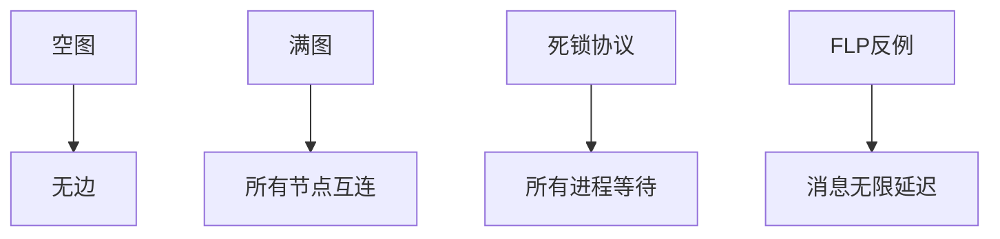
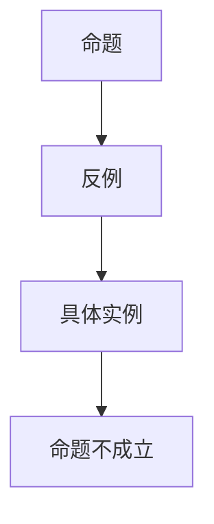

# 极端与反例

## 9.1 极端情形与边界条件

### 9.1.1 极端情形定义

- **极端情形**：在理论、算法、结构等领域中，参数取极值或达到边界的特殊情况。
- **边界条件**：问题定义、算法或结构在边界输入下的行为。
- **反例**：用于证明命题不成立的具体实例。

### 9.1.2 形式化定义

```coq
(* 极端情形的形式化定义 *)
Definition ExtremeCase (P : Type) (cond : P -> Prop) :=
  exists x : P, cond x /\ (forall y : P, cond y -> x = y -> False).

(* 反例的形式化定义 *)
Definition CounterExample (P : Prop) :=
  exists x, ~P x.

(* 边界条件 *)
Definition BoundaryCondition (f : nat -> nat) :=
  f 0 = ... /\ f (max_nat) = ... .
```

## 9.2 典型极端与反例

### 9.2.1 图论中的极端与反例

- **空图/满图**：节点数为0或边数为最大时的极端结构。
- **不可连通图**：反例用于连通性命题。
- **极端度分布**：所有节点度为0或n-1。
- **反例：非欧拉图**：存在度为奇数的节点。

### 9.2.2 网络与协议中的极端与反例

- **单点失效**：网络中唯一关键节点失效。
- **极端拓扑**：星型、环型、完全图等。
- **协议死锁反例**：特定消息顺序导致死锁。

### 9.2.3 分布式与量子中的极端与反例

- **FLP不可能性反例**：异步系统下无法达成一致。
- **量子不可克隆反例**：线性性导致无法克隆任意态。

## 9.3 自动生成极端与反例

### 9.3.1 自动化脚本

```python
# scripts/extreme_case_generator.py
class ExtremeCaseGenerator:
    def __init__(self):
        pass
    
    def generate_empty_graph(self, n):
        return { 'nodes': list(range(n)), 'edges': [] }
    
    def generate_complete_graph(self, n):
        edges = [(i, j) for i in range(n) for j in range(i+1, n)]
        return { 'nodes': list(range(n)), 'edges': edges }
    
    def generate_counterexample_non_eulerian(self, n):
        # 构造一个有奇数度节点的图
        edges = [(0, 1), (1, 2), (2, 0), (0, 3)]
        return { 'nodes': list(range(n)), 'edges': edges }
    
    def generate_deadlock_protocol(self):
        # 死锁协议反例
        return [ ('P1', 'wait'), ('P2', 'wait') ]
    
    def generate_flp_counterexample(self):
        # FLP不可能性反例
        return { 'nodes': ['A', 'B', 'C'], 'messages': [], 'delays': 'arbitrary' }
```

### 9.3.2 可视化方法

```python
# scripts/extreme_case_visualizer.py
import networkx as nx
import matplotlib.pyplot as plt

class ExtremeCaseVisualizer:
    def __init__(self):
        pass
    
    def draw_graph(self, graph):
        G = nx.Graph()
        G.add_nodes_from(graph['nodes'])
        G.add_edges_from(graph['edges'])
        nx.draw(G, with_labels=True)
        plt.show()
    
    def draw_protocol_deadlock(self, protocol):
        fig, ax = plt.subplots()
        for i, (proc, state) in enumerate(protocol):
            ax.text(0.5, 1-i*0.2, f"{proc}: {state}", fontsize=12)
        plt.show()
```

## 9.4 多模态表达与可视化

### 9.4.1 极端结构图



### 9.4.2 反例证明树



## 9.5 前沿与批判性分析

- 极端与反例对于理论健壮性、算法鲁棒性、系统安全性至关重要。
- 自动化生成与可视化有助于发现隐藏缺陷。
- 建议在每个分支系统性补充极端、边界、反例及其自动化验证。

---

如需更深层极端情形、反例生成与验证、批判性分析等，请继续指定！ 