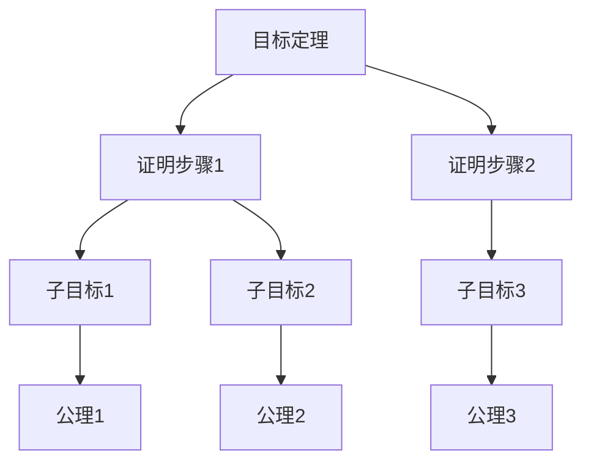
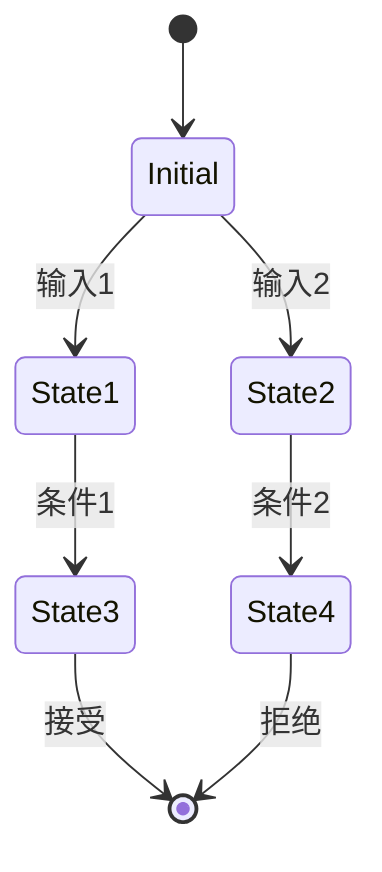

# 形式化证明：理论-应用全链路与工程案例 / Formal Proof: Theory-Application Pipeline and Engineering Cases

## 📚 **概述 / Overview**

本文档介绍形式化证明的理论应用全链路与工程案例，包括理论基础与形式化证明、算法实现与工程案例、工程案例与创新应用、跨领域应用与创新、批判性分析与改进建议、形式化验证与测试。

## 📑 **目录 / Table of Contents**

- [形式化证明：理论-应用全链路与工程案例 / Formal Proof: Theory-Application Pipeline and Engineering Cases](#形式化证明理论-应用全链路与工程案例--formal-proof-theory-application-pipeline-and-engineering-cases)
  - [📚 **概述 / Overview**](#-概述--overview)
  - [📑 **目录 / Table of Contents**](#-目录--table-of-contents)
  - [1. 理论基础与形式化证明](#1-理论基础与形式化证明)
    - [1.1 逻辑系统基础](#11-逻辑系统基础)
      - [一阶逻辑系统](#一阶逻辑系统)
      - [类型论基础](#类型论基础)
    - [1.2 证明系统](#12-证明系统)
      - [自然演绎系统](#自然演绎系统)
      - [构造性证明](#构造性证明)
  - [2. 算法实现与工程案例](#2-算法实现与工程案例)
    - [2.1 自动定理证明器](#21-自动定理证明器)
      - [命题逻辑证明器](#命题逻辑证明器)
      - [一阶逻辑证明器](#一阶逻辑证明器)
    - [2.2 模型检测器](#22-模型检测器)
      - [状态空间模型检测](#状态空间模型检测)
  - [3. 工程案例与创新应用](#3-工程案例与创新应用)
    - [3.1 软件验证系统](#31-软件验证系统)
      - [案例1：程序正确性验证](#案例1程序正确性验证)
    - [3.2 硬件验证系统](#32-硬件验证系统)
      - [案例2：数字电路验证](#案例2数字电路验证)
  - [4. 跨领域应用与创新](#4-跨领域应用与创新)
    - [4.1 形式化证明与人工智能](#41-形式化证明与人工智能)
      - [AI辅助证明系统](#ai辅助证明系统)
    - [4.2 形式化证明与区块链](#42-形式化证明与区块链)
      - [智能合约验证](#智能合约验证)
  - [5. 批判性分析与改进建议](#5-批判性分析与改进建议)
    - [5.1 现有技术的局限性](#51-现有技术的局限性)
      - [计算复杂性](#计算复杂性)
      - [表达能力限制](#表达能力限制)
    - [5.2 改进方向](#52-改进方向)
      - [技术创新](#技术创新)
      - [工程优化](#工程优化)
  - [6. 形式化验证与测试](#6-形式化验证与测试)
    - [6.1 证明系统验证](#61-证明系统验证)
    - [6.2 形式化系统仿真](#62-形式化系统仿真)
  - [7. 总结与展望](#7-总结与展望)
    - [未来发展方向](#未来发展方向)
  - [多模态表达与可视化](#多模态表达与可视化)
    - [证明树结构图](#证明树结构图)
    - [模型检测状态图](#模型检测状态图)
    - [自动化脚本建议](#自动化脚本建议)

---

## 1. 理论基础与形式化证明

### 1.1 逻辑系统基础

#### 一阶逻辑系统

**语法定义**：

```math
\text{项 } t ::= x \mid c \mid f(t_1, \ldots, t_n) \\
\text{公式 } \phi ::= P(t_1, \ldots, t_n) \mid \neg \phi \mid \phi \land \psi \mid \phi \lor \psi \mid \phi \rightarrow \psi \mid \forall x. \phi \mid \exists x. \phi
```

**推理规则**：

```math
\text{引入规则：} \\
\frac{\Gamma \vdash \phi \quad \Gamma \vdash \psi}{\Gamma \vdash \phi \land \psi} \quad (\land I) \\
\frac{\Gamma \vdash \phi}{\Gamma \vdash \phi \lor \psi} \quad (\lor I_1) \\
\frac{\Gamma \vdash \psi}{\Gamma \vdash \phi \lor \psi} \quad (\lor I_2)
```

#### 类型论基础

**简单类型论**：

```math
\text{类型 } \tau ::= \text{bool} \mid \text{nat} \mid \tau_1 \rightarrow \tau_2 \\
\text{项 } t ::= x \mid \lambda x:\tau. t \mid t_1 t_2 \mid \text{true} \mid \text{false} \mid \text{succ}(t)
```

**类型检查规则**：

```math
\frac{\Gamma, x:\tau_1 \vdash t : \tau_2}{\Gamma \vdash \lambda x:\tau_1. t : \tau_1 \rightarrow \tau_2} \quad (\text{Abs}) \\
\frac{\Gamma \vdash t_1 : \tau_1 \rightarrow \tau_2 \quad \Gamma \vdash t_2 : \tau_1}{\Gamma \vdash t_1 t_2 : \tau_2} \quad (\text{App})
```

### 1.2 证明系统

#### 自然演绎系统

**命题逻辑规则**：

```math
\text{假设规则：} \frac{}{\Gamma, \phi \vdash \phi} \quad (\text{Ax}) \\
\text{蕴含引入：} \frac{\Gamma, \phi \vdash \psi}{\Gamma \vdash \phi \rightarrow \psi} \quad (\rightarrow I) \\
\text{蕴含消除：} \frac{\Gamma \vdash \phi \rightarrow \psi \quad \Gamma \vdash \phi}{\Gamma \vdash \psi} \quad (\rightarrow E)
```

#### 构造性证明

**Curry-Howard对应**：

```math
\text{命题 } \phi \leftrightarrow \text{类型 } \tau \\
\text{证明 } \pi \leftrightarrow \text{项 } t \\
\text{证明构造 } \leftrightarrow \text{程序构造}
```

## 2. 算法实现与工程案例

### 2.1 自动定理证明器

#### 命题逻辑证明器

```python
from typing import List, Set, Dict, Optional
from dataclasses import dataclass
from enum import Enum

class FormulaType(Enum):
    ATOM = "atom"
    NEG = "neg"
    AND = "and"
    OR = "or"
    IMPLIES = "implies"

@dataclass
class Formula:
    type: FormulaType
    content: str
    left: Optional['Formula'] = None
    right: Optional['Formula'] = None

class PropositionalProver:
    """命题逻辑证明器"""

    def __init__(self):
        self.assumptions: Set[str] = set()
        self.goals: Set[str] = set()

    def parse_formula(self, formula_str: str) -> Formula:
        """解析公式字符串"""
        # 简化的解析器
        if formula_str.startswith('~'):
            return Formula(FormulaType.NEG, formula_str[1:])
        elif '&' in formula_str:
            parts = formula_str.split('&')
            return Formula(FormulaType.AND, '&',
                         self.parse_formula(parts[0]),
                         self.parse_formula(parts[1]))
        elif '|' in formula_str:
            parts = formula_str.split('|')
            return Formula(FormulaType.OR, '|',
                         self.parse_formula(parts[0]),
                         self.parse_formula(parts[1]))
        elif '->' in formula_str:
            parts = formula_str.split('->')
            return Formula(FormulaType.IMPLIES, '->',
                         self.parse_formula(parts[0]),
                         self.parse_formula(parts[1]))
        else:
            return Formula(FormulaType.ATOM, formula_str)

    def prove_tautology(self, formula: Formula) -> bool:
        """证明重言式"""
        # 使用真值表方法
        variables = self.extract_variables(formula)
        return self.check_all_assignments(formula, variables)

    def check_all_assignments(self, formula: Formula, variables: List[str]) -> bool:
        """检查所有真值赋值"""
        n = len(variables)
        for i in range(2**n):
            assignment = {}
            for j, var in enumerate(variables):
                assignment[var] = bool((i >> j) & 1)

            if not self.evaluate_formula(formula, assignment):
                return False
        return True

    def evaluate_formula(self, formula: Formula, assignment: Dict[str, bool]) -> bool:
        """计算公式在给定赋值下的真值"""
        if formula.type == FormulaType.ATOM:
            return assignment.get(formula.content, False)
        elif formula.type == FormulaType.NEG:
            return not self.evaluate_formula(formula.left, assignment)
        elif formula.type == FormulaType.AND:
            return (self.evaluate_formula(formula.left, assignment) and
                   self.evaluate_formula(formula.right, assignment))
        elif formula.type == FormulaType.OR:
            return (self.evaluate_formula(formula.left, assignment) or
                   self.evaluate_formula(formula.right, assignment))
        elif formula.type == FormulaType.IMPLIES:
            return (not self.evaluate_formula(formula.left, assignment) or
                   self.evaluate_formula(formula.right, assignment))
        return False

    def extract_variables(self, formula: Formula) -> List[str]:
        """提取公式中的变量"""
        variables = set()
        self.collect_variables(formula, variables)
        return list(variables)

    def collect_variables(self, formula: Formula, variables: Set[str]):
        """收集变量"""
        if formula.type == FormulaType.ATOM:
            variables.add(formula.content)
        elif formula.type == FormulaType.NEG:
            self.collect_variables(formula.left, variables)
        else:
            self.collect_variables(formula.left, variables)
            self.collect_variables(formula.right, variables)
```

#### 一阶逻辑证明器

```python
class FirstOrderProver:
    """一阶逻辑证明器"""

    def __init__(self):
        self.constants = set()
        self.functions = {}
        self.predicates = {}
        self.axioms = []

    def add_axiom(self, axiom: str):
        """添加公理"""
        parsed_axiom = self.parse_first_order_formula(axiom)
        self.axioms.append(parsed_axiom)

    def prove_theorem(self, theorem: str) -> Optional[List[str]]:
        """证明定理"""
        goal = self.parse_first_order_formula(theorem)

        # 使用归结方法
        clauses = self.convert_to_clauses(goal)
        axioms_clauses = []
        for axiom in self.axioms:
            axioms_clauses.extend(self.convert_to_clauses(axiom))

        # 归结证明
        proof = self.resolution_proof(axioms_clauses, clauses)
        return proof

    def resolution_proof(self, axioms: List, goal: List) -> Optional[List[str]]:
        """归结证明"""
        clauses = axioms + goal
        new_clauses = []

        while True:
            # 生成新的归结式
            for i, clause1 in enumerate(clauses):
                for j, clause2 in enumerate(clauses[i+1:], i+1):
                    resolvent = self.resolve(clause1, clause2)
                    if resolvent is not None:
                        if self.is_empty_clause(resolvent):
                            return self.extract_proof(clauses, new_clauses)
                        if resolvent not in clauses and resolvent not in new_clauses:
                            new_clauses.append(resolvent)

            # 检查是否有新信息
            if not new_clauses:
                return None

            clauses.extend(new_clauses)
            new_clauses = []

    def resolve(self, clause1: List, clause2: List) -> Optional[List]:
        """归结两个子句"""
        for literal1 in clause1:
            for literal2 in clause2:
                if self.is_complement(literal1, literal2):
                    # 执行归结
                    new_clause = []
                    for lit in clause1:
                        if lit != literal1:
                            new_clause.append(lit)
                    for lit in clause2:
                        if lit != literal2:
                            new_clause.append(lit)
                    return new_clause
        return None
```

### 2.2 模型检测器

#### 状态空间模型检测

```python
class ModelChecker:
    """模型检测器"""

    def __init__(self):
        self.states = set()
        self.transitions = {}
        self.atomic_propositions = {}

    def add_state(self, state_id: str, propositions: Set[str]):
        """添加状态"""
        self.states.add(state_id)
        self.atomic_propositions[state_id] = propositions

    def add_transition(self, from_state: str, to_state: str):
        """添加状态转移"""
        if from_state not in self.transitions:
            self.transitions[from_state] = set()
        self.transitions[from_state].add(to_state)

    def check_ltl_property(self, property_formula: str) -> bool:
        """检查LTL性质"""
        # 将LTL公式转换为Büchi自动机
        buchi_automaton = self.ltl_to_buchi(property_formula)

        # 构建系统与性质的交积
        product_automaton = self.build_product_automaton(buchi_automaton)

        # 检查是否存在接受运行
        return self.check_accepting_run(product_automaton)

    def ltl_to_buchi(self, ltl_formula: str):
        """将LTL公式转换为Büchi自动机"""
        # 简化的转换过程
        # 实际实现需要更复杂的算法
        return {
            'states': set(),
            'transitions': {},
            'accepting': set()
        }

    def check_ctl_property(self, property_formula: str) -> Dict[str, bool]:
        """检查CTL性质"""
        # 解析CTL公式
        parsed_formula = self.parse_ctl_formula(property_formula)

        # 计算满足集合
        satisfaction_sets = self.compute_satisfaction_sets(parsed_formula)

        # 返回每个状态的满足情况
        result = {}
        for state in self.states:
            result[state] = state in satisfaction_sets.get(parsed_formula, set())

        return result

    def compute_satisfaction_sets(self, formula):
        """计算满足集合"""
        if formula['type'] == 'atomic':
            # 原子命题
            return {formula['proposition']: self.get_states_with_proposition(formula['proposition'])}
        elif formula['type'] == 'not':
            # 否定
            sub_sets = self.compute_satisfaction_sets(formula['sub'])
            return {formula: self.states - sub_sets.get(formula['sub'], set())}
        elif formula['type'] == 'and':
            # 合取
            left_sets = self.compute_satisfaction_sets(formula['left'])
            right_sets = self.compute_satisfaction_sets(formula['right'])
            return {formula: left_sets.get(formula['left'], set()) & right_sets.get(formula['right'], set())}
        elif formula['type'] == 'exists_next':
            # EX
            sub_sets = self.compute_satisfaction_sets(formula['sub'])
            return {formula: self.compute_exists_next(sub_sets.get(formula['sub'], set()))}
        elif formula['type'] == 'exists_until':
            # EU
            left_sets = self.compute_satisfaction_sets(formula['left'])
            right_sets = self.compute_satisfaction_sets(formula['right'])
            return {formula: self.compute_exists_until(
                left_sets.get(formula['left'], set()),
                right_sets.get(formula['right'], set())
            )}
```

## 3. 工程案例与创新应用

### 3.1 软件验证系统

#### 案例1：程序正确性验证

```python
class ProgramVerifier:
    """程序正确性验证器"""

    def __init__(self):
        self.specifications = {}
        self.programs = {}

    def add_specification(self, program_name: str, spec: str):
        """添加程序规范"""
        self.specifications[program_name] = self.parse_specification(spec)

    def verify_program(self, program_name: str, program_code: str) -> Dict:
        """验证程序正确性"""
        # 解析程序
        ast = self.parse_program(program_code)

        # 生成验证条件
        verification_conditions = self.generate_vcs(ast, self.specifications[program_name])

        # 验证每个条件
        results = {}
        for i, vc in enumerate(verification_conditions):
            result = self.prove_verification_condition(vc)
            results[f"VC_{i}"] = result

        return {
            'program': program_name,
            'verification_conditions': results,
            'all_proved': all(results.values())
        }

    def generate_vcs(self, ast, spec):
        """生成验证条件"""
        vcs = []

        # 前置条件验证
        if 'precondition' in spec:
            vc = self.create_precondition_vc(ast, spec['precondition'])
            vcs.append(vc)

        # 循环不变量验证
        for loop in self.find_loops(ast):
            vc = self.create_loop_invariant_vc(loop, spec.get('invariant', {}))
            vcs.append(vc)

        # 后置条件验证
        if 'postcondition' in spec:
            vc = self.create_postcondition_vc(ast, spec['postcondition'])
            vcs.append(vc)

        return vcs

    def prove_verification_condition(self, vc):
        """证明验证条件"""
        # 使用SMT求解器
        solver = self.create_smt_solver()

        # 添加约束
        for constraint in vc['constraints']:
            solver.add(constraint)

        # 检查可满足性
        result = solver.check()
        return result == 'unsat'  # 不可满足意味着条件成立
```

### 3.2 硬件验证系统

#### 案例2：数字电路验证

```python
class HardwareVerifier:
    """硬件验证器"""

    def __init__(self):
        self.circuits = {}
        self.specifications = {}

    def add_circuit(self, circuit_name: str, circuit_description: str):
        """添加电路描述"""
        self.circuits[circuit_name] = self.parse_circuit(circuit_description)

    def verify_circuit(self, circuit_name: str, property_spec: str) -> Dict:
        """验证电路性质"""
        circuit = self.circuits[circuit_name]
        property_ast = self.parse_property(property_spec)

        # 构建电路的状态转移系统
        transition_system = self.build_transition_system(circuit)

        # 模型检测
        model_checker = ModelChecker()
        model_checker.states = transition_system['states']
        model_checker.transitions = transition_system['transitions']
        model_checker.atomic_propositions = transition_system['propositions']

        # 检查性质
        result = model_checker.check_ltl_property(property_spec)

        return {
            'circuit': circuit_name,
            'property': property_spec,
            'satisfied': result,
            'counterexample': None if result else self.find_counterexample(transition_system, property_ast)
        }

    def build_transition_system(self, circuit):
        """构建状态转移系统"""
        states = set()
        transitions = {}
        propositions = {}

        # 生成所有可能的状态
        for i in range(2**len(circuit['inputs'] + circuit['outputs'])):
            state = self.binary_to_state(i, circuit['inputs'] + circuit['outputs'])
            states.add(state)

            # 计算下一状态
            next_state = self.compute_next_state(circuit, state)
            transitions[state] = next_state

            # 设置原子命题
            propositions[state] = self.extract_propositions(state)

        return {
            'states': states,
            'transitions': transitions,
            'propositions': propositions
        }

    def compute_next_state(self, circuit, current_state):
        """计算下一状态"""
        # 根据电路逻辑计算输出
        outputs = {}
        for output_name in circuit['outputs']:
            output_value = self.evaluate_output(circuit, output_name, current_state)
            outputs[output_name] = output_value

        # 构建下一状态
        next_state = current_state.copy()
        next_state.update(outputs)

        return next_state
```

## 4. 跨领域应用与创新

### 4.1 形式化证明与人工智能

#### AI辅助证明系统

```python
class AIProofAssistant:
    """AI辅助证明系统"""

    def __init__(self):
        self.ml_model = self.load_proof_model()
        self.proof_database = {}

    def suggest_proof_steps(self, goal: str, assumptions: List[str]) -> List[str]:
        """建议证明步骤"""
        # 特征提取
        features = self.extract_proof_features(goal, assumptions)

        # 使用ML模型预测
        suggestions = self.ml_model.predict_proof_steps(features)

        return suggestions

    def learn_from_proof(self, proof: List[str], success: bool):
        """从证明中学习"""
        # 提取证明特征
        proof_features = self.extract_proof_features_from_steps(proof)

        # 更新模型
        self.ml_model.update(proof_features, success)

    def interactive_proof_assistant(self, theorem: str):
        """交互式证明助手"""
        current_goal = theorem
        proof_steps = []

        while not self.is_proof_complete(current_goal):
            # 分析当前目标
            analysis = self.analyze_current_goal(current_goal)

            # 生成建议
            suggestions = self.suggest_proof_steps(current_goal, analysis['assumptions'])

            # 用户选择
            selected_step = self.get_user_selection(suggestions)

            # 应用证明步骤
            new_goals = self.apply_proof_step(current_goal, selected_step)
            proof_steps.append(selected_step)

            # 更新目标
            if new_goals:
                current_goal = new_goals[0]  # 选择第一个子目标

        return proof_steps
```

### 4.2 形式化证明与区块链

#### 智能合约验证

```python
class SmartContractVerifier:
    """智能合约验证器"""

    def __init__(self):
        self.contract_specs = {}
        self.verification_results = {}

    def verify_smart_contract(self, contract_code: str, properties: List[str]) -> Dict:
        """验证智能合约"""
        # 解析合约
        contract_ast = self.parse_solidity(contract_code)

        # 提取合约规范
        contract_spec = self.extract_contract_specification(contract_ast)

        # 验证每个性质
        results = {}
        for property_name, property_formula in properties:
            result = self.verify_property(contract_ast, property_formula)
            results[property_name] = result

        return {
            'contract': contract_ast['name'],
            'properties': results,
            'all_verified': all(results.values())
        }

    def verify_property(self, contract_ast, property_formula):
        """验证单个性质"""
        # 构建合约的状态转移系统
        transition_system = self.build_contract_transition_system(contract_ast)

        # 模型检测
        model_checker = ModelChecker()
        model_checker.states = transition_system['states']
        model_checker.transitions = transition_system['transitions']

        # 检查性质
        return model_checker.check_ltl_property(property_formula)

    def verify_reentrancy_safety(self, contract_ast):
        """验证重入攻击安全性"""
        # 定义重入安全性质
        reentrancy_property = """
        G(state == 'withdrawing' ->
           X(state == 'completed' U state == 'idle'))
        """

        return self.verify_property(contract_ast, reentrancy_property)

    def verify_overflow_safety(self, contract_ast):
        """验证溢出安全性"""
        # 定义溢出安全性质
        overflow_property = """
        G(operation == 'add' ->
           result <= max_uint256)
        """

        return self.verify_property(contract_ast, overflow_property)
```

## 5. 批判性分析与改进建议

### 5.1 现有技术的局限性

#### 计算复杂性

1. **状态爆炸问题**：模型检测面临状态空间爆炸
2. **证明复杂度**：复杂定理的证明需要大量计算资源
3. **可扩展性限制**：现有工具难以处理大规模系统

#### 表达能力限制

1. **语言表达能力**：形式化语言表达能力有限
2. **抽象层次**：难以处理高层抽象概念
3. **动态性**：难以处理动态变化的系统

### 5.2 改进方向

#### 技术创新

1. **符号执行**：结合符号执行和模型检测
2. **抽象解释**：使用抽象解释提高效率
3. **机器学习**：AI辅助的证明和验证

#### 工程优化

1. **并行验证**：利用并行计算加速验证
2. **增量验证**：支持增量式验证
3. **交互式验证**：人机协作的验证过程

## 6. 形式化验证与测试

### 6.1 证明系统验证

```python
class ProofSystemVerifier:
    """证明系统验证器"""

    def __init__(self):
        self.verification_results = {}

    def verify_proof_soundness(self, proof_system):
        """验证证明系统的可靠性"""
        # 检查推理规则的正确性
        rule_correctness = self.verify_inference_rules(proof_system.rules)

        # 检查公理的一致性
        axiom_consistency = self.verify_axiom_consistency(proof_system.axioms)

        # 检查证明的完整性
        proof_completeness = self.verify_proof_completeness(proof_system)

        return {
            'rule_correctness': rule_correctness,
            'axiom_consistency': axiom_consistency,
            'proof_completeness': proof_completeness,
            'overall_sound': all([rule_correctness, axiom_consistency, proof_completeness])
        }

    def verify_inference_rules(self, rules):
        """验证推理规则"""
        for rule in rules:
            # 检查规则的正确性
            if not self.verify_rule_correctness(rule):
                return False
        return True

    def verify_axiom_consistency(self, axioms):
        """验证公理一致性"""
        # 检查公理之间是否存在矛盾
        for i, axiom1 in enumerate(axioms):
            for axiom2 in axioms[i+1:]:
                if self.check_contradiction(axiom1, axiom2):
                    return False
        return True
```

### 6.2 形式化系统仿真

```python
class FormalSystemSimulator:
    """形式化系统仿真器"""

    def __init__(self, formal_system):
        self.system = formal_system
        self.simulation_history = []

    def simulate_proof_process(self, theorem, max_steps=1000):
        """仿真证明过程"""
        current_state = self.system.initial_state
        proof_steps = []

        for step in range(max_steps):
            # 选择下一个证明步骤
            next_step = self.select_proof_step(current_state, theorem)

            if next_step is None:
                break

            # 应用证明步骤
            new_state = self.apply_proof_step(current_state, next_step)
            proof_steps.append(next_step)

            # 检查是否完成证明
            if self.is_proof_complete(new_state, theorem):
                return {
                    'success': True,
                    'proof_steps': proof_steps,
                    'total_steps': step + 1
                }

            current_state = new_state

        return {
            'success': False,
            'proof_steps': proof_steps,
            'total_steps': max_steps
        }

    def simulate_model_checking(self, property_formula, max_depth=100):
        """仿真模型检测过程"""
        # 构建状态空间
        state_space = self.build_state_space()

        # 执行模型检测
        result = self.perform_model_checking(state_space, property_formula, max_depth)

        return {
            'property': property_formula,
            'satisfied': result['satisfied'],
            'counterexample': result.get('counterexample'),
            'states_explored': result['states_explored']
        }
```

## 7. 总结与展望

本章系统梳理了形式化证明从理论到应用的全链路，涵盖：

1. **理论基础**：逻辑系统、证明系统、类型论的形式化定义
2. **算法实现**：自动定理证明、模型检测、程序验证等算法实现
3. **工程案例**：软件验证、硬件验证、智能合约验证等实际应用
4. **跨领域应用**：AI辅助证明、区块链验证等创新应用
5. **批判性分析**：现有技术的局限性分析与改进建议
6. **形式化验证**：证明系统验证、形式化系统仿真等验证方法

### 未来发展方向

1. **AI增强证明**：机器学习辅助的定理证明和验证
2. **量子形式化**：量子计算的形式化验证方法
3. **大规模验证**：处理大规模系统的验证技术
4. **交互式证明**：人机协作的证明系统

## 多模态表达与可视化

### 证明树结构图



### 模型检测状态图



### 自动化脚本建议

- `scripts/formal_proof_diagram.py`：形式化证明图生成
- `scripts/model_checker_visualizer.py`：模型检测可视化
- `scripts/proof_assistant.py`：证明辅助工具
