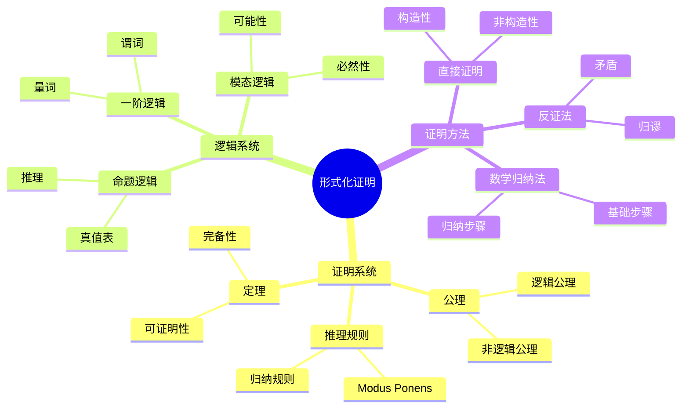
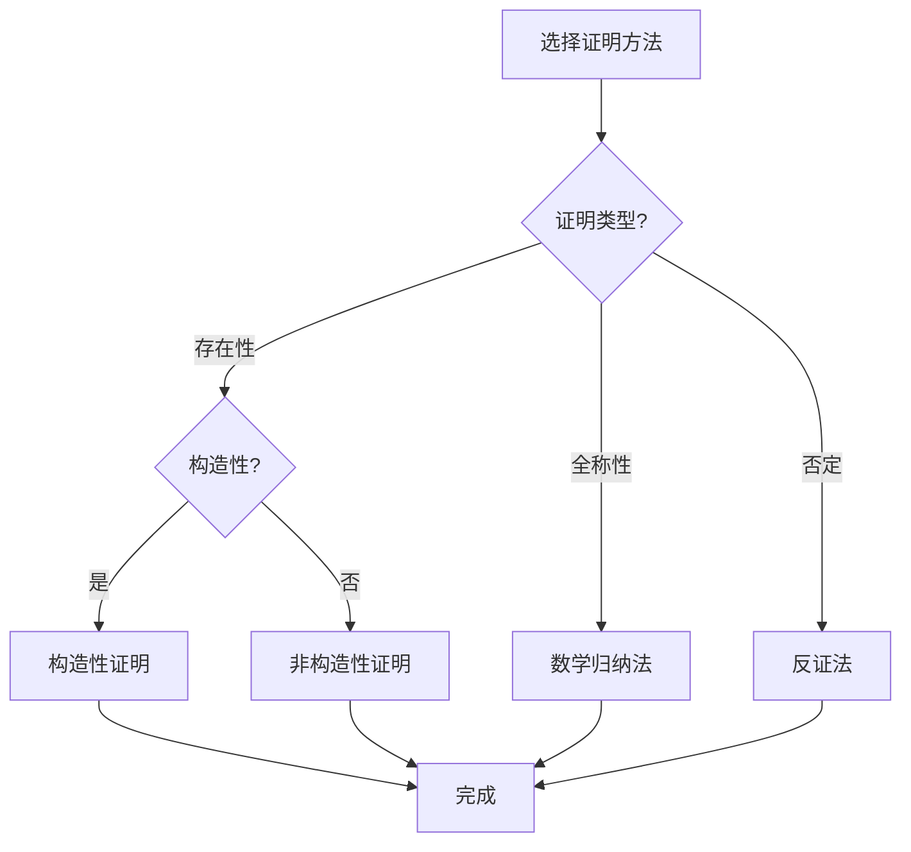

# 形式化证明思维表征工具 / Formal Proof Mental Representation Tools

## 📚 **概述 / Overview**

本文档提供形式化证明模块的多种思维表征工具，包括思维导图、对比矩阵、决策树、逻辑路径和概念地图，帮助更好地理解和应用形式化证明知识。

**创建时间**: 2025年1月
**模块**: 形式化证明
**状态**: 🚀 持续更新中

---

## 🗺️ **一、思维导图 / Mind Maps**

### 1.1 形式化证明核心概念思维导图

---

## 📊 **二、对比矩阵 / Comparison Matrices**

### 2.1 自动定理证明器对比矩阵

| 证明器 | 逻辑系统 | 自动化程度 | 学习曲线 | 应用领域 | 特点 |
|--------|---------|-----------|---------|---------|------|
| **Coq** | 依赖类型 | 高 | 陡 | 程序验证、数学 | 强类型、交互式 |
| **Lean** | 依赖类型 | 高 | 陡 | 数学、AI | 现代、快速 |
| **Isabelle** | 高阶逻辑 | 高 | 中 | 程序验证、数学 | 成熟、工具丰富 |
| **Agda** | 依赖类型 | 中 | 陡 | 程序验证 | 函数式、证明即程序 |
| **PVS** | 高阶逻辑 | 高 | 中 | 系统验证 | 自动化、SMT集成 |

**选择指南**：

- **程序验证**：Coq或Isabelle
- **数学证明**：Lean或Coq
- **系统验证**：PVS
- **函数式编程**：Agda

---

## 🌳 **三、决策树 / Decision Trees**

### 3.1 形式化证明方法选择决策树

---

**文档版本**: v1.0
**创建时间**: 2025年1月
**最后更新**: 2025年1月
**维护者**: GraphNetWorkCommunicate项目组
