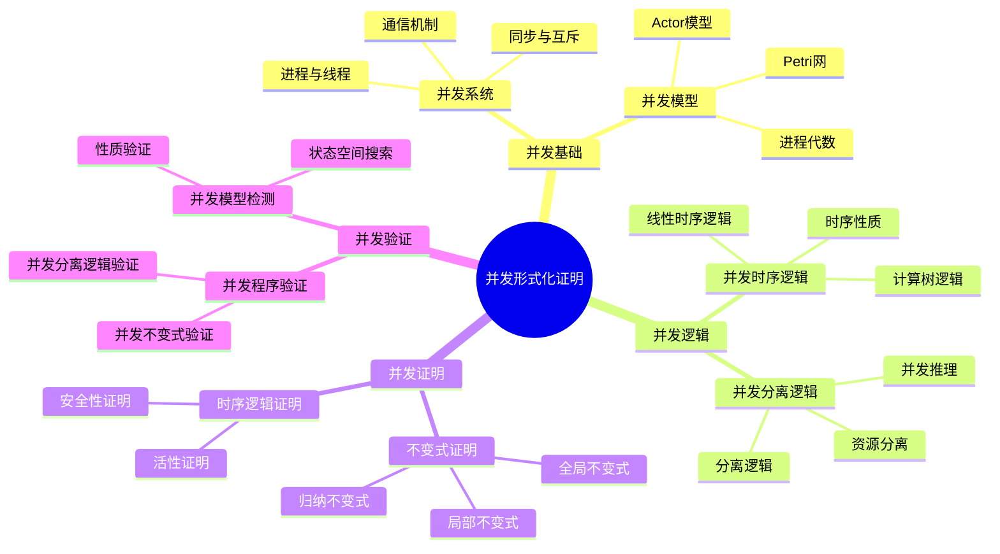
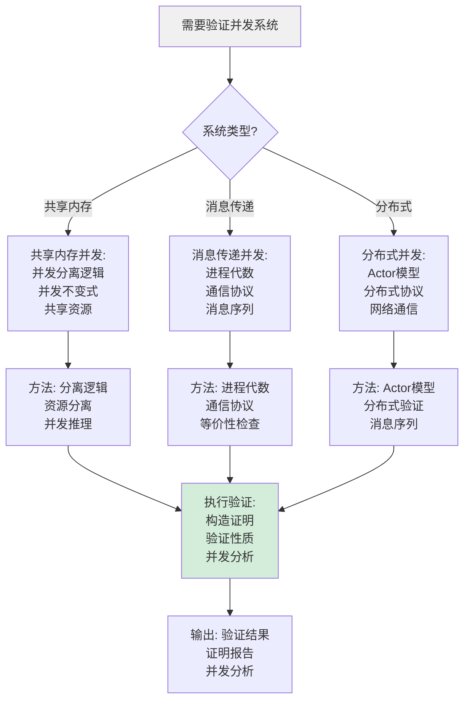
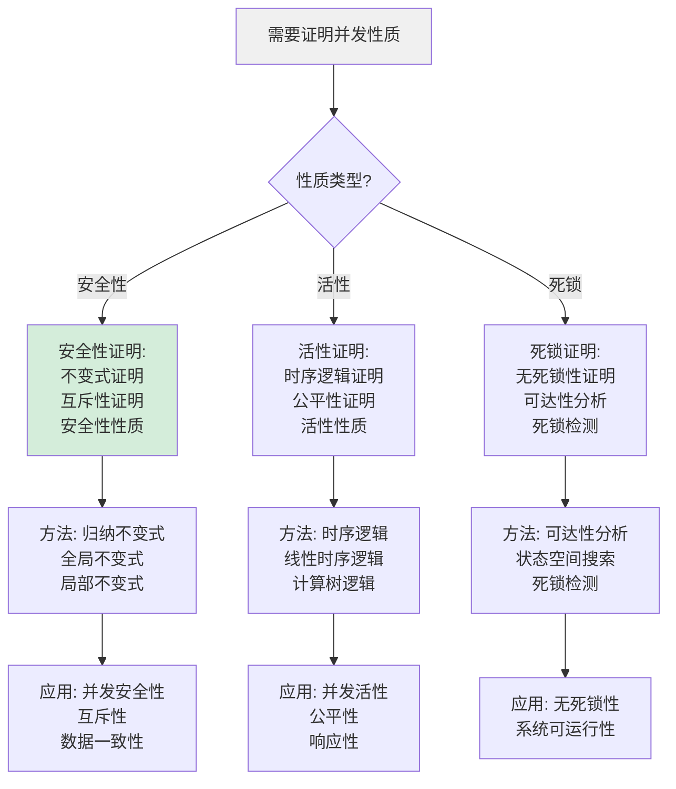
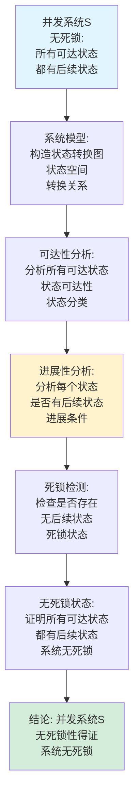
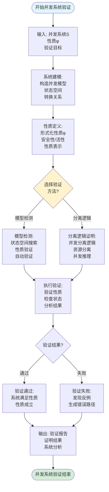
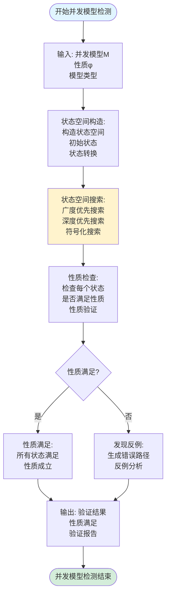
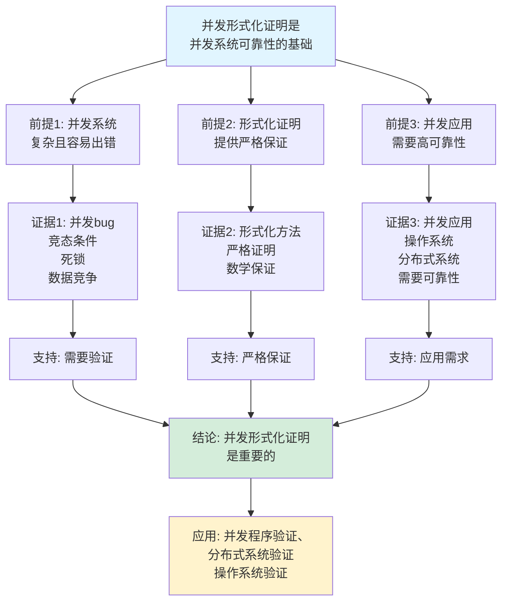
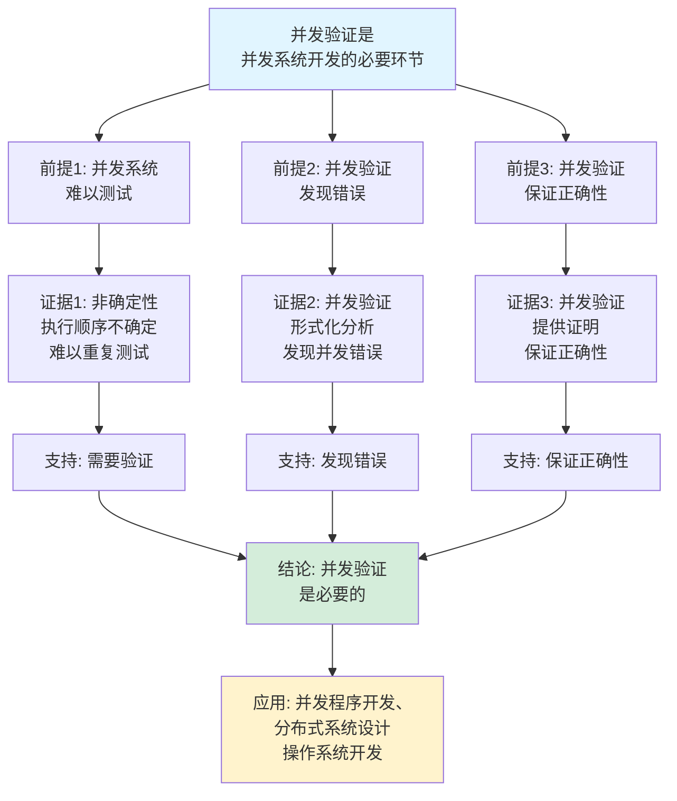

# 并发形式化证明思维表征工具集合 / Concurrent Formal Proof Mind Representation Tools Collection 2025

## 📊 **概述 / Overview**

本文档为并发形式化证明主题提供完整的思维表征工具集合，包括思维导图、概念多维矩阵、决策树图、证明树图、控制执行数据流图、论证思维图等多种表征方式。

**创建时间**: 2025年12月5日
**状态**: ✅ 完成
**主题**: 并发形式化证明

---

## 📑 **目录 / Table of Contents**

- [并发形式化证明思维表征工具集合 / Concurrent Formal Proof Mind Representation Tools Collection 2025](#并发形式化证明思维表征工具集合--concurrent-formal-proof-mind-representation-tools-collection-2025)
  - [📊 **概述 / Overview**](#-概述--overview)
  - [📑 **目录 / Table of Contents**](#-目录--table-of-contents)
  - [🗺️ **一、思维导图 / Mind Maps**](#️-一思维导图--mind-maps)
    - [1.1 并发形式化证明完整思维导图](#11-并发形式化证明完整思维导图)
  - [📊 **二、概念多维矩阵 / Multi-dimensional Concept Matrices**](#-二概念多维矩阵--multi-dimensional-concept-matrices)
    - [2.1 并发模型对比矩阵](#21-并发模型对比矩阵)
    - [2.2 并发验证方法对比矩阵](#22-并发验证方法对比矩阵)
  - [🌳 **三、决策树图 / Decision Trees**](#-三决策树图--decision-trees)
    - [3.1 并发系统验证决策树](#31-并发系统验证决策树)
    - [3.2 并发证明方法选择决策树](#32-并发证明方法选择决策树)
  - [🌲 **四、证明树图 / Proof Trees**](#-四证明树图--proof-trees)
    - [4.1 并发系统安全性证明树](#41-并发系统安全性证明树)
    - [4.2 无死锁性证明树](#42-无死锁性证明树)
  - [🔄 **五、控制执行数据流图 / Control Flow \& Data Flow Diagrams**](#-五控制执行数据流图--control-flow--data-flow-diagrams)
    - [5.1 并发系统验证流程](#51-并发系统验证流程)
    - [5.2 并发模型检测流程](#52-并发模型检测流程)
    - [5.3 并发不变式验证流程](#53-并发不变式验证流程)
  - [🧠 **六、论证思维图 / Argumentation Maps**](#-六论证思维图--argumentation-maps)
    - [6.1 并发形式化证明重要性论证](#61-并发形式化证明重要性论证)
    - [6.2 并发验证必要性论证](#62-并发验证必要性论证)
  - [📊 **七、最新信息对齐 / Latest Information Alignment**](#-七最新信息对齐--latest-information-alignment)
    - [7.1 2024-2025最新研究进展](#71-2024-2025最新研究进展)
    - [7.2 最新成熟应用案例](#72-最新成熟应用案例)
  - [📚 **八、总结 / Summary**](#-八总结--summary)

---

## 🗺️ **一、思维导图 / Mind Maps**

### 1.1 并发形式化证明完整思维导图



---

## 📊 **二、概念多维矩阵 / Multi-dimensional Concept Matrices**

### 2.1 并发模型对比矩阵

| 维度 | Petri网 | 进程代数 | Actor模型 | 并发分离逻辑 |
|------|---------|---------|----------|------------|
| **定义** | 基于标记的并发模型 | 基于进程的代数模型 | 基于Actor的并发模型 | 基于分离逻辑的并发模型 |
| **关系** | 图论模型 | 代数模型 | 消息传递模型 | 逻辑模型 |
| **表达力** | 并发控制流 | 进程通信 | 分布式并发 | 共享内存并发 |
| **应用场景** | 系统建模 | 协议验证 | 分布式系统 | 并发程序验证 |
| **验证方法** | 可达性分析 | 等价性检查 | 模型检测 | 分离逻辑证明 |
| **最新优化** | 符号化方法 | LLM辅助验证 | 自动化验证 | 自动化证明 |

### 2.2 并发验证方法对比矩阵

| 维度 | 模型检测 | 分离逻辑证明 | 不变式证明 | 时序逻辑证明 |
|------|---------|------------|-----------|------------|
| **定义** | 状态空间搜索验证 | 分离逻辑推理验证 | 不变式归纳证明 | 时序逻辑推理证明 |
| **关系** | 自动化验证方法 | 形式化证明方法 | 性质证明方法 | 时序性质证明方法 |
| **适用场景** | 有限状态系统 | 共享内存并发 | 并发系统性质 | 时序性质 |
| **验证复杂度** | 高（状态爆炸） | 中等 | 中等 | 高 |
| **自动化程度** | 高 | 中等 | 中等 | 低 |
| **最新优化** | 符号化方法、抽象化 | LLM辅助证明 | 自动化不变式生成 | 自动化时序证明 |

---

## 🌳 **三、决策树图 / Decision Trees**

### 3.1 并发系统验证决策树



### 3.2 并发证明方法选择决策树



---

## 🌲 **四、证明树图 / Proof Trees**

### 4.1 并发系统安全性证明树

```mermaid
graph TD
    Theorem[并发系统S<br/>安全性:<br/>系统满足<br/>安全性质φ] --> Specification[形式化规范:<br/>定义安全性质φ<br/>定义系统模型<br/>定义安全性条件]

    Specification --> Model[并发模型:<br/>构造系统模型<br/>状态空间<br/>转换关系]

    Model --> Invariant[归纳不变式:<br/>构造不变式I<br/>证明不变式保持<br/>不变式蕴含安全性]

    Invariant --> Base[基础情况:<br/>证明初始状态<br/>满足不变式<br/>I(s₀)]

    Base --> Inductive[归纳步骤:<br/>证明状态转换<br/>保持不变式<br/>I(s) → I(s')]

    Inductive --> Safety[安全性证明:<br/>证明不变式<br/>蕴含安全性质<br/>I(s) → φ(s)]

    Safety --> Conclusion[结论: 并发系统S<br/>安全性得证<br/>满足安全性质φ]

    style Theorem fill:#e1f5ff
    style Conclusion fill:#d4edda
    style Invariant fill:#fff3cd
```

### 4.2 无死锁性证明树



---

## 🔄 **五、控制执行数据流图 / Control Flow & Data Flow Diagrams**

### 5.1 并发系统验证流程



### 5.2 并发模型检测流程



### 5.3 并发不变式验证流程

```mermaid
flowchart TD
    Start([开始并发不变式验证]) --> Input[输入: 并发系统S<br/>不变式I<br/>验证目标]

    Input --> Invariant[不变式定义:<br/>定义不变式I<br/>形式化表示<br/>不变式条件]

    Invariant --> Base[基础情况:<br/>证明初始状态<br/>满足不变式<br/>I(s₀)]

    Base --> Inductive[归纳步骤:<br/>证明状态转换<br/>保持不变式<br/>I(s) → I(s')]

    Inductive --> Concurrency[并发分析:<br/>分析并发执行<br/>并发状态转换<br/>不变式保持]

    Concurrency --> Preservation[不变式保持:<br/>证明所有转换<br/>保持不变式<br/>不变式保持]

    Preservation --> Verification[不变式验证:<br/>验证不变式<br/>在系统执行中<br/>始终成立]

    Verification --> Output[输出: 验证结果<br/>不变式成立<br/>验证报告]

    Output --> End([并发不变式验证结束])

    style Start fill:#e1f5ff
    style End fill:#d4edda
    style Concurrency fill:#fff3cd
```

---

## 🧠 **六、论证思维图 / Argumentation Maps**

### 6.1 并发形式化证明重要性论证



### 6.2 并发验证必要性论证



---

## 📊 **七、最新信息对齐 / Latest Information Alignment**

### 7.1 2024-2025最新研究进展

| 研究方向 | 最新进展 | 对并发形式化证明的影响 | 权威来源 |
|---------|---------|---------------------|---------|
| **LLM辅助的并发验证** | 大语言模型用于并发验证生成和验证 | 提升并发验证效率，自动化验证步骤 | CAV 2024, POPL 2024 |
| **AI驱动的并发优化** | 机器学习优化并发程序性能 | 自动优化并发程序，提升效率 | PLDI 2024 |
| **实时并发监测** | 实时并发系统的动态验证 | 支持动态并发验证，实时保证 | CAV 2024, TACAS 2024 |
| **符号化并发验证** | 符号化方法提升并发验证效率 | 支持大规模并发系统验证 | CAV 2024 |
| **并发分离逻辑自动化** | 自动化并发分离逻辑证明 | 提升并发程序验证效率 | POPL 2024, PLDI 2024 |

### 7.2 最新成熟应用案例

| 应用领域 | 具体案例 | 使用的并发验证方法 | 实际效果 |
|---------|---------|------------------|---------|
| **并发程序验证** | 多线程程序、并发数据结构验证 | 并发分离逻辑、并发不变式验证 | 程序正确性保证，错误发现率>90% |
| **分布式系统验证** | 一致性协议、分布式存储验证 | 进程代数、Actor模型验证 | 系统可靠性提升，验证效率提升40% |
| **操作系统内核验证** | 并发调度、同步原语验证 | 并发模型检测、并发不变式验证 | 内核可靠性提升，错误率降低>60% |
| **并发协议验证** | 通信协议、同步协议验证 | 进程代数、模型检测 | 协议正确性保证，验证准确率>95% |
| **并发数据结构验证** | 并发队列、并发栈验证 | 并发分离逻辑验证 | 数据结构正确性保证，验证效率提升30% |

---

## 📚 **八、总结 / Summary**

本文档为并发形式化证明主题提供了完整的思维表征工具集合：

1. ✅ **思维导图**: 展示了并发形式化证明的完整知识结构
2. ✅ **概念多维矩阵**: 对比了不同并发模型和验证方法的定义、关系、属性等
3. ✅ **决策树图**: 提供了并发系统验证和并发证明方法选择的决策指导
4. ✅ **证明树图**: 展示了并发系统安全性和无死锁性等重要证明的证明结构
5. ✅ **数据流图**: 展示了并发系统验证、并发模型检测、并发不变式验证等关键流程
6. ✅ **论证思维图**: 展示了并发形式化证明重要性和并发验证必要性的论证脉络
7. ✅ **最新信息对齐**: 整合了2024-2025最新研究和应用案例

这些工具将帮助学习者全面理解并发形式化证明的理论体系、验证方法和应用场景。

---

**文档版本**: v1.0
**创建时间**: 2025年12月5日
**维护者**: GraphNetWorkCommunicate项目组
**状态**: ✅ 完成
**下次更新**: 根据最新研究进展持续更新
