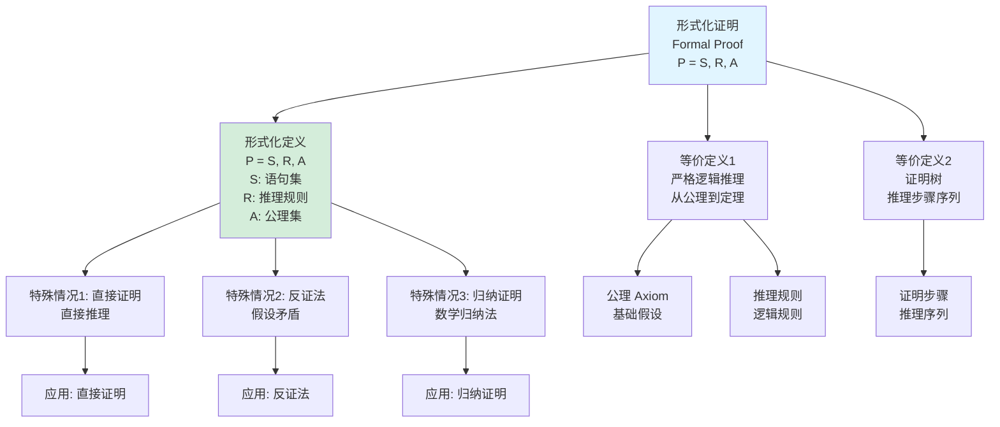
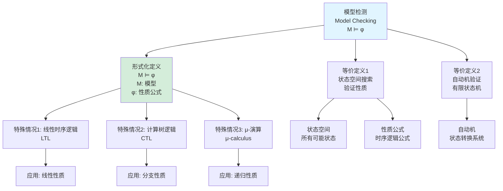
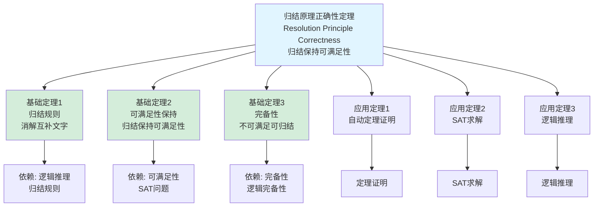
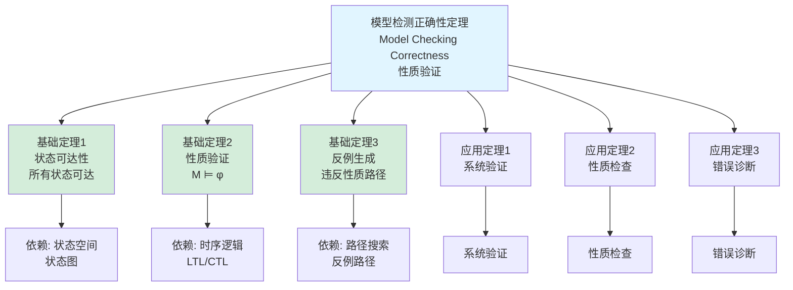
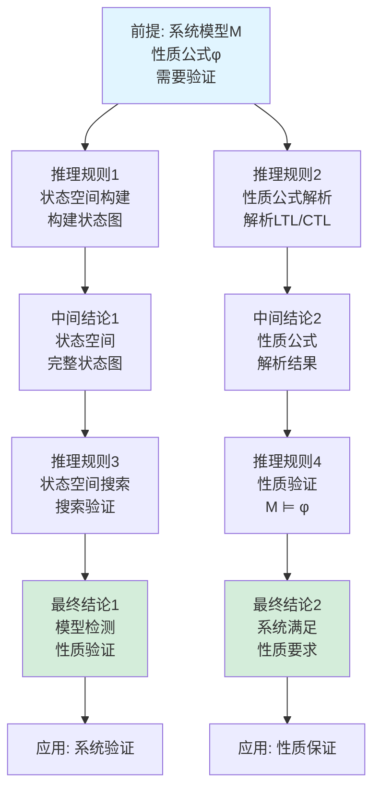

# 形式化证明定义树与定理树集合 / Formal Proof Definition Tree and Theorem Tree Collection 2025

## 📚 **概述 / Overview**

本文档提供形式化证明模块的核心概念定义树和重要定理依赖树，清晰展示概念的定义层次结构和定理之间的依赖关系。

**创建时间**: 2025年1月
**模块**: 形式化证明
**状态**: ✅ 已完成
**版本**: v1.0

---

## 🌳 **一、定义树 / Definition Trees**

### 1.1 形式化证明定义树



### 1.2 Hoare逻辑定义树

```mermaid
graph TD
    Root[Hoare逻辑<br/>Hoare Logic<br/>{P} C {Q}]

    Root --> D1[形式化定义<br/>{P} C {Q}<br/>P: 前置条件<br/>C: 程序<br/>Q: 后置条件]
    Root --> D2[等价定义1<br/>程序正确性<br/>规范]
    Root --> D3[等价定义2<br/>最弱前置条件<br/>wp(C, Q)]

    D1 --> S1[特殊情况1: 赋值规则<br/>x := e]
    D1 --> S2[特殊情况2: 条件规则<br/>if-then-else]
    D1 --> S3[特殊情况3: 循环规则<br/>while]

    D2 --> A1[前置条件<br/>输入约束]
    D2 --> A2[后置条件<br/>输出约束]

    D3 --> A3[最弱前置条件<br/>最小约束]

    S1 --> App1[应用: 程序验证]
    S2 --> App2[应用: 条件验证]
    S3 --> App3[应用: 循环验证]

    style Root fill:#e1f5ff
    style D1 fill:#d4edda
```

### 1.3 模型检测定义树



---

## 🌳 **二、定理树 / Theorem Trees**

### 2.1 归结原理正确性定理树



### 2.2 Hoare逻辑正确性定理树

```mermaid
graph TD
    Root[Hoare逻辑正确性定理<br/>Hoare Logic Correctness<br/>程序正确性验证]

    Root --> T1[基础定理1<br/>赋值规则<br/>{Q[e/x]} x:=e {Q}]
    Root --> T2[基础定理2<br/>条件规则<br/>if-then-else]
    Root --> T3[基础定理3<br/>循环规则<br/>while循环]

    T1 --> D1[依赖: 赋值语义<br/>变量替换]
    T2 --> D2[依赖: 条件语义<br/>分支执行]
    T3 --> D3[依赖: 循环语义<br/>迭代执行]

    Root --> App1[应用定理1<br/>程序验证]
    Root --> App2[应用定理2<br/>正确性证明]
    Root --> App3[应用定理3<br/>程序分析]

    App1 --> Use1[程序验证]
    App2 --> Use2[正确性证明]
    App3 --> Use3[程序分析]

    style Root fill:#e1f5ff
    style T1 fill:#d4edda
    style T2 fill:#d4edda
    style T3 fill:#d4edda
```

### 2.3 模型检测正确性定理树



---

## 🌳 **三、推理关系树 / Inference Relation Trees**

### 3.1 程序验证推理链

```mermaid
graph TD
    Premise[前提: 程序C<br/>前置条件P<br/>后置条件Q]

    Premise --> R1[推理规则1<br/>Hoare逻辑<br/>{P} C {Q}]
    Premise --> R2[推理规则2<br/>最弱前置条件<br/>wp(C, Q)]

    R1 --> IC1[中间结论1<br/>程序正确性<br/>满足规范]

    R2 --> IC2[中间结论2<br/>最弱前置条件<br/>最小约束]

    IC1 --> R3[推理规则3<br/>验证条件<br/>生成VC]
    IC2 --> R4[推理规则4<br/>证明VC<br/>验证条件]

    R3 --> FC1[最终结论1<br/>程序正确性<br/>已验证]

    R4 --> FC2[最终结论2<br/>程序满足<br/>规范要求]

    FC1 --> App1[应用: 程序验证]
    FC2 --> App2[应用: 正确性保证]

    style Premise fill:#e1f5ff
    style FC1 fill:#d4edda
    style FC2 fill:#d4edda
```

### 3.2 模型检测推理链



---

## 📊 **四、使用指南 / Usage Guide**

### 4.1 定义树使用指南

- **概念理解**: 通过定义树理解概念的层次结构
- **等价定义**: 理解同一概念的不同定义方式
- **特殊情况**: 识别概念的特殊情况和应用场景
- **知识整合**: 整合相关概念的知识

### 4.2 定理树使用指南

- **依赖关系**: 理解定理之间的依赖关系
- **证明路径**: 理解证明的逻辑路径
- **应用路径**: 理解定理的应用路径
- **知识体系**: 构建完整的知识体系

### 4.3 推理关系树使用指南

- **逻辑推理**: 理解逻辑推理的过程
- **因果关系**: 理解因果关系链
- **证明结构**: 理解证明的结构
- **知识连接**: 连接相关知识点

---

## 📚 **五、总结 / Summary**

本文档提供了形式化证明模块的三种重要思维表征工具：

1. ✅ **定义树**: 展示核心概念的定义层次结构（3个定义树）
2. ✅ **定理树**: 展示重要定理的依赖关系（3个定理树）
3. ✅ **推理关系树**: 展示逻辑推理链（2个推理关系树）

这些工具将帮助学习者：

- 理解概念的定义层次
- 理解定理的依赖关系
- 理解逻辑推理过程
- 构建完整的知识体系

---

**文档版本**: v1.0
**创建时间**: 2025年1月
**最后更新**: 2025年1月
**维护者**: GraphNetWorkCommunicate项目组
**状态**: ✅ **已完成**
