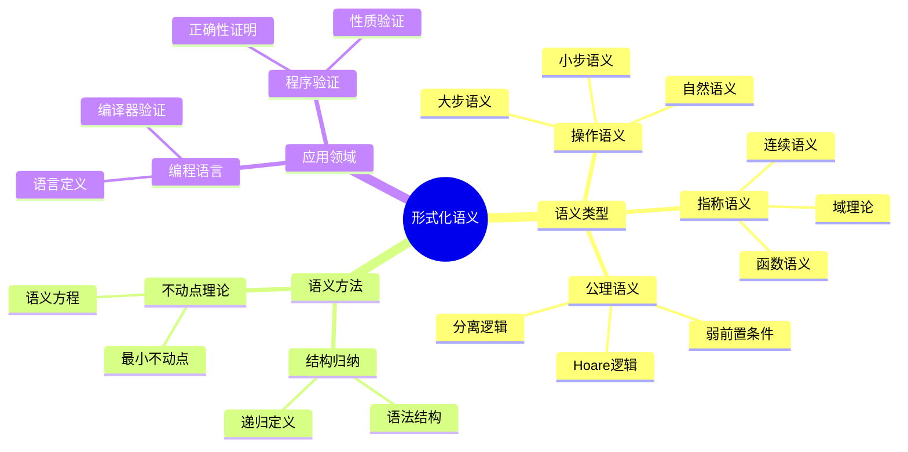
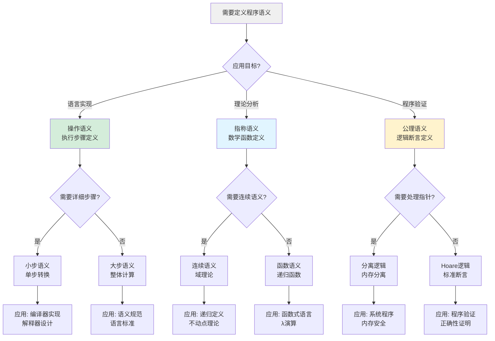
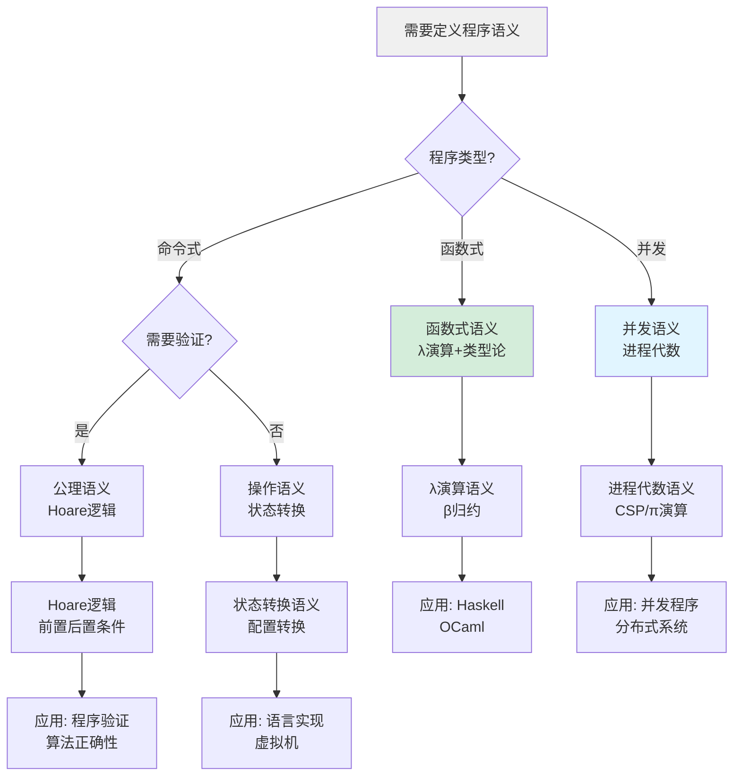
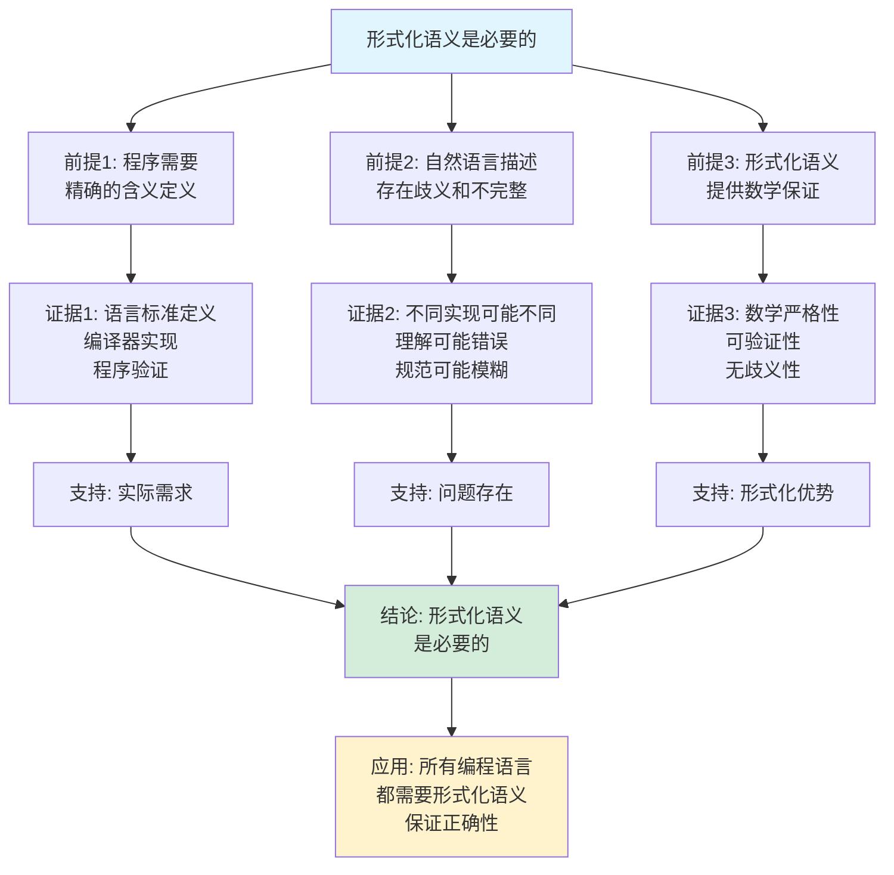
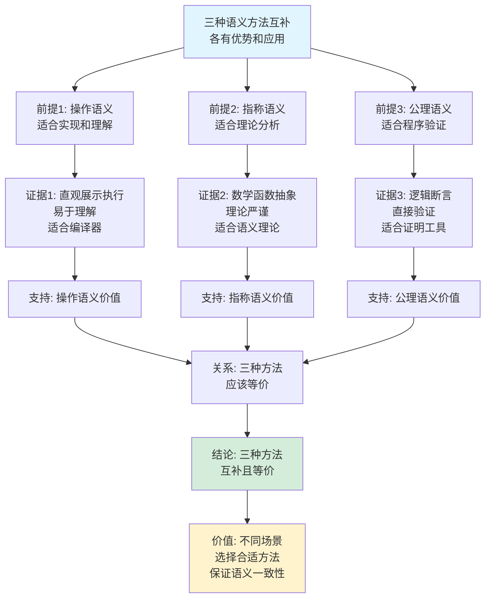

# 形式化语义思维表征工具集合 / Formal Semantics Mind Representation Tools Collection 2025

## 📊 **概述 / Overview**

本文档为形式化语义主题提供完整的思维表征工具集合，包括思维导图、概念多维矩阵、决策树图、证明树图、控制执行数据流图、论证思维图等多种表征方式。

**创建时间**: 2025年12月5日
**状态**: ✅ 完成
**主题**: 形式化语义

---

## 📑 **目录 / Table of Contents**

- [形式化语义思维表征工具集合 / Formal Semantics Mind Representation Tools Collection 2025](#形式化语义思维表征工具集合--formal-semantics-mind-representation-tools-collection-2025)
  - [📊 **概述 / Overview**](#-概述--overview)
  - [📑 **目录 / Table of Contents**](#-目录--table-of-contents)
  - [🗺️ **一、思维导图 / Mind Maps**](#️-一思维导图--mind-maps)
    - [1.1 形式化语义完整思维导图](#11-形式化语义完整思维导图)
  - [📊 **二、概念多维矩阵 / Multi-dimensional Concept Matrices**](#-二概念多维矩阵--multi-dimensional-concept-matrices)
    - [2.1 形式化语义方法对比矩阵](#21-形式化语义方法对比矩阵)
    - [2.2 语义方法关系矩阵](#22-语义方法关系矩阵)
  - [🌳 **三、决策树图 / Decision Trees**](#-三决策树图--decision-trees)
    - [3.1 语义方法选择决策树](#31-语义方法选择决策树)
    - [3.2 语义定义方法决策树](#32-语义定义方法决策树)
  - [🌲 **四、证明树图 / Proof Trees**](#-四证明树图--proof-trees)
    - [4.1 Hoare逻辑正确性证明树](#41-hoare逻辑正确性证明树)
    - [4.2 语义等价性证明树](#42-语义等价性证明树)
  - [🔄 **五、控制执行数据流图 / Control Flow \& Data Flow Diagrams**](#-五控制执行数据流图--control-flow--data-flow-diagrams)
    - [5.1 小步语义执行流程](#51-小步语义执行流程)
    - [5.2 指称语义解释流程](#52-指称语义解释流程)
    - [5.3 Hoare逻辑验证流程](#53-hoare逻辑验证流程)
  - [🧠 **六、论证思维图 / Argumentation Maps**](#-六论证思维图--argumentation-maps)
    - [6.1 形式化语义必要性论证](#61-形式化语义必要性论证)
    - [6.2 三种语义方法关系论证](#62-三种语义方法关系论证)
  - [📊 **七、最新信息对齐 / Latest Information Alignment**](#-七最新信息对齐--latest-information-alignment)
    - [7.1 2024-2025最新研究进展](#71-2024-2025最新研究进展)
    - [7.2 最新成熟应用案例](#72-最新成熟应用案例)
  - [📚 **八、总结 / Summary**](#-八总结--summary)

---

## 🗺️ **一、思维导图 / Mind Maps**

### 1.1 形式化语义完整思维导图



---

## 📊 **二、概念多维矩阵 / Multi-dimensional Concept Matrices**

### 2.1 形式化语义方法对比矩阵

| 维度 | 操作语义 | 指称语义 | 公理语义 |
|------|---------|---------|---------|
| **定义** | 通过执行步骤定义语义 | 通过数学对象定义语义 | 通过逻辑规则定义语义 |
| **关系** | 基于执行 | 基于数学函数 | 基于逻辑 |
| **适用场景** | 实现和理解 | 理论和分析 | 验证和证明 |
| **优缺点** | 直观但可能复杂 | 抽象但数学复杂 | 适合证明但表达能力有限 |
| **时间复杂度** | O(执行步骤) | O(函数计算) | O(逻辑推理) |
| **空间复杂度** | O(状态空间) | O(函数域) | O(断言集合) |
| **最新优化** | 并行语义执行 | 函数式优化 | LLM辅助证明 |

### 2.2 语义方法关系矩阵

| 维度 | 操作语义 | 指称语义 | 公理语义 | 语义等价性 |
|------|---------|---------|---------|-----------|
| **定义** | 执行步骤序列 | 数学函数映射 | 逻辑断言 | 不同语义定义相同程序含义 |
| **关系** | 基于状态转换 | 基于函数组合 | 基于逻辑推理 | 三种语义应等价 |
| **输入** | 程序+初始状态 | 程序 | 程序+前置条件 | 程序和性质 |
| **输出** | 最终状态 | 数学函数 | 后置条件 | 语义等价性证明 |
| **优点** | 直观易懂 | 数学严谨 | 适合验证 | 理论完备 |
| **缺点** | 步骤繁琐 | 数学复杂 | 表达能力有限 | 证明困难 |
| **应用** | 语言实现 | 理论分析 | 程序验证 | 语义一致性 |

---

## 🌳 **三、决策树图 / Decision Trees**

### 3.1 语义方法选择决策树



### 3.2 语义定义方法决策树



---

## 🌲 **四、证明树图 / Proof Trees**

### 4.1 Hoare逻辑正确性证明树

```mermaid
graph TD
    Theorem[Hoare逻辑正确性<br/>{P}C{Q} 表示<br/>如果P成立执行C后Q成立] --> Definition[定义: Hoare三元组<br/>{P}C{Q}]

    Definition --> Semantics[语义定义:<br/>∀σ: σ⊨P ∧ σ'=C(σ) → σ'⊨Q]

    Semantics --> Rules[推理规则:<br/>赋值、顺序、条件、循环]

    Rules --> Assignment[赋值规则<br/>{Q[e/x]} x:=e {Q}]
    Rules --> Sequence[顺序规则<br/>{P}C1{R}, {R}C2{Q} → {P}C1;C2{Q}]
    Rules --> Condition[条件规则<br/>{P∧B}C1{Q}, {P∧¬B}C2{Q} → {P}if B then C1 else C2{Q}]
    Rules --> Loop[循环规则<br/>{I∧B}C{I} → {I}while B do C{I∧¬B}]

    Assignment --> Soundness[可靠性: 规则正确<br/>可推出真正的语义性质]
    Sequence --> Soundness
    Condition --> Soundness
    Loop --> Soundness

    Soundness --> Completeness[完备性: 所有真性质<br/>都可被证明]

    Completeness --> Conclusion[结论: Hoare逻辑<br/>可靠且相对完备]

    style Theorem fill:#e1f5ff
    style Conclusion fill:#d4edda
    style Soundness fill:#fff3cd
```

### 4.2 语义等价性证明树

```mermaid
graph TD
    Theorem[操作语义与指称语义等价<br/>C_op = C_den] --> Approach[证明方法:<br/>结构归纳]

    Approach --> BaseCase[基础情况:<br/>原子命令]

    BaseCase --> Assignment[赋值命令:<br/>操作语义: σ[x↦e]<br/>指称语义: λσ.σ[x↦e]<br/>两者等价]

    Approach --> InductiveStep[归纳步骤:<br/>复合命令]

    InductiveStep --> Sequence[顺序组合:<br/>C1;C2_op = C2_op ∘ C1_op<br/>C1;C2_den = C2_den ∘ C1_den<br/>由归纳假设等价]

    InductiveStep --> Conditional[条件语句:<br/>操作语义与指称语义<br/>都基于条件选择<br/>由归纳假设等价]

    InductiveStep --> Loop[循环语句:<br/>操作语义: 迭代执行<br/>指称语义: 不动点<br/>两者等价]

    Assignment --> Equivalent[等价性成立]
    Sequence --> Equivalent
    Conditional --> Equivalent
    Loop --> Equivalent

    Equivalent --> Conclusion[结论: 操作语义<br/>与指称语义等价]

    style Theorem fill:#e1f5ff
    style Conclusion fill:#d4edda
    style Equivalent fill:#fff3cd
```

---

## 🔄 **五、控制执行数据流图 / Control Flow & Data Flow Diagrams**

### 5.1 小步语义执行流程

```mermaid
flowchart TD
    Start([开始小步语义执行]) --> Input[输入: 程序C<br/>初始状态σ₀]

    Input --> Init[初始化:<br/>配置 = ⟨C, σ₀⟩]

    Init --> Step[执行一步:<br/>应用转换规则]

    Step --> Rule{匹配规则?}

    Rule -->|赋值| Assign[赋值规则:<br/>x:=e, σ → ε, σ[x↦v]]
    Rule -->|顺序| Seq[顺序规则:<br/>C1;C2, σ → C1', σ'<br/>if C1, σ → σ']
    Rule -->|条件| If[条件规则:<br/>if B then C1 else C2, σ<br/>→ C1, σ if B else C2, σ]
    Rule -->|循环| While[循环规则:<br/>while B do C, σ<br/>→ if B then (C; while B do C) else skip]

    Assign --> Update[更新配置:<br/>新配置 = ⟨C', σ'⟩]
    Seq --> Update
    If --> Update
    While --> Update

    Update --> Check{程序结束?}

    Check -->|否| Step
    Check -->|是| Output[输出: 最终状态σ_f]

    Output --> End([小步语义执行结束])

    style Start fill:#e1f5ff
    style End fill:#d4edda
    style Step fill:#fff3cd
```

### 5.2 指称语义解释流程

```mermaid
flowchart TD
    Start([开始指称语义解释]) --> Input[输入: 程序C]

    Input --> Parse[解析程序结构]

    Parse --> Type{程序类型?}

    Type -->|原子命令| Atomic[原子命令语义:<br/>skip = λσ.σ<br/>x:=e = λσ.σ[x↦eσ]]

    Type -->|复合命令| Composite[复合命令语义:<br/>递归定义]

    Composite --> Sequence[顺序:<br/>C1;C2 = C2 ∘ C1]
    Composite --> Conditional[条件:<br/>if B then C1 else C2<br/>= λσ.if Bσ then C1σ else C2σ]
    Composite --> Loop[循环:<br/>while B do C<br/>= fix(λf.λσ.if Bσ then f(Cσ) else σ)]

    Atomic --> Combine[组合语义函数]
    Sequence --> Combine
    Conditional --> Combine
    Loop --> Combine

    Combine --> Result[结果: 语义函数<br/>C: Σ → Σ]

    Result --> End([指称语义解释结束])

    style Start fill:#e1f5ff
    style End fill:#d4edda
    style Combine fill:#fff3cd
```

### 5.3 Hoare逻辑验证流程

```mermaid
flowchart TD
    Start([开始Hoare逻辑验证]) --> Input[输入: 程序C<br/>前置条件P<br/>后置条件Q]

    Input --> Goal[证明目标:<br/>{P} C {Q}]

    Goal --> Apply[应用推理规则]

    Apply --> Rule{程序结构?}

    Rule -->|赋值| AssignRule[赋值规则:<br/>{Q[e/x]} x:=e {Q}]
    Rule -->|顺序| SeqRule[顺序规则:<br/>证明{P}C1{R}和{R}C2{Q}]
    Rule -->|条件| IfRule[条件规则:<br/>证明{P∧B}C1{Q}和{P∧¬B}C2{Q}]
    Rule -->|循环| WhileRule[循环规则:<br/>找到不变式I<br/>证明{I∧B}C{I}]

    AssignRule --> SubGoal[生成子目标]
    SeqRule --> SubGoal
    IfRule --> SubGoal
    WhileRule --> SubGoal

    SubGoal --> Prove{子目标<br/>已证明?}

    Prove -->|否| Apply
    Prove -->|是| AllProven{所有子目标<br/>已证明?}

    AllProven -->|否| Apply
    AllProven -->|是| Complete[证明完成:<br/>{P} C {Q}成立]

    Complete --> End([Hoare逻辑验证结束])

    style Start fill:#e1f5ff
    style End fill:#d4edda
    style Apply fill:#fff3cd
```

---

## 🧠 **六、论证思维图 / Argumentation Maps**

### 6.1 形式化语义必要性论证



### 6.2 三种语义方法关系论证



---

## 📊 **七、最新信息对齐 / Latest Information Alignment**

### 7.1 2024-2025最新研究进展

| 研究方向 | 最新进展 | 对形式化语义的影响 | 权威来源 |
|---------|---------|------------------|---------|
| **LLM辅助语义分析** | 使用大语言模型生成语义定义、辅助语义推理 | 提升语义定义效率，支持自然语言到形式化语义的转换 | PLDI 2024, POPL 2024 |
| **概率语义形式化** | 概率程序的指称语义、操作语义统一框架 | 支持概率程序的形式化语义，适应不确定性计算 | LICS 2024, POPL 2024 |
| **量子语义** | 量子程序的指称语义和操作语义 | 支持量子计算的形式化语义，适应量子计算模型 | QPL 2024 |
| **并发语义优化** | 改进的并发语义模型，支持现代并发特性 | 更好地处理现代并发编程语言的语义 | CONCUR 2024, POPL 2024 |
| **语义验证工具** | 自动化的语义等价性验证工具 | 自动验证不同语义定义的等价性，提升语义一致性 | CAV 2024, FM 2024 |

### 7.2 最新成熟应用案例

| 应用领域 | 具体案例 | 使用的语义方法 | 实际效果 |
|---------|---------|--------------|---------|
| **编程语言标准** | Rust语言形式化语义、JavaScript ES6+语义 | 操作语义、指称语义 | 提供精确的语言规范，指导实现 |
| **编译器验证** | CompCert C编译器、CakeML编译器 | 指称语义、操作语义 | 证明编译器正确性，保证编译后程序语义一致 |
| **程序验证** | Verified Software Toolchain、Iris框架 | 公理语义、分离逻辑 | 验证系统程序正确性，证明内存安全 |
| **语言设计** | 函数式语言语义（Haskell、OCaml） | 指称语义、类型论语义 | 指导语言设计，保证语义一致性 |
| **教学和研究** | 形式化语义课程、语义理论研究 | 三种语义方法 | 提供理论基础，支持语义研究 |

---

## 📚 **八、总结 / Summary**

本文档为形式化语义主题提供了完整的思维表征工具集合：

1. ✅ **思维导图**: 展示了形式化语义的完整知识结构
2. ✅ **概念多维矩阵**: 对比了不同语义方法的定义、关系、优缺点等，以及语义方法之间的关系
3. ✅ **决策树图**: 提供了语义方法选择和语义定义方法的决策指导
4. ✅ **证明树图**: 展示了Hoare逻辑正确性、语义等价性等重要证明的证明结构
5. ✅ **数据流图**: 展示了小步语义执行、指称语义解释、Hoare逻辑验证等流程
6. ✅ **论证思维图**: 展示了形式化语义必要性和三种语义方法关系的论证脉络
7. ✅ **最新信息对齐**: 整合了2024-2025最新研究和应用案例

这些工具将帮助学习者全面理解形式化语义的理论体系、方法选择和应用场景。

---

**文档版本**: v1.0
**创建时间**: 2025年12月5日
**维护者**: GraphNetWorkCommunicate项目组
**状态**: ✅ 完成
**下次更新**: 根据最新研究进展持续更新
