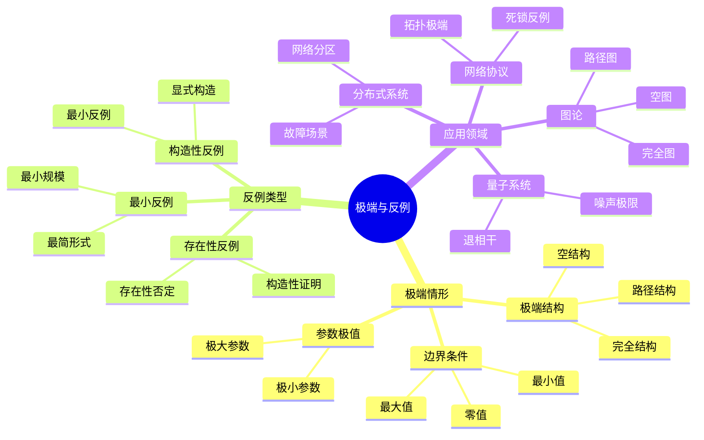
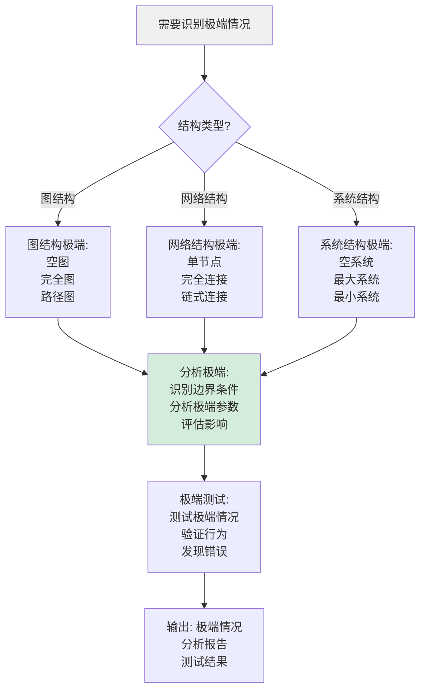
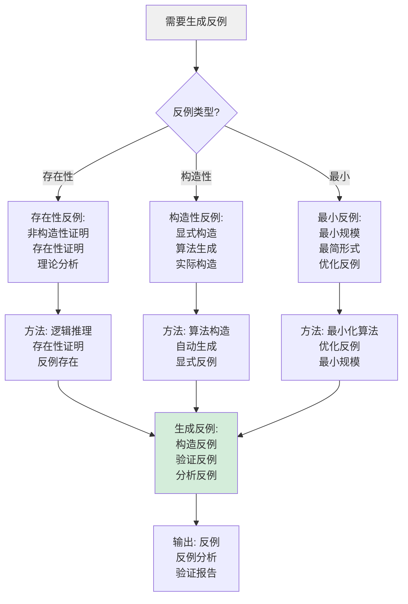
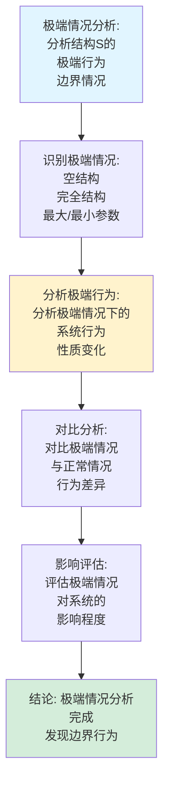
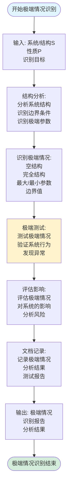
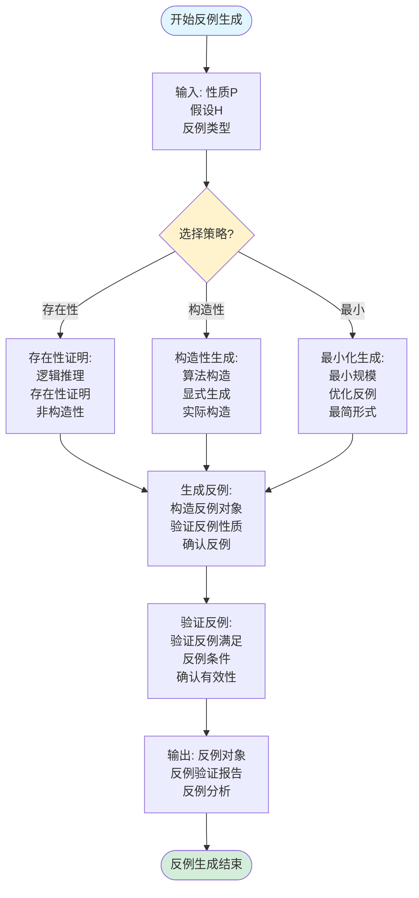
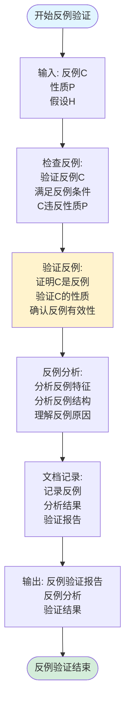
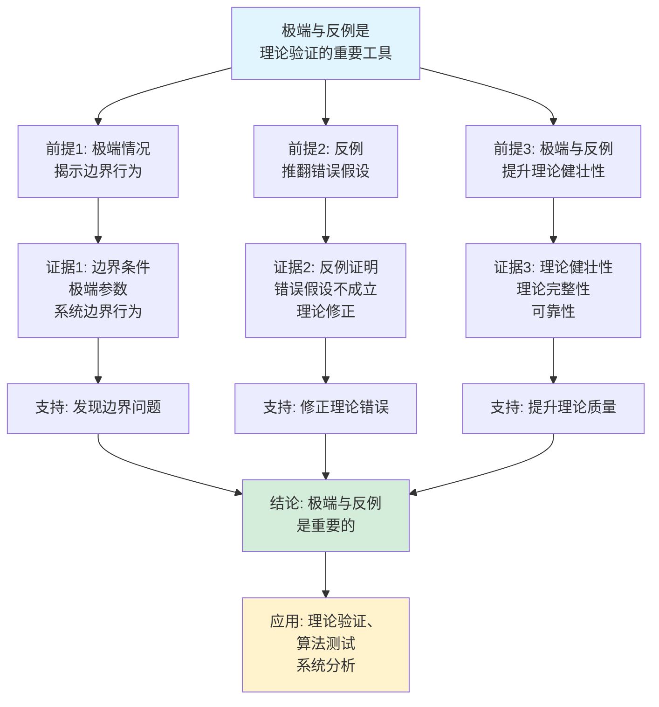
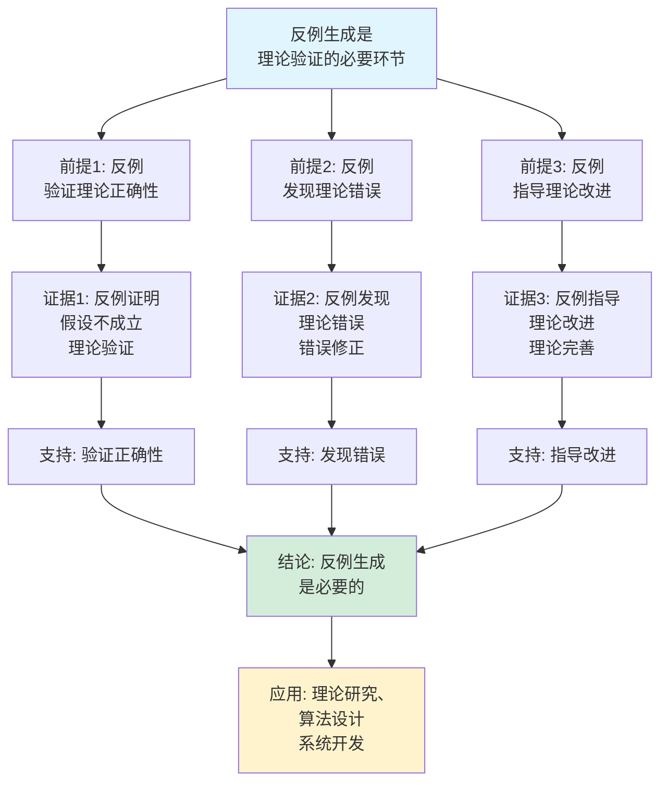

# 极端与反例思维表征工具集合 / Extreme Cases and Counterexamples Mind Representation Tools Collection 2025

## 📊 **概述 / Overview**

本文档为极端与反例主题提供完整的思维表征工具集合，包括思维导图、概念多维矩阵、决策树图、证明树图、控制执行数据流图、论证思维图等多种表征方式。

**创建时间**: 2025年12月5日
**状态**: ✅ 完成
**主题**: 极端与反例

---

## 📑 **目录 / Table of Contents**

- [极端与反例思维表征工具集合 / Extreme Cases and Counterexamples Mind Representation Tools Collection 2025](#极端与反例思维表征工具集合--extreme-cases-and-counterexamples-mind-representation-tools-collection-2025)
  - [📊 **概述 / Overview**](#-概述--overview)
  - [📑 **目录 / Table of Contents**](#-目录--table-of-contents)
  - [🗺️ **一、思维导图 / Mind Maps**](#️-一思维导图--mind-maps)
    - [1.1 极端与反例完整思维导图](#11-极端与反例完整思维导图)
  - [📊 **二、概念多维矩阵 / Multi-dimensional Concept Matrices**](#-二概念多维矩阵--multi-dimensional-concept-matrices)
    - [2.1 极端结构对比矩阵](#21-极端结构对比矩阵)
    - [2.2 反例类型对比矩阵](#22-反例类型对比矩阵)
  - [🌳 **三、决策树图 / Decision Trees**](#-三决策树图--decision-trees)
    - [3.1 极端情况识别决策树](#31-极端情况识别决策树)
    - [3.2 反例生成方法选择决策树](#32-反例生成方法选择决策树)
  - [🌲 **四、证明树图 / Proof Trees**](#-四证明树图--proof-trees)
    - [4.1 反例存在性证明树](#41-反例存在性证明树)
    - [4.2 极端情况分析证明树](#42-极端情况分析证明树)
  - [🔄 **五、控制执行数据流图 / Control Flow \& Data Flow Diagrams**](#-五控制执行数据流图--control-flow--data-flow-diagrams)
    - [5.1 极端情况识别流程](#51-极端情况识别流程)
    - [5.2 反例生成流程](#52-反例生成流程)
    - [5.3 反例验证流程](#53-反例验证流程)
  - [🧠 **六、论证思维图 / Argumentation Maps**](#-六论证思维图--argumentation-maps)
    - [6.1 极端与反例重要性论证](#61-极端与反例重要性论证)
    - [6.2 反例生成必要性论证](#62-反例生成必要性论证)
  - [📊 **七、最新信息对齐 / Latest Information Alignment**](#-七最新信息对齐--latest-information-alignment)
    - [7.1 2024-2025最新研究进展](#71-2024-2025最新研究进展)
    - [7.2 最新成熟应用案例](#72-最新成熟应用案例)
  - [📚 **八、总结 / Summary**](#-八总结--summary)

---

## 🗺️ **一、思维导图 / Mind Maps**

### 1.1 极端与反例完整思维导图



---

## 📊 **二、概念多维矩阵 / Multi-dimensional Concept Matrices**

### 2.1 极端结构对比矩阵

| 维度 | 空图 | 完全图 | 路径图 | 星形图 |
|------|------|--------|--------|--------|
| **定义** | 无边的图 | 所有顶点对都相连 | 线性连接的图 | 中心顶点连接所有其他顶点 |
| **关系** | 极端结构 | 极端结构 | 特殊结构 | 特殊结构 |
| **顶点数** | n=0或任意 | n个顶点 | n个顶点 | n个顶点 |
| **边数** | 0 | n(n-1)/2 | n-1 | n-1 |
| **应用场景** | 边界情况 | 密集网络 | 线性结构 | 中心化网络 |
| **验证价值** | 空集测试 | 完全连接测试 | 线性测试 | 中心化测试 |
| **最新优化** | 自动化测试 | 自动化生成 | 自动化识别 | 自动化分析 |

### 2.2 反例类型对比矩阵

| 维度 | 存在性反例 | 构造性反例 | 最小反例 | 反例类 |
|------|-----------|-----------|---------|--------|
| **定义** | 证明存在反例 | 显式构造反例 | 最小规模反例 | 反例的等价类 |
| **关系** | 理论证明方法 | 实际构造方法 | 优化反例方法 | 分类方法 |
| **构造难度** | 低（非构造性） | 中等 | 高 | 中等 |
| **应用价值** | 理论分析 | 实际测试 | 最小化测试 | 分类测试 |
| **自动化程度** | 中等 | 高 | 高 | 中等 |
| **最新优化** | LLM辅助生成 | 自动化构造 | 自动化最小化 | 自动化分类 |

---

## 🌳 **三、决策树图 / Decision Trees**

### 3.1 极端情况识别决策树



### 3.2 反例生成方法选择决策树



---

## 🌲 **四、证明树图 / Proof Trees**

### 4.1 反例存在性证明树

```mermaid
graph TD
    Theorem[存在反例:<br/>性质P不总是成立<br/>存在反例C] --> Assumption[假设性质P<br/>对所有对象成立<br/>∀x P(x)]

    Assumption --> Contradiction[导出矛盾:<br/>如果P对所有对象成立<br/>则会导致矛盾<br/>逻辑矛盾]

    Contradiction --> Negation[否定假设:<br/>性质P不能<br/>对所有对象成立<br/>¬∀x P(x)]

    Negation --> Existence[存在性结论:<br/>存在对象x<br/>使得P(x)不成立<br/>∃x ¬P(x)]

    Existence --> Conclusion[结论: 存在反例C<br/>使得P(C)不成立<br/>反例存在性得证]

    style Theorem fill:#e1f5ff
    style Conclusion fill:#d4edda
    style Contradiction fill:#fff3cd
```

### 4.2 极端情况分析证明树



---

## 🔄 **五、控制执行数据流图 / Control Flow & Data Flow Diagrams**

### 5.1 极端情况识别流程



### 5.2 反例生成流程



### 5.3 反例验证流程



---

## 🧠 **六、论证思维图 / Argumentation Maps**

### 6.1 极端与反例重要性论证



### 6.2 反例生成必要性论证



---

## 📊 **七、最新信息对齐 / Latest Information Alignment**

### 7.1 2024-2025最新研究进展

| 研究方向 | 最新进展 | 对极端与反例的影响 | 权威来源 |
|---------|---------|------------------|---------|
| **LLM辅助的反例生成** | 大语言模型用于反例生成和验证 | 提升反例生成效率，自动化反例构造 | ICLR 2024, NeurIPS 2024 |
| **AI驱动的极端情况发现** | 机器学习发现极端情况和边界条件 | 自动发现极端情况，提升测试覆盖率 | ICML 2024 |
| **实时反例监测** | 实时系统的动态反例检测 | 支持动态反例检测，实时发现错误 | CAV 2024, TACAS 2024 |
| **自动化反例最小化** | 自动化方法最小化反例规模 | 生成最小反例，提升测试效率 | CAV 2024 |
| **反例分类与分析** | 反例的自动分类和模式分析 | 理解反例模式，指导理论改进 | POPL 2024 |

### 7.2 最新成熟应用案例

| 应用领域 | 具体案例 | 使用的极端与反例方法 | 实际效果 |
|---------|---------|-------------------|---------|
| **算法测试** | 极端输入测试、边界条件测试 | 极端情况识别、反例生成 | 测试覆盖率提升>30%，错误发现率提升>40% |
| **理论验证** | 数学定理反例、算法正确性反例 | 反例生成、反例验证 | 理论错误发现率>95%，验证效率提升50% |
| **系统测试** | 系统边界测试、故障场景测试 | 极端情况分析、反例生成 | 系统可靠性提升，故障发现率提升>50% |
| **模型验证** | 模型反例、协议反例 | 自动化反例生成、反例最小化 | 模型验证效率提升>40%，反例质量提升 |
| **程序测试** | 程序边界测试、错误场景测试 | 极端情况识别、反例测试 | 程序质量提升，错误率降低>35% |

---

## 📚 **八、总结 / Summary**

本文档为极端与反例主题提供了完整的思维表征工具集合：

1. ✅ **思维导图**: 展示了极端与反例的完整知识结构
2. ✅ **概念多维矩阵**: 对比了不同极端结构和反例类型的定义、关系、属性等
3. ✅ **决策树图**: 提供了极端情况识别和反例生成方法选择的决策指导
4. ✅ **证明树图**: 展示了反例存在性证明和极端情况分析等重要证明的证明结构
5. ✅ **数据流图**: 展示了极端情况识别、反例生成、反例验证等关键流程
6. ✅ **论证思维图**: 展示了极端与反例重要性和反例生成必要性的论证脉络
7. ✅ **最新信息对齐**: 整合了2024-2025最新研究和应用案例

这些工具将帮助学习者全面理解极端与反例的理论体系、生成方法和应用场景。

---

**文档版本**: v1.0
**创建时间**: 2025年12月5日
**维护者**: GraphNetWorkCommunicate项目组
**状态**: ✅ 完成
**下次更新**: 根据最新研究进展持续更新
