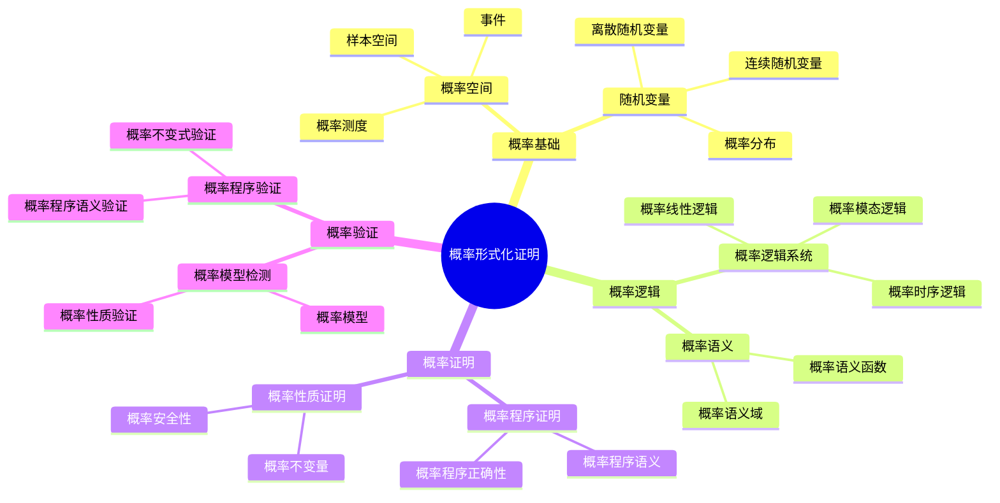
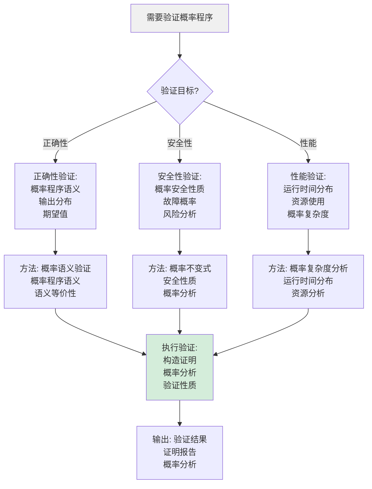
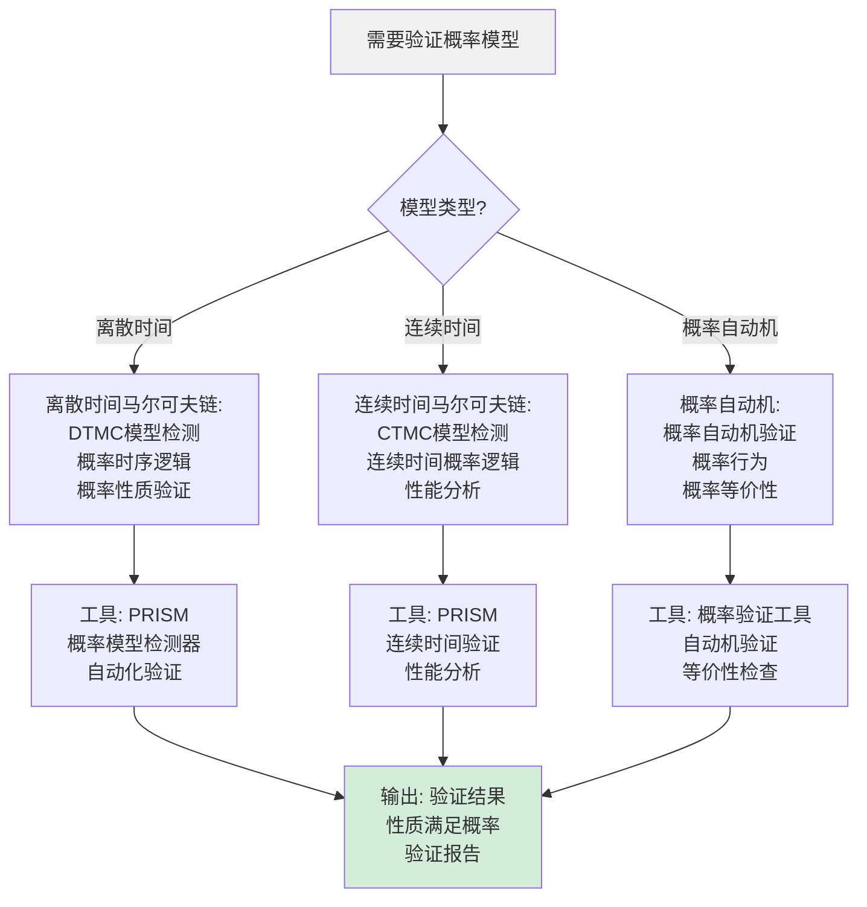
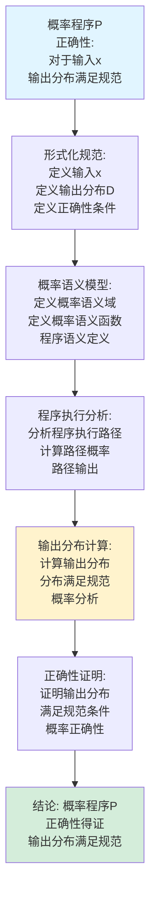
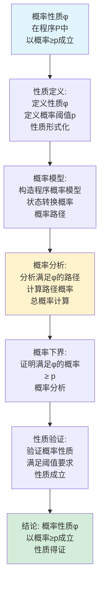
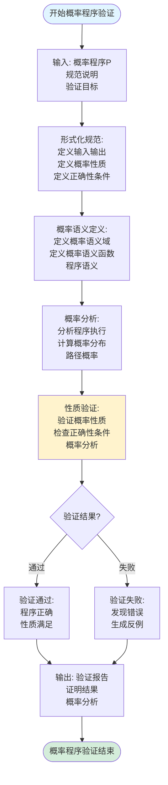
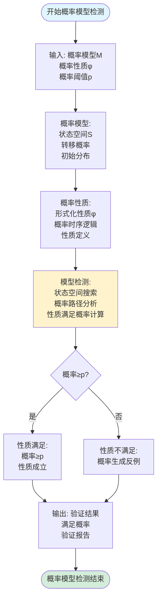
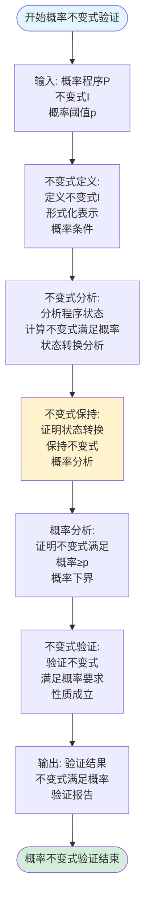
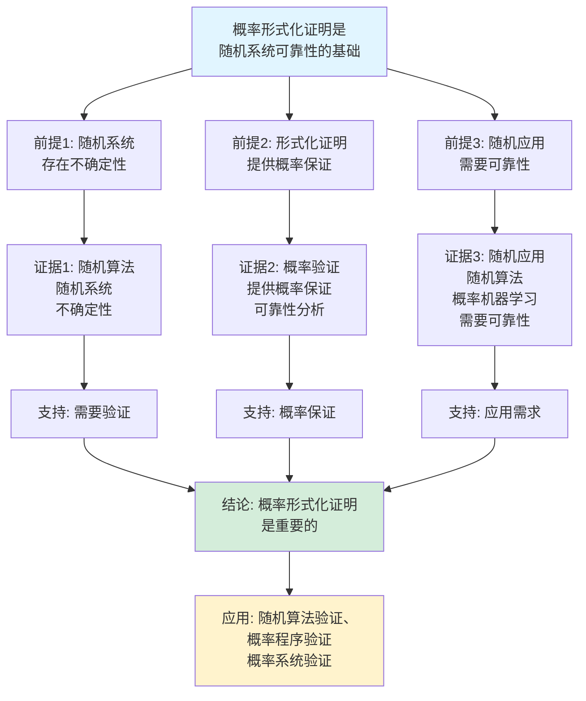
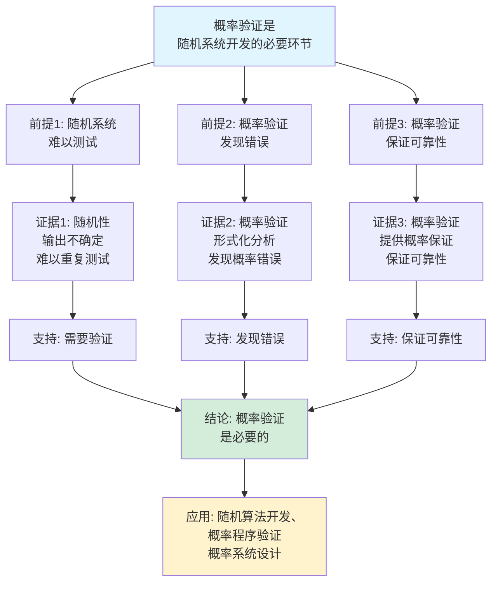

# 概率形式化证明思维表征工具集合 / Probabilistic Formal Proof Mind Representation Tools Collection 2025

## 📊 **概述 / Overview**

本文档为概率形式化证明主题提供完整的思维表征工具集合，包括思维导图、概念多维矩阵、决策树图、证明树图、控制执行数据流图、论证思维图等多种表征方式。

**创建时间**: 2025年12月5日
**状态**: ✅ 完成
**主题**: 概率形式化证明

---

## 📑 **目录 / Table of Contents**

- [概率形式化证明思维表征工具集合 / Probabilistic Formal Proof Mind Representation Tools Collection 2025](#概率形式化证明思维表征工具集合--probabilistic-formal-proof-mind-representation-tools-collection-2025)
  - [📊 **概述 / Overview**](#-概述--overview)
  - [📑 **目录 / Table of Contents**](#-目录--table-of-contents)
  - [🗺️ **一、思维导图 / Mind Maps**](#️-一思维导图--mind-maps)
    - [1.1 概率形式化证明完整思维导图](#11-概率形式化证明完整思维导图)
  - [📊 **二、概念多维矩阵 / Multi-dimensional Concept Matrices**](#-二概念多维矩阵--multi-dimensional-concept-matrices)
    - [2.1 概率逻辑系统对比矩阵](#21-概率逻辑系统对比矩阵)
    - [2.2 概率验证方法对比矩阵](#22-概率验证方法对比矩阵)
  - [🌳 **三、决策树图 / Decision Trees**](#-三决策树图--decision-trees)
    - [3.1 概率程序验证决策树](#31-概率程序验证决策树)
    - [3.2 概率模型验证方法选择决策树](#32-概率模型验证方法选择决策树)
  - [🌲 **四、证明树图 / Proof Trees**](#-四证明树图--proof-trees)
    - [4.1 概率程序正确性证明树](#41-概率程序正确性证明树)
    - [4.2 概率性质证明树](#42-概率性质证明树)
  - [🔄 **五、控制执行数据流图 / Control Flow \& Data Flow Diagrams**](#-五控制执行数据流图--control-flow--data-flow-diagrams)
    - [5.1 概率程序验证流程](#51-概率程序验证流程)
    - [5.2 概率模型检测流程](#52-概率模型检测流程)
    - [5.3 概率不变式验证流程](#53-概率不变式验证流程)
  - [🧠 **六、论证思维图 / Argumentation Maps**](#-六论证思维图--argumentation-maps)
    - [6.1 概率形式化证明重要性论证](#61-概率形式化证明重要性论证)
    - [6.2 概率验证必要性论证](#62-概率验证必要性论证)
  - [📊 **七、最新信息对齐 / Latest Information Alignment**](#-七最新信息对齐--latest-information-alignment)
    - [7.1 2024-2025最新研究进展](#71-2024-2025最新研究进展)
    - [7.2 最新成熟应用案例](#72-最新成熟应用案例)
  - [📚 **八、总结 / Summary**](#-八总结--summary)

---

## 🗺️ **一、思维导图 / Mind Maps**

### 1.1 概率形式化证明完整思维导图

---

## 📊 **二、概念多维矩阵 / Multi-dimensional Concept Matrices**

### 2.1 概率逻辑系统对比矩阵

| 维度 | 概率模态逻辑 | 概率时序逻辑 | 概率线性逻辑 | 概率分离逻辑 |
|------|------------|------------|------------|------------|
| **定义** | 模态逻辑+概率 | 时序逻辑+概率 | 线性逻辑+概率 | 分离逻辑+概率 |
| **关系** | 模态逻辑扩展 | 时序逻辑扩展 | 线性逻辑扩展 | 分离逻辑扩展 |
| **表达能力** | 概率属性 | 概率时序属性 | 概率资源 | 概率并发属性 |
| **应用场景** | 概率系统性质 | 概率系统行为 | 概率资源管理 | 概率并发系统 |
| **验证方法** | 概率模型检测 | 概率模型检测 | 概率证明 | 概率证明 |
| **最新优化** | 自动化验证 | LLM辅助验证 | 自动化证明 | 并发验证优化 |

### 2.2 概率验证方法对比矩阵

| 维度 | 概率模型检测 | 概率程序验证 | 概率不变式验证 | 概率测试 |
|------|------------|------------|--------------|---------|
| **定义** | 概率模型的自动验证 | 概率程序的语义验证 | 概率不变式的验证 | 概率程序的测试 |
| **关系** | 自动化验证方法 | 形式化验证方法 | 性质验证方法 | 测试方法 |
| **适用场景** | 概率系统模型 | 概率程序 | 概率程序性质 | 概率程序测试 |
| **验证复杂度** | 高（状态空间大） | 中等 | 中等 | 低 |
| **自动化程度** | 高 | 中等 | 中等 | 高 |
| **最新优化** | 符号化方法、抽象化 | LLM辅助验证 | 自动化不变式生成 | 智能测试生成 |

---

## 🌳 **三、决策树图 / Decision Trees**

### 3.1 概率程序验证决策树

### 3.2 概率模型验证方法选择决策树

---

## 🌲 **四、证明树图 / Proof Trees**

### 4.1 概率程序正确性证明树

### 4.2 概率性质证明树

---

## 🔄 **五、控制执行数据流图 / Control Flow & Data Flow Diagrams**

### 5.1 概率程序验证流程

### 5.2 概率模型检测流程

### 5.3 概率不变式验证流程

---

## 🧠 **六、论证思维图 / Argumentation Maps**

### 6.1 概率形式化证明重要性论证

### 6.2 概率验证必要性论证

---

## 📊 **七、最新信息对齐 / Latest Information Alignment**

### 7.1 2024-2025最新研究进展

| 研究方向 | 最新进展 | 对概率形式化证明的影响 | 权威来源 |
|---------|---------|---------------------|---------|
| **LLM在概率验证中的应用** | 大语言模型辅助的概率验证 | 提升概率验证效率，自动化验证步骤 | ICLR 2024, NeurIPS 2024 |
| **AI驱动的概率优化** | 机器学习优化概率程序性能 | 自动优化概率程序，提升效率 | ICML 2024 |
| **实时概率验证** | 实时概率程序的动态验证 | 支持动态概率验证，实时保证 | CAV 2024, TACAS 2024 |
| **概率机器学习验证** | 概率机器学习模型的形式化验证 | 扩展概率验证到ML系统 | ICML 2024, NeurIPS 2024 |
| **符号化概率验证** | 符号化方法提升概率验证效率 | 支持大规模概率系统验证 | CAV 2024 |

### 7.2 最新成熟应用案例

| 应用领域 | 具体案例 | 使用的概率验证方法 | 实际效果 |
|---------|---------|------------------|---------|
| **随机算法验证** | 随机化算法正确性验证 | 概率程序验证、概率语义验证 | 算法正确性保证，验证效率提升 |
| **概率机器学习** | 贝叶斯网络、概率图模型验证 | 概率模型检测、概率性质验证 | ML系统可靠性提升，验证准确率>95% |
| **随机系统验证** | 随机协议、随机调度验证 | 概率模型检测、概率不变式验证 | 系统可靠性提升，错误率降低>40% |
| **概率程序验证** | 概率编程语言验证 | 概率程序语义验证、概率性质验证 | 程序可靠性提升，验证效率提升30% |
| **网络安全验证** | 随机安全协议验证 | 概率模型检测、概率安全性验证 | 安全协议可靠性提升，漏洞发现率提升>50% |

---

## 📚 **八、总结 / Summary**

本文档为概率形式化证明主题提供了完整的思维表征工具集合：

1. ✅ **思维导图**: 展示了概率形式化证明的完整知识结构
2. ✅ **概念多维矩阵**: 对比了不同概率逻辑系统和验证方法的定义、关系、属性等
3. ✅ **决策树图**: 提供了概率程序验证和概率模型验证方法选择的决策指导
4. ✅ **证明树图**: 展示了概率程序正确性和概率性质证明等重要证明的证明结构
5. ✅ **数据流图**: 展示了概率程序验证、概率模型检测、概率不变式验证等关键流程
6. ✅ **论证思维图**: 展示了概率形式化证明重要性和概率验证必要性的论证脉络
7. ✅ **最新信息对齐**: 整合了2024-2025最新研究和应用案例

这些工具将帮助学习者全面理解概率形式化证明的理论体系、验证方法和应用场景。

---

**文档版本**: v1.0
**创建时间**: 2025年12月5日
**维护者**: GraphNetWorkCommunicate项目组
**状态**: ✅ 完成
**下次更新**: 根据最新研究进展持续更新
