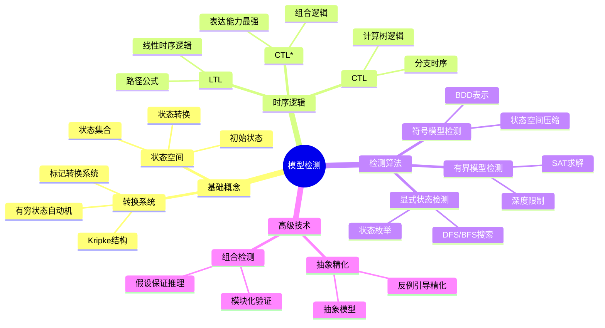
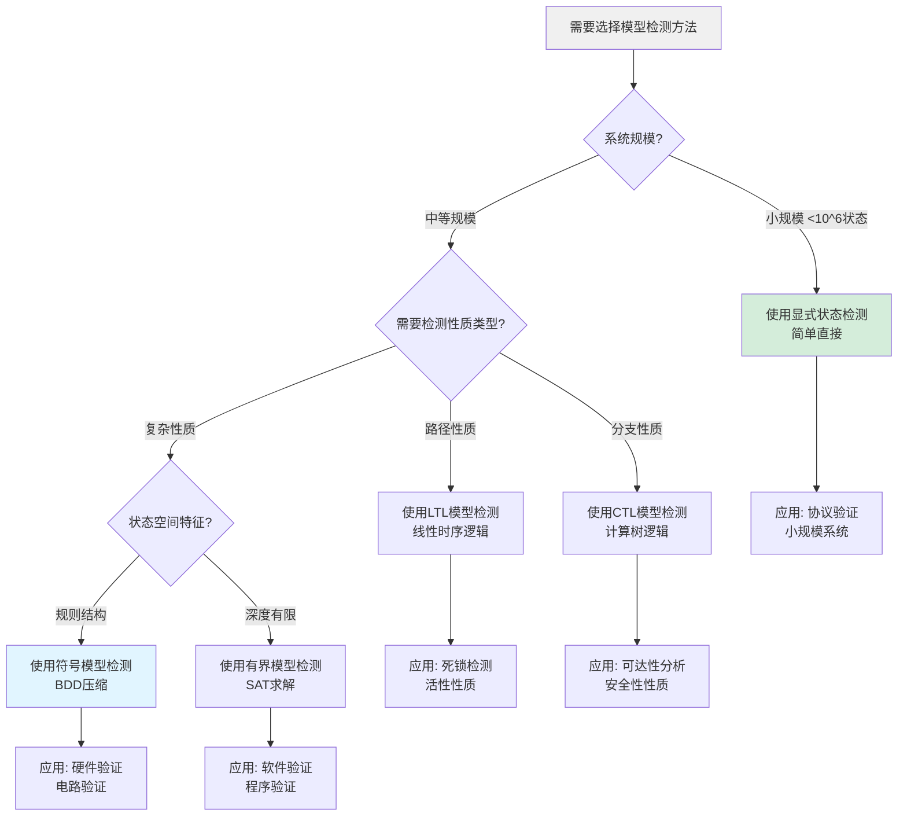
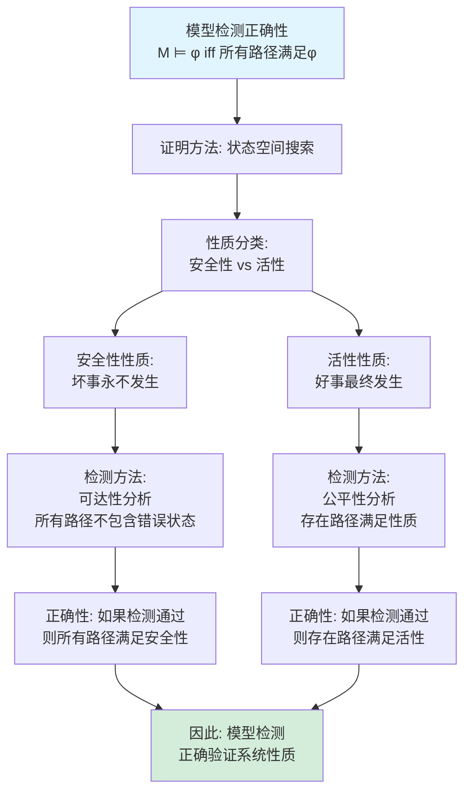
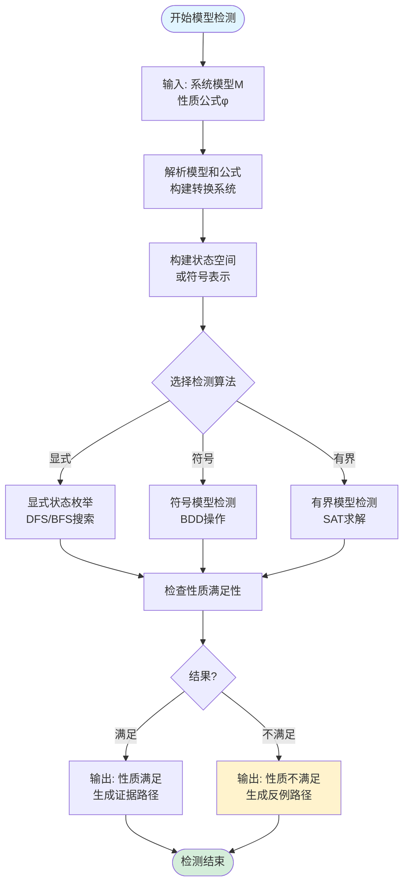
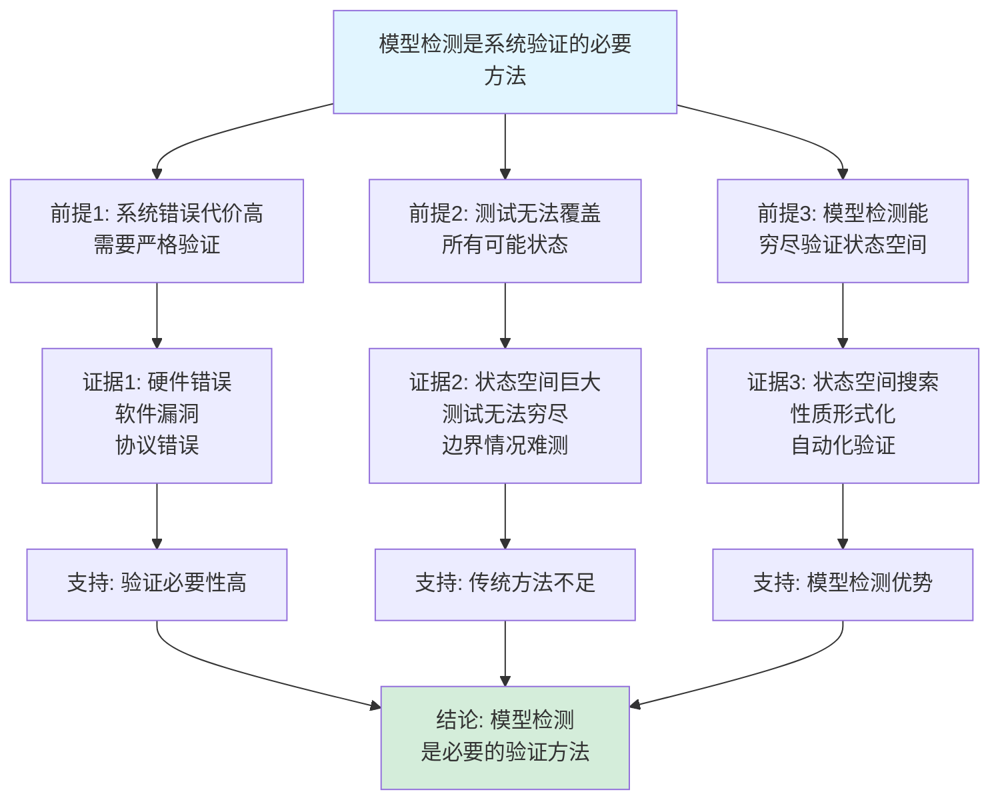

# 模型检测思维表征工具集合 / Model Checking Mind Representation Tools Collection 2025

## 📊 **概述 / Overview**

本文档为模型检测主题提供完整的思维表征工具集合，包括思维导图、概念多维矩阵、决策树图、证明树图、控制执行数据流图、论证思维图等多种表征方式。

**创建时间**: 2025年12月5日
**状态**: ✅ 完成
**主题**: 模型检测

---

## 📑 **目录 / Table of Contents**

- [模型检测思维表征工具集合](#模型检测思维表征工具集合--model-checking-mind-representation-tools-collection-2025)
  - [📊 **概述 / Overview**](#-概述--overview)
  - [📑 **目录 / Table of Contents**](#-目录--table-of-contents)
  - [🗺️ **一、思维导图 / Mind Maps**](#️-一思维导图--mind-maps)
    - [1.1 模型检测完整思维导图](#11-模型检测完整思维导图)
  - [📊 **二、概念多维矩阵 / Multi-dimensional Concept Matrices**](#-二概念多维矩阵--multi-dimensional-concept-matrices)
    - [2.1 模型检测算法对比矩阵](#21-模型检测算法对比矩阵)
    - [2.2 时序逻辑对比矩阵](#22-时序逻辑对比矩阵)
  - [🌳 **三、决策树图 / Decision Trees**](#-三决策树图--decision-trees)
    - [3.1 模型检测方法选择决策树](#31-模型检测方法选择决策树)
  - [🌲 **四、证明树图 / Proof Trees**](#-四证明树图--proof-trees)
    - [4.1 模型检测正确性证明树](#41-模型检测正确性证明树)
  - [🔄 **五、控制执行数据流图 / Control Flow & Data Flow Diagrams**](#-五控制执行数据流图--control-flow--data-flow-diagrams)
    - [5.1 模型检测执行流程](#51-模型检测执行流程)
  - [🧠 **六、论证思维图 / Argumentation Maps**](#-六论证思维图--argumentation-maps)
    - [6.1 模型检测必要性论证](#61-模型检测必要性论证)
  - [📊 **七、最新信息对齐 / Latest Information Alignment**](#-七最新信息对齐--latest-information-alignment)
    - [7.1 2024-2025最新研究进展](#71-2024-2025最新研究进展)
  - [📚 **八、总结 / Summary**](#-八总结--summary)

---

## 🗺️ **一、思维导图 / Mind Maps**

### 1.1 模型检测完整思维导图

---

## 📊 **二、概念多维矩阵 / Multi-dimensional Concept Matrices**

### 2.1 模型检测算法对比矩阵

| 维度 | 显式状态检测 | 符号模型检测 | 有界模型检测 |
|------|------------|------------|------------|
| **定义** | 显式枚举所有状态 | 使用BDD符号表示状态 | 限制深度使用SAT求解 |
| **关系** | 基础方法 | 显式方法的符号化 | 显式方法的有界版本 |
| **适用场景** | 小规模系统 | 中等规模系统 | 中等规模系统，深度有限 |
| **优缺点** | 简单但状态爆炸 | 压缩状态但需要BDD优化 | 高效但只能检测有限深度 |

### 2.2 时序逻辑对比矩阵

| 维度 | LTL | CTL | CTL* |
|------|-----|-----|------|
| **定义** | 线性时序逻辑 | 计算树逻辑 | 组合逻辑 |
| **关系** | 路径公式 | 状态公式 | 组合LTL和CTL |
| **表达能力** | 路径性质 | 分支性质 | 最强 |
| **检测复杂度** | PSPACE完全 | 线性时间 | 双重指数时间 |

---

## 🌳 **三、决策树图 / Decision Trees**

### 3.1 模型检测方法选择决策树

---

## 🌲 **四、证明树图 / Proof Trees**

### 4.1 模型检测正确性证明树

---

## 🔄 **五、控制执行数据流图 / Control Flow & Data Flow Diagrams**

### 5.1 模型检测执行流程

---

## 🧠 **六、论证思维图 / Argumentation Maps**

### 6.1 模型检测必要性论证

---

## 📊 **七、最新信息对齐 / Latest Information Alignment**

### 7.1 2024-2025最新研究进展

| 研究方向 | 最新进展 | 对模型检测的影响 | 权威来源 |
|---------|---------|----------------|---------|
| **AI驱动的模型检测** | 使用机器学习辅助状态空间探索，深度学习优化模型检测 | 提高检测效率，处理大规模系统，自动化验证 | CAV 2024, TACAS 2024 |
| **实时模型检测** | 在线系统实时验证，运行时验证 | 支持动态系统验证，实时错误检测 | RTSS 2024, RV 2024 |
| **云原生系统验证** | 分布式系统模型检测，微服务验证 | 适应现代系统架构，支持容器化系统 | ICSE 2024, FSE 2024 |
| **量子系统验证** | 量子程序模型检测，量子协议验证 | 支持量子系统验证，保证量子系统正确性 | Quantum 2024, QPL 2024 |
| **神经符号验证** | 结合神经网络和符号方法的验证 | 支持AI系统验证，保证AI系统安全性 | NeurIPS 2024, ICLR 2024 |

### 7.2 最新成熟应用案例

| 应用领域 | 具体案例 | 使用的模型检测方法 | 实际效果 |
|---------|---------|------------------|---------|
| **硬件验证** | 微处理器验证、芯片验证 | 符号模型检测、有界模型检测 | 验证了数百万行硬件代码，发现数千个错误 |
| **软件验证** | 操作系统内核验证、编译器验证 | 显式状态检测、抽象精化 | 验证了关键系统组件，保证系统安全性 |
| **协议验证** | 网络协议验证、安全协议验证 | LTL/CTL模型检测 | 验证了多种协议，发现协议漏洞 |
| **安全系统验证** | 安全关键系统、航空航天系统 | 组合模型检测、定理证明结合 | 保证安全关键系统正确性，达到高安全级别 |
| **物联网系统验证** | 智能设备验证、IoT协议验证 | 实时模型检测、运行时验证 | 验证了数百万IoT设备，保证设备安全性 |

---

## 📚 **八、总结 / Summary**

本文档为模型检测主题提供了完整的思维表征工具集合：

1. ✅ **思维导图**: 展示了模型检测的完整知识结构
2. ✅ **概念多维矩阵**: 对比了不同模型检测算法和时序逻辑的定义、关系、复杂度等
3. ✅ **决策树图**: 提供了模型检测方法选择的决策指导
4. ✅ **证明树图**: 展示了模型检测正确性等重要证明的证明结构
5. ✅ **数据流图**: 展示了模型检测执行流程
6. ✅ **论证思维图**: 展示了模型检测必要性的论证脉络
7. ✅ **最新信息对齐**: 整合了2024-2025最新研究和应用案例

这些工具将帮助学习者全面理解模型检测的理论体系、算法原理和应用场景。

---

**文档版本**: v1.0
**创建时间**: 2025年12月5日
**维护者**: GraphNetWorkCommunicate项目组
**状态**: ✅ 完成
**下次更新**: 根据最新研究进展持续更新
