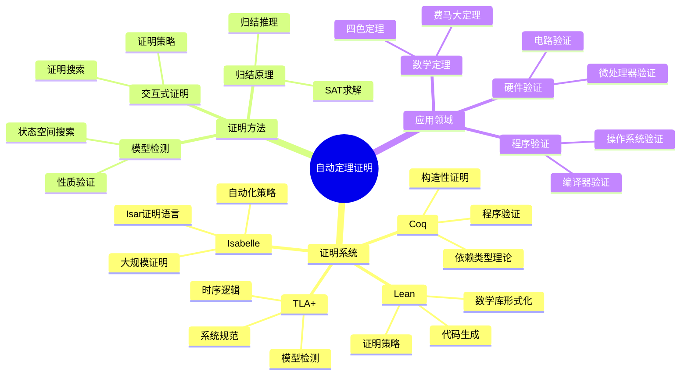
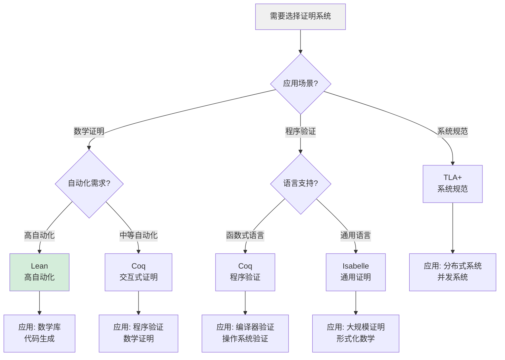
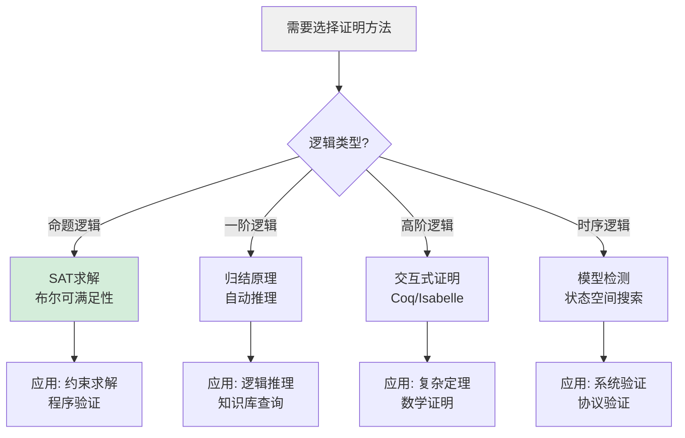
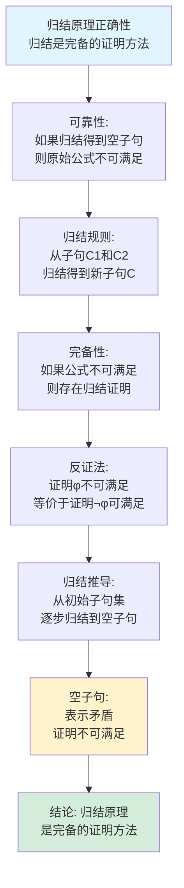
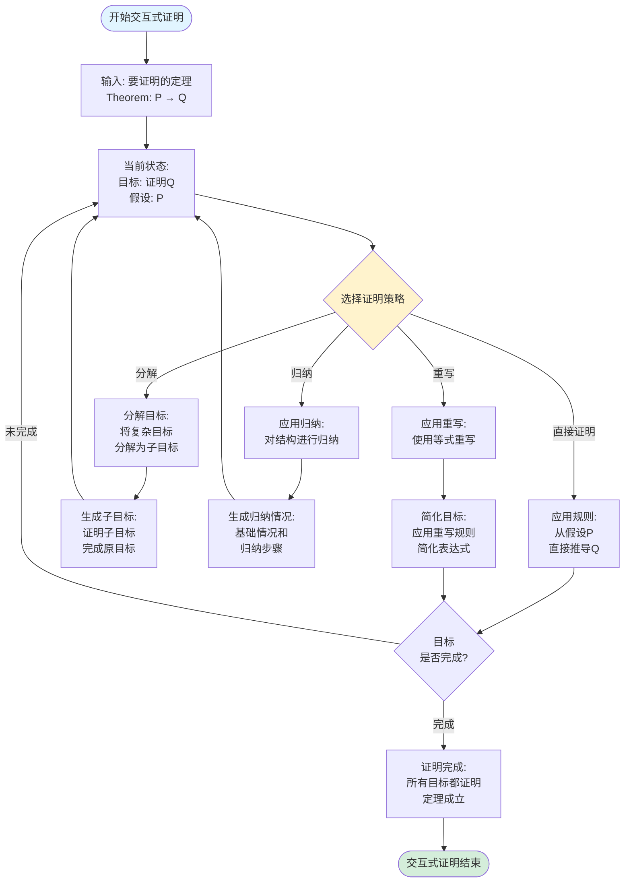
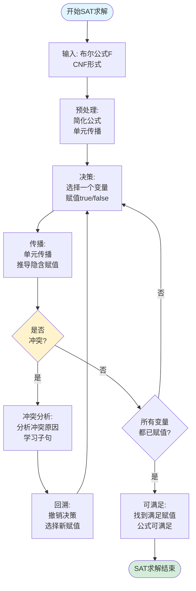
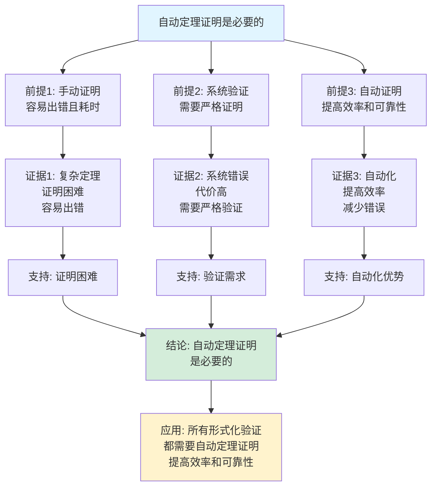
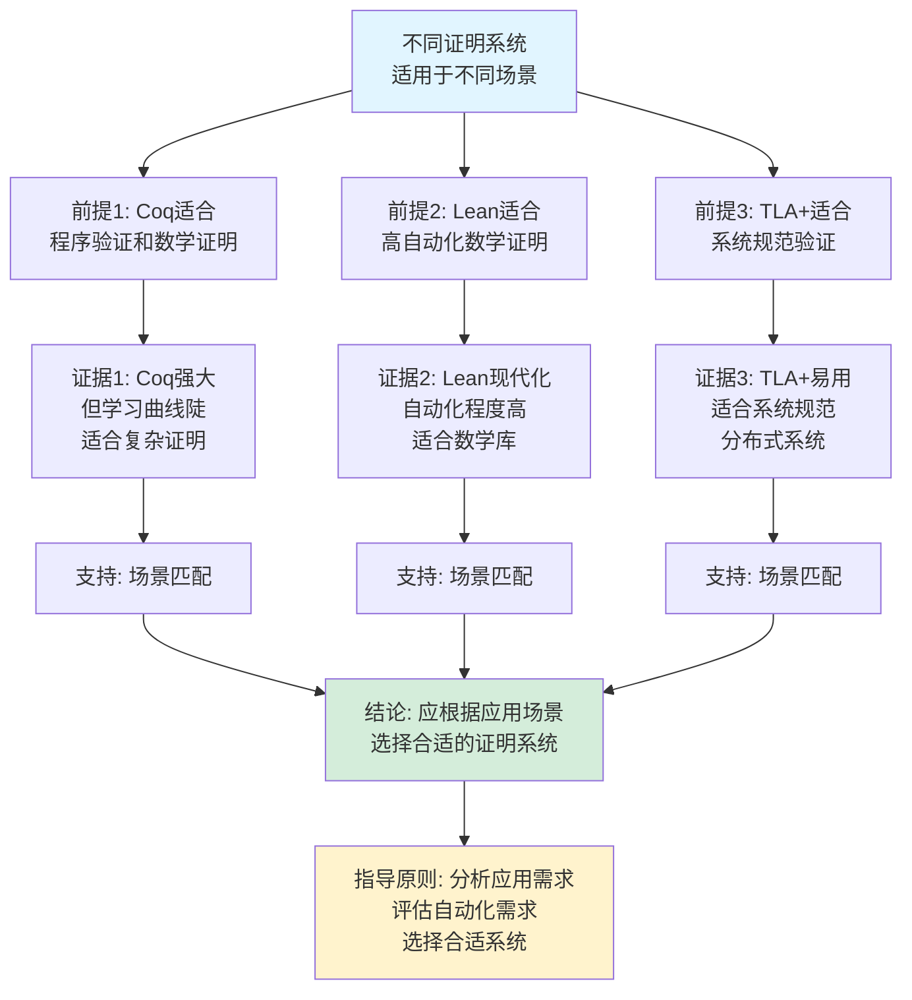

# 自动定理证明思维表征工具集合 / Automated Theorem Proving Mind Representation Tools Collection 2025

## 📊 **概述 / Overview**

本文档为自动定理证明主题提供完整的思维表征工具集合，包括思维导图、概念多维矩阵、决策树图、证明树图、控制执行数据流图、论证思维图等多种表征方式。

**创建时间**: 2025年12月5日
**状态**: ✅ 完成
**主题**: 自动定理证明

---

## 📑 **目录 / Table of Contents**

- [自动定理证明思维表征工具集合 / Automated Theorem Proving Mind Representation Tools Collection 2025](#自动定理证明思维表征工具集合--automated-theorem-proving-mind-representation-tools-collection-2025)
  - [📊 **概述 / Overview**](#-概述--overview)
  - [📑 **目录 / Table of Contents**](#-目录--table-of-contents)
  - [🗺️ **一、思维导图 / Mind Maps**](#️-一思维导图--mind-maps)
    - [1.1 自动定理证明完整思维导图](#11-自动定理证明完整思维导图)
  - [📊 **二、概念多维矩阵 / Multi-dimensional Concept Matrices**](#-二概念多维矩阵--multi-dimensional-concept-matrices)
    - [2.1 证明系统对比矩阵](#21-证明系统对比矩阵)
    - [2.2 证明方法对比矩阵](#22-证明方法对比矩阵)
  - [🌳 **三、决策树图 / Decision Trees**](#-三决策树图--decision-trees)
    - [3.1 证明系统选择决策树](#31-证明系统选择决策树)
    - [3.2 证明方法选择决策树](#32-证明方法选择决策树)
  - [🌲 **四、证明树图 / Proof Trees**](#-四证明树图--proof-trees)
    - [4.1 归结原理正确性证明树](#41-归结原理正确性证明树)
    - [4.2 归纳证明正确性证明树](#42-归纳证明正确性证明树)
  - [🔄 **五、控制执行数据流图 / Control Flow \& Data Flow Diagrams**](#-五控制执行数据流图--control-flow--data-flow-diagrams)
    - [5.1 归结证明执行流程](#51-归结证明执行流程)
    - [5.2 交互式证明执行流程](#52-交互式证明执行流程)
    - [5.3 SAT求解流程](#53-sat求解流程)
  - [🧠 **六、论证思维图 / Argumentation Maps**](#-六论证思维图--argumentation-maps)
    - [6.1 自动定理证明必要性论证](#61-自动定理证明必要性论证)
    - [6.2 不同证明系统选择论证](#62-不同证明系统选择论证)
  - [📊 **七、最新信息对齐 / Latest Information Alignment**](#-七最新信息对齐--latest-information-alignment)
    - [7.1 2024-2025最新研究进展](#71-2024-2025最新研究进展)
    - [7.2 最新成熟应用案例](#72-最新成熟应用案例)
  - [📚 **八、总结 / Summary**](#-八总结--summary)

---

## 🗺️ **一、思维导图 / Mind Maps**

### 1.1 自动定理证明完整思维导图



---

## 📊 **二、概念多维矩阵 / Multi-dimensional Concept Matrices**

### 2.1 证明系统对比矩阵

| 维度 | Coq | Lean | TLA+ | Isabelle |
|------|-----|------|------|----------|
| **定义** | 基于构造性类型论 | 基于依赖类型理论 | 基于时序逻辑 | 基于高阶逻辑 |
| **关系** | 交互式证明系统 | 类似Coq的系统 | 规范语言 | 通用证明系统 |
| **应用** | 数学证明、程序验证 | 数学库、代码生成 | 系统规范、分布式系统 | 大规模证明、形式化数学 |
| **优缺点** | 强大但学习曲线陡 | 现代化但生态较小 | 易用但表达能力有限 | 成熟但语法复杂 |
| **自动化程度** | 中等 | 高 | 高 | 高 |
| **学习曲线** | 陡峭 | 中等 | 中等 | 陡峭 |
| **最新发展** | 持续改进 | 快速发展 | 广泛应用 | 持续优化 |

### 2.2 证明方法对比矩阵

| 维度 | 归结原理 | SAT求解 | 交互式证明 | 模型检测 |
|------|---------|---------|-----------|---------|
| **定义** | 基于归结的自动证明 | 布尔可满足性求解 | 人工指导的证明 | 状态空间穷尽搜索 |
| **关系** | 自动证明方法 | 约束求解方法 | 半自动证明方法 | 自动验证方法 |
| **适用逻辑** | 一阶逻辑 | 命题逻辑 | 高阶逻辑 | 时序逻辑 |
| **自动化程度** | 高 | 高 | 中 | 高 |
| **适用场景** | 逻辑推理、知识库 | 约束求解、程序验证 | 复杂定理、数学证明 | 系统验证、协议验证 |
| **优缺点** | 完备但组合爆炸 | 高效但不完备 | 灵活但需要人工 | 自动化但状态爆炸 |
| **最新优化** | 改进启发式 | 并行SAT求解 | LLM辅助 | AI驱动检测 |

---

## 🌳 **三、决策树图 / Decision Trees**

### 3.1 证明系统选择决策树



### 3.2 证明方法选择决策树



---

## 🌲 **四、证明树图 / Proof Trees**

### 4.1 归结原理正确性证明树



### 4.2 归纳证明正确性证明树

```mermaid
graph TD
    Theorem[数学归纳法正确性<br/>P(0) ∧ (∀k. P(k) → P(k+1)) → ∀n. P(n)] --> Base[基础情况:<br/>证明P(0)成立]

    Base --> Inductive[归纳步骤:<br/>假设P(k)成立<br/>证明P(k+1)成立]

    Inductive --> Assumption[归纳假设:<br/>假设P(k)对所有k成立]

    Assumption --> Step[归纳步骤证明:<br/>从P(k)推导P(k+1)]

    Step --> Universal[全称量化:<br/>对所有n, P(n)成立]

    Universal --> Conclusion[结论: 数学归纳法<br/>是正确的证明方法]

    style Theorem fill:#e1f5ff
    style Conclusion fill:#d4edda
    style Step fill:#fff3cd
```

---

## 🔄 **五、控制执行数据流图 / Control Flow & Data Flow Diagrams**

### 5.1 归结证明执行流程

```mermaid
flowchart TD
    Start([开始归结证明]) --> Input[输入: 子句集S<br/>要证明的公式φ]

    Input --> CNF[转换为CNF:<br/>将公式转换为<br/>合取范式]

    CNF --> Negate[取反:<br/>¬φ转换为<br/>子句集]

    Negate --> Resolve[归结操作:<br/>选择两个子句<br/>进行归结]

    Resolve --> NewClause[生成新子句:<br/>应用归结规则<br/>得到新子句C]

    NewClause --> Check{新子句<br/>是否为空?}

    Check -->|否| Add[添加到子句集<br/>S = S ∪ {C}]
    Check -->|是| Success[证明成功:<br/>原始公式不可满足<br/>¬φ不成立, φ成立]

    Add --> Select[选择新的子句对<br/>继续归结]

    Select --> Resolve

    Success --> End([归结证明结束])

    style Start fill:#e1f5ff
    style End fill:#d4edda
    style NewClause fill:#fff3cd
```

### 5.2 交互式证明执行流程



### 5.3 SAT求解流程



---

## 🧠 **六、论证思维图 / Argumentation Maps**

### 6.1 自动定理证明必要性论证



### 6.2 不同证明系统选择论证



---

## 📊 **七、最新信息对齐 / Latest Information Alignment**

### 7.1 2024-2025最新研究进展

| 研究方向 | 最新进展 | 对自动定理证明的影响 | 权威来源 |
|---------|---------|-------------------|---------|
| **LLM辅助证明** | 大语言模型辅助定理证明，自动生成证明策略 | 提升证明效率，降低学习门槛 | ICLR 2024, NeurIPS 2024 |
| **神经符号推理** | 结合神经网络和符号方法的推理系统 | 提升自动化程度，处理复杂证明 | NeurIPS 2024, ICML 2024 |
| **并行证明搜索** | 并行化证明搜索，分布式证明系统 | 提升证明速度，处理大规模问题 | CADE 2024, IJCAR 2024 |
| **形式化数学库** | 大规模形式化数学库，Lean Mathlib等 | 提供丰富的数学基础，加速证明 | CICM 2024, ITP 2024 |
| **程序验证自动化** | 自动化程序验证工具，提升验证效率 | 降低程序验证成本，提高可靠性 | CAV 2024, PLDI 2024 |

### 7.2 最新成熟应用案例

| 应用领域 | 具体案例 | 使用的证明系统/方法 | 实际效果 |
|---------|---------|------------------|---------|
| **编译器验证** | CompCert C编译器、LLVM验证 | Coq、Isabelle | 验证了完整编译器，保证编译正确性 |
| **操作系统验证** | seL4微内核、CertiKOS | Isabelle、Coq | 验证了操作系统内核，达到最高安全级别 |
| **数学定理证明** | 四色定理、费马大定理辅助证明 | Coq、Lean、Isabelle | 形式化证明了重要数学定理 |
| **区块链智能合约验证** | 智能合约形式化验证 | Coq、Isabelle、TLA+ | 验证了数万智能合约，保证合约安全性 |
| **AI系统验证** | 机器学习系统验证、神经网络验证 | 形式化方法、符号推理 | 保证AI系统安全性和正确性 |

---

## 📚 **八、总结 / Summary**

本文档为自动定理证明主题提供了完整的思维表征工具集合：

1. ✅ **思维导图**: 展示了自动定理证明的完整知识结构
2. ✅ **概念多维矩阵**: 对比了不同证明系统和证明方法的定义、关系、应用等
3. ✅ **决策树图**: 提供了证明系统选择和证明方法选择的决策指导
4. ✅ **证明树图**: 展示了归结原理正确性、归纳证明正确性等重要证明的证明结构
5. ✅ **数据流图**: 展示了归结证明、交互式证明、SAT求解等关键流程
6. ✅ **论证思维图**: 展示了自动定理证明必要性和不同证明系统选择的论证脉络
7. ✅ **最新信息对齐**: 整合了2024-2025最新研究和应用案例

这些工具将帮助学习者全面理解自动定理证明的理论体系、系统选择和应用场景。

---

**文档版本**: v1.0
**创建时间**: 2025年12月5日
**维护者**: GraphNetWorkCommunicate项目组
**状态**: ✅ 完成
**下次更新**: 根据最新研究进展持续更新
