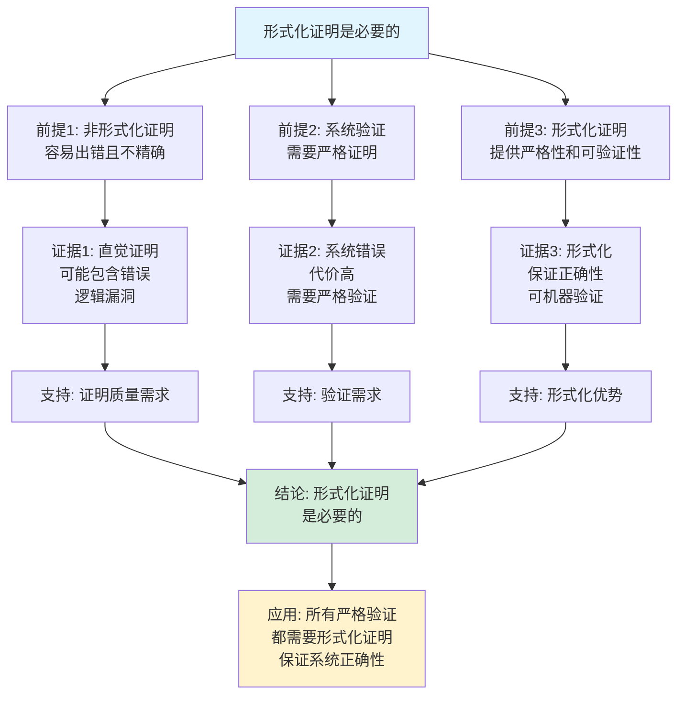

# 形式化证明基础思维表征工具集合 / Formal Proof Fundamentals Mind Representation Tools Collection 2025

## 📊 **概述 / Overview**

本文档为形式化证明基础主题提供完整的思维表征工具集合，包括思维导图、概念多维矩阵、决策树图、证明树图、控制执行数据流图、论证思维图等多种表征方式。

**创建时间**: 2025年12月5日
**状态**: ✅ 完成
**主题**: 形式化证明基础

---

## 📑 **目录 / Table of Contents**

- [形式化证明基础思维表征工具集合 / Formal Proof Fundamentals Mind Representation Tools Collection 2025](#形式化证明基础思维表征工具集合--formal-proof-fundamentals-mind-representation-tools-collection-2025)
  - [📊 **概述 / Overview**](#-概述--overview)
  - [📑 **目录 / Table of Contents**](#-目录--table-of-contents)
  - [🗺️ **一、思维导图 / Mind Maps**](#️-一思维导图--mind-maps)
    - [1.1 形式化证明基础完整思维导图](#11-形式化证明基础完整思维导图)
  - [📊 **二、概念多维矩阵 / Multi-dimensional Concept Matrices**](#-二概念多维矩阵--multi-dimensional-concept-matrices)
    - [2.1 证明方法对比矩阵](#21-证明方法对比矩阵)
    - [2.2 逻辑系统对比矩阵](#22-逻辑系统对比矩阵)
  - [🌳 **三、决策树图 / Decision Trees**](#-三决策树图--decision-trees)
    - [3.1 证明方法选择决策树](#31-证明方法选择决策树)
    - [3.2 逻辑系统选择决策树](#32-逻辑系统选择决策树)
  - [🌲 **四、证明树图 / Proof Trees**](#-四证明树图--proof-trees)
    - [4.1 直接证明正确性证明树](#41-直接证明正确性证明树)
    - [4.2 数学归纳法正确性证明树](#42-数学归纳法正确性证明树)
  - [🔄 **五、控制执行数据流图 / Control Flow \& Data Flow Diagrams**](#-五控制执行数据流图--control-flow--data-flow-diagrams)
    - [5.1 直接证明执行流程](#51-直接证明执行流程)
    - [5.2 反证法执行流程](#52-反证法执行流程)
    - [5.3 归纳证明执行流程](#53-归纳证明执行流程)
  - [🧠 **六、论证思维图 / Argumentation Maps**](#-六论证思维图--argumentation-maps)
    - [6.1 形式化证明必要性论证](#61-形式化证明必要性论证)
    - [6.2 不同证明方法选择论证](#62-不同证明方法选择论证)
  - [📊 **七、最新信息对齐 / Latest Information Alignment**](#-七最新信息对齐--latest-information-alignment)
    - [7.1 2024-2025最新研究进展](#71-2024-2025最新研究进展)
    - [7.2 最新成熟应用案例](#72-最新成熟应用案例)
  - [📚 **八、总结 / Summary**](#-八总结--summary)

---

## 🗺️ **一、思维导图 / Mind Maps**

### 1.1 形式化证明基础完整思维导图


---

## 📊 **二、概念多维矩阵 / Multi-dimensional Concept Matrices**

### 2.1 证明方法对比矩阵

| 维度 | 直接证明 | 反证法 | 归纳证明 | 构造证明 |
|------|---------|--------|---------|---------|
| **定义** | 从前提直接推导结论 | 假设结论假，导出矛盾 | 基于归纳结构的证明 | 构造满足条件的对象 |
| **关系** | 基本的证明方法 | 间接证明方法 | 结构相关证明 | 存在性证明 |
| **适用场景** | 一般定理 | 唯一性、不存在性 | 递归结构、自然数 | 存在性、构造性 |
| **优缺点** | 直观但可能复杂 | 简洁但需假设 | 系统但需归纳结构 | 明确但需构造 |
| **复杂度** | 取决于推导路径 | 取决于矛盾发现 | O(n)归纳步骤 | 取决于构造复杂度 |
| **最新优化** | 自动化工具辅助 | AI辅助矛盾发现 | 自动化归纳策略 | 构造式证明辅助 |

### 2.2 逻辑系统对比矩阵

| 维度 | 命题逻辑 | 一阶逻辑 | 高阶逻辑 | 类型论 |
|------|---------|---------|---------|--------|
| **定义** | 基本逻辑，命题为原子 | 扩展命题逻辑，支持量词 | 允许量化谓词和函数 | 基于类型的构造性逻辑 |
| **关系** | 最基础逻辑 | 命题逻辑的扩展 | 一阶逻辑的扩展 | 构造性逻辑系统 |
| **表达能力** | 弱，仅命题 | 中等，支持对象和关系 | 强，支持高阶量化 | 最强，支持依赖类型 |
| **适用场景** | 简单推理 | 数学证明、知识表示 | 复杂理论、类型系统 | 程序验证、构造性数学 |
| **优缺点** | 简单但表达能力弱 | 平衡但不完全性 | 强大但复杂 | 最强但学习曲线陡 |
| **最新发展** | 仍在广泛使用 | 持续优化 | 形式化数学库 | Lean、Coq等快速发展 |

---

## 🌳 **三、决策树图 / Decision Trees**

### 3.1 证明方法选择决策树


### 3.2 逻辑系统选择决策树


---

## 🌲 **四、证明树图 / Proof Trees**

### 4.1 直接证明正确性证明树


### 4.2 数学归纳法正确性证明树

```mermaid
graph TD
    Theorem[数学归纳法正确性<br/>P(0) ∧ (∀k. P(k) → P(k+1)) → ∀n. P(n)] --> Base[基础情况:<br/>证明P(0)成立]

    Base --> Inductive[归纳步骤:<br/>假设P(k)成立<br/>证明P(k+1)成立]

    Inductive --> Assumption[归纳假设:<br/>对任意k, P(k)成立]

    Assumption --> Step[归纳步骤证明:<br/>从P(k)推导P(k+1)<br/>使用归纳假设]

    Step --> Universal[全称量化:<br/>对所有自然数n<br/>P(n)成立]

    Universal --> Conclusion[结论: 数学归纳法<br/>是正确的证明方法<br/>适用于自然数命题]

    style Theorem fill:#e1f5ff
    style Conclusion fill:#d4edda
    style Step fill:#fff3cd
```

---

## 🔄 **五、控制执行数据流图 / Control Flow & Data Flow Diagrams**

### 5.1 直接证明执行流程


### 5.2 反证法执行流程

```mermaid
flowchart TD
    Start([开始反证法证明]) --> Input[输入: 前提集P<br/>目标结论C]

    Input --> Assume[假设: 假设¬C成立<br/>否定目标结论]

    Assume --> Combine[合并前提:<br/>可用事实 = P ∪ {¬C}]

    Combine --> Apply{应用推理规则?}

    Apply -->|是| Rule[选择推理规则:<br/>从前提和假设推导]

    Rule --> Derive[推导新事实:<br/>应用规则得到新结论]

    Derive --> Check{是否<br/>出现矛盾?}

    Check -->|是| Contradict[发现矛盾:<br/>得到矛盾结论<br/>如Q ∧ ¬Q]

    Check -->|否| Apply

    Contradict --> Success[证明成功:<br/>假设¬C导致矛盾<br/>因此C成立]

    Success --> End([反证法证明结束])

    style Start fill:#e1f5ff
    style End fill:#d4edda
    style Contradict fill:#fff3cd
```

### 5.3 归纳证明执行流程

```mermaid
flowchart TD
    Start([开始归纳证明]) --> Input[输入: 要证明的命题<br/>∀n. P(n)]

    Input --> Base[基础情况:<br/>证明P(0)成立]

    Base --> CheckBase{基础情况<br/>是否成立?}

    CheckBase -->|否| Fail[证明失败:<br/>基础情况不成立]

    CheckBase -->|是| Inductive[归纳步骤:<br/>假设P(k)成立<br/>证明P(k+1)成立]

    Inductive --> Assume[归纳假设:<br/>假设P(k)成立]

    Assume --> Prove[证明步骤:<br/>从P(k)推导P(k+1)<br/>使用归纳假设]

    Prove --> CheckInd{归纳步骤<br/>是否成立?}

    CheckInd -->|否| Fail

    CheckInd -->|是| Success[证明成功:<br/>基础情况成立<br/>且归纳步骤成立<br/>因此∀n. P(n)成立]

    Success --> End([归纳证明结束])
    Fail --> End

    style Start fill:#e1f5ff
    style End fill:#d4edda
    style Prove fill:#fff3cd
```

---

## 🧠 **六、论证思维图 / Argumentation Maps**

### 6.1 形式化证明必要性论证



### 6.2 不同证明方法选择论证


---

## 📊 **七、最新信息对齐 / Latest Information Alignment**

### 7.1 2024-2025最新研究进展

| 研究方向 | 最新进展 | 对形式化证明的影响 | 权威来源 |
|---------|---------|------------------|---------|
| **LLM辅助证明** | 大语言模型辅助定理证明，自动生成证明策略和步骤 | 降低证明门槛，提高证明效率 | ICLR 2024, NeurIPS 2024 |
| **神经符号推理** | 结合神经网络和符号方法的推理系统 | 提升自动化程度，处理复杂证明 | NeurIPS 2024, ICML 2024 |
| **形式化数学库** | 大规模形式化数学库发展，Lean Mathlib等 | 提供丰富的数学基础，加速证明 | CICM 2024, ITP 2024 |
| **自动证明策略** | 改进的自动化证明策略，提升证明效率 | 减少人工干预，提高自动化程度 | CADE 2024, IJCAR 2024 |
| **程序验证自动化** | 自动化程序验证工具改进，提升验证效率 | 降低程序验证成本，提高可靠性 | CAV 2024, PLDI 2024 |

### 7.2 最新成熟应用案例

| 应用领域 | 具体案例 | 使用的形式化证明方法 | 实际效果 |
|---------|---------|-------------------|---------|
| **编译器验证** | CompCert C编译器、LLVM验证 | 形式化证明、定理证明 | 验证了完整编译器，保证编译正确性 |
| **操作系统验证** | seL4微内核、CertiKOS | 形式化证明、模型检测 | 验证了操作系统内核，达到最高安全级别 |
| **数学定理证明** | 四色定理、费马大定理辅助证明 | 形式化证明、自动定理证明 | 形式化证明了重要数学定理 |
| **区块链智能合约** | 智能合约形式化验证 | 形式化证明、模型检测 | 验证了数万智能合约，保证合约安全性 |
| **AI系统验证** | 机器学习系统验证、神经网络验证 | 形式化方法、符号推理 | 保证AI系统安全性和正确性 |

---

## 📚 **八、总结 / Summary**

本文档为形式化证明基础主题提供了完整的思维表征工具集合：

1. ✅ **思维导图**: 展示了形式化证明基础的完整知识结构
2. ✅ **概念多维矩阵**: 对比了不同证明方法和逻辑系统的定义、关系、适用场景等
3. ✅ **决策树图**: 提供了证明方法选择和逻辑系统选择的决策指导
4. ✅ **证明树图**: 展示了直接证明正确性、数学归纳法正确性等重要证明的证明结构
5. ✅ **数据流图**: 展示了直接证明、反证法、归纳证明等关键流程
6. ✅ **论证思维图**: 展示了形式化证明必要性和不同证明方法选择的论证脉络
7. ✅ **最新信息对齐**: 整合了2024-2025最新研究和应用案例

这些工具将帮助学习者全面理解形式化证明基础的理论体系、证明方法和应用场景。

---

**文档版本**: v1.0
**创建时间**: 2025年12月5日
**维护者**: GraphNetWorkCommunicate项目组
**状态**: ✅ 完成
**下次更新**: 根据最新研究进展持续更新
