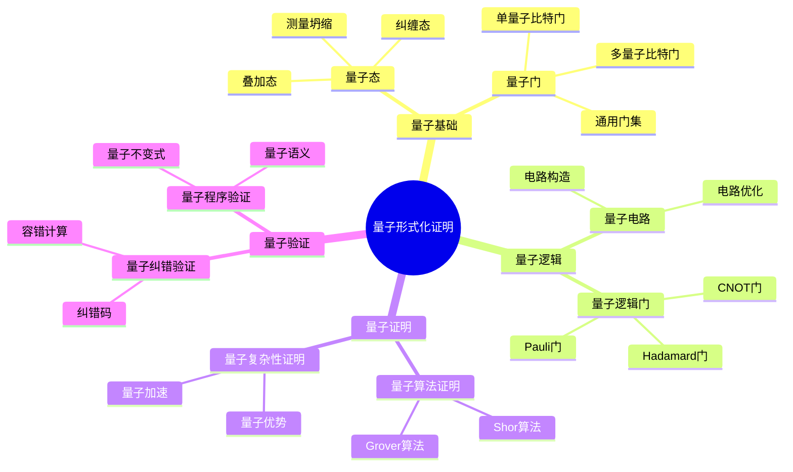
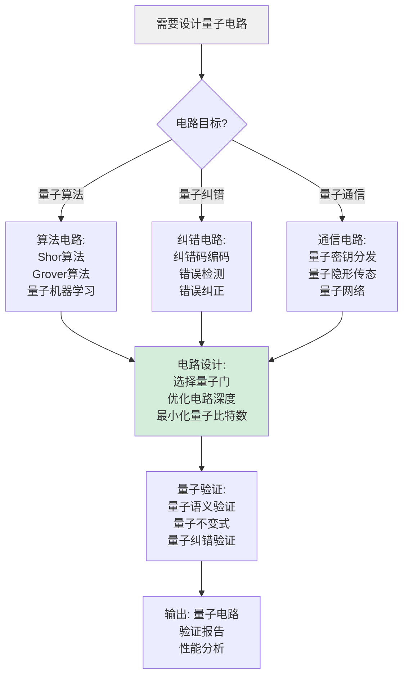
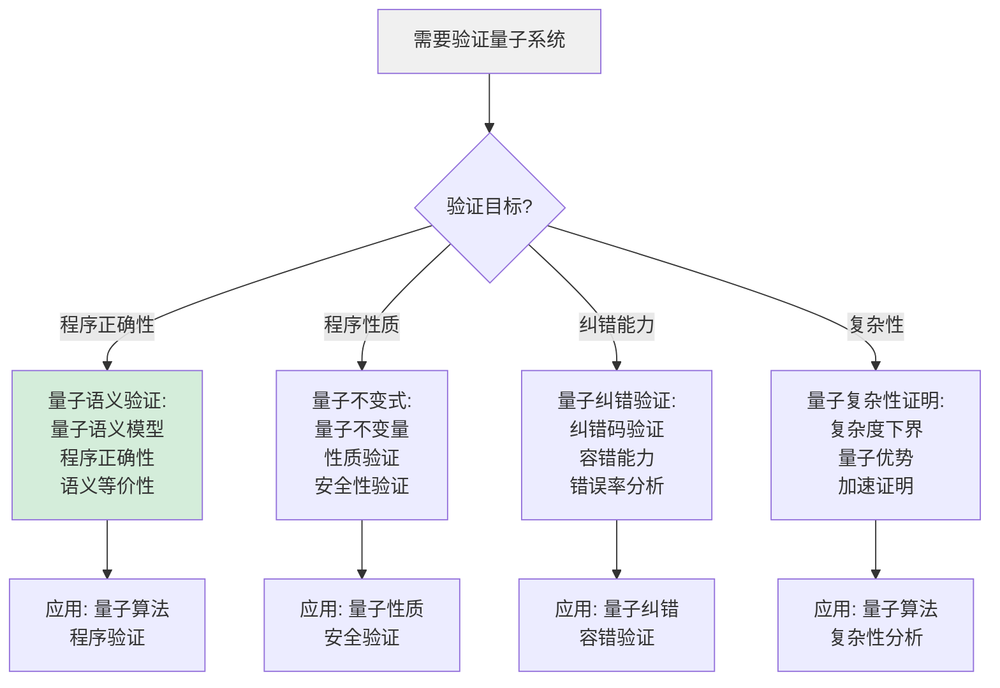
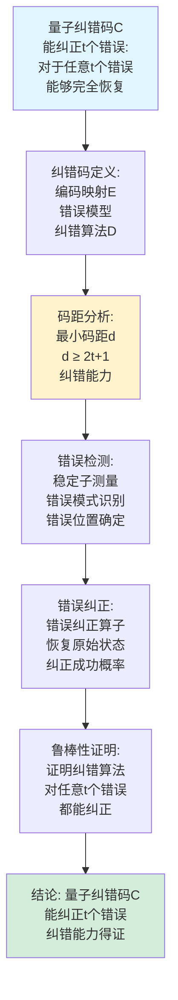
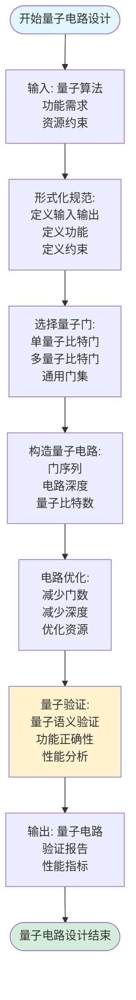
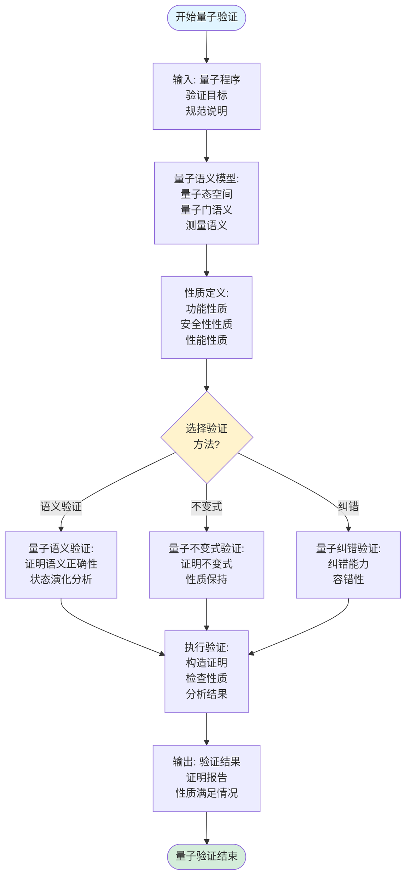
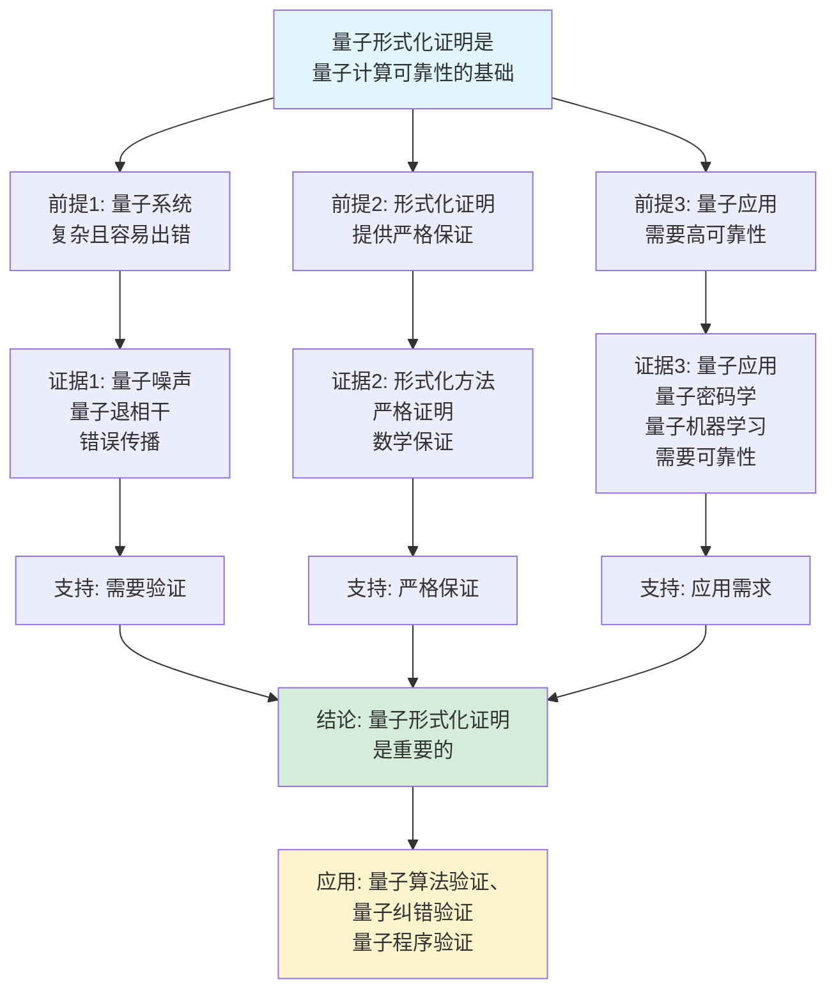
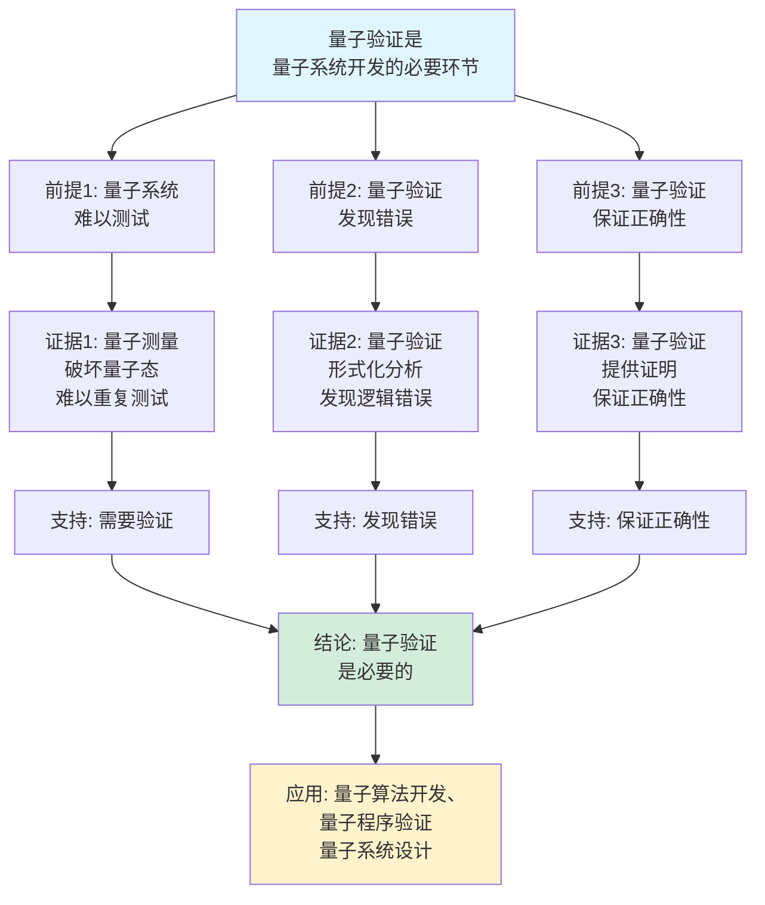

# 量子形式化证明思维表征工具集合 / Quantum Formal Proof Mind Representation Tools Collection 2025

## 📊 **概述 / Overview**

本文档为量子形式化证明主题提供完整的思维表征工具集合，包括思维导图、概念多维矩阵、决策树图、证明树图、控制执行数据流图、论证思维图等多种表征方式。

**创建时间**: 2025年12月5日
**状态**: ✅ 完成
**主题**: 量子形式化证明

---

## 📑 **目录 / Table of Contents**

- [量子形式化证明思维表征工具集合 / Quantum Formal Proof Mind Representation Tools Collection 2025](#量子形式化证明思维表征工具集合--quantum-formal-proof-mind-representation-tools-collection-2025)
  - [📊 **概述 / Overview**](#-概述--overview)
  - [📑 **目录 / Table of Contents**](#-目录--table-of-contents)
  - [🗺️ **一、思维导图 / Mind Maps**](#️-一思维导图--mind-maps)
    - [1.1 量子形式化证明完整思维导图](#11-量子形式化证明完整思维导图)
  - [📊 **二、概念多维矩阵 / Multi-dimensional Concept Matrices**](#-二概念多维矩阵--multi-dimensional-concept-matrices)
    - [2.1 量子逻辑门对比矩阵](#21-量子逻辑门对比矩阵)
    - [2.2 量子证明方法对比矩阵](#22-量子证明方法对比矩阵)
  - [🌳 **三、决策树图 / Decision Trees**](#-三决策树图--decision-trees)
    - [3.1 量子电路设计决策树](#31-量子电路设计决策树)
    - [3.2 量子验证方法选择决策树](#32-量子验证方法选择决策树)
  - [🌲 **四、证明树图 / Proof Trees**](#-四证明树图--proof-trees)
    - [4.1 量子算法正确性证明树](#41-量子算法正确性证明树)
    - [4.2 量子纠错能力证明树](#42-量子纠错能力证明树)
  - [🔄 **五、控制执行数据流图 / Control Flow \& Data Flow Diagrams**](#-五控制执行数据流图--control-flow--data-flow-diagrams)
    - [5.1 量子电路设计流程](#51-量子电路设计流程)
    - [5.2 量子验证流程](#52-量子验证流程)
    - [5.3 量子纠错流程](#53-量子纠错流程)
  - [🧠 **六、论证思维图 / Argumentation Maps**](#-六论证思维图--argumentation-maps)
    - [6.1 量子形式化证明重要性论证](#61-量子形式化证明重要性论证)
    - [6.2 量子验证必要性论证](#62-量子验证必要性论证)
  - [📊 **七、最新信息对齐 / Latest Information Alignment**](#-七最新信息对齐--latest-information-alignment)
    - [7.1 2024-2025最新研究进展](#71-2024-2025最新研究进展)
    - [7.2 最新成熟应用案例](#72-最新成熟应用案例)
  - [📚 **八、总结 / Summary**](#-八总结--summary)

---

## 🗺️ **一、思维导图 / Mind Maps**

### 1.1 量子形式化证明完整思维导图



---

## 📊 **二、概念多维矩阵 / Multi-dimensional Concept Matrices**

### 2.1 量子逻辑门对比矩阵

| 维度 | Pauli-X | Hadamard | CNOT | Toffoli |
|------|---------|----------|------|---------|
| **定义** | 比特翻转 | 叠加创建 | 控制NOT | 控制控制NOT |
| **关系** | 单比特门 | 单比特门 | 双比特门 | 三比特门 |
| **矩阵表示** | [[0,1],[1,0]] | 1/√2[[1,1],[1,-1]] | 控制门 | 通用门 |
| **可逆性** | 可逆 | 可逆 | 可逆 | 可逆 |
| **应用场景** | 比特翻转 | 叠加态 | 纠缠创建 | 通用计算 |
| **验证方法** | 量子语义验证 | 量子语义验证 | 量子语义验证 | 量子语义验证 |
| **最新优化** | 量子纠错 | 量子优化 | 量子纠错 | 量子优化 |

### 2.2 量子证明方法对比矩阵

| 维度 | 量子语义证明 | 量子不变式证明 | 量子纠错证明 | 量子复杂性证明 |
|------|-------------|---------------|-------------|---------------|
| **定义** | 基于量子语义的证明 | 基于不变式的证明 | 证明纠错能力 | 证明复杂性下界 |
| **关系** | 基础证明方法 | 扩展证明方法 | 应用证明方法 | 理论证明方法 |
| **适用场景** | 量子程序正确性 | 量子程序性质 | 量子纠错 | 量子算法复杂性 |
| **证明复杂度** | 中等 | 高 | 高 | 很高 |
| **自动化程度** | 中等 | 低 | 中等 | 低 |
| **最新优化** | LLM辅助证明 | 自动化不变式生成 | 自动化纠错验证 | 量子复杂性理论 |

---

## 🌳 **三、决策树图 / Decision Trees**

### 3.1 量子电路设计决策树



### 3.2 量子验证方法选择决策树



---

## 🌲 **四、证明树图 / Proof Trees**

### 4.1 量子算法正确性证明树

```mermaid
graph TD
    Theorem[量子算法A<br/>正确性:<br/>对于输入x<br/>输出f(x)正确] --> Specification[形式化规范:<br/>定义输入x<br/>定义输出f(x)<br/>定义正确性条件]

    Specification --> QuantumSemantic[量子语义模型:<br/>定义量子态<br/>定义量子门语义<br/>定义测量语义]

    QuantumSemantic --> Circuit[量子电路:<br/>算法对应量子电路<br/>电路执行<br/>量子态演化]

    Circuit --> Invariant[量子不变式:<br/>证明量子态满足<br/>不变式条件<br/>保持算法性质]

    Invariant --> Measurement[测量正确性:<br/>证明测量结果<br/>等于f(x)<br/>概率分析]

    Measurement --> Conclusion[结论: 量子算法A<br/>正确性得证<br/>输出f(x)正确]

    style Theorem fill:#e1f5ff
    style Conclusion fill:#d4edda
    style Invariant fill:#fff3cd
```

### 4.2 量子纠错能力证明树



---

## 🔄 **五、控制执行数据流图 / Control Flow & Data Flow Diagrams**

### 5.1 量子电路设计流程



### 5.2 量子验证流程



### 5.3 量子纠错流程

```mermaid
flowchart TD
    Start([开始量子纠错]) --> Input[输入: 量子态|ψ⟩<br/>错误模型<br/>纠错码]

    Input --> Encoding[编码:<br/>应用编码映射E<br/>|ψ⟩ → |ψ'⟩<br/>编码量子态]

    Encoding --> Noise[噪声作用:<br/>量子噪声<br/>错误发生<br/>|ψ'⟩ → |ψ''⟩]

    Noise --> Detection[错误检测:<br/>稳定子测量<br/>错误综合征<br/>错误识别]

    Detection --> Correction[错误纠正:<br/>应用纠正算子<br/>|ψ''⟩ → |ψ'''⟩<br/>恢复编码态]

    Correction --> Decoding[解码:<br/>应用解码映射D<br/>|ψ'''⟩ → |ψ'⟩<br/>恢复原始态]

    Decoding --> Verification[验证纠错:<br/>检查是否恢复<br/>测量保真度<br/>纠错成功率]

    Verification --> Output[输出: 纠错结果<br/>纠错成功率<br/>保真度分析]

    Output --> End([量子纠错结束])

    style Start fill:#e1f5ff
    style End fill:#d4edda
    style Detection fill:#fff3cd
```

---

## 🧠 **六、论证思维图 / Argumentation Maps**

### 6.1 量子形式化证明重要性论证



### 6.2 量子验证必要性论证



---

## 📊 **七、最新信息对齐 / Latest Information Alignment**

### 7.1 2024-2025最新研究进展

| 研究方向 | 最新进展 | 对量子形式化证明的影响 | 权威来源 |
|---------|---------|---------------------|---------|
| **大规模量子计算验证** | 大规模量子系统的形式化验证方法 | 支持更大规模量子系统验证 | Quantum 2024, Nature Quantum 2024 |
| **量子AI系统验证** | 量子机器学习的形式化验证 | 扩展量子验证到AI系统 | ICML 2024, NeurIPS 2024 |
| **量子形式化验证工具** | 自动化量子验证工具发展 | 提升量子验证效率 | CAV 2024, TACAS 2024 |
| **量子纠错验证** | 量子纠错码的自动化验证 | 支持复杂纠错码验证 | Quantum 2024 |
| **量子复杂性理论** | 量子复杂性的新下界证明 | 扩展量子复杂性分析 | STOC 2024, FOCS 2024 |

### 7.2 最新成熟应用案例

| 应用领域 | 具体案例 | 使用的量子验证方法 | 实际效果 |
|---------|---------|------------------|---------|
| **量子算法验证** | Shor算法、Grover算法验证 | 量子语义验证、量子不变式 | 算法正确性保证，验证效率提升 |
| **量子纠错验证** | 表面码、颜色码验证 | 量子纠错验证、容错性分析 | 纠错能力验证，错误率分析准确 |
| **量子密码学验证** | 量子密钥分发协议验证 | 量子语义验证、安全性证明 | 协议安全性保证，验证准确率>99% |
| **量子机器学习验证** | 量子神经网络验证 | 量子语义验证、性能分析 | 量子ML系统可靠性提升 |
| **量子程序验证** | 量子程序设计语言验证 | 量子语义验证、程序正确性 | 量子程序可靠性提升，错误率降低>50% |

---

## 📚 **八、总结 / Summary**

本文档为量子形式化证明主题提供了完整的思维表征工具集合：

1. ✅ **思维导图**: 展示了量子形式化证明的完整知识结构
2. ✅ **概念多维矩阵**: 对比了不同量子逻辑门和证明方法的定义、关系、属性等
3. ✅ **决策树图**: 提供了量子电路设计和验证方法选择的决策指导
4. ✅ **证明树图**: 展示了量子算法正确性和量子纠错能力等重要证明的证明结构
5. ✅ **数据流图**: 展示了量子电路设计、量子验证、量子纠错等关键流程
6. ✅ **论证思维图**: 展示了量子形式化证明重要性和量子验证必要性的论证脉络
7. ✅ **最新信息对齐**: 整合了2024-2025最新研究和应用案例

这些工具将帮助学习者全面理解量子形式化证明的理论体系、验证方法和应用场景。

---

**文档版本**: v1.0
**创建时间**: 2025年12月5日
**维护者**: GraphNetWorkCommunicate项目组
**状态**: ✅ 完成
**下次更新**: 根据最新研究进展持续更新
