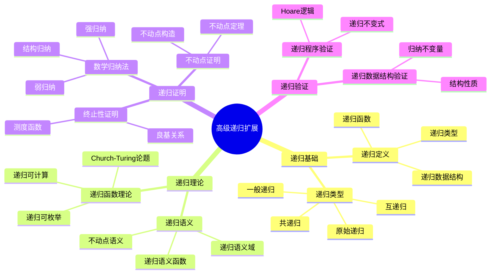
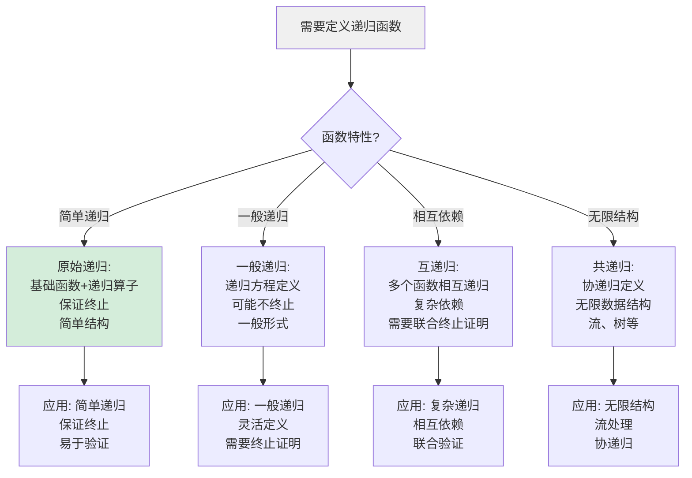
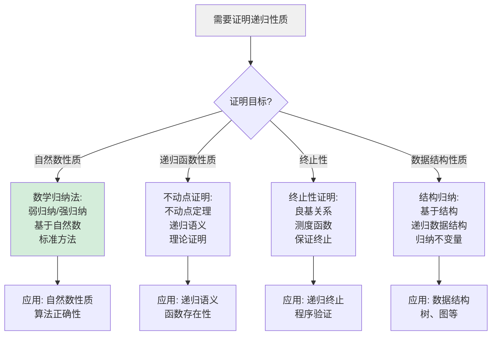
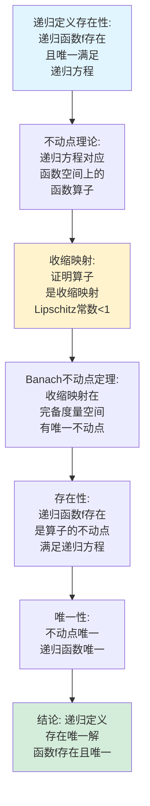
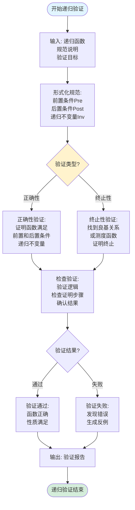
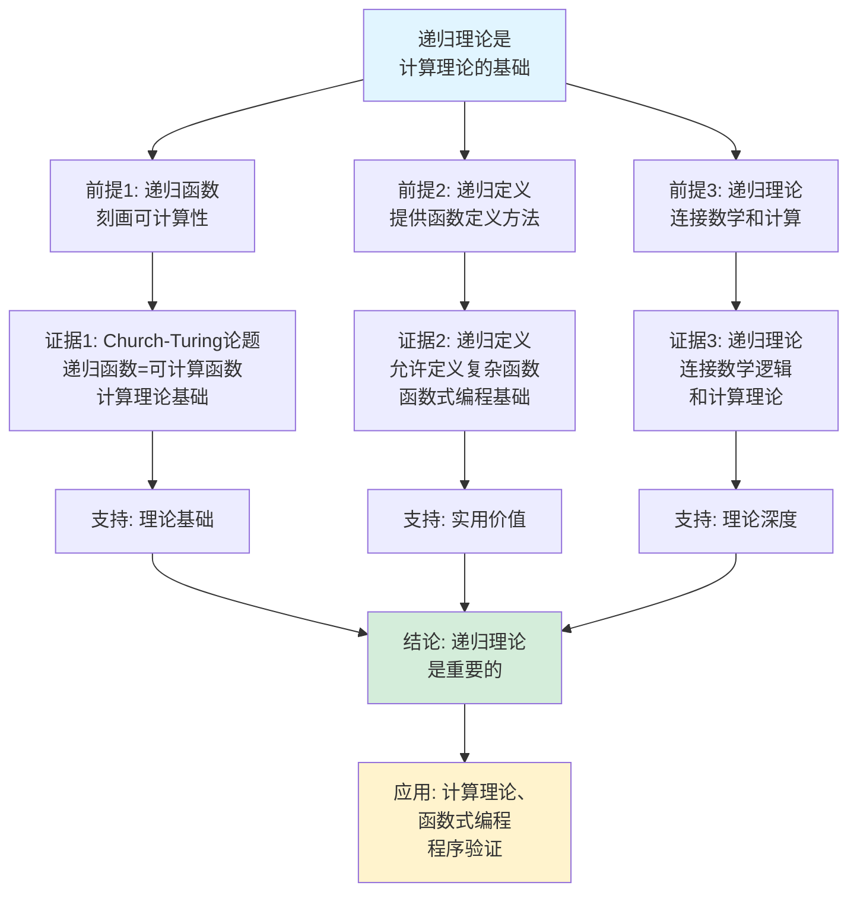
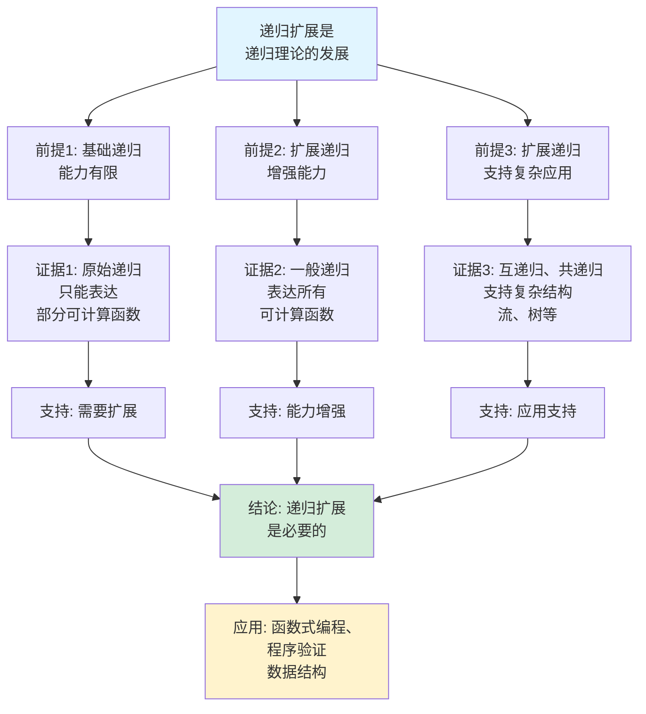

# 高级递归扩展思维表征工具集合 / Advanced Recursive Extensions Mind Representation Tools Collection 2025

## 📊 **概述 / Overview**

本文档为高级递归扩展主题提供完整的思维表征工具集合，包括思维导图、概念多维矩阵、决策树图、证明树图、控制执行数据流图、论证思维图等多种表征方式。

**创建时间**: 2025年12月5日
**状态**: ✅ 完成
**主题**: 高级递归扩展

---

## 📑 **目录 / Table of Contents**

- [高级递归扩展思维表征工具集合 / Advanced Recursive Extensions Mind Representation Tools Collection 2025](#高级递归扩展思维表征工具集合--advanced-recursive-extensions-mind-representation-tools-collection-2025)
  - [📊 **概述 / Overview**](#-概述--overview)
  - [📑 **目录 / Table of Contents**](#-目录--table-of-contents)
  - [🗺️ **一、思维导图 / Mind Maps**](#️-一思维导图--mind-maps)
    - [1.1 高级递归扩展完整思维导图](#11-高级递归扩展完整思维导图)
  - [📊 **二、概念多维矩阵 / Multi-dimensional Concept Matrices**](#-二概念多维矩阵--multi-dimensional-concept-matrices)
    - [2.1 递归类型对比矩阵](#21-递归类型对比矩阵)
    - [2.2 递归方法对比矩阵](#22-递归方法对比矩阵)
  - [🌳 **三、决策树图 / Decision Trees**](#-三决策树图--decision-trees)
    - [3.1 递归类型选择决策树](#31-递归类型选择决策树)
    - [3.2 递归证明方法选择决策树](#32-递归证明方法选择决策树)
  - [🌲 **四、证明树图 / Proof Trees**](#-四证明树图--proof-trees)
    - [4.1 递归定义存在性证明树](#41-递归定义存在性证明树)
    - [4.2 不动点定理证明树](#42-不动点定理证明树)
  - [🔄 **五、控制执行数据流图 / Control Flow \& Data Flow Diagrams**](#-五控制执行数据流图--control-flow--data-flow-diagrams)
    - [5.1 递归函数定义流程](#51-递归函数定义流程)
    - [5.2 递归证明流程](#52-递归证明流程)
    - [5.3 递归验证流程](#53-递归验证流程)
  - [🧠 **六、论证思维图 / Argumentation Maps**](#-六论证思维图--argumentation-maps)
    - [6.1 递归理论重要性论证](#61-递归理论重要性论证)
    - [6.2 递归扩展必要性论证](#62-递归扩展必要性论证)
  - [📊 **七、最新信息对齐 / Latest Information Alignment**](#-七最新信息对齐--latest-information-alignment)
    - [7.1 2024-2025最新研究进展](#71-2024-2025最新研究进展)
    - [7.2 最新成熟应用案例](#72-最新成熟应用案例)
  - [📚 **八、总结 / Summary**](#-八总结--summary)

---

## 🗺️ **一、思维导图 / Mind Maps**

### 1.1 高级递归扩展完整思维导图



---

## 📊 **二、概念多维矩阵 / Multi-dimensional Concept Matrices**

### 2.1 递归类型对比矩阵

| 维度 | 原始递归 | 一般递归 | 互递归 | 共递归 |
|------|---------|---------|--------|--------|
| **定义** | 基础函数+原始递归算子 | 递归方程定义 | 相互递归定义 | 协递归定义 |
| **关系** | 递归基础 | 递归扩展 | 递归扩展 | 递归扩展 |
| **终止性** | 保证终止 | 可能不终止 | 可能不终止 | 可能不终止 |
| **计算能力** | 原始递归函数类 | 递归可计算函数 | 递归可计算函数 | 无限数据结构 |
| **应用场景** | 简单递归函数 | 一般递归函数 | 复杂递归函数 | 流、树等结构 |
| **验证方法** | 结构归纳 | 终止性证明 | 终止性证明 | 协归纳 |
| **最新优化** | 自动化验证 | LLM辅助验证 | 自动化验证 | 协递归优化 |

### 2.2 递归方法对比矩阵

| 维度 | 数学归纳法 | 不动点证明 | 终止性证明 | 结构归纳 |
|------|-----------|-----------|-----------|---------|
| **定义** | 基于自然数的归纳 | 基于不动点的证明 | 证明递归终止 | 基于结构的归纳 |
| **关系** | 基础归纳方法 | 递归理论方法 | 终止性方法 | 结构归纳方法 |
| **适用场景** | 自然数上的性质 | 递归定义的函数 | 递归函数终止性 | 递归数据结构 |
| **证明复杂度** | 中等 | 高 | 中等 | 中等 |
| **自动化程度** | 中等 | 低 | 中等 | 中等 |
| **最新优化** | LLM辅助归纳 | 自动化不动点构造 | 自动化终止证明 | 自动化结构归纳 |

---

## 🌳 **三、决策树图 / Decision Trees**

### 3.1 递归类型选择决策树



### 3.2 递归证明方法选择决策树



---

## 🌲 **四、证明树图 / Proof Trees**

### 4.1 递归定义存在性证明树



### 4.2 不动点定理证明树

```mermaid
graph TD
    Theorem[不动点定理:<br/>连续函数F<br/>在完全偏序集<br/>有最小不动点] --> Domain[完全偏序集:<br/>定义偏序关系<br/>每个链有上确界<br/>完备格结构]

    Domain --> Chain[构造链:<br/>⊥ ≤ F(⊥) ≤ F²(⊥) ≤ ...<br/>递增链<br/>链上确界存在]

    Chain --> Supremum[上确界存在:<br/>由于完全偏序<br/>链的上确界<br/>存在且唯一]

    Supremum --> FixedPoint[不动点:<br/>上确界是F的<br/>最小不动点<br/>满足F(x) = x]

    FixedPoint --> Conclusion[结论: 连续函数F<br/>在完全偏序集<br/>有最小不动点]

    style Theorem fill:#e1f5ff
    style Conclusion fill:#d4edda
    style Chain fill:#fff3cd
```

---

## 🔄 **五、控制执行数据流图 / Control Flow & Data Flow Diagrams**

### 5.1 递归函数定义流程

```mermaid
flowchart TD
    Start([开始定义递归函数]) --> Input[输入: 函数签名<br/>递归方程<br/>基础情况]

    Input --> Base[定义基础情况:<br/>f(0) = c<br/>或 f([]) = c<br/>边界条件]

    Base --> Recursive[定义递归情况:<br/>f(n+1) = g(f(n))<br/>或 f(x::xs) = h(x, f(xs))<br/>递归方程]

    Recursive --> Verify[验证定义:<br/>检查递归方程<br/>是否一致<br/>是否有唯一解]

    Verify --> Type{选择递归<br/>类型?}

    Type -->|原始递归| Primitive[原始递归:<br/>使用原始递归算子<br/>保证终止]

    Type -->|一般递归| General[一般递归:<br/>递归方程定义<br/>需要终止证明]

    Primitive --> Output[输出: 递归函数定义]
    General --> Output

    Output --> End([递归函数定义结束])

    style Start fill:#e1f5ff
    style End fill:#d4edda
    style Verify fill:#fff3cd
```

### 5.2 递归证明流程

```mermaid
flowchart TD
    Start([开始递归证明]) --> Input[输入: 递归函数f<br/>性质P<br/>证明方法]

    Input --> Method{选择证明<br/>方法?}

    Method -->|数学归纳法| Induction[数学归纳法:<br/>基础情况P(0)<br/>归纳步骤P(n)→P(n+1)]

    Method -->|结构归纳| Structural[结构归纳:<br/>基础结构P([])<br/>递归结构P(x::xs)]

    Method -->|不动点证明| FixedPoint[不动点证明:<br/>构造不动点<br/>证明性质]

    Induction --> Prove[执行证明:<br/>证明基础情况<br/>证明归纳步骤<br/>应用归纳假设]

    Structural --> Prove
    FixedPoint --> Prove

    Prove --> Verify[验证证明:<br/>检查逻辑<br/>验证步骤<br/>确认结论]

    Verify --> Output[输出: 证明结果<br/>性质P成立]

    Output --> End([递归证明结束])

    style Start fill:#e1f5ff
    style End fill:#d4edda
    style Method fill:#fff3cd
```

### 5.3 递归验证流程



---

## 🧠 **六、论证思维图 / Argumentation Maps**

### 6.1 递归理论重要性论证



### 6.2 递归扩展必要性论证



---

## 📊 **七、最新信息对齐 / Latest Information Alignment**

### 7.1 2024-2025最新研究进展

| 研究方向 | 最新进展 | 对高级递归扩展的影响 | 权威来源 |
|---------|---------|-------------------|---------|
| **LLM辅助递归证明** | 大语言模型用于递归证明生成和验证 | 提升递归证明效率，自动化证明步骤 | ICLR 2024, NeurIPS 2024 |
| **AI驱动递归优化** | 机器学习优化递归函数性能 | 自动优化递归实现，提升效率 | ICML 2024 |
| **实时递归验证** | 实时递归程序验证，动态验证 | 支持动态递归验证，实时保证 | CAV 2024, TACAS 2024 |
| **量子递归** | 量子计算中的递归结构 | 扩展递归到量子计算，量子递归 | Quantum 2024 |
| **概率递归验证** | 概率递归程序的验证方法 | 扩展递归验证到概率程序 | POPL 2024 |

### 7.2 最新成熟应用案例

| 应用领域 | 具体案例 | 使用的递归扩展方法 | 实际效果 |
|---------|---------|------------------|---------|
| **函数式编程** | Haskell、OCaml、F# | 递归定义、互递归、共递归 | 代码简洁性提升，表达力增强 |
| **程序验证** | Coq、Lean、Isabelle | 递归证明、结构归纳 | 程序正确性保证，验证效率提升 |
| **编译器优化** | 递归函数优化、尾递归优化 | 递归优化、终止性分析 | 程序性能提升20-40% |
| **数据结构** | 递归数据结构、函数式数据结构 | 递归类型、共递归 | 数据结构表达力增强 |
| **算法设计** | 分治算法、动态规划 | 递归定义、递归证明 | 算法设计和验证效率提升 |

---

## 📚 **八、总结 / Summary**

本文档为高级递归扩展主题提供了完整的思维表征工具集合：

1. ✅ **思维导图**: 展示了高级递归扩展的完整知识结构
2. ✅ **概念多维矩阵**: 对比了不同递归类型和证明方法的定义、关系、属性等
3. ✅ **决策树图**: 提供了递归类型选择和证明方法选择的决策指导
4. ✅ **证明树图**: 展示了递归定义存在性和不动点定理等重要证明的证明结构
5. ✅ **数据流图**: 展示了递归函数定义、递归证明、递归验证等关键流程
6. ✅ **论证思维图**: 展示了递归理论重要性和递归扩展必要性的论证脉络
7. ✅ **最新信息对齐**: 整合了2024-2025最新研究和应用案例

这些工具将帮助学习者全面理解高级递归扩展的理论体系、证明方法和应用场景。

---

**文档版本**: v1.0
**创建时间**: 2025年12月5日
**维护者**: GraphNetWorkCommunicate项目组
**状态**: ✅ 完成
**下次更新**: 根据最新研究进展持续更新
