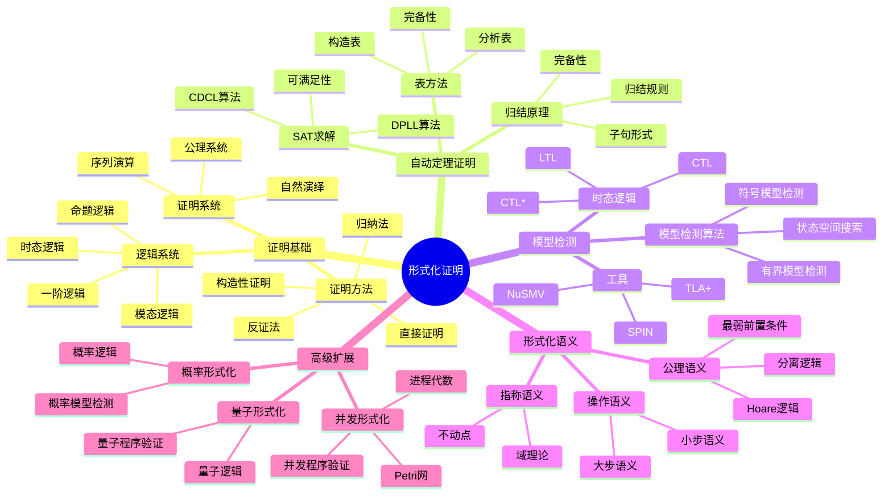
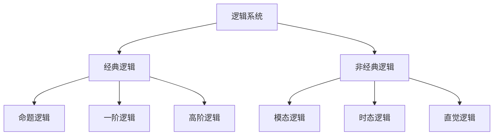
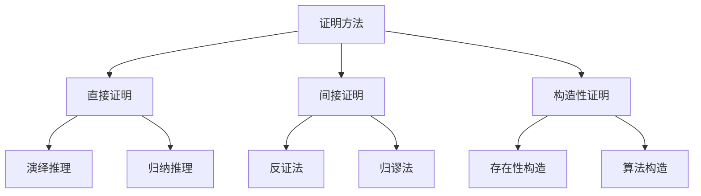
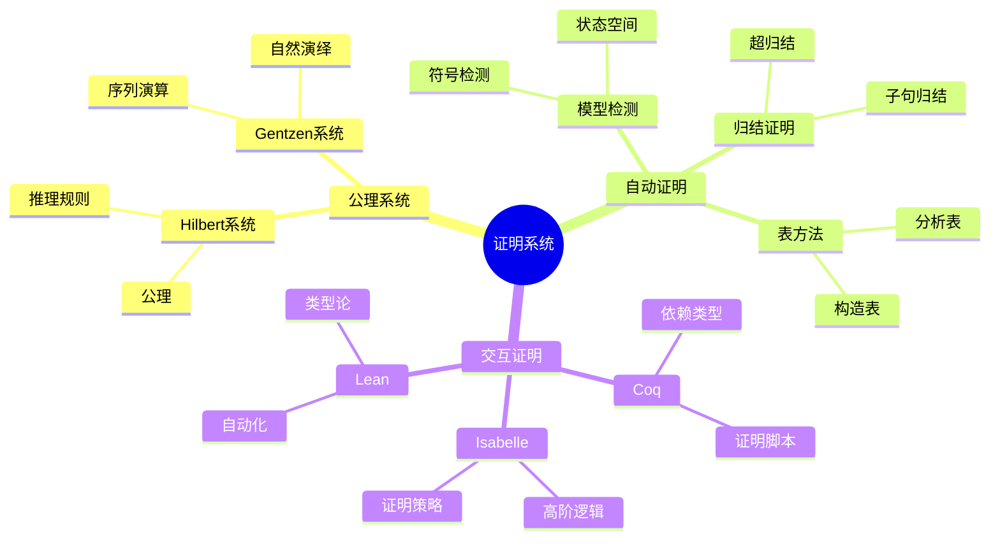
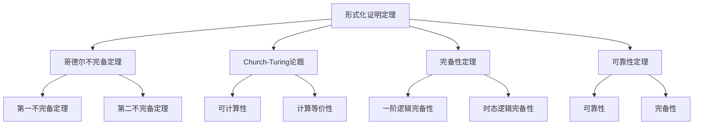
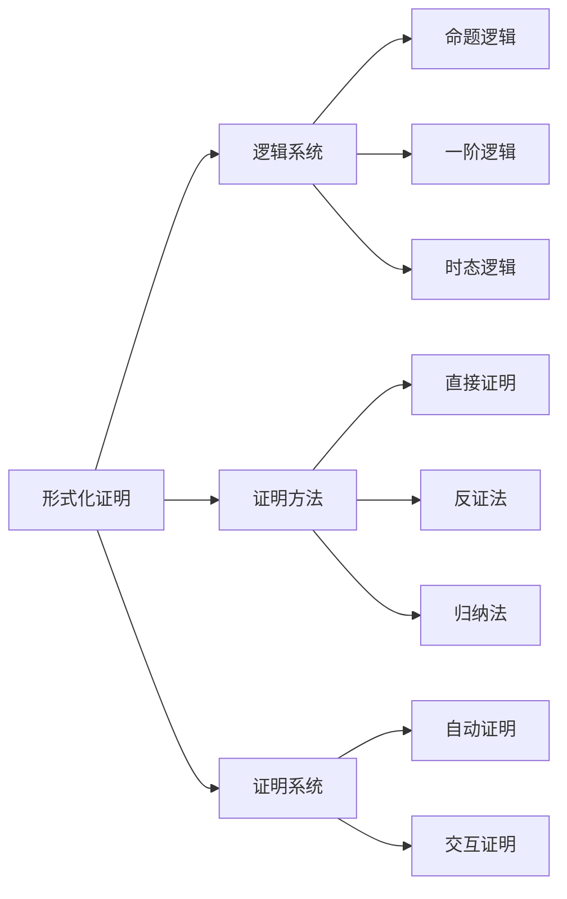
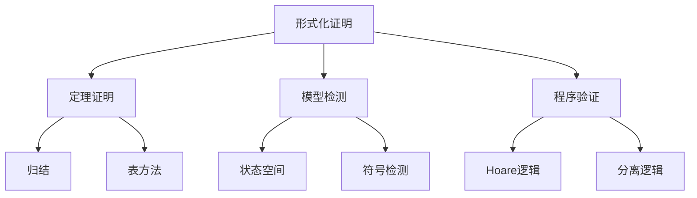
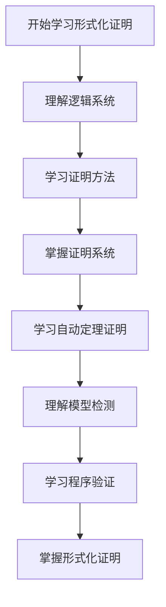
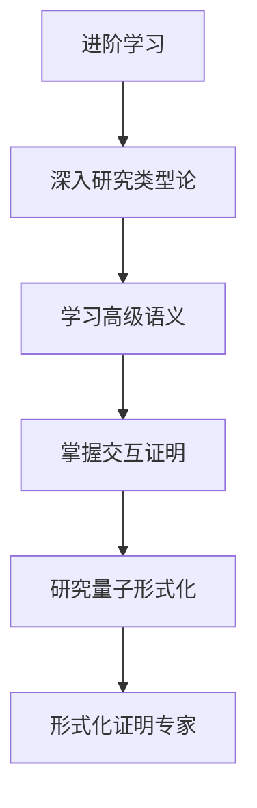

# 形式化证明模块知识结构思维导图 / Formal Proof Module Knowledge Structure Mind Map

## 📚 **概述 / Overview**

本文档提供形式化证明模块的完整知识结构思维导图，帮助理解形式化证明知识的层次结构和相互关系。

**创建时间**: 2025年1月
**模块**: 形式化证明
**状态**: 🚀 持续更新中

---

## 🗺️ **一、整体知识结构 / Overall Knowledge Structure**

---

## 📊 **二、核心概念层次结构 / Core Concept Hierarchy**

### 2.1 逻辑系统层次

### 2.2 证明方法层次

---

## 🔬 **三、证明系统分类结构 / Proof System Classification Structure**

### 3.1 证明系统分类

### 3.2 证明系统特性对比

| 证明系统 | 类型 | 自动化程度 | 表达能力 | 适用场景 |
|---------|------|-----------|---------|---------|
| **归结证明** | 自动 | 高 | 一阶逻辑 | 定理证明 |
| **表方法** | 自动 | 中 | 模态逻辑 | 逻辑验证 |
| **模型检测** | 自动 | 高 | 时态逻辑 | 系统验证 |
| **Coq** | 交互 | 中 | 依赖类型 | 程序验证 |
| **Isabelle** | 交互 | 中 | 高阶逻辑 | 数学证明 |

---

## 📐 **四、重要定理结构 / Important Theorems Structure**

### 4.1 定理分类

### 4.2 定理应用领域

| 定理 | 应用领域 | 具体应用 |
|------|---------|---------|
| **哥德尔不完备定理** | 逻辑学 | 形式化系统局限性 |
| **Church-Turing论题** | 计算理论 | 可计算性分析 |
| **完备性定理** | 逻辑学 | 逻辑系统完备性 |
| **可靠性定理** | 证明系统 | 证明正确性 |

---

## 🔗 **五、知识关联网络 / Knowledge Association Network**

### 5.1 概念关联图

### 5.2 方法关联图

---

## 📚 **六、学习路径 / Learning Path**

### 6.1 基础学习路径

### 6.2 进阶学习路径

---

## 🎯 **七、应用领域映射 / Application Domain Mapping**

### 7.1 应用领域

| 形式化证明概念 | 应用领域 | 具体应用 |
|--------------|---------|---------|
| **定理证明** | 数学证明 | 自动证明、交互证明 |
| **模型检测** | 系统验证 | 协议验证、硬件验证 |
| **程序验证** | 软件工程 | 程序正确性、安全验证 |
| **形式化语义** | 编程语言 | 语义定义、类型系统 |

---

## 📋 **八、知识检查清单 / Knowledge Checklist**

### 8.1 基础概念

- [ ] 理解逻辑系统（命题、一阶、时态）
- [ ] 掌握证明方法（直接、反证、归纳）
- [ ] 理解证明系统（公理、自然演绎）
- [ ] 掌握形式化语义（操作、指称、公理）

### 8.2 自动定理证明

- [ ] 理解归结原理
- [ ] 掌握表方法
- [ ] 了解SAT求解
- [ ] 理解自动证明工具

### 8.3 模型检测

- [ ] 理解时态逻辑（LTL、CTL）
- [ ] 掌握模型检测算法
- [ ] 了解模型检测工具
- [ ] 理解模型检测应用

### 8.4 程序验证

- [ ] 理解Hoare逻辑
- [ ] 掌握分离逻辑
- [ ] 了解程序验证工具
- [ ] 理解程序验证应用

---

## 🔗 **相关链接 / Related Links**

- [形式化证明README](README.md)
- [证明基础](01-证明基础.md)
- [自动定理证明](02-自动定理证明.md)
- [模型检测](03-模型检测.md)
- [形式化语义](04-形式化语义.md)
- [思维表征工具](思维表征工具-形式化证明.md)

---

**文档版本**: v1.0
**创建时间**: 2025年1月
**最后更新**: 2025年1月
**维护者**: GraphNetWorkCommunicate项目组
