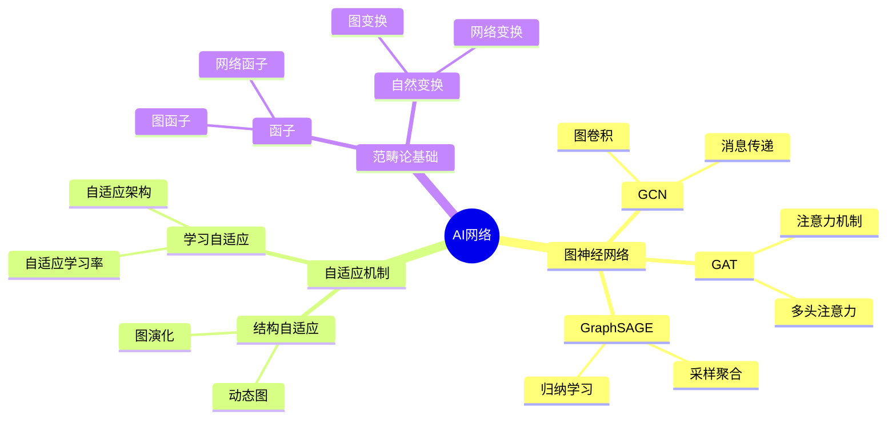
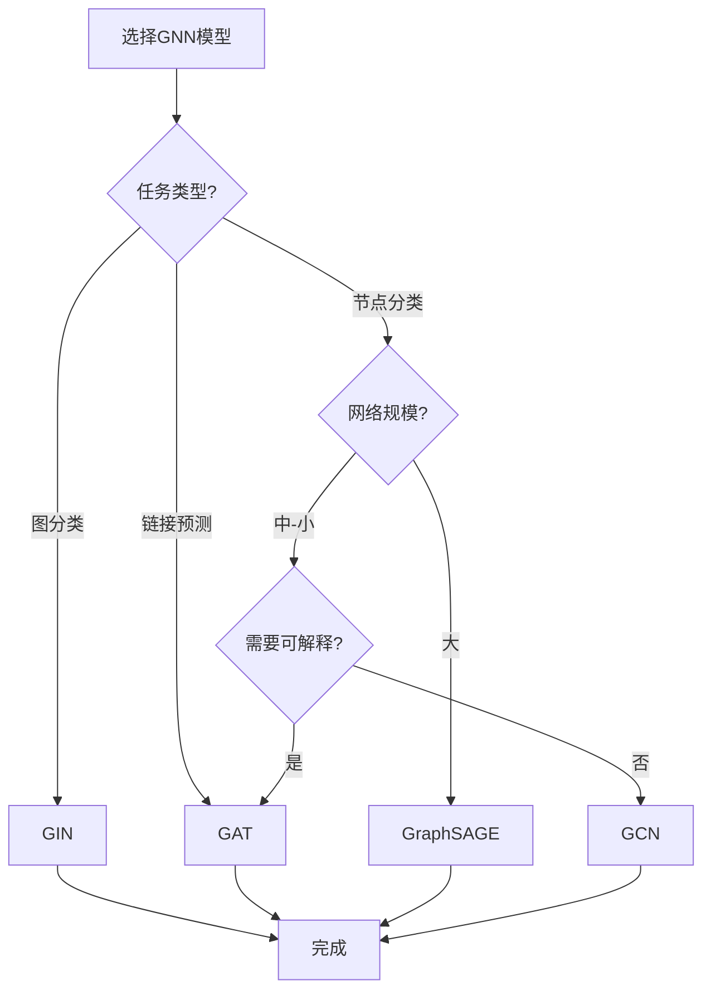

# AI网络与自适应范畴思维表征工具 / AI Networks and Adaptive Categories Mental Representation Tools

## 📚 **概述 / Overview**

本文档提供AI网络与自适应范畴模块的多种思维表征工具，包括思维导图、对比矩阵、决策树、逻辑路径和概念地图，帮助更好地理解和应用AI网络知识。

**创建时间**: 2025年1月
**模块**: AI网络与自适应范畴
**状态**: 🚀 持续更新中

---

## 🗺️ **一、思维导图 / Mind Maps**

### 1.1 AI网络核心概念思维导图

---

## 📊 **二、对比矩阵 / Comparison Matrices**

### 2.1 图神经网络模型对比矩阵

| 模型 | 类型 | 消息传递 | 注意力 | 适用规模 | 特点 | 应用场景 |
|------|------|---------|--------|---------|------|---------|
| **GCN** | 卷积 | 固定聚合 | 无 | 中-大 | 简单、高效 | 节点分类 |
| **GAT** | 注意力 | 加权聚合 | 有 | 中 | 可解释、灵活 | 节点分类、链接预测 |
| **GraphSAGE** | 采样 | 采样聚合 | 无 | 大 | 归纳学习、可扩展 | 大规模网络 |
| **GIN** | 同构 | 可学习聚合 | 无 | 中 | 表达能力最强 | 图分类 |
| **Graph Transformer** | Transformer | 全连接 | 有 | 中 | 长距离依赖 | 复杂图结构 |

**选择指南**：

- **节点分类**：GCN或GAT
- **大规模网络**：GraphSAGE
- **图分类**：GIN
- **复杂结构**：Graph Transformer
- **可解释性**：GAT

---

## 🌳 **三、决策树 / Decision Trees**

### 3.1 图神经网络模型选择决策树

---

**文档版本**: v1.0
**创建时间**: 2025年1月
**最后更新**: 2025年1月
**维护者**: GraphNetWorkCommunicate项目组
