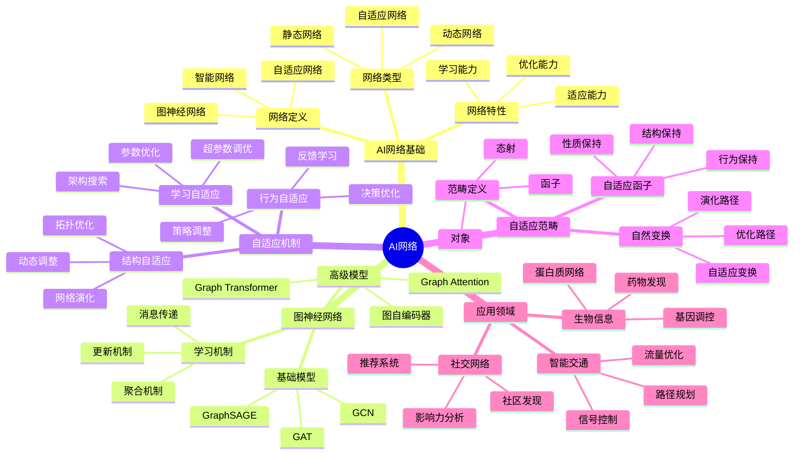
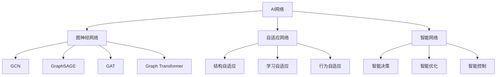
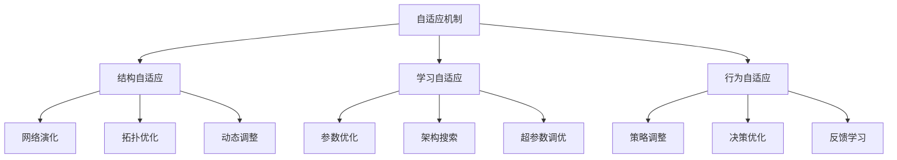
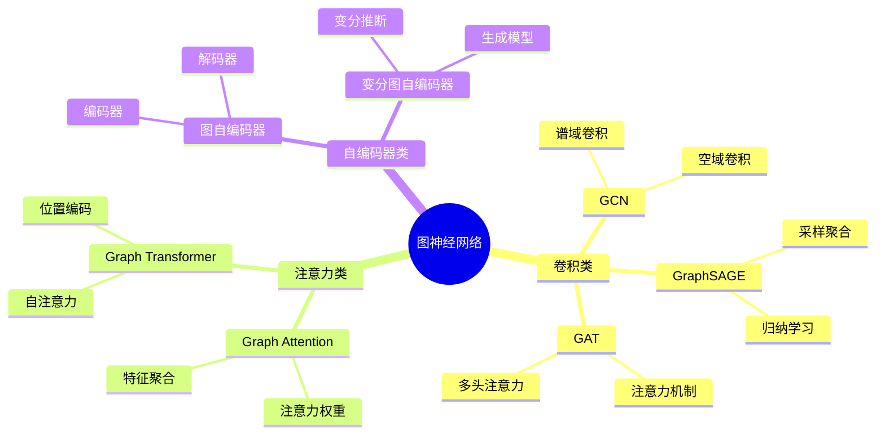
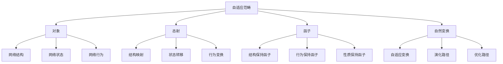
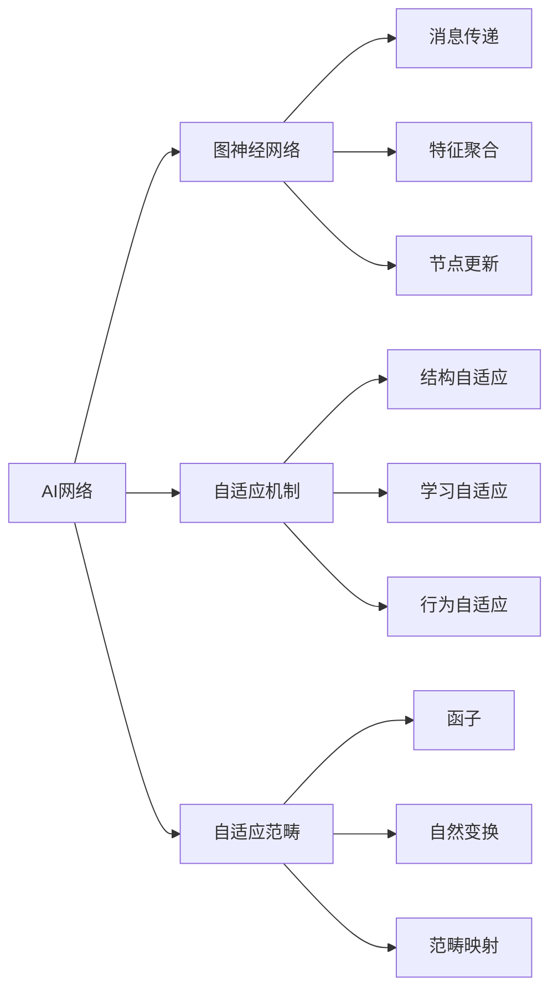
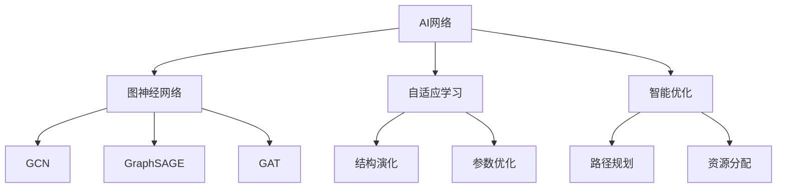
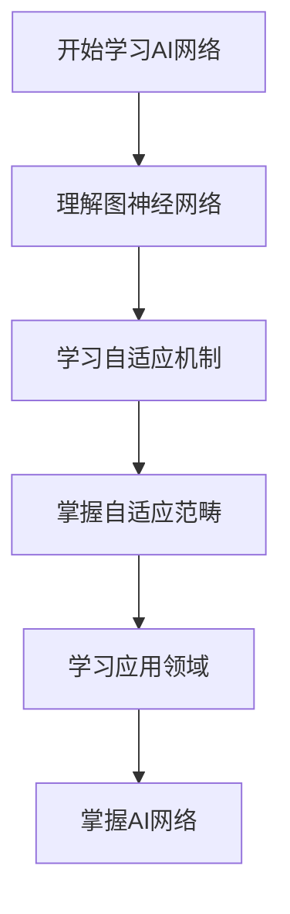
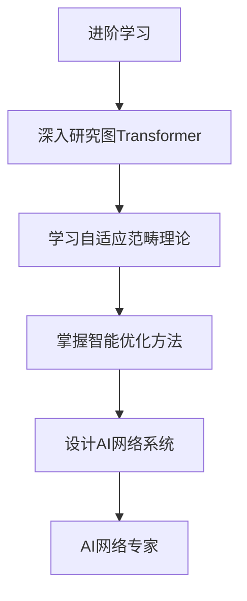

# AI网络与自适应范畴模块知识结构思维导图 / AI Networks and Adaptive Categories Module Knowledge Structure Mind Map

## 📚 **概述 / Overview**

本文档提供AI网络与自适应范畴模块的完整知识结构思维导图，帮助理解AI网络知识的层次结构和相互关系。

**创建时间**: 2025年1月
**模块**: AI网络与自适应范畴
**状态**: 🚀 持续更新中

---

## 🗺️ **一、整体知识结构 / Overall Knowledge Structure**

---

## 📊 **二、核心概念层次结构 / Core Concept Hierarchy**

### 2.1 网络类型层次

### 2.2 自适应机制层次

---

## 🔬 **三、图神经网络分类结构 / Graph Neural Network Classification Structure**

### 3.1 GNN模型分类

### 3.2 GNN模型对比

| 模型 | 类型 | 复杂度 | 适用场景 | 特点 |
|------|------|--------|---------|------|
| **GCN** | 卷积 | $O(E)$ | 节点分类 | 简单、高效 |
| **GraphSAGE** | 采样 | $O(S \cdot E)$ | 大规模图 | 归纳学习 |
| **GAT** | 注意力 | $O(K \cdot E)$ | 异质图 | 自适应权重 |
| **Graph Transformer** | Transformer | $O(V^2)$ | 小规模图 | 全局注意力 |

---

## 📐 **四、自适应范畴结构 / Adaptive Category Structure**

### 4.1 范畴定义

### 4.2 自适应机制

| 机制类型 | 定义 | 应用 | 特点 |
|---------|------|------|------|
| **结构自适应** | 网络结构动态调整 | 拓扑优化 | 适应环境变化 |
| **学习自适应** | 学习参数动态优化 | 模型训练 | 提高学习效率 |
| **行为自适应** | 行为策略动态调整 | 决策优化 | 适应任务需求 |

---

## 🔗 **五、知识关联网络 / Knowledge Association Network**

### 5.1 概念关联图

### 5.2 方法关联图

---

## 📚 **六、学习路径 / Learning Path**

### 6.1 基础学习路径

### 6.2 进阶学习路径

---

## 🎯 **七、应用领域映射 / Application Domain Mapping**

### 7.1 应用领域

| AI网络概念 | 应用领域 | 具体应用 |
|-----------|---------|---------|
| **图神经网络** | 社交网络 | 节点分类、链接预测 |
| **自适应机制** | 智能交通 | 路径优化、信号控制 |
| **自适应范畴** | 系统优化 | 结构优化、性能优化 |

---

## 📋 **八、知识检查清单 / Knowledge Checklist**

### 8.1 基础概念

- [ ] 理解AI网络的定义和类型
- [ ] 掌握图神经网络模型
- [ ] 理解自适应机制
- [ ] 掌握自适应范畴理论

### 8.2 图神经网络

- [ ] 理解GCN、GraphSAGE、GAT
- [ ] 掌握Graph Transformer
- [ ] 了解图自编码器
- [ ] 理解GNN应用

### 8.3 自适应机制

- [ ] 理解结构自适应
- [ ] 掌握学习自适应
- [ ] 了解行为自适应
- [ ] 理解自适应应用

---

## 🔗 **相关链接 / Related Links**

- [AI网络README](README.md)
- [AI网络元模型](00-AI网络元模型.md)
- [思维表征工具](思维表征工具-AI网络.md)

---

**文档版本**: v1.0
**创建时间**: 2025年1月
**最后更新**: 2025年1月
**维护者**: GraphNetWorkCommunicate项目组
