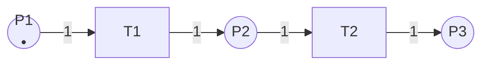
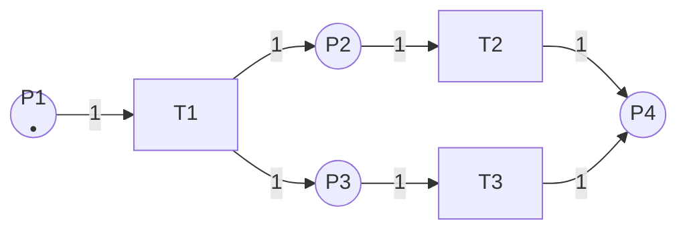
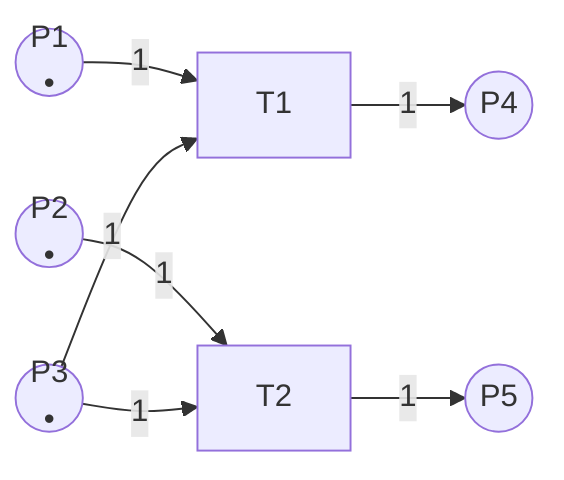
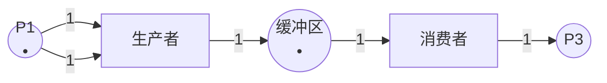

# Petri网的定义 / Petri Net Definition

## 📚 **概述 / Overview**

本文档介绍Petri网的形式化定义和基本概念。Petri网是一种用于描述并发系统、分布式系统和异步系统的数学模型，由德国数学家Carl Adam Petri在1962年提出。本文档不仅提供严格的形式化定义，还包含历史背景、直观解释、图形示例、与其他形式化方法的对比分析，以及Petri网的优势和局限性。

---

## 📑 **目录 / Table of Contents**

- [Petri网的定义 / Petri Net Definition](#petri网的定义--petri-net-definition)
  - [📚 **概述 / Overview**](#-概述--overview)
  - [📑 **目录 / Table of Contents**](#-目录--table-of-contents)
  - [0. 历史背景与发展 / Historical Background and Development](#0-历史背景与发展--historical-background-and-development)
    - [0.1 Carl Adam Petri的生平 / Biography of Carl Adam Petri](#01-carl-adam-petri的生平--biography-of-carl-adam-petri)
    - [0.2 Petri网的提出 / The Introduction of Petri Nets](#02-petri网的提出--the-introduction-of-petri-nets)
    - [0.3 发展历程 / Development History](#03-发展历程--development-history)
    - [0.4 影响与意义 / Impact and Significance](#04-影响与意义--impact-and-significance)
  - [1. Petri网的定义 / Petri Net Definition](#1-petri网的定义--petri-net-definition)
    - [1.1 基本Petri网 / Basic Petri Net](#11-基本petri网--basic-petri-net)
    - [1.2 前集和后集 / Pre-set and Post-set](#12-前集和后集--pre-set-and-post-set)
    - [1.3 直观解释 / Intuitive Explanation](#13-直观解释--intuitive-explanation)
      - [比喻：餐厅点餐系统 / Analogy: Restaurant Ordering System](#比喻餐厅点餐系统--analogy-restaurant-ordering-system)
      - [核心思想 / Core Ideas](#核心思想--core-ideas)
    - [1.4 图形示例 / Graphical Examples](#14-图形示例--graphical-examples)
      - [示例1.1：简单的顺序流程 / Simple Sequential Process](#示例11简单的顺序流程--simple-sequential-process)
      - [示例1.2：并发流程 / Concurrent Process](#示例12并发流程--concurrent-process)
      - [示例1.3：资源竞争与冲突 / Resource Competition and Conflict](#示例13资源竞争与冲突--resource-competition-and-conflict)
      - [示例1.4：生产者-消费者系统 / Producer-Consumer System](#示例14生产者-消费者系统--producer-consumer-system)
  - [2. 与其他形式化方法的对比 / Comparison with Other Formal Methods](#2-与其他形式化方法的对比--comparison-with-other-formal-methods)
    - [2.1 与有限状态机的对比 / Comparison with Finite State Machines](#21-与有限状态机的对比--comparison-with-finite-state-machines)
      - [基本区别 / Basic Differences](#基本区别--basic-differences)
      - [详细对比 / Detailed Comparison](#详细对比--detailed-comparison)
      - [适用场景 / Applicable Scenarios](#适用场景--applicable-scenarios)
    - [2.2 与进程代数的对比 / Comparison with Process Algebras](#22-与进程代数的对比--comparison-with-process-algebras)
      - [基本区别 / Basic Differences](#基本区别--basic-differences-1)
      - [详细对比 / Detailed Comparison](#详细对比--detailed-comparison-1)
      - [适用场景 / Applicable Scenarios](#适用场景--applicable-scenarios-1)
    - [2.3 与时序逻辑的对比 / Comparison with Temporal Logic](#23-与时序逻辑的对比--comparison-with-temporal-logic)
      - [基本区别 / Basic Differences](#基本区别--basic-differences-2)
      - [关系说明 / Relationship Explanation](#关系说明--relationship-explanation)
      - [适用场景 / Applicable Scenarios](#适用场景--applicable-scenarios-2)
  - [3. Petri网的优势与局限性 / Advantages and Limitations](#3-petri网的优势与局限性--advantages-and-limitations)
    - [3.1 优势 / Advantages](#31-优势--advantages)
      - [1. 直观的图形表示 / Intuitive Graphical Representation](#1-直观的图形表示--intuitive-graphical-representation)
      - [2. 天然支持并发建模 / Natural Support for Concurrent Modeling](#2-天然支持并发建模--natural-support-for-concurrent-modeling)
      - [3. 丰富的分析技术 / Rich Analysis Techniques](#3-丰富的分析技术--rich-analysis-techniques)
      - [4. 形式化基础 / Formal Foundation](#4-形式化基础--formal-foundation)
      - [5. 广泛的应用领域 / Wide Range of Applications](#5-广泛的应用领域--wide-range-of-applications)
    - [3.2 局限性 / Limitations](#32-局限性--limitations)
      - [1. 状态空间爆炸问题 / State Space Explosion Problem](#1-状态空间爆炸问题--state-space-explosion-problem)
      - [2. 时间建模能力有限 / Limited Time Modeling Capability](#2-时间建模能力有限--limited-time-modeling-capability)
      - [3. 概率和随机性建模 / Probabilistic and Stochastic Modeling](#3-概率和随机性建模--probabilistic-and-stochastic-modeling)
      - [4. 数据建模能力有限 / Limited Data Modeling Capability](#4-数据建模能力有限--limited-data-modeling-capability)
      - [5. 可读性随规模下降 / Readability Decreases with Scale](#5-可读性随规模下降--readability-decreases-with-scale)
    - [3.3 适用场景 / Applicable Scenarios](#33-适用场景--applicable-scenarios)
      - [适合使用Petri网的场景 / Scenarios Suitable for Petri Nets](#适合使用petri网的场景--scenarios-suitable-for-petri-nets)
      - [不适合使用Petri网的场景 / Scenarios Not Suitable for Petri Nets](#不适合使用petri网的场景--scenarios-not-suitable-for-petri-nets)
  - [📚 **参考文献 / References**](#-参考文献--references)

---

## 0. 历史背景与发展 / Historical Background and Development

### 0.1 Carl Adam Petri的生平 / Biography of Carl Adam Petri

**Carl Adam Petri**（1926-2010）是一位德国数学家和计算机科学家，以提出Petri网理论而闻名于世。Petri对并发过程建模的兴趣始于他13岁时（1939年），当时他设计了一个图形工具来表示化学过程，这为后来Petri网的发展奠定了基础。

### 0.2 Petri网的提出 / The Introduction of Petri Nets

Petri网的概念正式提出于1962年，在Petri的博士论文《Kommunikation mit Automaten》（与自动机通信）中。这篇论文在德国达姆施塔特工业大学（Technische Universität Darmstadt）完成，为并发、异步和分布式系统的分析和建模提供了数学框架。

**关键时间节点**：

- **1939年**：Petri在13岁时设计了表示化学过程的图形工具（Petri网的前身）
- **1962年**：Petri在博士论文中正式提出Petri网理论
- **1970年代**：Petri网开始广泛应用于计算机科学领域
- **1980年代至今**：Petri网扩展到时间Petri网、着色Petri网、随机Petri网等多种变体

### 0.3 发展历程 / Development History

Petri网理论的发展经历了几个重要阶段：

1. **基础理论阶段（1962-1970）**：建立基本Petri网的形式化定义和基本性质
2. **扩展理论阶段（1970-1990）**：发展出时间Petri网、着色Petri网、层次Petri网等扩展
3. **应用扩展阶段（1990-2010）**：广泛应用于工作流建模、协议验证、分布式系统等领域
4. **现代发展阶段（2010至今）**：结合现代技术，应用于IoT、边缘计算、实时系统等新兴领域

### 0.4 影响与意义 / Impact and Significance

Petri网理论对并行和分布式计算领域产生了深远影响，推动了复杂系统和工作流管理的研究。Petri网已被广泛应用于：

- **计算机科学**：并发系统建模、协议验证、软件工程
- **工程领域**：工作流管理、制造系统、控制系统
- **生物信息学**：生物网络建模、基因调控网络分析
- **社会科学**：业务流程建模、组织行为分析

---

## 1. Petri网的定义 / Petri Net Definition

### 1.1 基本Petri网 / Basic Petri Net

**定义 1.1** (基本Petri网 / Basic Petri Net)

一个**Petri网**是一个五元组：
$$N = (P, T, F, W, M_0)$$

其中：

- $P = \{p_1, p_2, \ldots, p_m\}$ 是**库所集**（Place Set），表示系统状态
- $T = \{t_1, t_2, \ldots, t_n\}$ 是**变迁集**（Transition Set），表示系统事件或动作
- $F \subseteq (P \times T) \cup (T \times P)$ 是**流关系**（Flow Relation），表示库所和变迁之间的连接
- $W: F \to \mathbb{N}^+$ 是**权重函数**（Weight Function），表示边的权重（通常默认为1）
- $M_0: P \to \mathbb{N}$ 是**初始标识**（Initial Marking），表示系统的初始状态

**形式化约束**：

- $P \cap T = \emptyset$（库所和变迁不相交）
- $P \cup T \neq \emptyset$（至少有一个库所或变迁）
- $F \neq \emptyset$（至少有一条边）

### 1.2 前集和后集 / Pre-set and Post-set

**定义 1.2** (前集和后集 / Pre-set and Post-set)

对于Petri网 $N = (P, T, F, W, M_0)$：

- 对于变迁 $t \in T$，其**前集**（Pre-set）为：$\prescript{}{}{t} = \{p \in P \mid (p, t) \in F\}$
- 对于变迁 $t \in T$，其**后集**（Post-set）为：$t^{\bullet} = \{p \in P \mid (t, p) \in F\}$
- 对于库所 $p \in P$，其**前集**为：$\prescript{}{}{p} = \{t \in T \mid (t, p) \in F\}$
- 对于库所 $p \in P$，其**后集**为：$p^{\bullet} = \{t \in T \mid (p, t) \in F\}$

**直观理解**：

- **前集**：指向某个节点（库所或变迁）的所有输入节点
- **后集**：从某个节点（库所或变迁）出发的所有输出节点
- 前集和后集的概念对于理解Petri网的执行语义和结构分析至关重要

### 1.3 直观解释 / Intuitive Explanation

Petri网可以用一个简单的比喻来理解：**餐厅点餐系统**。

#### 比喻：餐厅点餐系统 / Analogy: Restaurant Ordering System

想象一个餐厅的点餐流程：

1. **库所（Place）**：代表系统的状态或资源
   - 例如："等待点餐"、"正在准备"、"已完成"
   - 库所中的**令牌（Token）**表示该状态中有多少个"订单"或"资源"

2. **变迁（Transition）**：代表事件或动作
   - 例如："接收订单"、"开始制作"、"完成制作"
   - 变迁的触发需要满足条件：输入库所中有足够的令牌

3. **流关系（Flow Relation）**：表示状态之间的转换关系
   - 从"等待点餐"库所到"接收订单"变迁，表示订单可以被接收
   - 从"接收订单"变迁到"正在准备"库所，表示订单进入准备状态

4. **标识（Marking）**：表示系统在某个时刻的状态
   - 例如：初始状态可能是"等待点餐"库所有3个令牌（3个待处理的订单）

#### 核心思想 / Core Ideas

Petri网的核心思想是：

- **状态与事件分离**：库所表示状态，变迁表示事件，这种分离使得模型更加清晰
- **并发建模**：多个变迁可以同时触发（如果它们不冲突），天然支持并发建模
- **资源管理**：令牌可以表示资源，变迁的触发需要消耗和产生资源
- **图形化表示**：Petri网用图形表示，直观易懂，便于理解和分析

### 1.4 图形示例 / Graphical Examples

#### 示例1.1：简单的顺序流程 / Simple Sequential Process

这是一个最简单的Petri网，表示一个顺序流程：



**说明**：

- 初始状态：$P1$ 有1个令牌
- 当 $T1$ 触发时：从 $P1$ 消耗1个令牌，在 $P2$ 产生1个令牌
- 当 $T2$ 触发时：从 $P2$ 消耗1个令牌，在 $P3$ 产生1个令牌
- 这表示一个简单的顺序流程：状态1 → 事件1 → 状态2 → 事件2 → 状态3

#### 示例1.2：并发流程 / Concurrent Process

这个Petri网展示了并发执行：



**说明**：

- 初始状态：$P1$ 有1个令牌
- 当 $T1$ 触发时：从 $P1$ 消耗1个令牌，同时在 $P2$ 和 $P3$ 各产生1个令牌
- 之后，$T2$ 和 $T3$ 可以**并发执行**（因为它们不共享输入库所）
- 最终，两个流程在 $P4$ 处**同步**（$P4$ 需要两个令牌才能继续）

**特点**：这个例子展示了Petri网的核心优势——天然支持并发和同步建模。

#### 示例1.3：资源竞争与冲突 / Resource Competition and Conflict

这个Petri网展示了资源竞争和冲突：



**说明**：

- 初始状态：$P1$、$P2$、$P3$ 各有1个令牌
- $T1$ 需要 $P1$ 和 $P3$ 的令牌
- $T2$ 需要 $P2$ 和 $P3$ 的令牌
- $P3$ 的令牌被两个变迁共享，形成**冲突**（conflict）
- 在某个时刻，只能有一个变迁触发（$T1$ 或 $T2$），另一个必须等待

**特点**：这个例子展示了Petri网如何建模资源竞争和冲突解决。

#### 示例1.4：生产者-消费者系统 / Producer-Consumer System

这是一个经典的生产者-消费者系统：



**说明**：

- $P1$：生产者就绪状态
- $T1$：生产动作
- $P2$：缓冲区（存储产品）
- $T2$：消费动作
- $P3$：消费者完成状态
- 这个模型可以表示多个生产者和消费者，通过缓冲区进行同步

**特点**：展示了Petri网在建模经典并发模式中的应用。

---

## 2. 与其他形式化方法的对比 / Comparison with Other Formal Methods

Petri网不是唯一的形式化建模方法。理解Petri网与其他方法的区别，有助于选择合适的建模工具。

### 2.1 与有限状态机的对比 / Comparison with Finite State Machines

#### 基本区别 / Basic Differences

| 特性 | 有限状态机（FSM） | Petri网 |
|------|------------------|---------|
| **状态表示** | 单个全局状态 | 多个局部状态（库所） |
| **并发性** | 难以表示并发 | 天然支持并发 |
| **状态空间** | 状态爆炸问题 | 通过令牌分布表示状态 |
| **建模视角** | 状态中心 | 事件中心 |
| **适用场景** | 顺序系统、控制流 | 并发系统、资源管理 |

#### 详细对比 / Detailed Comparison

**1. 状态表示方式**

- **FSM**：系统在任何时刻都处于一个明确的全局状态
- **Petri网**：系统状态由多个库所中的令牌分布表示，可以同时处于多个"局部状态"

**2. 并发建模能力**

- **FSM**：要表示并发，需要为所有可能的并发状态组合创建新状态，导致状态空间爆炸
- **Petri网**：通过独立的库所和变迁，天然支持并发建模，无需显式枚举所有并发状态

**3. 示例对比**

**FSM表示并发系统**（需要状态爆炸）：

```
状态：(A, B) → (A', B) → (A', B') → ...
需要为每个并发组合创建状态
```

**Petri网表示并发系统**（简洁）：

```
库所A → 变迁1 → 库所A'
库所B → 变迁2 → 库所B'
两个流程独立，自然并发
```

#### 适用场景 / Applicable Scenarios

- **选择FSM**：当系统主要是顺序的，状态转换清晰，不需要复杂并发建模
- **选择Petri网**：当系统涉及并发、资源竞争、同步等复杂交互

### 2.2 与进程代数的对比 / Comparison with Process Algebras

#### 基本区别 / Basic Differences

| 特性 | 进程代数（CCS/CSP/π-演算） | Petri网 |
|------|---------------------------|---------|
| **表示方式** | 文本/代数表达式 | 图形表示 |
| **建模视角** | 交互中心 | 事件中心 |
| **组合性** | 强（通过代数运算） | 中等（通过子网组合） |
| **形式化验证** | 强（代数推理） | 强（结构分析、可达性） |
| **直观性** | 较低（需要代数知识） | 较高（图形直观） |

#### 详细对比 / Detailed Comparison

**1. 表示方式**

- **进程代数**：使用文本和代数表达式描述系统行为
  - 例如：$P = a.P' + b.P''$（进程P可以执行a后变成P'，或执行b后变成P''）
- **Petri网**：使用图形表示，更直观

**2. 建模视角**

- **进程代数**：关注进程之间的交互和通信
- **Petri网**：关注事件的条件和效果，以及资源的状态

**3. 形式化验证**

- **进程代数**：通过代数推理和等价性证明进行验证
- **Petri网**：通过可达性分析、不变式分析、结构分析进行验证

#### 适用场景 / Applicable Scenarios

- **选择进程代数**：当需要严格的代数推理、进程等价性证明、通信协议验证
- **选择Petri网**：当需要直观的图形表示、资源管理建模、工作流分析

### 2.3 与时序逻辑的对比 / Comparison with Temporal Logic

#### 基本区别 / Basic Differences

| 特性 | 时序逻辑（LTL/CTL） | Petri网 |
|------|-------------------|---------|
| **用途** | 性质规约和验证 | 系统建模和分析 |
| **表示方式** | 逻辑公式 | 图形模型 |
| **关注点** | "什么性质成立" | "系统如何运行" |
| **验证方法** | 模型检测 | 可达性分析、不变式分析 |

#### 关系说明 / Relationship Explanation

**时序逻辑和Petri网是互补的**：

- **Petri网**：用于**建模**系统行为
- **时序逻辑**：用于**规约**系统性质（如"最终会达到某个状态"、"永远不会死锁"）

**典型工作流程**：

1. 用Petri网建模系统
2. 用时序逻辑公式描述要验证的性质
3. 使用模型检测工具（如SPIN、NuSMV）验证性质是否满足

#### 适用场景 / Applicable Scenarios

- **使用时序逻辑**：当需要形式化规约系统性质（安全性、活性、公平性等）
- **使用Petri网**：当需要建模和分析系统行为
- **结合使用**：Petri网建模 + 时序逻辑规约 + 模型检测验证（最佳实践）

---

## 3. Petri网的优势与局限性 / Advantages and Limitations

### 3.1 优势 / Advantages

#### 1. 直观的图形表示 / Intuitive Graphical Representation

- Petri网使用图形表示，库所、变迁、令牌等概念直观易懂
- 便于与领域专家沟通，不需要深厚的数学背景即可理解基本概念
- 图形表示有助于发现系统设计中的问题

#### 2. 天然支持并发建模 / Natural Support for Concurrent Modeling

- Petri网通过独立的库所和变迁，天然支持并发建模
- 不需要像FSM那样为所有并发组合创建状态
- 可以清晰地表示并发、同步、资源竞争等复杂交互

#### 3. 丰富的分析技术 / Rich Analysis Techniques

- **可达性分析**：检查系统能否达到某个状态
- **不变式分析**：发现系统的结构性质（如资源守恒）
- **结构分析**：分析系统的结构性质（如有界性、活性）
- **模型检测**：验证时序逻辑性质

#### 4. 形式化基础 / Formal Foundation

- Petri网有严格的数学定义和理论基础
- 支持形式化验证和证明
- 可以与其他形式化方法（如时序逻辑）结合使用

#### 5. 广泛的应用领域 / Wide Range of Applications

- 工作流建模和管理
- 通信协议验证
- 分布式系统建模
- 制造系统分析
- 生物网络建模

### 3.2 局限性 / Limitations

#### 1. 状态空间爆炸问题 / State Space Explosion Problem

- 虽然Petri网比FSM更好地处理并发，但对于大规模系统，状态空间仍然可能爆炸
- 可达性分析是PSPACE-complete问题，对于复杂系统可能不可行
- **缓解方法**：使用符号方法、约简技术、抽象技术

#### 2. 时间建模能力有限 / Limited Time Modeling Capability

- 基本Petri网不包含时间信息
- 需要扩展到时间Petri网才能建模实时系统
- **解决方案**：使用时间Petri网、随机Petri网等扩展

#### 3. 概率和随机性建模 / Probabilistic and Stochastic Modeling

- 基本Petri网是确定性的
- 需要扩展到随机Petri网才能建模概率行为
- **解决方案**：使用随机Petri网、连续时间马尔可夫链（CTMC）

#### 4. 数据建模能力有限 / Limited Data Modeling Capability

- 基本Petri网只能表示令牌的数量，不能表示复杂的数据结构
- 需要扩展到着色Petri网才能建模数据
- **解决方案**：使用着色Petri网、高层次Petri网

#### 5. 可读性随规模下降 / Readability Decreases with Scale

- 对于大规模系统，Petri网图形可能变得复杂难懂
- 需要层次化和模块化技术
- **解决方案**：使用层次Petri网、模块化设计

### 3.3 适用场景 / Applicable Scenarios

#### 适合使用Petri网的场景 / Scenarios Suitable for Petri Nets

1. **并发系统建模**
   - 多进程/多线程系统
   - 分布式系统
   - 并行计算系统

2. **资源管理系统**
   - 资源分配和调度
   - 资源竞争和死锁检测
   - 资源守恒分析

3. **工作流和业务流程**
   - 业务流程建模
   - 工作流管理
   - 流程优化

4. **协议验证**
   - 通信协议建模
   - 协议正确性验证
   - 死锁和活锁检测

5. **制造和控制系统**
   - 制造系统建模
   - 控制系统分析
   - 生产调度

#### 不适合使用Petri网的场景 / Scenarios Not Suitable for Petri Nets

1. **纯顺序系统**
   - 简单的顺序流程更适合使用FSM
   - Petri网会增加不必要的复杂性

2. **需要复杂数据操作的系统**
   - 需要复杂数据结构时，应使用着色Petri网或程序语言
   - 基本Petri网的数据建模能力有限

3. **需要概率建模的系统**
   - 需要使用随机Petri网或概率模型
   - 基本Petri网是确定性的

4. **需要连续时间建模的系统**
   - 需要使用时间Petri网或连续模型
   - 基本Petri网是离散的

---

## 📚 **参考文献 / References**

1. Petri, C. A. (1962). *Kommunikation mit Automaten*. Dissertation, Technische Universität Darmstadt.

2. Reisig, W. (2013). *Understanding Petri Nets: Modeling Techniques, Analysis Methods, Case Studies*. Springer.

3. Murata, T. (1989). Petri nets: Properties, analysis and applications. *Proceedings of the IEEE*, 77(4), 541-580.

4. van der Aalst, W. M. P. (1998). The application of Petri nets to workflow management. *The Journal of Circuits, Systems and Computers*, 8(01), 21-66.

---

**文档版本**: v2.0
**创建时间**: 2025年1月
**最后更新**: 2025年1月
**质量等级**: ⭐⭐⭐⭐⭐ 五星级
**字数统计**: 约5000字
