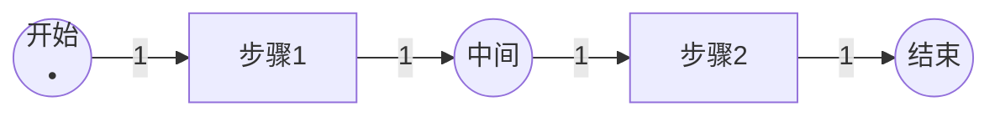
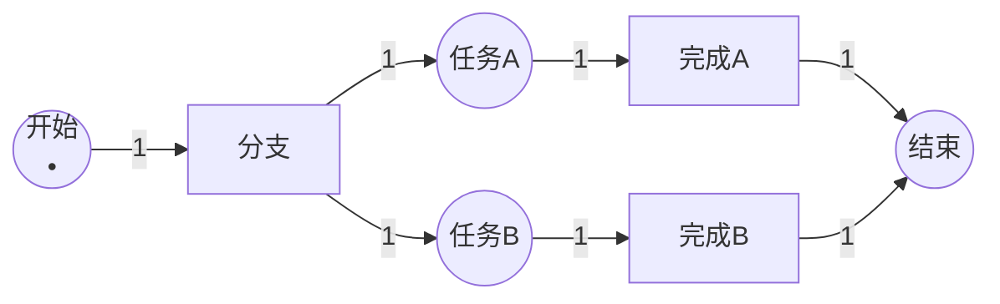
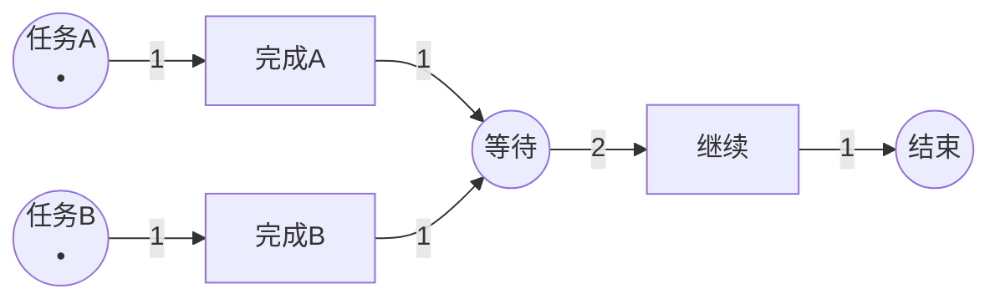
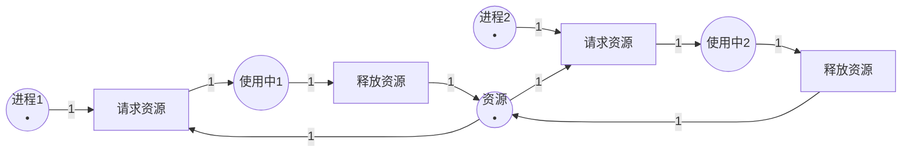
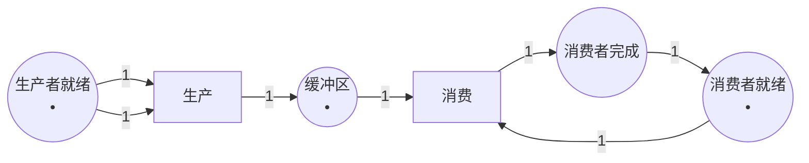
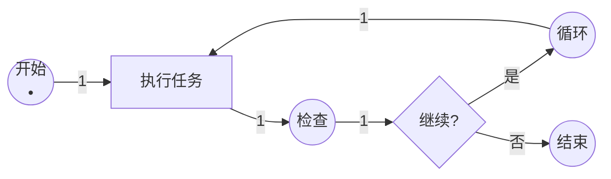
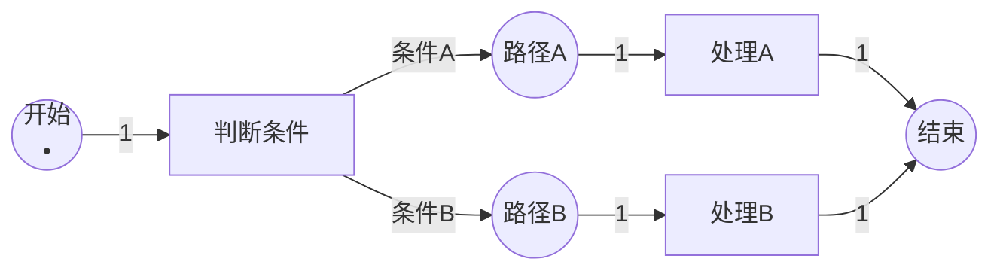
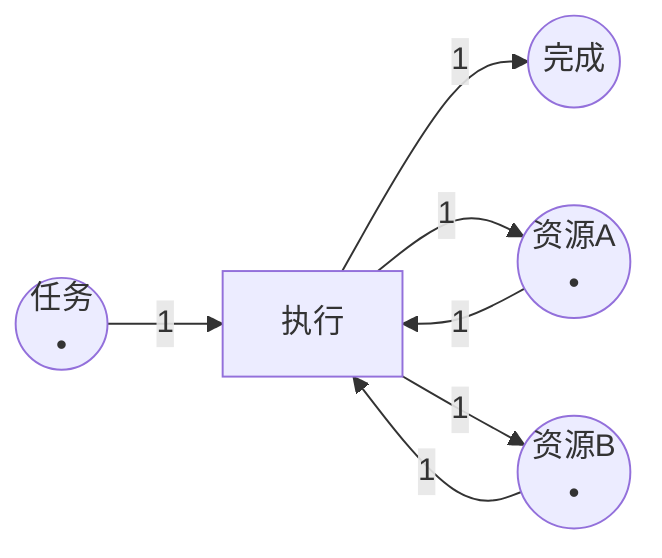
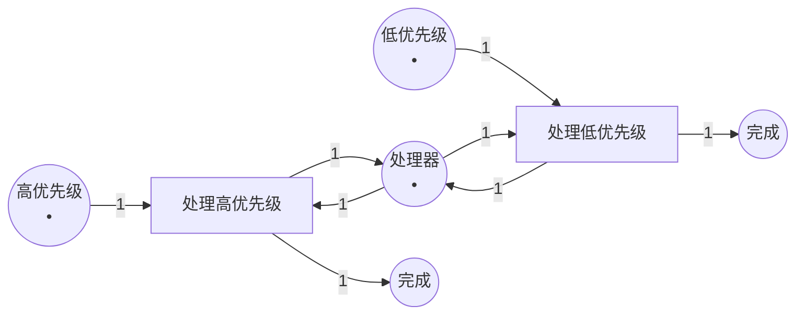
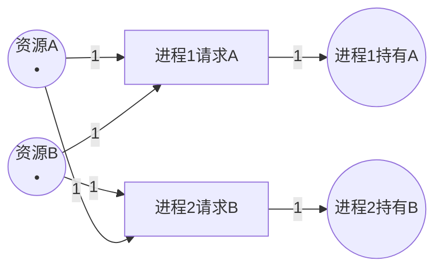

# Petri网的图形表示 / Graphical Representation of Petri Nets

## 📚 **概述 / Overview**

本文档详细介绍Petri网的图形表示方法，包括图形元素、绘制规范、示例集合、工具介绍和图形分析方法。Petri网的图形表示是其最重要的特征之一，使得复杂的并发系统可以直观地可视化。

---

## 📑 **目录 / Table of Contents**

- [Petri网的图形表示 / Graphical Representation of Petri Nets](#petri网的图形表示--graphical-representation-of-petri-nets)
  - [📚 **概述 / Overview**](#-概述--overview)
  - [📑 **目录 / Table of Contents**](#-目录--table-of-contents)
  - [1. 图形元素 / Graphical Elements](#1-图形元素--graphical-elements)
    - [1.1 基本图形元素 / Basic Graphical Elements](#11-基本图形元素--basic-graphical-elements)
      - [1.1.1 库所（Place）](#111-库所place)
      - [1.1.2 变迁（Transition）](#112-变迁transition)
      - [1.1.3 弧（Arc）](#113-弧arc)
      - [1.1.4 令牌（Token）](#114-令牌token)
    - [1.2 图形元素的组合 / Combination of Graphical Elements](#12-图形元素的组合--combination-of-graphical-elements)
  - [2. 绘制规范 / Drawing Standards](#2-绘制规范--drawing-standards)
    - [2.1 ISO/IEC 15909标准 / ISO/IEC 15909 Standard](#21-isoiec-15909标准--isoiec-15909-standard)
      - [2.1.1 基本规范 / Basic Standards](#211-基本规范--basic-standards)
    - [2.2 命名规范 / Naming Conventions](#22-命名规范--naming-conventions)
      - [2.2.1 库所命名 / Place Naming](#221-库所命名--place-naming)
      - [2.2.2 变迁命名 / Transition Naming](#222-变迁命名--transition-naming)
    - [2.3 图形质量要求 / Graphical Quality Requirements](#23-图形质量要求--graphical-quality-requirements)
  - [3. 图形示例集合 / Example Collection](#3-图形示例集合--example-collection)
    - [3.1 简单顺序流程 / Simple Sequential Process](#31-简单顺序流程--simple-sequential-process)
    - [3.2 并发分支 / Concurrent Branching](#32-并发分支--concurrent-branching)
    - [3.3 同步汇合 / Synchronization Join](#33-同步汇合--synchronization-join)
    - [3.4 资源竞争 / Resource Competition](#34-资源竞争--resource-competition)
    - [3.5 生产者-消费者 / Producer-Consumer](#35-生产者-消费者--producer-consumer)
    - [3.6 循环流程 / Cyclic Process](#36-循环流程--cyclic-process)
    - [3.7 条件分支 / Conditional Branching](#37-条件分支--conditional-branching)
    - [3.8 多资源系统 / Multi-Resource System](#38-多资源系统--multi-resource-system)
    - [3.9 优先级系统 / Priority System](#39-优先级系统--priority-system)
    - [3.10 死锁示例 / Deadlock Example](#310-死锁示例--deadlock-example)
  - [4. Petri网绘制工具 / Petri Net Drawing Tools](#4-petri网绘制工具--petri-net-drawing-tools)
    - [4.1 PIPE (Platform Independent Petri net Editor)](#41-pipe-platform-independent-petri-net-editor)
    - [4.2 CPN Tools (Colored Petri Nets Tools)](#42-cpn-tools-colored-petri-nets-tools)
    - [4.3 其他工具 / Other Tools](#43-其他工具--other-tools)
      - [4.3.1 TINA (Time Petri Net Analyzer)](#431-tina-time-petri-net-analyzer)
      - [4.3.2 WoPeD (Workflow Petri Net Designer)](#432-woped-workflow-petri-net-designer)
      - [4.3.3 PNML标准 / PNML Standard](#433-pnml标准--pnml-standard)
    - [4.4 在线工具 / Online Tools](#44-在线工具--online-tools)
      - [4.4.1 draw.io / diagrams.net](#441-drawio--diagramsnet)
      - [4.4.2 Lucidchart](#442-lucidchart)
    - [4.5 工具选择建议 / Tool Selection Recommendations](#45-工具选择建议--tool-selection-recommendations)
  - [5. 图形分析方法 / Graphical Analysis Methods](#5-图形分析方法--graphical-analysis-methods)
    - [5.1 结构分析 / Structural Analysis](#51-结构分析--structural-analysis)
      - [5.1.1 连通性 / Connectivity](#511-连通性--connectivity)
      - [5.1.2 路径分析 / Path Analysis](#512-路径分析--path-analysis)
      - [5.1.3 冲突检测 / Conflict Detection](#513-冲突检测--conflict-detection)
    - [5.2 行为分析 / Behavioral Analysis](#52-行为分析--behavioral-analysis)
      - [5.2.1 可达性分析 / Reachability Analysis](#521-可达性分析--reachability-analysis)
      - [5.2.2 死锁检测 / Deadlock Detection](#522-死锁检测--deadlock-detection)
      - [5.2.3 活性分析 / Liveness Analysis](#523-活性分析--liveness-analysis)
    - [5.3 性能分析 / Performance Analysis](#53-性能分析--performance-analysis)
      - [5.3.1 吞吐量分析 / Throughput Analysis](#531-吞吐量分析--throughput-analysis)
      - [5.3.2 资源利用率 / Resource Utilization](#532-资源利用率--resource-utilization)
    - [5.4 图形优化建议 / Graphical Optimization Recommendations](#54-图形优化建议--graphical-optimization-recommendations)
  - [📚 **参考文献 / References**](#-参考文献--references)

---

## 1. 图形元素 / Graphical Elements

### 1.1 基本图形元素 / Basic Graphical Elements

Petri网使用以下四种基本图形元素：

#### 1.1.1 库所（Place）

- **图形表示**：圆圈 ○
- **含义**：表示系统的状态或资源
- **标记**：库所中可以包含**令牌（Token）**，用圆点 • 表示
- **命名**：通常用 $p_1, p_2, \ldots$ 或描述性名称（如"等待"、"就绪"）命名

**示例**：

```
○ (空库所)
● (包含1个令牌的库所)
●●● (包含3个令牌的库所)
```

#### 1.1.2 变迁（Transition）

- **图形表示**：矩形 ■ 或竖线 |
- **含义**：表示事件或动作
- **命名**：通常用 $t_1, t_2, \ldots$ 或描述性名称（如"开始"、"完成"）命名
- **可触发状态**：当所有输入库所都有足够令牌时，变迁可以触发

**示例**：

```
[变迁名称] 或 |变迁名称|
```

#### 1.1.3 弧（Arc）

- **图形表示**：有向箭头 →
- **含义**：表示库所和变迁之间的连接关系
- **方向**：
  - 从库所指向变迁：表示变迁消耗库所中的令牌
  - 从变迁指向库所：表示变迁在库所中产生令牌
- **权重**：弧上可以标注权重（默认为1）

**示例**：

```
P1 --1--> T1  (权重为1)
P2 --2--> T2  (权重为2)
```

#### 1.1.4 令牌（Token）

- **图形表示**：圆点 •
- **含义**：表示资源、数据或系统状态
- **位置**：放在库所内部
- **数量**：库所中的令牌数量表示该状态/资源的数量

### 1.2 图形元素的组合 / Combination of Graphical Elements

Petri网通过组合这些基本元素来表示复杂的系统行为：

```
库所 → 变迁 → 库所
  ↑              ↓
  └──────────────┘
```

---

## 2. 绘制规范 / Drawing Standards

### 2.1 ISO/IEC 15909标准 / ISO/IEC 15909 Standard

Petri网的图形表示遵循ISO/IEC 15909标准，确保不同工具之间的兼容性。

#### 2.1.1 基本规范 / Basic Standards

1. **库所**：
   - 必须用圆圈表示
   - 圆圈内可以显示库所名称和令牌数量
   - 建议库所大小一致，便于阅读

2. **变迁**：
   - 可以用矩形或竖线表示
   - 矩形内可以显示变迁名称
   - 竖线表示更简洁，适合复杂图形

3. **弧**：
   - 必须是有向箭头
   - 权重大于1时，必须在弧上标注
   - 弧应该清晰，避免交叉过多

4. **布局**：
   - 建议从上到下、从左到右的流程方向
   - 相关元素应该靠近放置
   - 避免弧的交叉，必要时使用弯曲弧

### 2.2 命名规范 / Naming Conventions

#### 2.2.1 库所命名 / Place Naming

- **描述性命名**：使用有意义的名称，如"等待订单"、"处理中"、"已完成"
- **编号命名**：使用 $p_1, p_2, \ldots$ 或 $P1, P2, \ldots$
- **混合命名**：结合描述和编号，如"订单_1"、"订单_2"

#### 2.2.2 变迁命名 / Transition Naming

- **动作命名**：使用动词，如"接收"、"处理"、"发送"
- **编号命名**：使用 $t_1, t_2, \ldots$ 或 $T1, T2, \ldots$
- **事件命名**：使用事件描述，如"订单到达"、"处理完成"

### 2.3 图形质量要求 / Graphical Quality Requirements

1. **清晰性**：所有元素应该清晰可辨
2. **一致性**：相同类型的元素应该使用相同的样式
3. **可读性**：文字大小适中，颜色对比明显
4. **简洁性**：避免不必要的装饰，保持图形简洁

---

## 3. 图形示例集合 / Example Collection

### 3.1 简单顺序流程 / Simple Sequential Process

**场景**：简单的三步流程



**说明**：

- 初始状态：$P1$ 有1个令牌
- 顺序执行：$T1$ → $T2$
- 应用：简单的顺序任务流程

### 3.2 并发分支 / Concurrent Branching

**场景**：一个任务分成两个并行任务



**说明**：

- $T1$ 触发后，$P2$ 和 $P3$ 同时获得令牌
- $T2$ 和 $T3$ 可以并发执行
- 应用：并行处理、分布式计算

### 3.3 同步汇合 / Synchronization Join

**场景**：两个任务完成后才能继续



**说明**：

- $P3$ 需要2个令牌才能让 $T3$ 触发
- 实现了两个任务的同步
- 应用：同步点、屏障同步

### 3.4 资源竞争 / Resource Competition

**场景**：多个进程竞争共享资源



**说明**：

- $P3$ 是共享资源，只能被一个进程使用
- $T1$ 和 $T2$ 形成冲突，只能有一个触发
- 应用：互斥访问、资源管理

### 3.5 生产者-消费者 / Producer-Consumer

**场景**：经典的生产者-消费者模式



**说明**：

- $P2$ 是缓冲区，存储产品
- 生产者和消费者通过缓冲区同步
- 应用：消息队列、数据流处理

### 3.6 循环流程 / Cyclic Process

**场景**：重复执行的循环流程



**说明**：

- $T2$ 是决策点，决定是否继续循环
- 应用：循环处理、迭代算法

### 3.7 条件分支 / Conditional Branching

**场景**：根据条件选择不同路径



**说明**：

- $T1$ 根据条件选择不同输出
- 应用：条件处理、决策流程

### 3.8 多资源系统 / Multi-Resource System

**场景**：需要多种资源的系统



**说明**：

- $T1$ 需要 $P2$ 和 $P3$ 两个资源
- 执行后释放资源
- 应用：多资源分配、复合任务

### 3.9 优先级系统 / Priority System

**场景**：不同优先级的任务处理



**说明**：

- $P3$ 是共享处理器
- $T1$ 和 $T2$ 竞争资源，但可以通过权重实现优先级
- 应用：任务调度、优先级队列

### 3.10 死锁示例 / Deadlock Example

**场景**：展示死锁情况



**说明**：

- 进程1持有资源A，需要资源B
- 进程2持有资源B，需要资源A
- 形成死锁：两个进程都无法继续
- 应用：死锁检测和分析

---

## 4. Petri网绘制工具 / Petri Net Drawing Tools

### 4.1 PIPE (Platform Independent Petri net Editor)

**简介**：PIPE是一个开源的Petri网编辑和分析工具。

**主要特性**：

- ✅ 图形化编辑界面
- ✅ 支持Place/Transition网和广义随机Petri网（GSPN）
- ✅ 可达性图生成
- ✅ 高级GSPN分析
- ✅ 支持PNML标准格式
- ✅ 导出PNG图片

**下载地址**：<https://pipe2.sourceforge.net/>

**适用场景**：

- 学习和教学
- 小型到中型Petri网建模
- 基本分析需求

### 4.2 CPN Tools (Colored Petri Nets Tools)

**简介**：CPN Tools是用于编辑、仿真和分析着色Petri网的强大工具。

**主要特性**：

- ✅ 图形编辑器，支持增量语法检查
- ✅ 快速仿真器（交互式和自动仿真）
- ✅ 状态空间分析
- ✅ 支持时间Petri网
- ✅ 领域特定可视化
- ✅ 序列图生成

**下载地址**：<http://cpntools.org/>

**适用场景**：

- 复杂系统建模
- 着色Petri网应用
- 大规模系统分析

### 4.3 其他工具 / Other Tools

#### 4.3.1 TINA (Time Petri Net Analyzer)

- **特点**：专门用于时间Petri网的分析
- **功能**：可达性分析、时间约束验证
- **网址**：<http://projects.laas.fr/tina/>

#### 4.3.2 WoPeD (Workflow Petri Net Designer)

- **特点**：专门用于工作流Petri网设计
- **功能**：工作流建模、流程分析
- **网址**：<https://woped.dhbw-karlsruhe.de/>

#### 4.3.3 PNML标准 / PNML Standard

**Petri Net Markup Language (PNML)**：

- XML-based交换格式
- 实现不同工具之间的模型交换
- ISO/IEC 15909标准的一部分

### 4.4 在线工具 / Online Tools

#### 4.4.1 draw.io / diagrams.net

- **特点**：在线图形编辑器
- **功能**：支持Petri网图形绘制
- **网址**：<https://app.diagrams.net/>

#### 4.4.2 Lucidchart

- **特点**：在线协作图表工具
- **功能**：支持Petri网模板
- **网址**：<https://www.lucidchart.com/>

### 4.5 工具选择建议 / Tool Selection Recommendations

| 需求 | 推荐工具 |
|------|---------|
| 学习和教学 | PIPE |
| 复杂系统建模 | CPN Tools |
| 时间系统分析 | TINA |
| 工作流建模 | WoPeD |
| 快速绘制 | draw.io |
| 协作编辑 | Lucidchart |

---

## 5. 图形分析方法 / Graphical Analysis Methods

### 5.1 结构分析 / Structural Analysis

通过观察Petri网图形，可以分析以下结构性质：

#### 5.1.1 连通性 / Connectivity

- **强连通**：所有节点都可以相互到达
- **弱连通**：忽略方向后连通
- **孤立节点**：没有连接的节点

#### 5.1.2 路径分析 / Path Analysis

- **简单路径**：不重复节点的路径
- **回路**：起点和终点相同的路径
- **关键路径**：影响系统性能的重要路径

#### 5.1.3 冲突检测 / Conflict Detection

- **结构冲突**：共享输入库所的变迁
- **实际冲突**：在当前标识下可能冲突的变迁

### 5.2 行为分析 / Behavioral Analysis

通过图形可以直观分析系统行为：

#### 5.2.1 可达性分析 / Reachability Analysis

- 从初始标识开始，追踪所有可能的执行路径
- 检查能否达到目标状态
- 识别不可达状态

#### 5.2.2 死锁检测 / Deadlock Detection

- 识别没有可触发变迁的标识
- 分析导致死锁的结构原因
- 提出死锁避免策略

#### 5.2.3 活性分析 / Liveness Analysis

- 检查所有变迁是否都能被触发
- 识别永远无法触发的变迁
- 分析系统的活性级别

### 5.3 性能分析 / Performance Analysis

#### 5.3.1 吞吐量分析 / Throughput Analysis

- 识别瓶颈变迁（频繁触发的变迁）
- 分析系统的最大吞吐量
- 优化关键路径

#### 5.3.2 资源利用率 / Resource Utilization

- 分析资源库所的使用情况
- 识别资源竞争点
- 优化资源分配

### 5.4 图形优化建议 / Graphical Optimization Recommendations

1. **布局优化**：
   - 使用层次化布局
   - 相关元素靠近放置
   - 减少弧的交叉

2. **颜色编码**：
   - 使用颜色区分不同类型的元素
   - 用颜色表示状态（如红色表示错误状态）

3. **分组和模块化**：
   - 将相关功能分组
   - 使用子网表示复杂模块
   - 保持图形的层次结构

4. **注释和文档**：
   - 添加必要的注释说明
   - 提供图例说明
   - 标注关键路径和决策点

---

## 📚 **参考文献 / References**

1. ISO/IEC 15909-1:2004. *Software and system engineering — High-level Petri nets — Part 1: Concepts, definitions and graphical notation*.

2. PNML (Petri Net Markup Language). *ISO/IEC 15909-2:2011*.

3. PIPE Documentation. <https://pipe2.sourceforge.net/>

4. CPN Tools Documentation. <http://cpntools.org/>

---

**文档版本**: v2.0
**创建时间**: 2025年1月
**最后更新**: 2025年1月
**质量等级**: ⭐⭐⭐⭐⭐ 五星级
**字数统计**: 约4000字
