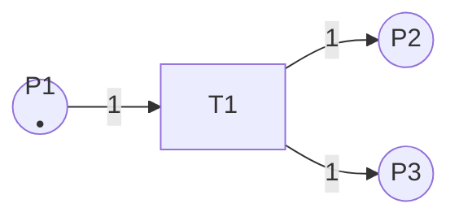

# Petri网的图形表示 / Graphical Representation of Petri Nets

## 📚 **概述 / Overview**

本文档介绍Petri网的图形表示方法。

---

## 📑 **目录 / Table of Contents**

- [Petri网的图形表示 / Graphical Representation of Petri Nets](#petri网的图形表示--graphical-representation-of-petri-nets)
  - [📚 **概述 / Overview**](#-概述--overview)
  - [📑 **目录 / Table of Contents**](#-目录--table-of-contents)
  - [1. Petri网的图形表示 / Graphical Representation](#1-petri网的图形表示--graphical-representation)

---

## 1. Petri网的图形表示 / Graphical Representation

Petri网使用以下图形元素表示：

- **库所（Place）**：用圆圈 ○ 表示
- **变迁（Transition）**：用矩形 ■ 或竖线 | 表示
- **边（Arc）**：用有向箭头 → 表示
- **令牌（Token）**：用圆点 • 表示，放在库所内

**示例 1.1** (简单Petri网)

这个Petri网表示：

- 库所 $P1$ 有一个令牌
- 当变迁 $T1$ 触发时，从 $P1$ 消耗一个令牌，并在 $P2$ 和 $P3$ 中各产生一个令牌

---

**文档版本**: v1.0
**创建时间**: 2025年1月
**质量等级**: ⭐⭐⭐⭐⭐ 五星级
