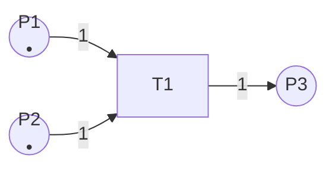
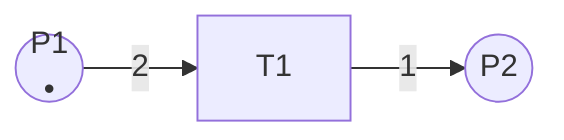
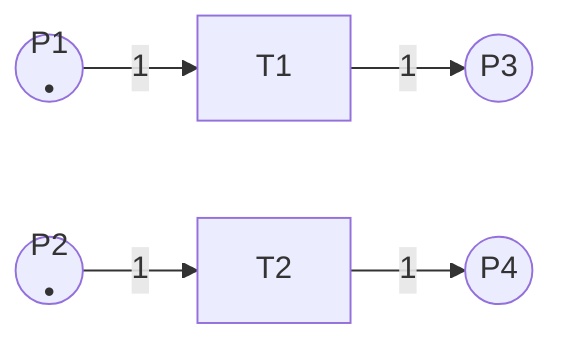
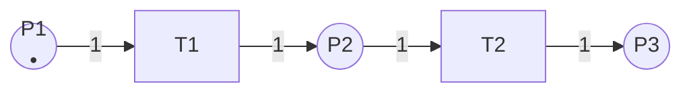
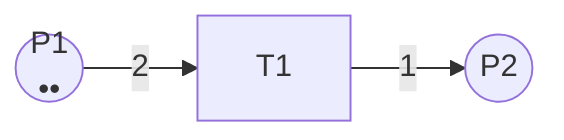
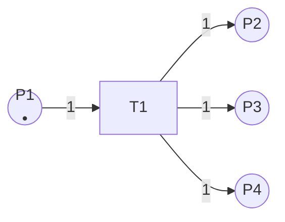
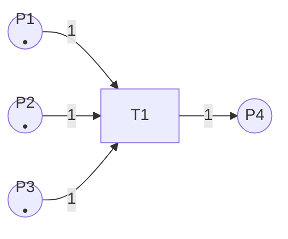
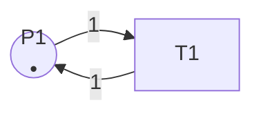
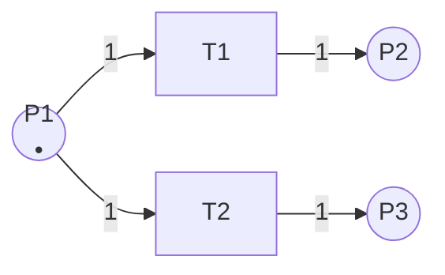

# Petri网的执行语义 / Execution Semantics of Petri Nets

## 📚 **概述 / Overview**

本文档详细介绍Petri网的执行语义，包括标识、变迁的可触发性、触发规则、并发执行、冲突处理、执行轨迹等核心概念。执行语义定义了Petri网如何从初始状态演化到其他状态，是理解Petri网动态行为的基础。

---

## 📑 **目录 / Table of Contents**

- [Petri网的执行语义 / Execution Semantics of Petri Nets](#petri网的执行语义--execution-semantics-of-petri-nets)
  - [📚 **概述 / Overview**](#-概述--overview)
  - [📑 **目录 / Table of Contents**](#-目录--table-of-contents)
  - [1. 标识与状态 / Marking and State](#1-标识与状态--marking-and-state)
  - [2. 变迁的可触发性 / Enabling of Transitions](#2-变迁的可触发性--enabling-of-transitions)
  - [3. 变迁的触发 / Firing of Transitions](#3-变迁的触发--firing-of-transitions)
  - [4. 状态转换示例 / State Transition Examples](#4-状态转换示例--state-transition-examples)
  - [5. 并发执行 / Concurrent Execution](#5-并发执行--concurrent-execution)
  - [6. 冲突与冲突解决 / Conflict and Conflict Resolution](#6-冲突与冲突解决--conflict-and-conflict-resolution)
  - [7. 执行轨迹 / Execution Traces](#7-执行轨迹--execution-traces)
  - [8. 可达性 / Reachability](#8-可达性--reachability)

---

## 1. 标识与状态 / Marking and State

### 1.1 标识的定义 / Definition of Marking

**定义 1.3** (标识 / Marking)

Petri网 $N = (P, T, F, W, M_0)$ 的**标识**（Marking）是一个函数：
$$M: P \to \mathbb{N}$$

表示每个库所中的令牌数量。

**标识的表示方法**：

1. **函数表示**：$M = \{p_1 \mapsto 2, p_2 \mapsto 0, p_3 \mapsto 1\}$
2. **向量表示**：$M = (2, 0, 1)$（假设库所顺序为 $p_1, p_2, p_3$）
3. **多重集表示**：$M = 2 \cdot p_1 + 0 \cdot p_2 + 1 \cdot p_3$

### 1.2 初始标识 / Initial Marking

**初始标识** $M_0$ 是Petri网的起始状态，定义了系统的初始配置。

**示例 1.1** (初始标识)

考虑一个简单的Petri网：

- 库所：$P = \{p_1, p_2, p_3\}$
- 初始标识：$M_0 = \{p_1 \mapsto 1, p_2 \mapsto 0, p_3 \mapsto 0\}$

这表示：

- $p_1$ 中有1个令牌
- $p_2$ 和 $p_3$ 中没有令牌

### 1.3 标识的图形表示 / Graphical Representation of Marking

在Petri网图形中，标识通过库所中的圆点（令牌）表示：

```
○ (空库所，M(p) = 0)
● (1个令牌，M(p) = 1)
●● (2个令牌，M(p) = 2)
●●● (3个令牌，M(p) = 3)
```

---

## 2. 变迁的可触发性 / Enabling of Transitions

### 2.1 可触发性的定义 / Definition of Enabling

**定义 1.4** (变迁的可触发性 / Enabling of Transitions)

在标识 $M$ 下，变迁 $t \in T$ **可触发**（enabled），当且仅当：
$$\forall p \in \prescript{}{}{t}: M(p) \geq W(p, t)$$

即，变迁 $t$ 的所有输入库所中的令牌数都**大于等于**相应边的权重。

### 2.2 可触发性的直观理解 / Intuitive Understanding

**可触发性的条件**：

1. **所有输入库所都有足够的令牌**
2. **令牌数量满足权重要求**

**示例 2.1** (可触发变迁)



- 初始标识：$M_0 = \{P1 \mapsto 1, P2 \mapsto 1, P3 \mapsto 0\}$
- $T1$ 的输入库所：$\prescript{}{}{T1} = \{P1, P2\}$
- 检查：$M_0(P1) = 1 \geq 1$ ✓，$M_0(P2) = 1 \geq 1$ ✓
- **结论**：$T1$ 在 $M_0$ 下可触发

**示例 2.2** (不可触发变迁)



- 初始标识：$M_0 = \{P1 \mapsto 1, P2 \mapsto 0\}$
- $T1$ 需要 $P1$ 中有至少2个令牌
- 检查：$M_0(P1) = 1 < 2$ ✗
- **结论**：$T1$ 在 $M_0$ 下**不可触发**

### 2.3 多个变迁的可触发性 / Enabling of Multiple Transitions

在同一个标识下，可能有多个变迁同时可触发。

**示例 2.3** (多个可触发变迁)



- 初始标识：$M_0 = \{P1 \mapsto 1, P2 \mapsto 1, P3 \mapsto 0, P4 \mapsto 0\}$
- $T1$ 和 $T2$ 都**可触发**（它们不共享输入库所）
- 它们可以**并发执行**

---

## 3. 变迁的触发 / Firing of Transitions

### 3.1 触发规则 / Firing Rule

**定义 1.5** (变迁的触发 / Firing of Transitions)

如果变迁 $t$ 在标识 $M$ 下可触发，那么它可以**触发**（fire），产生新标识 $M'$：

对于每个库所 $p \in P$：
$$M'(p) = M(p) - W(p, t) + W(t, p)$$

其中：

- $W(p, t)$：从库所 $p$ 到变迁 $t$ 的权重（如果 $(p, t) \notin F$，则 $W(p, t) = 0$）
- $W(t, p)$：从变迁 $t$ 到库所 $p$ 的权重（如果 $(t, p) \notin F$，则 $W(t, p) = 0$）

### 3.2 触发过程的步骤 / Steps of Firing Process

变迁 $t$ 的触发过程包括三个步骤：

1. **检查可触发性**：验证所有输入库所都有足够的令牌
2. **消耗令牌**：从每个输入库所 $p \in \prescript{}{}{t}$ 中移除 $W(p, t)$ 个令牌
3. **产生令牌**：在每个输出库所 $p \in t^{\bullet}$ 中添加 $W(t, p)$ 个令牌

### 3.3 形式化定义 / Formal Definition

**完整的形式化定义**：

$$
M'(p) = \begin{cases}
M(p) - W(p, t) & \text{if } p \in \prescript{}{}{t} \setminus t^{\bullet} \\
M(p) + W(t, p) & \text{if } p \in t^{\bullet} \setminus \prescript{}{}{t} \\
M(p) - W(p, t) + W(t, p) & \text{if } p \in \prescript{}{}{t} \cap t^{\bullet} \\
M(p) & \text{otherwise}
\end{cases}
$$

**简化形式**（当库所不同时是输入和输出时）：

$$
M'(p) = M(p) - W(p, t) + W(t, p)
$$

### 3.4 触发表示法 / Firing Notation

- **单步触发**：$M \xrightarrow{t} M'$（从标识 $M$ 触发变迁 $t$ 得到标识 $M'$）
- **多步触发**：$M \xrightarrow{t_1 t_2 \cdots t_k} M'$（触发序列）
- **可达性**：$M \xrightarrow{*} M'$（存在某个变迁序列使得 $M'$ 从 $M$ 可达）

---

## 4. 状态转换示例 / State Transition Examples

### 示例 4.1：简单顺序触发 / Simple Sequential Firing

**Petri网结构**：



**初始标识**：$M_0 = \{P1 \mapsto 1, P2 \mapsto 0, P3 \mapsto 0\}$

**执行过程**：

1. **步骤1：触发 $T1$**
   - 检查：$M_0(P1) = 1 \geq 1$ ✓
   - 消耗：$P1$ 中移除1个令牌
   - 产生：$P2$ 中添加1个令牌
   - 结果：$M_1 = \{P1 \mapsto 0, P2 \mapsto 1, P3 \mapsto 0\}$
   - 表示：$M_0 \xrightarrow{T1} M_1$

2. **步骤2：触发 $T2$**
   - 检查：$M_1(P2) = 1 \geq 1$ ✓
   - 消耗：$P2$ 中移除1个令牌
   - 产生：$P3$ 中添加1个令牌
   - 结果：$M_2 = \{P1 \mapsto 0, P2 \mapsto 0, P3 \mapsto 1\}$
   - 表示：$M_1 \xrightarrow{T2} M_2$

**完整执行轨迹**：$M_0 \xrightarrow{T1} M_1 \xrightarrow{T2} M_2$

### 示例 4.2：权重大于1的触发 / Firing with Weight > 1

**Petri网结构**：



**初始标识**：$M_0 = \{P1 \mapsto 2, P2 \mapsto 0\}$

**执行过程**：

1. **触发 $T1$**
   - 检查：$M_0(P1) = 2 \geq 2$ ✓
   - 消耗：$P1$ 中移除2个令牌
   - 产生：$P2$ 中添加1个令牌
   - 结果：$M_1 = \{P1 \mapsto 0, P2 \mapsto 1\}$
   - 表示：$M_0 \xrightarrow{T1} M_1$

**注意**：权重为2意味着需要消耗2个令牌，但只产生1个令牌。

### 示例 4.3：一个变迁多个输出 / One Transition Multiple Outputs

**Petri网结构**：



**初始标识**：$M_0 = \{P1 \mapsto 1, P2 \mapsto 0, P3 \mapsto 0, P4 \mapsto 0\}$

**执行过程**：

1. **触发 $T1$**
   - 检查：$M_0(P1) = 1 \geq 1$ ✓
   - 消耗：$P1$ 中移除1个令牌
   - 产生：$P2$、$P3$、$P4$ 中各添加1个令牌
   - 结果：$M_1 = \{P1 \mapsto 0, P2 \mapsto 1, P3 \mapsto 1, P4 \mapsto 1\}$
   - 表示：$M_0 \xrightarrow{T1} M_1$

**特点**：一个变迁可以同时向多个库所产生令牌，实现**分支**。

### 示例 4.4：多个输入库所 / Multiple Input Places

**Petri网结构**：



**初始标识**：$M_0 = \{P1 \mapsto 1, P2 \mapsto 1, P3 \mapsto 1, P4 \mapsto 0\}$

**执行过程**：

1. **触发 $T1$**
   - 检查：
     - $M_0(P1) = 1 \geq 1$ ✓
     - $M_0(P2) = 1 \geq 1$ ✓
     - $M_0(P3) = 1 \geq 1$ ✓
   - 消耗：$P1$、$P2$、$P3$ 中各移除1个令牌
   - 产生：$P4$ 中添加1个令牌
   - 结果：$M_1 = \{P1 \mapsto 0, P2 \mapsto 0, P3 \mapsto 0, P4 \mapsto 1\}$
   - 表示：$M_0 \xrightarrow{T1} M_1$

**特点**：一个变迁需要多个输入库所都有令牌才能触发，实现**同步**。

### 示例 4.5：自循环 / Self-Loop

**Petri网结构**：



**初始标识**：$M_0 = \{P1 \mapsto 1\}$

**执行过程**：

1. **触发 $T1$**
   - 检查：$M_0(P1) = 1 \geq 1$ ✓
   - 消耗：$P1$ 中移除1个令牌（$P1$ 变为0）
   - 产生：$P1$ 中添加1个令牌（$P1$ 变为1）
   - 结果：$M_1 = \{P1 \mapsto 1\}$（与 $M_0$ 相同）
   - 表示：$M_0 \xrightarrow{T1} M_0$

**特点**：自循环不改变标识，但可以表示**重复执行**。

---

## 5. 并发执行 / Concurrent Execution

### 5.1 并发的定义 / Definition of Concurrency

**定义 5.1** (并发变迁 / Concurrent Transitions)

两个变迁 $t_1$ 和 $t_2$ 在标识 $M$ 下**并发**（concurrent），如果：

1. 两者都在 $M$ 下可触发
2. 它们不共享输入库所：$\prescript{}{}{t_1} \cap \prescript{}{}{t_2} = \emptyset$
3. 触发一个不会使另一个不可触发

### 5.2 并发执行的示例 / Example of Concurrent Execution

**Petri网结构**：


**初始标识**：$M_0 = \{P1 \mapsto 1, P2 \mapsto 1, P3 \mapsto 0, P4 \mapsto 0\}$

**分析**：

- $T1$ 和 $T2$ 都可在 $M_0$ 下触发
- 它们不共享输入库所（$\prescript{}{}{T1} = \{P1\}$，$\prescript{}{}{T2} = \{P2\}$）
- **结论**：$T1$ 和 $T2$ 可以**并发执行**

**可能的执行顺序**：

1. $M_0 \xrightarrow{T1} M_1 \xrightarrow{T2} M_2$
2. $M_0 \xrightarrow{T2} M_1' \xrightarrow{T1} M_2$
3. $M_0 \xrightarrow{\{T1, T2\}} M_2$（并发触发，一步完成）

**最终结果**：$M_2 = \{P1 \mapsto 0, P2 \mapsto 0, P3 \mapsto 1, P4 \mapsto 1\}$

**注意**：无论执行顺序如何，最终结果相同（因为不共享资源）。

### 5.3 真并发语义 / True Concurrency Semantics

Petri网支持**真并发**（true concurrency），即多个变迁可以**同时**触发，而不需要交错执行。

**真并发 vs 交错并发**：

- **真并发**：$M \xrightarrow{\{t_1, t_2\}} M'$（同时触发）
- **交错并发**：$M \xrightarrow{t_1} M_1 \xrightarrow{t_2} M'$ 或 $M \xrightarrow{t_2} M_1' \xrightarrow{t_1} M'$（顺序触发）

在Petri网中，真并发和交错并发在结果上是等价的（当变迁不冲突时）。

---

## 6. 冲突与冲突解决 / Conflict and Conflict Resolution

### 6.1 冲突的定义 / Definition of Conflict

**定义 6.1** (冲突 / Conflict)

两个变迁 $t_1$ 和 $t_2$ 在标识 $M$ 下**冲突**（conflict），如果：

1. 两者都在 $M$ 下可触发
2. 它们共享输入库所：$\prescript{}{}{t_1} \cap \prescript{}{}{t_2} \neq \emptyset$
3. 触发一个会使另一个不可触发（因为共享库所的令牌不足）

### 6.2 冲突的示例 / Example of Conflict

**Petri网结构**：



**初始标识**：$M_0 = \{P1 \mapsto 1, P2 \mapsto 0, P3 \mapsto 0\}$

**分析**：

- $T1$ 和 $T2$ 都可在 $M_0$ 下触发
- 它们共享输入库所 $P1$：$\prescript{}{}{T1} \cap \prescript{}{}{T2} = \{P1\}$
- $P1$ 只有1个令牌，只能满足一个变迁
- **结论**：$T1$ 和 $T2$ **冲突**

**可能的执行**：

- 选择1：$M_0 \xrightarrow{T1} M_1 = \{P1 \mapsto 0, P2 \mapsto 1, P3 \mapsto 0\}$（$T2$ 不再可触发）
- 选择2：$M_0 \xrightarrow{T2} M_1' = \{P1 \mapsto 0, P2 \mapsto 0, P3 \mapsto 1\}$（$T1$ 不再可触发）

**注意**：冲突必须**非确定性地解决**，不能同时触发两个冲突的变迁。

### 6.3 冲突解决策略 / Conflict Resolution Strategies

#### 6.3.1 非确定性选择 / Nondeterministic Choice

**默认策略**：随机或非确定性地选择其中一个变迁触发。

**适用场景**：

- 系统设计阶段，探索所有可能的行为
- 模型检测，验证所有可能的执行路径

#### 6.3.2 优先级策略 / Priority Strategy

**方法**：为变迁分配优先级，高优先级的变迁优先触发。

**实现**：

- 在Petri网扩展中添加优先级属性
- 冲突时选择优先级最高的变迁

**适用场景**：

- 实时系统，需要明确的优先级
- 资源调度，需要优先级控制

#### 6.3.3 守卫条件 / Guard Conditions

**方法**：为变迁添加守卫条件（guard conditions），只有条件满足时才可触发。

**实现**：

- 在着色Petri网或高层次Petri网中实现
- 守卫条件基于令牌的值或系统状态

**适用场景**：

- 需要基于数据的选择
- 条件分支建模

#### 6.3.4 概率选择 / Probabilistic Selection

**方法**：为冲突的变迁分配概率，根据概率随机选择。

**实现**：

- 在随机Petri网中实现
- 每个变迁有触发概率

**适用场景**：

- 随机系统建模
- 性能分析

---

## 7. 执行轨迹 / Execution Traces

### 7.1 执行轨迹的定义 / Definition of Execution Trace

**定义 7.1** (执行轨迹 / Execution Trace)

Petri网的一个**执行轨迹**（execution trace）是一个序列：
$$\sigma = M_0 \xrightarrow{t_1} M_1 \xrightarrow{t_2} M_2 \xrightarrow{t_3} \cdots \xrightarrow{t_n} M_n$$

其中每个 $M_i \xrightarrow{t_{i+1}} M_{i+1}$ 是一个有效的状态转换。

### 7.2 执行轨迹的表示 / Representation of Execution Traces

#### 7.2.1 变迁序列表示 / Transition Sequence Representation

**表示**：$\sigma = t_1 t_2 t_3 \cdots t_n$

**含义**：依次触发变迁 $t_1, t_2, \ldots, t_n$。

#### 7.2.2 状态序列表示 / State Sequence Representation

**表示**：$\sigma = M_0 M_1 M_2 \cdots M_n$

**含义**：状态从 $M_0$ 依次转换到 $M_n$。

#### 7.2.3 完整轨迹表示 / Complete Trace Representation

**表示**：$\sigma = M_0 \xrightarrow{t_1} M_1 \xrightarrow{t_2} M_2 \xrightarrow{t_3} \cdots \xrightarrow{t_n} M_n$

**含义**：包含所有状态和变迁的完整信息。

### 7.3 执行轨迹示例 / Example of Execution Trace

**Petri网结构**：


**初始标识**：$M_0 = \{P1 \mapsto 1, P2 \mapsto 0, P3 \mapsto 0\}$

**执行轨迹**：

1. **变迁序列**：$\sigma = T1 T2$
2. **状态序列**：$\sigma = M_0 M_1 M_2$，其中：
   - $M_0 = \{P1 \mapsto 1, P2 \mapsto 0, P3 \mapsto 0\}$
   - $M_1 = \{P1 \mapsto 0, P2 \mapsto 1, P3 \mapsto 0\}$（触发 $T1$ 后）
   - $M_2 = \{P1 \mapsto 0, P2 \mapsto 0, P3 \mapsto 1\}$（触发 $T2$ 后）
3. **完整轨迹**：$M_0 \xrightarrow{T1} M_1 \xrightarrow{T2} M_2$

### 7.4 执行轨迹的分析 / Analysis of Execution Traces

#### 7.4.1 可达性分析 / Reachability Analysis

通过执行轨迹可以分析：

- 哪些状态可达
- 哪些状态不可达
- 到达某个状态需要哪些变迁序列

#### 7.4.2 死锁检测 / Deadlock Detection

通过执行轨迹可以检测：

- 是否存在死锁状态（没有可触发变迁）
- 导致死锁的变迁序列

#### 7.4.3 活性分析 / Liveness Analysis

通过执行轨迹可以分析：

- 哪些变迁可以无限次触发
- 哪些变迁可能永远无法触发

---

## 8. 可达性 / Reachability

### 8.1 可达性的定义 / Definition of Reachability

**定义 1.6** (可达性 / Reachability)

标识 $M'$ 从标识 $M$ **可达**（reachable），记作 $M \xrightarrow{*} M'$，如果存在一个变迁序列 $t_1, t_2, \ldots, t_k$，使得：
$$M \xrightarrow{t_1} M_1 \xrightarrow{t_2} M_2 \xrightarrow{t_3} \cdots \xrightarrow{t_k} M'$$

### 8.2 可达集 / Reachability Set

**定义 8.1** (可达集 / Reachability Set)

Petri网 $N$ 在初始标识 $M_0$ 下的**可达集**（Reachability Set）定义为：
$$R(N, M_0) = \{M \mid M_0 \xrightarrow{*} M\}$$

即所有从初始标识可达的标识集合。

### 8.3 可达性图 / Reachability Graph

**定义 8.2** (可达性图 / Reachability Graph)

Petri网的可达性图（Reachability Graph）是一个有向图 $RG = (V, E)$，其中：

- $V = R(N, M_0)$：顶点集，所有可达标识
- $E = \{(M, M', t) \mid M \xrightarrow{t} M'\}$：边集，标识转换

### 8.4 可达性分析的应用 / Applications of Reachability Analysis

1. **性质验证**：验证系统是否满足某些性质（如安全性、活性）
2. **死锁检测**：检查是否存在死锁状态
3. **覆盖性分析**：检查所有状态是否都被访问
4. **模型检测**：验证时序逻辑性质

---

## 📚 **参考文献 / References**

1. Reisig, W. (2013). *Understanding Petri Nets: Modeling Techniques, Analysis Methods, Case Studies*. Springer.

2. Murata, T. (1989). Petri nets: Properties, analysis and applications. *Proceedings of the IEEE*, 77(4), 541-580.

3. van der Aalst, W. M. P. (1998). The application of Petri nets to workflow management. *The Journal of Circuits, Systems and Computers*, 8(01), 21-66.

---

**文档版本**: v2.0
**创建时间**: 2025年1月
**最后更新**: 2025年1月
**质量等级**: ⭐⭐⭐⭐⭐ 五星级
**字数统计**: 约6000字
