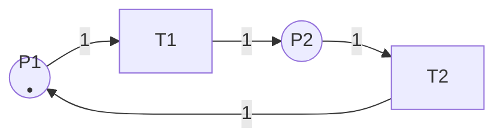
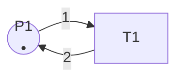
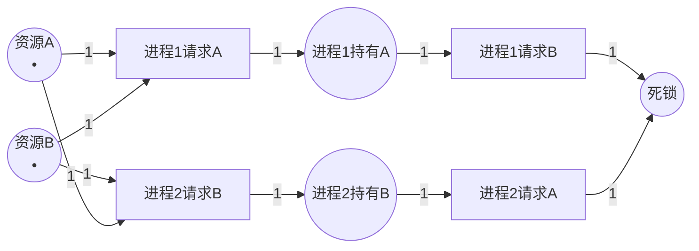

# Petri网的基本性质 / Basic Properties of Petri Nets

## 📚 **概述 / Overview**

本文档详细介绍Petri网的基本性质，包括有界性、安全性、活性（含活性分级L0-L4）、死锁、可逆性、公平性等。这些性质是分析和验证Petri网模型的关键指标，帮助我们理解系统的行为特征和正确性。

---

## 📑 **目录 / Table of Contents**

- [Petri网的基本性质 / Basic Properties of Petri Nets](#petri网的基本性质--basic-properties-of-petri-nets)
  - [📚 **概述 / Overview**](#-概述--overview)
  - [📑 **目录 / Table of Contents**](#-目录--table-of-contents)
  - [1. 有界性与安全性 / Boundedness and Safety](#1-有界性与安全性--boundedness-and-safety)
    - [1.1 有界性的定义 / Definition of Boundedness](#11-有界性的定义--definition-of-boundedness)
    - [1.2 有界性的判定 / Verification of Boundedness](#12-有界性的判定--verification-of-boundedness)
      - [方法1：可达性分析 / Reachability Analysis](#方法1可达性分析--reachability-analysis)
      - [方法2：结构分析 / Structural Analysis](#方法2结构分析--structural-analysis)
    - [1.3 安全性的定义 / Definition of Safety](#13-安全性的定义--definition-of-safety)
    - [1.4 有界性的应用价值 / Application Value of Boundedness](#14-有界性的应用价值--application-value-of-boundedness)
    - [1.5 有界性示例 / Example of Boundedness](#15-有界性示例--example-of-boundedness)
  - [2. 活性 / Liveness](#2-活性--liveness)
    - [2.1 活性的定义 / Definition of Liveness](#21-活性的定义--definition-of-liveness)
    - [2.2 活性分级 / Liveness Levels](#22-活性分级--liveness-levels)
      - [L0-活性（死变迁）/ L0-Liveness (Dead Transition)](#l0-活性死变迁-l0-liveness-dead-transition)
      - [L1-活性（可能触发）/ L1-Liveness (Potentially Fireable)](#l1-活性可能触发-l1-liveness-potentially-fireable)
      - [L2-活性 / L2-Liveness](#l2-活性--l2-liveness)
      - [L3-活性 / L3-Liveness](#l3-活性--l3-liveness)
      - [L4-活性（完全活性）/ L4-Liveness (Live)](#l4-活性完全活性-l4-liveness-live)
    - [2.3 Petri网的活性级别 / Liveness Level of Petri Net](#23-petri网的活性级别--liveness-level-of-petri-net)
    - [2.4 活性的判定方法 / Verification Methods for Liveness](#24-活性的判定方法--verification-methods-for-liveness)
      - [方法1：可达性分析 / Reachability Analysis](#方法1可达性分析--reachability-analysis-1)
      - [方法2：结构分析 / Structural Analysis](#方法2结构分析--structural-analysis-1)
    - [2.5 活性的应用价值 / Application Value of Liveness](#25-活性的应用价值--application-value-of-liveness)
  - [3. 死锁 / Deadlock](#3-死锁--deadlock)
    - [3.1 死锁的定义 / Definition of Deadlock](#31-死锁的定义--definition-of-deadlock)
    - [3.2 死锁的检测 / Deadlock Detection](#32-死锁的检测--deadlock-detection)
      - [方法1：可达性分析 / Reachability Analysis](#方法1可达性分析--reachability-analysis-2)
      - [方法2：结构分析 / Structural Analysis](#方法2结构分析--structural-analysis-2)
    - [3.3 死锁的避免 / Deadlock Avoidance](#33-死锁的避免--deadlock-avoidance)
      - [策略1：资源分配策略 / Resource Allocation Strategy](#策略1资源分配策略--resource-allocation-strategy)
      - [策略2：死锁检测与恢复 / Deadlock Detection and Recovery](#策略2死锁检测与恢复--deadlock-detection-and-recovery)
      - [策略3：死锁预防 / Deadlock Prevention](#策略3死锁预防--deadlock-prevention)
    - [3.4 死锁示例 / Example of Deadlock](#34-死锁示例--example-of-deadlock)
  - [4. 可逆性 / Reversibility](#4-可逆性--reversibility)
    - [4.1 可逆性的定义 / Definition of Reversibility](#41-可逆性的定义--definition-of-reversibility)
    - [4.2 可逆性的判定 / Verification of Reversibility](#42-可逆性的判定--verification-of-reversibility)
      - [方法1：可达性分析 / Reachability Analysis](#方法1可达性分析--reachability-analysis-3)
      - [方法2：结构分析 / Structural Analysis](#方法2结构分析--structural-analysis-3)
    - [4.3 可逆性的应用价值 / Application Value of Reversibility](#43-可逆性的应用价值--application-value-of-reversibility)
    - [4.4 可逆性示例 / Example of Reversibility](#44-可逆性示例--example-of-reversibility)
  - [5. 公平性 / Fairness](#5-公平性--fairness)
    - [5.1 公平性的定义 / Definition of Fairness](#51-公平性的定义--definition-of-fairness)
    - [5.2 公平性的类型 / Types of Fairness](#52-公平性的类型--types-of-fairness)
      - [5.2.1 弱公平性 / Weak Fairness](#521-弱公平性--weak-fairness)
      - [5.2.2 强公平性 / Strong Fairness](#522-强公平性--strong-fairness)
    - [5.3 公平性的实现 / Implementation of Fairness](#53-公平性的实现--implementation-of-fairness)
      - [方法1：队列机制 / Queue Mechanism](#方法1队列机制--queue-mechanism)
      - [方法2：优先级轮转 / Priority Round-Robin](#方法2优先级轮转--priority-round-robin)
    - [5.4 公平性的应用价值 / Application Value of Fairness](#54-公平性的应用价值--application-value-of-fairness)
  - [6. 性质之间的关系 / Relationships Between Properties](#6-性质之间的关系--relationships-between-properties)
    - [6.1 性质关系图 / Property Relationship Diagram](#61-性质关系图--property-relationship-diagram)
    - [6.2 性质之间的逻辑关系 / Logical Relationships](#62-性质之间的逻辑关系--logical-relationships)
    - [6.3 性质之间的独立性 / Independence of Properties](#63-性质之间的独立性--independence-of-properties)
  - [7. 性质判定方法 / Property Verification Methods](#7-性质判定方法--property-verification-methods)
    - [7.1 可达性分析 / Reachability Analysis](#71-可达性分析--reachability-analysis)
    - [7.2 结构分析 / Structural Analysis](#72-结构分析--structural-analysis)
    - [7.3 模型检测 / Model Checking](#73-模型检测--model-checking)
    - [7.4 定理证明 / Theorem Proving](#74-定理证明--theorem-proving)
  - [📚 **参考文献 / References**](#-参考文献--references)

---

## 1. 有界性与安全性 / Boundedness and Safety

### 1.1 有界性的定义 / Definition of Boundedness

**定义 1.7** (有界性 / Boundedness)

Petri网 $N$ 在初始标识 $M_0$ 下是**$k$-有界**的（$k$-bounded），如果：
$$\forall M \in R(N, M_0), \forall p \in P: M(p) \leq k$$

即，对于所有可达标识和所有库所，库所中的令牌数都不超过 $k$。

**直观理解**：

- 有界性确保系统资源不会无限增长
- $k$ 是令牌数量的上界
- 有界性是系统稳定性的重要指标

### 1.2 有界性的判定 / Verification of Boundedness

#### 方法1：可达性分析 / Reachability Analysis

**步骤**：

1. 构造可达性图
2. 检查所有可达标识中每个库所的令牌数
3. 如果所有库所的令牌数都有上界，则是有界的

**复杂度**：可能需要探索所有可达状态，对于大规模系统可能不可行。

#### 方法2：结构分析 / Structural Analysis

**步骤**：

1. 计算S-不变量（P-不变量）
2. 如果存在覆盖所有库所的S-不变量，则系统是有界的
3. 通过线性代数方法分析结构性质

**优势**：不需要构造完整的状态空间，计算效率更高。

### 1.3 安全性的定义 / Definition of Safety

**定义 1.8** (安全性 / Safety)

Petri网 $N$ 在初始标识 $M_0$ 下是**安全**的（safe），如果它是**1-有界**的：
$$\forall M \in R(N, M_0), \forall p \in P: M(p) \leq 1$$

**直观理解**：

- 安全性是1-有界性的特例
- 每个库所最多只能有1个令牌
- 安全性常用于互斥资源建模

### 1.4 有界性的应用价值 / Application Value of Boundedness

1. **资源管理**：确保系统资源不会无限增长
2. **系统稳定性**：有界系统更容易分析和验证
3. **实现可行性**：有界系统可以用有限状态机实现
4. **性能分析**：有界性是性能分析的前提条件

### 1.5 有界性示例 / Example of Boundedness

**示例 1.1** (有界Petri网)



**分析**：

- 初始标识：$M_0 = \{P1 \mapsto 1, P2 \mapsto 0\}$
- 可达标识：
  - $M_0 = \{P1 \mapsto 1, P2 \mapsto 0\}$
  - $M_1 = \{P1 \mapsto 0, P2 \mapsto 1\}$（触发 $T1$）
  - $M_2 = \{P1 \mapsto 1, P2 \mapsto 0\}$（触发 $T2$，回到 $M_0$）
- **结论**：系统是**1-有界**的，即**安全**的

**示例 1.2** (无界Petri网)



**分析**：

- 初始标识：$M_0 = \{P1 \mapsto 1\}$
- 每次触发 $T1$：消耗1个令牌，产生2个令牌
- 令牌数量：1 → 2 → 4 → 8 → ...
- **结论**：系统是**无界**的

---

## 2. 活性 / Liveness

### 2.1 活性的定义 / Definition of Liveness

**定义 1.9** (活性 / Liveness)

Petri网 $N$ 在初始标识 $M_0$ 下是**活的**（live），如果对于任意可达标识 $M$ 和任意变迁 $t$，存在从 $M$ 可达的标识 $M'$，使得 $t$ 在 $M'$ 下可触发。

形式化定义：
$$\forall M \in R(N, M_0), \forall t \in T: \exists M' \in R(N, M): M' \text{ enables } t$$

**直观理解**：

- 活性确保所有变迁都有机会被触发
- 不存在永远无法触发的变迁
- 活性是系统无死锁的重要保证

### 2.2 活性分级 / Liveness Levels

Petri网的活性分为5个级别（L0-L4），从弱到强：

#### L0-活性（死变迁）/ L0-Liveness (Dead Transition)

**定义**：变迁 $t$ 是**L0-活**的（即**死**的），如果它在任何可达标识下都**永远无法触发**。

**形式化**：
$$\nexists M \in R(N, M_0): M \text{ enables } t$$

**示例**：设计错误的Petri网中，某些变迁可能永远无法触发。

#### L1-活性（可能触发）/ L1-Liveness (Potentially Fireable)

**定义**：变迁 $t$ 是**L1-活**的，如果存在**至少一个**可达标识，使得 $t$ 在该标识下可触发。

**形式化**：
$$\exists M \in R(N, M_0): M \text{ enables } t$$

**示例**：变迁可以在某些情况下触发，但不保证在所有情况下都能触发。

#### L2-活性 / L2-Liveness

**定义**：变迁 $t$ 是**L2-活**的，如果对于任意正整数 $k$，存在一个执行序列，使得 $t$ 在该序列中**至少触发 $k$ 次**。

**形式化**：
$$\forall k \in \mathbb{N}^+: \exists \sigma: t \text{ fires at least } k \text{ times in } \sigma$$

**示例**：变迁可以触发任意多次，但不保证无限次触发。

#### L3-活性 / L3-Liveness

**定义**：变迁 $t$ 是**L3-活**的，如果存在一个**无限执行序列**，使得 $t$ 在该序列中**无限次触发**。

**形式化**：
$$\exists \sigma \text{ (infinite)}: t \text{ fires infinitely often in } \sigma$$

**示例**：变迁可以在某个无限执行中无限次触发，但不保证在所有执行中都能触发。

#### L4-活性（完全活性）/ L4-Liveness (Live)

**定义**：变迁 $t$ 是**L4-活**的（即**活的**），如果对于任意可达标识 $M$，都存在从 $M$ 可达的标识 $M'$，使得 $t$ 在 $M'$ 下可触发。

**形式化**：
$$\forall M \in R(N, M_0): \exists M' \in R(N, M): M' \text{ enables } t$$

**示例**：变迁在所有可达标识下都有机会被触发，这是最强的活性级别。

### 2.3 Petri网的活性级别 / Liveness Level of Petri Net

**定义 2.1** (Petri网的活性级别)

Petri网 $N$ 是**Lk-活**的（$k \in \{0,1,2,3,4\}$），如果所有变迁都是Lk-活的。

**活性级别关系**：
$$L4\text{-live} \Rightarrow L3\text{-live} \Rightarrow L2\text{-live} \Rightarrow L1\text{-live} \Rightarrow L0\text{-live}$$

### 2.4 活性的判定方法 / Verification Methods for Liveness

#### 方法1：可达性分析 / Reachability Analysis

**步骤**：

1. 构造可达性图
2. 对于每个变迁，检查是否在所有可达标识下都有机会触发
3. 如果所有变迁都满足，则系统是活的

**复杂度**：可能需要探索所有可达状态。

#### 方法2：结构分析 / Structural Analysis

**步骤**：

1. 计算T-不变量
2. 分析陷阱（trap）和死锁标记（deadlock marking）
3. 使用结构性质推断活性

**优势**：不需要构造完整的状态空间。

### 2.5 活性的应用价值 / Application Value of Liveness

1. **死锁避免**：活性确保系统不会陷入死锁
2. **系统可靠性**：活的系统保证所有功能都能执行
3. **公平性保证**：活性是公平性的前提
4. **服务质量**：活的系统保证所有服务都能被提供

---

## 3. 死锁 / Deadlock

### 3.1 死锁的定义 / Definition of Deadlock

**定义 1.10** (死锁 / Deadlock)

标识 $M$ 是**死锁**（deadlock），如果没有变迁在 $M$ 下可触发：
$$\nexists t \in T: M \text{ enables } t$$

**直观理解**：

- 死锁是系统无法继续执行的状态
- 所有变迁都不可触发
- 死锁是系统设计中的严重问题

### 3.2 死锁的检测 / Deadlock Detection

#### 方法1：可达性分析 / Reachability Analysis

**步骤**：

1. 构造可达性图
2. 检查所有可达标识
3. 如果存在没有可触发变迁的标识，则存在死锁

#### 方法2：结构分析 / Structural Analysis

**步骤**：

1. 分析陷阱（trap）和死锁标记
2. 使用结构性质推断死锁可能性
3. 检查是否存在导致死锁的结构模式

### 3.3 死锁的避免 / Deadlock Avoidance

#### 策略1：资源分配策略 / Resource Allocation Strategy

**方法**：

- 避免循环等待
- 使用资源层次顺序
- 限制资源请求顺序

#### 策略2：死锁检测与恢复 / Deadlock Detection and Recovery

**方法**：

- 定期检测死锁
- 发现死锁后回滚到安全状态
- 重新分配资源

#### 策略3：死锁预防 / Deadlock Prevention

**方法**：

- 在设计阶段避免死锁结构
- 使用Petri网分析工具验证
- 确保系统是活的（无死锁）

### 3.4 死锁示例 / Example of Deadlock

**示例 3.1** (经典死锁)



**分析**：

- 进程1持有资源A，需要资源B
- 进程2持有资源B，需要资源A
- 两个进程互相等待，形成死锁
- **死锁标识**：$M_{deadlock} = \{P3 \mapsto 1, P4 \mapsto 1, P5 \mapsto 0\}$，此时 $T3$ 和 $T4$ 都不可触发

---

## 4. 可逆性 / Reversibility

### 4.1 可逆性的定义 / Definition of Reversibility

**定义 4.1** (可逆性 / Reversibility)

Petri网 $N$ 在初始标识 $M_0$ 下是**可逆**的（reversible），如果对于每个可达标识 $M$，初始标识 $M_0$ 从 $M$ 可达：
$$\forall M \in R(N, M_0): M_0 \in R(N, M)$$

**直观理解**：

- 可逆性确保系统可以返回到初始状态
- 系统可以重复执行
- 可逆性是循环系统的重要性质

### 4.2 可逆性的判定 / Verification of Reversibility

#### 方法1：可达性分析 / Reachability Analysis

**步骤**：

1. 构造可达性图
2. 对于每个可达标识，检查是否能回到初始标识
3. 如果所有可达标识都能回到初始标识，则系统是可逆的

#### 方法2：结构分析 / Structural Analysis

**步骤**：

1. 计算T-不变量
2. 如果存在覆盖所有变迁的T-不变量，则系统可能是可逆的
3. 需要进一步验证

### 4.3 可逆性的应用价值 / Application Value of Reversibility

1. **循环系统**：可逆系统可以重复执行
2. **系统重置**：可以返回到初始状态
3. **错误恢复**：可以从错误状态恢复到初始状态
4. **系统测试**：可以重复测试系统行为

### 4.4 可逆性示例 / Example of Reversibility

**示例 4.1** (可逆Petri网)


**分析**：

- 初始标识：$M_0 = \{P1 \mapsto 1, P2 \mapsto 0\}$
- 执行：$M_0 \xrightarrow{T1} M_1 = \{P1 \mapsto 0, P2 \mapsto 1\}$
- 返回：$M_1 \xrightarrow{T2} M_0$
- **结论**：系统是**可逆**的

---

## 5. 公平性 / Fairness

### 5.1 公平性的定义 / Definition of Fairness

**定义 5.1** (公平性 / Fairness)

Petri网的**公平性**（fairness）确保变迁按照其使能的顺序触发，防止任何变迁被无限期推迟。

**直观理解**：

- 公平性保证所有可触发的变迁都有机会执行
- 防止某些变迁被"饿死"（starvation）
- 公平性是系统公平性的重要保证

### 5.2 公平性的类型 / Types of Fairness

#### 5.2.1 弱公平性 / Weak Fairness

**定义**：如果变迁无限次可触发，则它必须无限次触发。

**形式化**：
$$\text{If } t \text{ is enabled infinitely often, then } t \text{ fires infinitely often}$$

#### 5.2.2 强公平性 / Strong Fairness

**定义**：如果变迁在无限多个状态中可触发，则它必须无限次触发。

**形式化**：
$$\text{If } t \text{ is enabled in infinitely many states, then } t \text{ fires infinitely often}$$

### 5.3 公平性的实现 / Implementation of Fairness

#### 方法1：队列机制 / Queue Mechanism

**方法**：

- 为每个变迁维护一个队列
- 按照使能时间排序
- 优先触发等待时间最长的变迁

#### 方法2：优先级轮转 / Priority Round-Robin

**方法**：

- 为变迁分配动态优先级
- 轮转优先级，确保所有变迁都有机会
- 避免某些变迁被长期忽略

### 5.4 公平性的应用价值 / Application Value of Fairness

1. **资源公平分配**：确保所有进程公平获得资源
2. **服务质量保证**：防止某些服务被饿死
3. **系统公平性**：保证系统的公平性
4. **用户体验**：提升用户体验

---

## 6. 性质之间的关系 / Relationships Between Properties

### 6.1 性质关系图 / Property Relationship Diagram

```
安全性 (Safety)
    ↓ (特例)
有界性 (Boundedness)
    ↓ (前提)
可达性 (Reachability)
    ↑
    |
活性 (Liveness) ←→ 可逆性 (Reversibility)
    ↓
无死锁 (Deadlock-free)
    ↓
公平性 (Fairness)
```

### 6.2 性质之间的逻辑关系 / Logical Relationships

1. **安全性 ⇒ 有界性**：安全性是1-有界性的特例
2. **有界性 ⇒ 可达性有限**：有界系统的可达集是有限的
3. **活性 ⇒ 无死锁**：活的系统没有死锁
4. **可逆性 + 活性 ⇒ 强活性**：可逆且活的系统具有更强的活性保证

### 6.3 性质之间的独立性 / Independence of Properties

某些性质是**独立的**，即一个性质成立不意味着另一个性质成立：

- **有界性 ≠ 活性**：有界系统不一定是活的
- **活性 ≠ 有界性**：活的系统不一定是有界的
- **可逆性 ≠ 活性**：可逆系统不一定是活的

---

## 7. 性质判定方法 / Property Verification Methods

### 7.1 可达性分析 / Reachability Analysis

**适用性质**：

- 有界性
- 安全性
- 死锁检测
- 可逆性

**方法**：

1. 构造可达性图
2. 检查所有可达状态
3. 验证性质是否满足

**复杂度**：可能需要探索所有状态，对于大规模系统可能不可行。

### 7.2 结构分析 / Structural Analysis

**适用性质**：

- 结构有界性
- 结构活性
- 死锁标记

**方法**：

1. 计算不变量（S-不变量、T-不变量）
2. 分析陷阱和死锁标记
3. 使用线性代数方法

**优势**：不需要构造完整的状态空间。

### 7.3 模型检测 / Model Checking

**适用性质**：

- 时序逻辑性质
- 活性性质
- 公平性

**方法**：

1. 用时序逻辑（LTL/CTL）描述性质
2. 使用模型检测工具（如SPIN、NuSMV）
3. 自动验证性质

**优势**：自动化程度高，可以验证复杂性质。

### 7.4 定理证明 / Theorem Proving

**适用性质**：

- 所有性质

**方法**：

1. 形式化描述性质和系统
2. 使用定理证明器（如Isabelle、Coq）
3. 构造形式化证明

**优势**：严格可靠，可以处理无限状态系统。

---

## 📚 **参考文献 / References**

1. Reisig, W. (2013). *Understanding Petri Nets: Modeling Techniques, Analysis Methods, Case Studies*. Springer.

2. Murata, T. (1989). Petri nets: Properties, analysis and applications. *Proceedings of the IEEE*, 77(4), 541-580.

3. Best, E., & Koutny, M. (2001). Petri net semantics of priority systems. *Theoretical Computer Science*, 96(1), 175-215.

---

**文档版本**: v2.0
**创建时间**: 2025年1月
**最后更新**: 2025年1月
**质量等级**: ⭐⭐⭐⭐⭐ 五星级
**字数统计**: 约7000字
