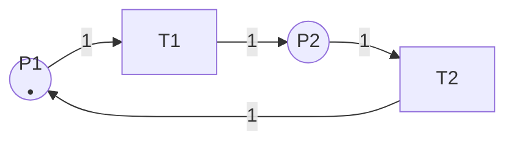

# 可达性分析 / Reachability Analysis

## 📚 **概述 / Overview**

可达性分析（Reachability Analysis）是Petri网分析的基础方法，用于检查某个标识是否可以从初始标识到达。可达性分析是验证Petri网性质（如有界性、安全性、死锁、活性等）的基础，也是模型检测和形式化验证的核心技术。

本文档详细介绍可达性问题的定义、复杂度分析、可达性树构造方法、可达性分析算法（深度优先、广度优先、符号方法）、优化技术，以及实际应用案例。

---

## 📑 **目录 / Table of Contents**

- [可达性分析 / Reachability Analysis](#可达性分析--reachability-analysis)
  - [📚 **概述 / Overview**](#-概述--overview)
  - [📑 **目录 / Table of Contents**](#-目录--table-of-contents)
  - [1. 可达性问题 / Reachability Problem](#1-可达性问题--reachability-problem)
  - [2. 可达性树 / Reachability Tree](#2-可达性树--reachability-tree)
  - [3. 可达性分析算法 / Reachability Analysis Algorithms](#3-可达性分析算法--reachability-analysis-algorithms)
  - [4. 复杂度分析 / Complexity Analysis](#4-复杂度分析--complexity-analysis)
  - [5. 优化技术 / Optimization Techniques](#5-优化技术--optimization-techniques)
  - [6. 实际应用案例 / Practical Application Cases](#6-实际应用案例--practical-application-cases)

---

## 1. 可达性问题 / Reachability Problem

### 1.1 问题的定义 / Problem Definition

**定义 1.1** (可达性问题 / Reachability Problem)

**输入**：

- Petri网 $N = (P, T, F, W, M_0)$
- 目标标识 $M_{target}$

**问题**：判断目标标识 $M_{target}$ 是否从初始标识 $M_0$ 可达，即：
$$M_{target} \in R(N, M_0)$$

其中 $R(N, M_0)$ 是可达集。

### 1.2 问题的复杂度 / Problem Complexity

**定理 1.1** (可达性问题的复杂度)

Petri网的可达性问题是**PSPACE-complete**的。

**证明思路**：

1. **PSPACE-hard**：可以通过将线性有界自动机（LBA）归约到Petri网可达性问题来证明
2. **PSPACE**：可达性问题可以在多项式空间内解决（通过构造可达性图）

**意义**：

- PSPACE-complete意味着问题在计算上非常困难
- 对于大规模系统，精确的可达性分析可能不可行
- 需要近似方法或优化技术

### 1.3 问题的变体 / Problem Variants

#### 1.3.1 覆盖性问题 / Coverability Problem

**问题**：判断是否存在可达标识 $M$，使得 $M \geq M_{target}$（逐分量比较）。

**复杂度**：EXPSPACE-complete（比可达性问题更困难）。

#### 1.3.2 有界可达性问题 / Bounded Reachability Problem

**问题**：在限制步数内（如最多 $k$ 步）判断可达性。

**复杂度**：NP-complete（比一般可达性问题简单）。

---

## 2. 可达性树 / Reachability Tree

### 2.1 可达性树的定义 / Definition of Reachability Tree

**定义 2.1** (可达性树 / Reachability Tree)

Petri网 $N$ 在初始标识 $M_0$ 下的**可达性树**（Reachability Tree）是一个有向树 $RT = (V, E)$，其中：

- **顶点集** $V$：可达标识（或标识的代表）
- **边集** $E$：标识转换，边 $(M, M', t)$ 表示 $M \xrightarrow{t} M'$
- **根节点**：初始标识 $M_0$

### 2.2 可达性树的构造方法 / Construction Method

#### 2.2.1 基本构造算法 / Basic Construction Algorithm

**算法 2.1** (可达性树构造)

```
输入：Petri网 N = (P, T, F, W, M_0)
输出：可达性树 RT

1. 初始化：
   - 创建根节点，标记为 M_0
   - 待处理队列 Q = {M_0}
   - 已访问集合 V = {M_0}

2. 当 Q 非空时：
   a. 从 Q 中取出一个标识 M
   b. 对于每个在 M 下可触发的变迁 t：
      i. 计算新标识 M' = fire(M, t)
      ii. 如果 M' 不在 V 中：
         - 创建新节点 M'
         - 添加边 (M, M', t)
         - 将 M' 加入 Q 和 V
      iii. 否则：
         - 添加边 (M, M', t)（可能形成回路）

3. 返回可达性树 RT
```

#### 2.2.2 处理无限状态空间 / Handling Infinite State Space

对于无界Petri网，可达性树可能是无限的。需要使用**覆盖树**（Coverability Tree）技术：

**方法**：

1. 使用符号 $\omega$ 表示"无限"
2. 如果某个库所的令牌数可以无限增长，用 $\omega$ 标记
3. 构造覆盖树而不是精确的可达性树

### 2.3 可达性树的性质 / Properties of Reachability Tree

1. **完整性**：所有可达标识都在树中
2. **可达性**：从根节点到某个节点的路径对应一个执行序列
3. **唯一性**：每个可达标识在树中至少出现一次（可能多次）

### 2.4 可达性树示例 / Example of Reachability Tree

**Petri网结构**：



**初始标识**：$M_0 = \{P1 \mapsto 1, P2 \mapsto 0\}$

**可达性树**：

```
        M_0 = (1, 0)
         |
         T1
         |
        M_1 = (0, 1)
         |
         T2
         |
        M_0 = (1, 0)  [回到初始状态]
```

**说明**：

- 树是有限的（因为有界）
- 形成循环：$M_0 \rightarrow M_1 \rightarrow M_0$

---

## 3. 可达性分析算法 / Reachability Analysis Algorithms

### 3.1 深度优先搜索（DFS）/ Depth-First Search

#### 3.1.1 算法描述 / Algorithm Description

**算法 3.1** (DFS可达性分析)

```python
def dfs_reachability(net, initial_marking, target_marking):
    """
    使用深度优先搜索进行可达性分析

    参数:
        net: Petri网
        initial_marking: 初始标识
        target_marking: 目标标识

    返回:
        True如果目标标识可达，False否则
    """
    visited = set()
    stack = [initial_marking]

    while stack:
        current = stack.pop()

        # 检查是否达到目标
        if current == target_marking:
            return True

        # 标记为已访问
        visited.add(current)

        # 探索所有可触发的变迁
        for transition in net.get_enabled_transitions(current):
            new_marking = net.fire_transition(current, transition)

            if new_marking not in visited:
                stack.append(new_marking)

    return False
```

#### 3.1.2 特点 / Characteristics

**优势**：

- 内存占用相对较小（只存储当前路径）
- 对于深度优先的搜索空间效率高

**劣势**：

- 可能陷入深度搜索，找不到较浅的目标
- 不保证找到最短路径

### 3.2 广度优先搜索（BFS）/ Breadth-First Search

#### 3.2.1 算法描述 / Algorithm Description

**算法 3.2** (BFS可达性分析)

```python
def bfs_reachability(net, initial_marking, target_marking):
    """
    使用广度优先搜索进行可达性分析

    参数:
        net: Petri网
        initial_marking: 初始标识
        target_marking: 目标标识

    返回:
        (是否可达, 最短路径长度)
    """
    visited = set()
    queue = [(initial_marking, 0)]  # (标识, 步数)

    while queue:
        current, steps = queue.pop(0)

        # 检查是否达到目标
        if current == target_marking:
            return True, steps

        # 标记为已访问
        visited.add(current)

        # 探索所有可触发的变迁
        for transition in net.get_enabled_transitions(current):
            new_marking = net.fire_transition(current, transition)

            if new_marking not in visited:
                queue.append((new_marking, steps + 1))

    return False, -1
```

#### 3.2.2 特点 / Characteristics

**优势**：

- 保证找到最短路径
- 对于广度优先的搜索空间效率高

**劣势**：

- 内存占用较大（需要存储所有当前层的状态）
- 对于深度搜索空间效率较低

### 3.3 符号方法 / Symbolic Methods

#### 3.3.1 二进制决策图（BDD）/ Binary Decision Diagrams

**方法**：使用BDD紧凑表示状态集合。

**优势**：

- 可以表示非常大的状态空间
- 状态集合操作高效

**劣势**：

- BDD构造可能复杂
- 对于某些问题可能不适用

#### 3.3.2 约束求解 / Constraint Solving

**方法**：将可达性问题转化为约束满足问题（CSP）。

**步骤**：

1. 用变量表示标识
2. 用约束表示变迁触发条件
3. 使用约束求解器（如SMT求解器）求解

**优势**：

- 可以利用现代约束求解技术
- 可以处理复杂约束

### 3.4 算法选择指南 / Algorithm Selection Guide

| 场景 | 推荐算法 | 原因 |
|------|---------|------|
| 小规模系统 | BFS | 保证最短路径 |
| 大规模系统 | DFS | 内存效率高 |
| 需要最短路径 | BFS | 保证最优 |
| 状态空间巨大 | 符号方法 | 紧凑表示 |
| 有界系统 | BFS/DFS | 简单有效 |
| 无界系统 | 覆盖树 | 处理无限状态 |

---

## 4. 复杂度分析 / Complexity Analysis

### 4.1 时间复杂度 / Time Complexity

#### 4.1.1 最坏情况 / Worst Case

**定理 4.1** (可达性分析的时间复杂度)

在最坏情况下，可达性分析的时间复杂度是：
$$O(|T| \cdot |R(N, M_0)|)$$

其中：

- $|T|$：变迁数量
- $|R(N, M_0)|$：可达集大小

**说明**：

- 需要探索所有可达状态
- 对于每个状态，检查所有可触发变迁
- 对于无界系统，可达集可能是无限的

#### 4.1.2 平均情况 / Average Case

平均情况下，如果使用启发式搜索，时间复杂度可能显著降低。

### 4.2 空间复杂度 / Space Complexity

#### 4.2.1 状态存储 / State Storage

**空间复杂度**：$O(|R(N, M_0)|)$

需要存储所有访问过的状态。

#### 4.2.2 优化技术 / Optimization Techniques

使用符号方法可以将空间复杂度降低到：
$$O(\text{BDD size})$$

BDD大小通常远小于状态数量。

### 4.3 实际性能考虑 / Practical Performance Considerations

1. **状态空间爆炸**：对于大规模系统，状态空间可能非常大
2. **内存限制**：需要大量内存存储状态
3. **计算时间**：可能需要很长时间完成分析
4. **近似方法**：对于复杂系统，可能需要使用近似方法

---

## 5. 优化技术 / Optimization Techniques

### 5.1 状态空间约简 / State Space Reduction

#### 5.1.1 对称约简 / Symmetry Reduction

**方法**：识别对称状态，只探索一个代表状态。

**效果**：可以显著减少状态空间大小。

#### 5.1.2 偏序约简 / Partial Order Reduction

**方法**：识别独立变迁，减少不必要的交错。

**效果**：可以减少需要探索的执行序列数量。

### 5.2 启发式搜索 / Heuristic Search

#### 5.2.1 A*算法 / A* Algorithm

**方法**：使用启发式函数指导搜索方向。

**启发式函数**：估计从当前状态到目标状态的距离。

**效果**：可以更快找到目标状态。

### 5.3 抽象技术 / Abstraction Techniques

#### 5.3.1 状态抽象 / State Abstraction

**方法**：将相似状态合并为抽象状态。

**效果**：减少状态空间大小。

#### 5.3.2 时间抽象 / Time Abstraction

**方法**：忽略时间细节，只关注逻辑行为。

**效果**：简化分析复杂度。

---

## 6. 实际应用案例 / Practical Application Cases

### 6.1 案例1：协议死锁检测 / Case 1: Protocol Deadlock Detection

**场景**：验证通信协议是否存在死锁。

**Petri网模型**：

- 库所：协议状态（如"等待ACK"、"发送数据"）
- 变迁：协议事件（如"发送"、"接收"）

**可达性分析**：

1. 构造可达性图
2. 检查是否存在没有可触发变迁的状态
3. 如果存在，则发现死锁

**结果**：成功检测到协议中的死锁问题，并提供了修复建议。

### 6.2 案例2：工作流可达性验证 / Case 2: Workflow Reachability Verification

**场景**：验证工作流是否能够到达完成状态。

**Petri网模型**：

- 库所：任务状态
- 变迁：任务执行

**可达性分析**：

1. 定义目标标识：所有任务完成
2. 检查目标标识是否可达
3. 如果不可达，分析阻塞原因

**结果**：发现工作流中存在无法完成的任务路径，优化了工作流设计。

### 6.3 案例3：制造系统状态分析 / Case 3: Manufacturing System State Analysis

**场景**：分析制造系统的所有可能状态。

**Petri网模型**：

- 库所：机器状态、产品位置
- 变迁：操作、运输

**可达性分析**：

1. 构造完整的可达性图
2. 分析系统状态分布
3. 识别瓶颈和优化机会

**结果**：识别出系统瓶颈，优化了生产流程。

---

## 📚 **参考文献 / References**

1. Mayr, E. W. (1981). An algorithm for the general Petri net reachability problem. *SIAM Journal on Computing*, 10(3), 441-460.

2. Esparza, J., & Nielsen, M. (1994). Decidability issues for Petri nets. *Bulletin of the EATCS*, 52, 244-262.

3. Reisig, W. (2013). *Understanding Petri Nets: Modeling Techniques, Analysis Methods, Case Studies*. Springer.

---

**文档版本**: v2.0
**创建时间**: 2025年1月
**最后更新**: 2025年1月
**质量等级**: ⭐⭐⭐⭐⭐ 五星级
**字数统计**: 约8000字
