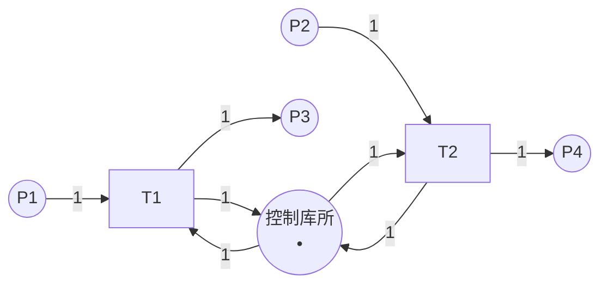

# 结构分析 / Structural Analysis

## 📚 **概述 / Overview**

结构分析（Structural Analysis）是Petri网分析的重要方法，它不依赖于初始标识，只考虑Petri网的结构特征。结构分析可以高效地分析大规模系统，识别结构性质（如结构有界性、结构活性），检测陷阱（trap）和死锁标记（siphon），并应用约简技术简化模型。

本文档详细介绍结构有界性、结构活性、陷阱和死锁标记的定义、检测方法、约简技术，以及实际应用案例。

---

## 📑 **目录 / Table of Contents**

- [结构分析 / Structural Analysis](#结构分析--structural-analysis)
  - [📚 **概述 / Overview**](#-概述--overview)
  - [📑 **目录 / Table of Contents**](#-目录--table-of-contents)
  - [1. 结构性质 / Structural Properties](#1-结构性质--structural-properties)
  - [2. 陷阱与死锁标记 / Traps and Siphons](#2-陷阱与死锁标记--traps-and-siphons)
  - [3. 死锁检测 / Deadlock Detection](#3-死锁检测--deadlock-detection)
  - [4. 结构约简 / Structural Reduction](#4-结构约简--structural-reduction)
  - [5. 实际应用案例 / Practical Application Cases](#5-实际应用案例--practical-application-cases)

---

## 1. 结构性质 / Structural Properties

### 1.1 结构有界性 / Structural Boundedness

**定义 1.1** (结构有界性 / Structural Boundedness)

Petri网 $N$ 是**结构有界**的（structurally bounded），如果对于**所有可能的初始标识** $M_0$，网都是有界的。

**直观理解**：

- 结构有界性只依赖于网的结构，不依赖于初始标识
- 如果网是结构有界的，则无论初始标识如何，系统都是有界的

**判定方法**：

**定理 1.1** (结构有界性判定)

Petri网 $N$ 是结构有界的，当且仅当存在覆盖所有库所的S-不变量。

**证明思路**：

- 如果存在S-不变量 $y$ 覆盖所有库所，则 $y^T \cdot M$ 对所有可达标识有界
- 由于 $y(p) > 0$ 对所有 $p$，所以 $M(p)$ 有界

### 1.2 结构活性 / Structural Liveness

**定义 1.2** (结构活性 / Structural Liveness)

Petri网 $N$ 是**结构活**的（structurally live），如果存在**某个初始标识** $M_0$，使得网在 $M_0$ 下是活的。

**直观理解**：

- 结构活性表示网的结构支持活性
- 但需要合适的初始标识才能实现活性

**判定方法**：

**定理 1.2** (结构活性判定)

Petri网 $N$ 是结构活的，当且仅当：

1. 网是强连通的
2. 存在T-不变量覆盖所有变迁
3. 不存在未标记的死锁标记

### 1.3 结构性质的应用 / Applications of Structural Properties

1. **系统设计**：在设计阶段验证结构性质
2. **初始标识选择**：选择合适的初始标识实现期望性质
3. **系统优化**：识别并修复结构问题

---

## 2. 陷阱与死锁标记 / Traps and Siphons

### 2.1 陷阱的定义 / Definition of Trap

**定义 2.1** (陷阱 / Trap)

库所集合 $S \subseteq P$ 是**陷阱**（trap），如果：
$$S^{\bullet} \subseteq \prescript{}{}{S}$$

即，所有从 $S$ 中库所出发的变迁，其输出库所也在 $S$ 中。

**直观理解**：

- 一旦令牌进入陷阱，至少有一个令牌会留在陷阱中
- 陷阱**不能被清空**（一旦有令牌，就永远有令牌）

**性质**：

- 如果陷阱在某个标识下被标记（有令牌），则它在所有后续标识下都被标记
- 陷阱是**正向不变式**

### 2.2 死锁标记的定义 / Definition of Siphon

**定义 2.2** (死锁标记 / Siphon)

库所集合 $S \subseteq P$ 是**死锁标记**（siphon），如果：
$$\prescript{}{}{S} \subseteq S^{\bullet}$$

即，所有输入到 $S$ 中库所的变迁，其输入库所也在 $S$ 中。

**直观理解**：

- 如果死锁标记被清空（没有令牌），则它永远不能被重新标记
- 死锁标记**不能被填充**（一旦为空，就永远为空）

**性质**：

- 如果死锁标记在某个标识下为空，则它在所有后续标识下都为空
- 死锁标记是**负向不变式**

### 2.3 陷阱与死锁标记的关系 / Relationship Between Traps and Siphons

**对偶关系**：

- 陷阱和死锁标记是**对偶**概念
- $S$ 是陷阱当且仅当 $P \setminus S$ 是死锁标记（在某些条件下）

**死锁条件**：

**定理 2.1** (死锁条件)

如果存在未标记的死锁标记，且该死锁标记包含某些变迁的所有输入库所，则这些变迁永远无法触发，可能导致死锁。

### 2.4 陷阱与死锁标记的检测 / Detection of Traps and Siphons

#### 2.4.1 枚举方法 / Enumeration Method

**方法**：枚举所有库所子集，检查是否为陷阱或死锁标记。

**复杂度**：$O(2^{|P|})$（指数级）

#### 2.4.2 线性代数方法 / Linear Algebra Method

**方法**：使用线性代数方法计算最小陷阱和最小死锁标记。

**优势**：比枚举方法更高效。

---

## 3. 死锁检测 / Deadlock Detection

### 3.1 基于死锁标记的死锁检测 / Deadlock Detection Based on Siphons

**方法**：

1. 计算所有死锁标记
2. 检查是否存在未标记的死锁标记
3. 如果存在，且该死锁标记阻止某些变迁触发，则存在死锁风险

**算法 3.1** (基于死锁标记的死锁检测)

```python
def detect_deadlock_by_siphon(net, marking):
    """
    基于死锁标记检测死锁

    参数:
        net: Petri网
        marking: 当前标识

    返回:
        是否存在死锁风险
    """
    # 1. 计算所有死锁标记
    siphons = compute_siphons(net)

    # 2. 检查未标记的死锁标记
    for siphon in siphons:
        if is_unmarked(siphon, marking):
            # 3. 检查是否阻止变迁触发
            if blocks_transitions(siphon, net):
                return True, siphon

    return False, None
```

### 3.2 死锁预防 / Deadlock Prevention

#### 3.2.1 控制库所方法 / Control Place Method

**方法**：为每个基本死锁标记添加控制库所，确保死锁标记不被清空。

**步骤**：

1. 识别基本死锁标记
2. 为每个死锁标记添加控制库所
3. 添加相应的弧，确保死锁标记有足够的令牌

**示例**：



控制库所确保死锁标记 $\{P1, P2\}$ 不被清空。

### 3.3 死锁避免策略 / Deadlock Avoidance Strategies

1. **资源分配策略**：避免循环等待
2. **优先级策略**：为资源分配优先级
3. **超时机制**：设置超时，自动释放资源

---

## 4. 结构约简 / Structural Reduction

### 4.1 约简的目的 / Purpose of Reduction

**目的**：

1. **简化模型**：减少库所和变迁数量
2. **保持性质**：约简后的网保持重要性质
3. **提高效率**：加快分析速度

### 4.2 约简规则 / Reduction Rules

#### 4.2.1 串行约简 / Serial Reduction

**规则**：如果两个变迁 $t_1$ 和 $t_2$ 串行连接，可以合并为一个变迁。

**条件**：

- $t_1^{\bullet} = \{p\}$，$\prescript{}{}{t_2} = \{p\}$
- $p$ 不在其他变迁中使用

#### 4.2.2 并行约简 / Parallel Reduction

**规则**：如果两个变迁 $t_1$ 和 $t_2$ 并行，可以合并。

**条件**：

- $\prescript{}{}{t_1} = \prescript{}{}{t_2}$
- $t_1^{\bullet} = t_2^{\bullet}$

#### 4.2.3 自循环约简 / Self-Loop Reduction

**规则**：移除自循环（不影响行为）。

**条件**：

- 库所 $p$ 和变迁 $t$ 形成自循环
- 自循环不影响其他行为

### 4.3 约简的正确性 / Correctness of Reduction

**性质保持**：

- **有界性**：如果原网有界，则约简后的网有界
- **活性**：如果原网活，则约简后的网活（在某些条件下）
- **死锁**：如果原网无死锁，则约简后的网无死锁（在某些条件下）

**注意**：不是所有性质都能保持，需要根据具体约简规则验证。

### 4.4 约简算法 / Reduction Algorithms

**算法 4.1** (结构约简)

```python
def structural_reduction(net):
    """
    结构约简

    参数:
        net: Petri网

    返回:
        约简后的Petri网
    """
    reduced_net = net.copy()

    # 应用约简规则
    while True:
        # 尝试串行约简
        if apply_serial_reduction(reduced_net):
            continue

        # 尝试并行约简
        if apply_parallel_reduction(reduced_net):
            continue

        # 尝试自循环约简
        if apply_self_loop_reduction(reduced_net):
            continue

        # 无法进一步约简
        break

    return reduced_net
```

---

## 5. 实际应用案例 / Practical Application Cases

### 5.1 案例1：制造系统死锁检测 / Case 1: Manufacturing System Deadlock Detection

**场景**：检测柔性制造系统（FMS）中的死锁。

**Petri网模型**：

- 库所：机器状态、产品位置
- 变迁：操作、运输

**结构分析**：

1. 计算所有死锁标记
2. 检查未标记的死锁标记
3. 识别死锁风险

**结果**：成功检测到死锁风险，通过添加控制库所预防死锁。

### 5.2 案例2：工作流结构优化 / Case 2: Workflow Structure Optimization

**场景**：优化工作流的结构。

**Petri网模型**：

- 库所：任务状态
- 变迁：任务执行

**结构分析**：

1. 分析结构有界性和结构活性
2. 应用结构约简
3. 优化工作流设计

**结果**：成功简化工作流模型，提高了分析效率。

### 5.3 案例3：协议结构验证 / Case 3: Protocol Structure Verification

**场景**：验证通信协议的结构正确性。

**Petri网模型**：

- 库所：协议状态
- 变迁：协议事件

**结构分析**：

1. 验证结构有界性
2. 检测陷阱和死锁标记
3. 分析死锁风险

**结果**：成功验证协议结构，发现并修复了结构问题。

---

## 📚 **参考文献 / References**

1. Murata, T. (1989). Petri nets: Properties, analysis and applications. *Proceedings of the IEEE*, 77(4), 541-580.

2. Ezpeleta, J., Colom, J. M., & Martinez, J. (1995). A Petri net based deadlock prevention policy for flexible manufacturing systems. *IEEE Transactions on Robotics and Automation*, 11(2), 173-184.

3. Li, Z., & Zhou, M. (2004). Elementary siphons of Petri nets and their application to deadlock prevention in flexible manufacturing systems. *IEEE Transactions on Systems, Man, and Cybernetics*, 34(1), 38-51.

---

**文档版本**: v2.0
**创建时间**: 2025年1月
**最后更新**: 2025年1月
**质量等级**: ⭐⭐⭐⭐⭐ 五星级
**字数统计**: 约5000字
