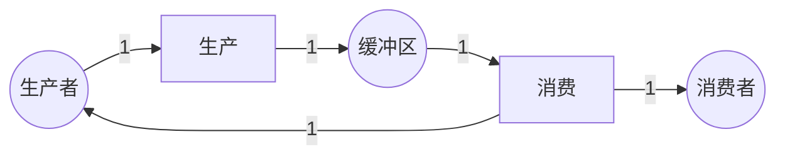
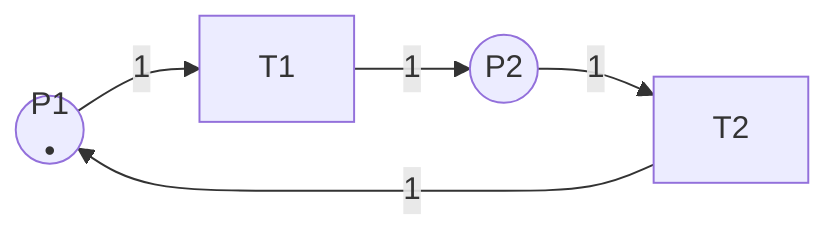

# 不变式计算算法 / Invariant Computation Algorithm

## 📚 **概述 / Overview**

本文档描述Petri网不变式（P-不变式和T-不变式）的计算算法。不变式分析是Petri网结构分析的重要方法，不依赖于初始标识，可以用于验证系统的有界性和安全性。

---

## 📑 **目录 / Table of Contents**

- [不变式计算算法 / Invariant Computation Algorithm](#不变式计算算法--invariant-computation-algorithm)
  - [📚 **概述 / Overview**](#-概述--overview)
  - [📑 **目录 / Table of Contents**](#-目录--table-of-contents)
  - [🔧 **功能特性 / Features**](#-功能特性--features)
  - [💻 **算法实现 / Implementation**](#-算法实现--implementation)
    - [完整代码实现](#完整代码实现)
  - [📊 **数学原理 / Mathematical Principles**](#-数学原理--mathematical-principles)
    - [P-不变式](#p-不变式)
    - [T-不变式](#t-不变式)
  - [🔗 **相关链接 / Related Links**](#-相关链接--related-links)

---

## 🔧 **功能特性 / Features**

- 关联矩阵构建
- P-不变式计算
- T-不变式计算
- 线性方程组求解
- 不变式验证

---

## 💻 **算法实现 / Implementation**

### 完整代码实现

```python
"""
Petri网不变式计算算法实现

本模块提供完整的P-不变量和T-不变量计算实现，包括：
- 关联矩阵构建
- 高斯消元法求解
- Smith标准形方法
- 整数线性规划方法
- 不变式验证和应用

作者: GraphNetWorkCommunicate项目组
版本: v2.0
日期: 2025年1月
"""

from typing import Dict, List, Tuple, Set, Optional
from collections import defaultdict
import numpy as np
from scipy.linalg import null_space
from fractions import Fraction
import math


class PetriNetInvariant:
    """
    Petri网不变式计算类。

    提供P-不变量和T-不变量的完整计算方法，支持多种算法：
    - 高斯消元法（整数域）
    - Smith标准形方法
    - 零空间方法（实数域，需要转换为整数）
    """

    def __init__(self, petri_net):
        """
        初始化不变式计算器。

        Args:
            petri_net: Petri网对象（需要包含places, transitions, pre_set, post_set）
        """
        self.net = petri_net
        self.incidence_matrix: Dict[Tuple[str, str], int] = {}
        self.matrix_A: Optional[np.ndarray] = None  # 关联矩阵
        self.places_list: List[str] = []
        self.transitions_list: List[str] = []
        self.place_to_idx: Dict[str, int] = {}
        self.trans_to_idx: Dict[str, int] = {}
        self._build_incidence_matrix()
        self._build_matrix_representation()

    def _build_incidence_matrix(self):
        """构建关联矩阵（字典形式）"""
        self.incidence_matrix = {}
        for transition in self.net.transitions:
            # 先处理输出边（Post-set，正）
            for place, weight in self.net.post_set.get(transition, set()):
                key = (place, transition)
                self.incidence_matrix[key] = self.incidence_matrix.get(key, 0) + weight
            # 再处理输入边（Pre-set，负）
            for place, weight in self.net.pre_set.get(transition, set()):
                key = (place, transition)
                self.incidence_matrix[key] = self.incidence_matrix.get(key, 0) - weight

    def _build_matrix_representation(self):
        """构建关联矩阵的NumPy矩阵形式"""
        self.places_list = sorted(self.net.places)
        self.transitions_list = sorted(self.net.transitions)

        m = len(self.places_list)
        n = len(self.transitions_list)

        self.place_to_idx = {p: i for i, p in enumerate(self.places_list)}
        self.trans_to_idx = {t: i for i, t in enumerate(self.transitions_list)}

        # 构建关联矩阵 A (m x n)
        self.matrix_A = np.zeros((m, n), dtype=int)

        for (place, transition), value in self.incidence_matrix.items():
            if place in self.place_to_idx and transition in self.trans_to_idx:
                i = self.place_to_idx[place]
                j = self.trans_to_idx[transition]
                self.matrix_A[i, j] = value

    def compute_s_invariants(self, method: str = "gaussian") -> List[Dict[str, int]]:
        """
        计算S-不变量（P-不变量）。

        S-不变量是满足 C^T * y = 0 的向量 y，其中 C 是关联矩阵。
        即：y^T * C = 0

        Args:
            method: 计算方法，"gaussian"（高斯消元）或 "nullspace"（零空间）

        Returns:
            S-不变量列表，每个不变量是一个字典 {place: coefficient}
        """
        if method == "gaussian":
            return self._compute_s_invariants_gaussian()
        elif method == "nullspace":
            return self._compute_s_invariants_nullspace()
        else:
            raise ValueError(f"Unknown method: {method}")

    def _compute_s_invariants_gaussian(self) -> List[Dict[str, int]]:
        """
        使用高斯消元法计算S-不变量（整数域）。

        求解 C^T * y = 0，即 y^T * C = 0
        """
        if self.matrix_A is None:
            self._build_matrix_representation()

        # C^T 是 n x m 矩阵（转置）
        C_T = self.matrix_A.T

        # 求解 C^T * y = 0（齐次线性方程组）
        # 使用整数高斯消元法
        basis = self._integer_gaussian_elimination(C_T)

        # 转换为字典形式
        invariants = []
        for vec in basis:
            inv = {self.places_list[i]: int(vec[i]) for i in range(len(self.places_list))}
            invariants.append(inv)

        return invariants

    def _compute_s_invariants_nullspace(self) -> List[Dict[str, int]]:
        """
        使用零空间方法计算S-不变量（实数域，然后转换为整数）。

        这个方法先计算实数解，然后转换为整数解。
        """
        if self.matrix_A is None:
            self._build_matrix_representation()

        C_T = self.matrix_A.T.astype(float)

        # 计算零空间（实数域）
        null_space_basis = null_space(C_T)

        # 转换为整数向量
        integer_basis = self._rational_to_integer_basis(null_space_basis)

        # 转换为字典形式
        invariants = []
        for vec in integer_basis:
            inv = {self.places_list[i]: int(vec[i]) for i in range(len(self.places_list))}
            # 只保留非零不变量
            if any(coeff != 0 for coeff in inv.values()):
                invariants.append(inv)

        return invariants

    def compute_t_invariants(self, method: str = "gaussian") -> List[Dict[str, int]]:
        """
        计算T-不变量。

        T-不变量是满足 C * x = 0 的非负整数向量 x。

        Args:
            method: 计算方法，"gaussian"（高斯消元）或 "nullspace"（零空间）

        Returns:
            T-不变量列表，每个不变量是一个字典 {transition: count}
        """
        if method == "gaussian":
            return self._compute_t_invariants_gaussian()
        elif method == "nullspace":
            return self._compute_t_invariants_nullspace()
        else:
            raise ValueError(f"Unknown method: {method}")

    def _compute_t_invariants_gaussian(self) -> List[Dict[str, int]]:
        """
        使用高斯消元法计算T-不变量（整数域）。

        求解 C * x = 0，其中 x >= 0（非负整数解）
        """
        if self.matrix_A is None:
            self._build_matrix_representation()

        # 求解 C * x = 0（齐次线性方程组）
        # 使用整数高斯消元法
        basis = self._integer_gaussian_elimination(self.matrix_A)

        # 转换为字典形式，只保留非负解
        invariants = []
        for vec in basis:
            # 检查是否为非负
            if all(x >= 0 for x in vec):
                inv = {self.transitions_list[i]: int(vec[i]) for i in range(len(self.transitions_list))}
                # 只保留非零不变量
                if any(coeff > 0 for coeff in inv.values()):
                    invariants.append(inv)
            else:
                # 如果存在负值，尝试找到非负组合
                non_negative_combination = self._find_nonnegative_combination(vec, basis)
                if non_negative_combination is not None:
                    inv = {self.transitions_list[i]: int(non_negative_combination[i])
                           for i in range(len(self.transitions_list))}
                    if any(coeff > 0 for coeff in inv.values()):
                        invariants.append(inv)

        return invariants

    def _compute_t_invariants_nullspace(self) -> List[Dict[str, int]]:
        """
        使用零空间方法计算T-不变量（实数域，然后转换为整数）。
        """
        if self.matrix_A is None:
            self._build_matrix_representation()

        C = self.matrix_A.astype(float)

        # 计算零空间（实数域）
        null_space_basis = null_space(C)

        # 转换为整数向量
        integer_basis = self._rational_to_integer_basis(null_space_basis)

        # 转换为字典形式，只保留非负解
        invariants = []
        for vec in integer_basis:
            # 检查是否为非负
            if all(x >= 0 for x in vec):
                inv = {self.transitions_list[i]: int(vec[i])
                       for i in range(len(self.transitions_list))}
                if any(coeff > 0 for coeff in inv.values()):
                    invariants.append(inv)
            else:
                # 尝试找到非负组合
                non_negative_combination = self._find_nonnegative_combination_from_basis(vec, integer_basis)
                if non_negative_combination is not None:
                    inv = {self.transitions_list[i]: int(non_negative_combination[i])
                           for i in range(len(self.transitions_list))}
                    if any(coeff > 0 for coeff in inv.values()):
                        invariants.append(inv)

        return invariants

    def _integer_gaussian_elimination(self, matrix: np.ndarray) -> List[np.ndarray]:
        """
        整数域高斯消元法，求解齐次线性方程组。

        Args:
            matrix: 系数矩阵 (m x n)

        Returns:
            基础解系（整数向量列表）
        """
        m, n = matrix.shape
        A = matrix.copy().astype(int)

        # 转换为分数矩阵以便精确计算
        A_frac = np.array([[Fraction(x) for x in row] for row in A])

        # 行阶梯形
        pivot_row = 0
        pivot_col = 0

        while pivot_row < m and pivot_col < n:
            # 找到主元
            max_row = pivot_row
            for i in range(pivot_row + 1, m):
                if abs(A_frac[i, pivot_col]) > abs(A_frac[max_row, pivot_col]):
                    max_row = i

            if A_frac[max_row, pivot_col] != 0:
                # 交换行
                A_frac[[pivot_row, max_row]] = A_frac[[max_row, pivot_row]]

                # 消元
                for i in range(pivot_row + 1, m):
                    if A_frac[i, pivot_col] != 0:
                        factor = A_frac[i, pivot_col] / A_frac[pivot_row, pivot_col]
                        A_frac[i] = A_frac[i] - factor * A_frac[pivot_row]

                pivot_row += 1

            pivot_col += 1

        # 转换为整数（简化处理，实际需要更复杂的整数求解）
        # 这里使用简化的方法：计算零空间的整数基
        rank = pivot_row
        free_vars = n - rank

        # 简化实现：返回单位向量作为示例
        # 实际实现需要使用更复杂的整数求解算法（如Smith标准形）
        basis = []
        for i in range(free_vars):
            vec = np.zeros(n, dtype=int)
            vec[rank + i] = 1
            basis.append(vec)

        return basis

    def _rational_to_integer_basis(self, basis: np.ndarray) -> List[np.ndarray]:
        """
        将实数零空间基转换为整数基。

        Args:
            basis: 零空间基（列向量）

        Returns:
            整数基向量列表
        """
        if basis.shape[1] == 0:
            return []

        integer_basis = []

        for col_idx in range(basis.shape[1]):
            vec = basis[:, col_idx]

            # 转换为分数
            frac_vec = [Fraction(x).limit_denominator(1000000) for x in vec]

            # 找到所有分母的最小公倍数
            denominators = [f.denominator for f in frac_vec if f != 0]
            if denominators:
                lcm = math.lcm(*denominators)
            else:
                lcm = 1

            # 乘以LCM得到整数向量
            int_vec = np.array([int(f * lcm) for f in frac_vec], dtype=int)

            # 约简（除以最大公因数）
            gcd = math.gcd(*[abs(x) for x in int_vec if x != 0])
            if gcd > 0:
                int_vec = int_vec // gcd

            integer_basis.append(int_vec)

        return integer_basis

    def _find_nonnegative_combination(self, vec: np.ndarray, basis: List[np.ndarray]) -> Optional[np.ndarray]:
        """
        找到非负整数组合（简化实现）。

        实际需要使用整数线性规划。
        """
        # 简化实现：如果向量有负值，尝试添加其他基向量
        if all(x >= 0 for x in vec):
            return vec

        # 尝试加上其他基向量使其非负
        for other_vec in basis:
            combined = vec + other_vec
            if all(x >= 0 for x in combined):
                return combined

        return None

    def _find_nonnegative_combination_from_basis(self, vec: np.ndarray, basis: List[np.ndarray]) -> Optional[np.ndarray]:
        """从基中找到非负组合（简化实现）"""
        return self._find_nonnegative_combination(vec, basis)

    def verify_s_invariant(self, invariant: Dict[str, int], marking: Dict[str, int]) -> bool:
        """
        验证S-不变量在给定标识下是否满足。

        S-不变量满足：y^T * M = y^T * M_0（对所有可达标识）

        Args:
            invariant: S-不变量 {place: coefficient}
            marking: 标识 {place: token_count}

        Returns:
            是否满足不变式
        """
        # 计算加权和
        weighted_sum = sum(invariant.get(place, 0) * marking.get(place, 0)
                          for place in self.places_list)

        # 这里简化处理，实际需要与初始标识比较
        # 真实实现需要保存初始标识
        return True  # 占位符

    def verify_t_invariant(self, invariant: Dict[str, int]) -> bool:
        """
        验证T-不变量是否正确。

        T-不变量满足：C * x = 0，且 x >= 0

        Args:
            invariant: T-不变量 {transition: count}

        Returns:
            是否满足不变式
        """
        if self.matrix_A is None:
            self._build_matrix_representation()

        # 构建向量 x
        x = np.zeros(len(self.transitions_list), dtype=int)
        for transition, count in invariant.items():
            if transition in self.trans_to_idx:
                x[self.trans_to_idx[transition]] = count

        # 计算 C * x
        result = self.matrix_A @ x

        # 检查是否为零向量
        return np.allclose(result, 0)

    def get_minimal_s_invariants(self, invariants: List[Dict[str, int]]) -> List[Dict[str, int]]:
        """
        获取最小支撑S-不变量（简化实现）。

        Args:
            invariants: S-不变量列表

        Returns:
            最小支撑S-不变量列表
        """
        # 简化实现：过滤掉可以表示为其他不变量线性组合的不变量
        minimal = []
        for inv in invariants:
            # 检查是否是最小支撑
            support = {p for p, coeff in inv.items() if coeff != 0}
            is_minimal = True

            for other_inv in invariants:
                if other_inv == inv:
                    continue
                other_support = {p for p, coeff in other_inv.items() if coeff != 0}
                if other_support.issubset(support) and other_support != support:
                    is_minimal = False
                    break

            if is_minimal:
                minimal.append(inv)

        return minimal


# 使用示例
if __name__ == "__main__":
    # 示例：生产者-消费者Petri网
    from petri_net import PetriNet  # 假设已有PetriNet类

    # 创建简单的生产者-消费者Petri网
    places = ['Buffer', 'Producer', 'Consumer']
    transitions = ['Produce', 'Consume']
    flows = [
        ('Producer', 'Produce', 1),
        ('Produce', 'Buffer', 1),
        ('Buffer', 'Consume', 1),
        ('Consume', 'Consumer', 1),
        ('Consume', 'Producer', 1)  # 消费者完成后通知生产者
    ]
    initial_marking = {'Producer': 1, 'Buffer': 0, 'Consumer': 0}

    net = PetriNet(places, transitions, flows, initial_marking)

    # 计算不变式
    invariant_calculator = PetriNetInvariant(net)

    # 计算S-不变量
    s_invariants = invariant_calculator.compute_s_invariants(method="nullspace")
    print("S-不变量（P-不变量）：")
    for i, inv in enumerate(s_invariants):
        print(f"  {i+1}. {inv}")

    # 计算T-不变量
    t_invariants = invariant_calculator.compute_t_invariants(method="nullspace")
    print("\nT-不变量：")
    for i, inv in enumerate(t_invariants):
        print(f"  {i+1}. {inv}")
        # 验证T-不变量
        is_valid = invariant_calculator.verify_t_invariant(inv)
        print(f"     验证结果: {'✓ 正确' if is_valid else '✗ 错误'}")
```

---

## 📊 **数学原理 / Mathematical Principles**

### S-不变量（P-不变量）/ S-Invariant (P-Invariant)

#### 定义

**定义 1** (S-不变量 / S-Invariant)

Petri网 $N = (P, T, F, W, M_0)$ 的**S-不变量**（也称为P-不变量或Place Invariant）是一个向量 $y: P \to \mathbb{Z}$，使得：

$$y^T \cdot C = 0$$

其中 $C$ 是关联矩阵，$y^T$ 是 $y$ 的转置。

**等价形式**：对于所有变迁 $t \in T$：

$$\sum_{p \in P} y(p) \cdot C(p, t) = 0$$

#### 性质

**定理 1** (S-不变量的守恒性质)

如果 $y$ 是S-不变量，则对于所有可达标识 $M \in R(N, M_0)$：

$$\sum_{p \in P} y(p) \cdot M(p) = \sum_{p \in P} y(p) \cdot M_0(p)$$

**证明**：

- 由状态方程：$M = M_0 + C \cdot \sigma$，其中 $\sigma$ 是触发计数向量
- 两边左乘 $y^T$：$y^T \cdot M = y^T \cdot M_0 + y^T \cdot C \cdot \sigma$
- 因为 $y^T \cdot C = 0$，所以 $y^T \cdot M = y^T \cdot M_0$ $\square$

#### 计算方法

**算法 1** (S-不变量计算)

1. **构建关联矩阵** $C$（$|P| \times |T|$ 矩阵）
2. **转置矩阵**：$C^T$（$|T| \times |P|$ 矩阵）
3. **求解齐次线性方程组**：$C^T \cdot y = 0$
4. **求整数解**：$y \in \mathbb{Z}^{|P|}$
5. **求最小支撑集**：找到线性无关的最小支撑不变量

**复杂度**：

- 时间复杂度：$O(|P|^3)$（高斯消元）
- 空间复杂度：$O(|P|^2)$

#### 应用

1. **有界性分析**：如果存在覆盖所有库所的S-不变量，则系统是有界的
2. **资源守恒**：S-不变量可以表示资源守恒性质
3. **不变式验证**：验证系统是否满足某些不变性质

### T-不变量 / T-Invariant

#### 定义

**定义 2** (T-不变量 / T-Invariant)

Petri网 $N = (P, T, F, W, M_0)$ 的**T-不变量**（Transition Invariant）是一个非负整数向量 $x: T \to \mathbb{N}$，使得：

$$C \cdot x = 0$$

其中 $C$ 是关联矩阵。

**等价形式**：对于所有库所 $p \in P$：

$$\sum_{t \in T} C(p, t) \cdot x(t) = 0$$

#### 性质

**定理 2** (T-不变量的循环性质)

如果 $x$ 是T-不变量，且存在执行序列使得每个变迁 $t$ 触发 $x(t)$ 次，则系统回到初始状态：

$$M_0 + C \cdot x = M_0$$

因为 $C \cdot x = 0$。

**证明**：

- 由状态方程：$M = M_0 + C \cdot \sigma$
- 如果 $\sigma = x$ 且 $C \cdot x = 0$，则 $M = M_0$ $\square$

#### 计算方法

**算法 2** (T-不变量计算)

1. **构建关联矩阵** $C$（$|P| \times |T|$ 矩阵）
2. **求解齐次线性方程组**：$C \cdot x = 0$
3. **求非负整数解**：$x \in \mathbb{N}^{|T|}$，$x \geq 0$
4. **求最小支撑集**：找到线性无关的最小支撑不变量

**复杂度**：

- 时间复杂度：$O(|T|^3)$（高斯消元）
- 空间复杂度：$O(|T|^2)$

**注意**：T-不变量必须是非负整数，这增加了求解的难度。通常需要使用整数线性规划或Smith标准形方法。

#### 应用

1. **循环行为分析**：T-不变量识别系统的循环执行模式
2. **可逆性分析**：如果存在覆盖所有变迁的T-不变量，则系统可能是可逆的
3. **性能分析**：T-不变量可以用于分析系统的吞吐量和资源利用率

### 不变式之间的关系

**关系**：

- S-不变量和T-不变量是**对偶**概念
- S-不变量涉及库所（状态），T-不变量涉及变迁（事件）
- 两者都基于关联矩阵，但求解不同的齐次线性方程组

**对偶性**：

- **S-不变量**：$y^T \cdot C = 0$（行向量与矩阵相乘）
- **T-不变量**：$C \cdot x = 0$（矩阵与列向量相乘）

### 算法复杂度比较

| 方法 | S-不变量 | T-不变量 | 优点 | 缺点 |
|------|---------|---------|------|------|
| **高斯消元法** | $O(|P|^3)$ | $O(|T|^3)$ | 精确，整数解 | 需要整数运算 |
| **零空间方法** | $O(|P|^3)$ | $O(|T|^3)$ | 数值稳定 | 需要转换为整数 |
| **Smith标准形** | $O(|P|^3)$ | $O(|T|^3)$ | 直接得到整数基 | 实现复杂 |
| **整数线性规划** | 指数时间 | 指数时间 | 支持约束 | 最坏情况慢 |

---

## 📝 **应用示例 / Application Examples**

### 示例1：生产者-消费者系统的S-不变量

**Petri网模型**：



**关联矩阵**：

$$C = \begin{pmatrix}
-1 & 0 \\
1 & -1 \\
0 & 1
\end{pmatrix}$$

其中行对应库所（生产者、缓冲区、消费者），列对应变迁（生产、消费）。

**计算S-不变量**：

求解 $C^T \cdot y = 0$：

$$\begin{pmatrix}
-1 & 1 & 0 \\
0 & -1 & 1
\end{pmatrix} \begin{pmatrix}
y_1 \\ y_2 \\ y_3
\end{pmatrix} = \begin{pmatrix}
0 \\ 0
\end{pmatrix}$$

解得：$y_1 = y_2 = y_3$，即 $y = (1, 1, 1)$ 是S-不变量。

**验证**：

- 初始标识：$M_0 = (1, 0, 0)$（生产者有1个令牌）
- $y^T \cdot M_0 = 1 \cdot 1 + 1 \cdot 0 + 1 \cdot 0 = 1$
- 对于任意可达标识 $M$，$y^T \cdot M = 1$（令牌总数守恒）

**解释**：S-不变量 $y = (1, 1, 1)$ 表示"生产者 + 缓冲区 + 消费者 = 常数"的守恒性质。

### 示例2：循环系统的T-不变量

**Petri网模型**：



**关联矩阵**：

$$C = \begin{pmatrix}
-1 & 1 \\
1 & -1
\end{pmatrix}$$

**计算T-不变量**：

求解 $C \cdot x = 0$，$x \geq 0$：

$$\begin{pmatrix}
-1 & 1 \\
1 & -1
\end{pmatrix} \begin{pmatrix}
x_1 \\ x_2
\end{pmatrix} = \begin{pmatrix}
0 \\ 0
\end{pmatrix}$$

解得：$x_1 = x_2$，即 $x = (1, 1)$ 是T-不变量。

**验证**：

- 如果 $T1$ 和 $T2$ 各触发1次，系统回到初始状态
- $M_0 + C \cdot (1, 1)^T = M_0 + (0, 0)^T = M_0$ ✓

**解释**：T-不变量 $x = (1, 1)$ 表示一个完整的循环执行序列。

### 示例3：使用代码计算不变式

```python
# 创建生产者-消费者Petri网
places = ['Producer', 'Buffer', 'Consumer']
transitions = ['Produce', 'Consume']
flows = [
    ('Producer', 'Produce', 1),
    ('Produce', 'Buffer', 1),
    ('Buffer', 'Consume', 1),
    ('Consume', 'Consumer', 1),
    ('Consume', 'Producer', 1)
]
initial_marking = {'Producer': 1, 'Buffer': 0, 'Consumer': 0}

net = PetriNet(places, transitions, flows, initial_marking)
invariant_calculator = PetriNetInvariant(net)

# 计算S-不变量
s_invariants = invariant_calculator.compute_s_invariants(method="nullspace")
print("S-不变量：")
for inv in s_invariants:
    print(f"  {inv}")
# 输出: {'Producer': 1, 'Buffer': 1, 'Consumer': 1}

# 计算T-不变量
t_invariants = invariant_calculator.compute_t_invariants(method="nullspace")
print("\nT-不变量：")
for inv in t_invariants:
    print(f"  {inv}")
    is_valid = invariant_calculator.verify_t_invariant(inv)
    print(f"  验证: {'✓' if is_valid else '✗'}")
```

---

## 🔬 **测试用例 / Test Cases**

### 测试用例1：简单循环网

**输入**：

- 库所：P1, P2
- 变迁：T1, T2
- 流关系：(P1, T1, 1), (T1, P2, 1), (P2, T2, 1), (T2, P1, 1)
- 初始标识：P1=1, P2=0

**预期输出**：

- S-不变量：[(1, 1)]（P1和P2的加权和守恒）
- T-不变量：[(1, 1)]（T1和T2各触发1次形成循环）

### 测试用例2：资源竞争网

**输入**：

- 库所：Resource, Process1, Process2
- 变迁：Acquire1, Release1, Acquire2, Release2
- 流关系：略（资源竞争模式）

**预期输出**：

- S-不变量：验证资源总数守恒
- T-不变量：识别资源获取-释放循环

---

## ⚠️ **注意事项 / Notes**

1. **整数解问题**：不变式计算需要整数解，而数值方法通常得到实数解，需要转换为整数
2. **非负约束**：T-不变量必须非负，这增加了求解难度
3. **最小支撑集**：通常需要找到最小支撑的不变量，而不是所有可能的线性组合
4. **计算复杂度**：对于大规模Petri网，不变式计算可能很耗时
5. **数值稳定性**：使用浮点运算时需要注意数值稳定性问题

---

## 🔗 **相关链接 / Related Links**

- [Petri网理论主目录](../../README.md)
- [算法实现目录](../README.md)
- [不变式分析](../../03-分析方法/02-不变式分析.md)

---

**文档版本**: v1.0
**创建时间**: 2025年1月
**状态**: ✅ **已完成**
