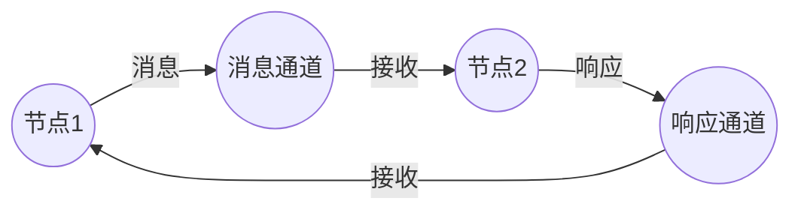

# Petri网跨模块关联与统一框架 / Cross-Module Relationships and Unified Framework

## 📚 **概述 / Overview**

本文档详细阐述Petri网与其他理论模块（图论基础、分布式系统、动态图论、拓扑模型等）之间的深层关联，建立统一的理论框架和认知模式。

---

## 📑 **目录 / Table of Contents**

- [Petri网跨模块关联与统一框架](#petri网跨模块关联与统一框架--cross-module-relationships-and-unified-framework)
  - [📚 **概述 / Overview**](#-概述--overview)
  - [📑 **目录 / Table of Contents**](#-目录--table-of-contents)
  - [1. Petri网与图论基础的关联 / Relationship with Graph Theory](#1-petri网与图论基础的关联--relationship-with-graph-theory)
  - [2. Petri网与分布式系统的关联 / Relationship with Distributed Systems](#2-petri网与分布式系统的关联--relationship-with-distributed-systems)
  - [3. Petri网与动态图论的关联 / Relationship with Dynamic Graph Theory](#3-petri网与动态图论的关联--relationship-with-dynamic-graph-theory)
  - [4. Petri网与拓扑模型的关联 / Relationship with Topological Models](#4-petri网与拓扑模型的关联--relationship-with-topological-models)
  - [5. 统一理论框架 / Unified Theoretical Framework](#5-统一理论框架--unified-theoretical-framework)
  - [6. 应用场景关联 / Application Scenario Relationships](#6-应用场景关联--application-scenario-relationships)

---

## 1. Petri网与图论基础的关联 / Relationship with Graph Theory

### 1.1 结构层面的关联

#### 1.1.1 有向二分图基础

**定理 1.1** (Petri网的有向二分图结构)

Petri网 $N = (P, T, F, W, M_0)$ 的底层结构是一个**有向二分图** $G = (V, E)$，其中：

- **顶点集**：$V = P \cup T$，划分为两个不相交的集合 $P$ 和 $T$
- **边集**：$E = F \subseteq (P \times T) \cup (T \times P)$
- **二分性**：$P \cap T = \emptyset$，且 $\forall e \in E$，$e$ 连接 $P$ 和 $T$ 之间的顶点

**与图论基础的映射**：

| Petri网概念 | 图论概念 | 说明 |
|------------|---------|------|
| 库所 $P$ | 二分图的一个顶点集 | 表示资源或状态 |
| 变迁 $T$ | 二分图的另一个顶点集 | 表示事件或操作 |
| 流关系 $F$ | 有向边集 | 表示依赖关系 |
| 权重 $W$ | 边权重 | 表示令牌数量或资源消耗 |

#### 1.1.2 图论性质在Petri网中的应用

**强连通性**：

- **定义**：Petri网的有向二分图 $G$ 是强连通的，如果 $\forall u, v \in V$，存在从 $u$ 到 $v$ 的有向路径
- **Petri网意义**：强连通性对应Petri网的**结构活性**
- **应用**：用于判断是否存在使网活化的初始标识

**路径分析**：

- **最短路径**：从库所 $p_1$ 到库所 $p_2$ 的最短路径长度对应最小触发序列长度
- **最长路径**：用于分析最大执行时间和资源需求
- **路径枚举**：所有路径对应所有可能的执行序列

**度分析**：

- **出度**：库所 $p$ 的出度 $deg^+(p) = |p^{\bullet}|$ 表示从 $p$ 出发的变迁数
- **入度**：库所 $p$ 的入度 $deg^-(p) = |\prescript{}{}{p}|$ 表示进入 $p$ 的变迁数
- **应用**：度分布分析可以揭示系统的并发模式和瓶颈

### 1.2 算法层面的关联

#### 1.2.1 图遍历算法在Petri网中的应用

**深度优先搜索（DFS）**：

```python
def dfs_reachability_analysis(petri_net, initial_marking):
    """
    使用DFS进行可达性分析（基于图遍历）
    """
    visited = set()
    reachable_states = []

    def dfs(current_marking):
        if current_marking in visited:
            return
        visited.add(current_marking)
        reachable_states.append(current_marking)

        # 找到所有可达的"邻居"状态（通过变迁触发）
        for transition in petri_net.transitions:
            if petri_net.is_enabled(transition, current_marking):
                next_marking = petri_net.fire_transition(transition, current_marking)
                dfs(next_marking)

    dfs(initial_marking)
    return reachable_states
```

**广度优先搜索（BFS）**：

- 用于构造可达性图
- 找到最短执行路径
- 检测死锁状态

**拓扑排序**：

- 在Petri网中，拓扑排序可以找到满足依赖关系的变迁执行顺序
- 用于工作流分析和任务调度

#### 1.2.2 图匹配算法

**子图同构**：

- 检测Petri网中是否存在特定的模式（如死锁模式）
- 工作流模式识别

**最大匹配**：

- 在资源分配问题中，最大匹配对应最优资源分配
- 分布式系统中的任务分配

### 1.3 理论层面的关联

#### 1.3.1 图的分解定理

**强连通分量（SCC）分解**：

- Petri网的有向图可以分解为强连通分量
- 每个SCC对应一个**循环子系统**
- 用于简化分析和约简

**双连通分量分解**：

- 识别Petri网中的关键节点（割点）
- 用于故障分析和可靠性评估

#### 1.3.2 图着色理论

**库所着色**：

- 在着色Petri网中，库所可以有不同的颜色（类型）
- 对应图着色问题：相邻库所不能有冲突的颜色
- 用于资源类型管理和类型安全

### 1.4 与图论基础模块的具体关联点

**关联文档**：

- `01-图论基础/02-有向图/` - Petri网作为有向二分图的特例
- `01-图论基础/03-二分图/` - Petri网的二分图结构
- `01-图论基础/05-图的遍历/` - 可达性分析算法
- `01-图论基础/06-最短路径/` - 最优执行路径分析

---

## 2. Petri网与分布式系统的关联 / Relationship with Distributed Systems

### 2.1 建模层面的关联

#### 2.1.1 分布式系统的Petri网建模

**节点建模**：

- **库所表示**：节点状态（空闲、运行、等待）
- **变迁表示**：节点操作（启动、执行、停止）
- **令牌表示**：节点上的进程或任务

**通信建模**：



- **库所**：消息通道、缓冲区
- **变迁**：消息发送、消息接收
- **令牌**：消息本身

#### 2.1.2 分布式算法建模

**共识算法（Consensus）**：

**Raft协议的Petri网模型**：

- **库所**：Follower状态、Candidate状态、Leader状态、日志条目
- **变迁**：选举、心跳、日志复制、提交
- **性质验证**：使用模型检测验证安全性（不会同时存在多个Leader）

**两阶段提交（2PC）**：

- **库所**：准备状态、提交状态、中止状态
- **变迁**：Prepare、Vote、Commit、Abort
- **性质验证**：验证原子性（所有参与者要么全部提交，要么全部中止）

### 2.2 性质层面的关联

#### 2.2.1 一致性性质

**线性一致性（Linearizability）**：

- Petri网可以建模操作的偏序关系
- 验证操作序列是否满足线性一致性
- 使用可达性分析检查所有可能的执行顺序

**因果一致性（Causal Consistency）**：

- 使用向量时钟在Petri网中表示因果关系
- 着色Petri网可以建模向量时钟的更新
- 验证因果顺序是否得到保证

#### 2.2.2 容错性质

**故障恢复**：

- 使用Petri网建模故障和恢复过程
- 验证系统是否能够从故障中恢复
- 分析恢复时间和数据一致性

**拜占庭容错**：

- 建模恶意节点行为
- 验证在存在故障节点的情况下系统是否仍然正确
- 分析容错阈值（最多容忍多少个故障节点）

### 2.3 算法层面的关联

#### 2.3.1 分布式Petri网

**定义**：分布式Petri网是Petri网的扩展，其中：

- 库所和变迁分布在不同节点上
- 通信通过消息传递实现
- 每个节点维护部分Petri网状态

**应用**：

- 大规模系统的分布式建模
- 去中心化工作流
- 区块链智能合约建模

### 2.4 与分布式系统模块的具体关联点

**关联文档**：

- `07-分布式系统/01-分布式一致性/` - Petri网建模共识算法
- `07-分布式系统/02-分布式事务/` - 2PC/3PC的Petri网模型
- `07-分布式系统/03-分布式锁/` - 锁协议的Petri网验证
- `07-分布式系统/04-消息传递/` - 消息传递系统的Petri网建模

---

## 3. Petri网与动态图论的关联 / Relationship with Dynamic Graph Theory

### 3.1 时间演化的关联

#### 3.1.1 时间Petri网与时间图

**时间Petri网（TPN）**：

- 变迁有时间约束 $[a, b]$
- 对应时间图中的时间边
- 时间图分析可以用于TPN的时序验证

**关联**：

| 时间Petri网 | 时间图 |
|------------|--------|
| 变迁触发时间约束 | 边的时间属性 |
| 时间状态空间 | 时间图快照序列 |
| 时间可达性 | 时间路径可达性 |

#### 3.1.2 动态行为建模

**状态演化**：

- Petri网的标识演化对应动态图的节点状态变化
- 可达性图对应动态图的时间序列
- 使用动态图分析方法分析Petri网的长期行为

**网络演化**：

- Petri网结构的变化（动态Petri网）对应动态图的结构演化
- 可以建模系统重构、节点加入/离开等场景

### 3.2 并发语义的关联

#### 3.2.1 真并发与偏序

**Petri网的真并发语义**：

- 独立变迁可以同时触发（真并发）
- 对应动态图中的并行路径
- 偏序执行对应动态图中的偏序结构

**Mazurkiewicz迹**：

- Petri网的发生序列可以划分为Mazurkiewicz迹
- 每个迹对应动态图中的一个等价类
- 用于简化分析和状态空间约简

### 3.3 与动态图论模块的具体关联点

**关联文档**：

- `02-动态图论/01-时间图/` - 时间Petri网的时序分析
- `02-动态图论/02-动态演化/` - Petri网结构演化
- `02-动态图论/03-并发模型/` - 真并发语义

---

## 4. Petri网与拓扑模型的关联 / Relationship with Topological Models

### 4.1 拓扑结构的关联

#### 4.1.1 网拓扑（Net Topology）

**通用网论（GNT）中的网拓扑**：

- Petri网是网拓扑的特例
- 网拓扑研究无向网的连续与离散性质
- 同步距离、并发公理等概念量化了因果序与空间邻接的关系

**同步距离**：

- 两个变迁的同步距离定义为它们在所有执行序列中的最大时间差
- 对应拓扑中的距离度量
- 用于分析系统的并发程度

#### 4.1.2 事件结构与单纯复形

**事件结构（Event Structure）**：

- Petri网的展开（unfolding）产生事件结构
- 事件结构是拓扑空间中的离散结构
- 对应单纯复形（Simplicial Complex）的构造

**关联**：

- Petri网 → 展开 → 事件结构 → 单纯复形
- 每个路径对应一个单纯形
- 使用同调理论分析Petri网的结构性质

### 4.2 范畴论视角

#### 4.2.1 Petri网作为范畴

**触发范畴**：

- Petri网的变迁触发关系构成一个范畴
- 对象：标识（状态）
- 态射：变迁触发

**函子表示**：

- Petri网的动态行为可以建模为从触发范畴到集合范畴的函子
- 统一了静态结构与动态语义
- 与拓扑斯理论（Topos Theory）中的层（Sheaf）构造相关

### 4.3 与拓扑模型模块的具体关联点

**关联文档**：

- `03-拓扑模型/01-网拓扑/` - Petri网的拓扑结构
- `03-拓扑模型/02-事件结构/` - Petri网的展开
- `03-拓扑模型/03-范畴论方法/` - 范畴论视角

---

## 5. 统一理论框架 / Unified Theoretical Framework

### 5.1 离散事件动态系统（DEDS）框架

**Petri网作为DEDS模型**：

Petri网和动态图论都是**离散事件动态系统（Discrete Event Dynamic Systems, DEDS）**的标准模型。

**统一特征**：

1. **离散状态空间**：状态集合是离散的
2. **事件驱动**：状态转换由事件触发
3. **并发性**：支持并发事件
4. **非确定性**：可能存在多个可能的执行路径

**分析方法统一**：

- **线性代数方法**：关联矩阵、状态方程
- **图论方法**：可达性图、路径分析
- **随机过程**：随机Petri网、时序图
- **形式化验证**：模型检测、不变式分析

### 5.2 通用网论（GNT）框架

**GNT的五大组件**：

1. **同步论**：研究事件同步
2. **并发论**：研究并发语义
3. **网逻辑**：研究逻辑性质
4. **网拓扑**：研究拓扑结构
5. **信息流网**：研究信息流动

**Petri网在GNT中的位置**：

- Petri网是GNT中**特殊网论（SNT）**的核心
- GNT提供了更通用的框架，包含无向网、连续网等
- Petri网的性质可以在GNT框架中统一理解

### 5.3 认知框架统一

**统一的认知模式**：

| 层面 | 图论基础 | Petri网 | 动态图论 | 拓扑模型 |
|------|---------|---------|---------|---------|
| **静态结构** | 图 $G=(V,E)$ | 有向二分图 $(P,T,F)$ | 时间图 | 单纯复形 |
| **动态行为** | 路径、遍历 | 变迁触发、标识演化 | 时间演化 | 同调演化 |
| **分析方法** | 图算法 | 可达性、不变量 | 时间分析 | 拓扑不变量 |
| **应用领域** | 网络分析 | 并发系统 | 时序系统 | 几何结构 |

**认知路径**：

```
图论基础（静态结构）
    ↓
Petri网（状态+结构）
    ↓
动态图论（时间演化）
    ↓
拓扑模型（几何结构）
```

---

## 6. 应用场景关联 / Application Scenario Relationships

### 6.1 工作流系统

**关联模块**：

- **Petri网**：工作流建模（工作流网）
- **图论基础**：工作流图的拓扑分析
- **分布式系统**：分布式工作流执行
- **动态图论**：工作流的动态演化

**统一应用**：

```python
# 工作流的统一建模框架
class UnifiedWorkflowModel:
    """
    统一工作流模型，整合Petri网、图论和分布式系统
    """
    def __init__(self):
        self.petri_net = None      # Petri网模型
        self.workflow_graph = None  # 图论模型
        self.distributed_nodes = [] # 分布式节点
        self.time_evolution = []    # 时间演化序列

    def analyze_workflow(self):
        # 1. 使用Petri网验证正确性
        petri_analysis = self.petri_net.check_soundness()

        # 2. 使用图论分析结构
        graph_analysis = self.analyze_graph_structure()

        # 3. 使用分布式系统分析执行
        distributed_analysis = self.analyze_distributed_execution()

        # 4. 使用动态图论分析演化
        evolution_analysis = self.analyze_time_evolution()

        return {
            'petri': petri_analysis,
            'graph': graph_analysis,
            'distributed': distributed_analysis,
            'evolution': evolution_analysis
        }
```

### 6.2 网络协议验证

**关联模块**：

- **Petri网**：协议状态机建模
- **图论基础**：协议图的路径分析
- **分布式系统**：分布式协议实现
- **模型检测**：协议性质验证

### 6.3 系统性能分析

**关联模块**：

- **Petri网**：随机Petri网性能模型
- **动态图论**：系统负载演化
- **图论基础**：网络拓扑对性能的影响

---

## 7. 跨模块分析方法 / Cross-Module Analysis Methods

### 7.1 混合分析方法

**Petri网 + 图论**：

- 使用图论算法优化Petri网分析
- 使用Petri网验证图论算法的正确性

**Petri网 + 分布式系统**：

- 分布式Petri网建模
- 分布式可达性分析

**Petri网 + 动态图论**：

- 时间Petri网的时间演化分析
- 动态Petri网的结构演化

### 7.2 统一验证框架

**多视角验证**：

```python
class UnifiedVerificationFramework:
    """
    统一验证框架，整合多种验证方法
    """
    def verify_system(self, system_model):
        results = {}

        # 1. Petri网验证
        results['petri'] = self.petri_verification(system_model)

        # 2. 图论验证
        results['graph'] = self.graph_verification(system_model)

        # 3. 分布式系统验证
        results['distributed'] = self.distributed_verification(system_model)

        # 4. 模型检测
        results['model_checking'] = self.model_checking(system_model)

        # 综合结论
        return self.synthesize_results(results)
```

---

## 📚 **参考文献 / References**

1. Murata, T. (1989). Petri nets: Properties, analysis and applications. *Proceedings of the IEEE*, 77(4), 541-580.

2. Reisig, W. (2013). *Understanding Petri Nets: Modeling Techniques, Analysis Methods, Case Studies*. Springer.

3. Desel, J., & Reisig, W. (1998). Place/transition Petri nets. *Lectures on Petri Nets I: Basic Models*, 122-173.

4. Baier, C., & Katoen, J. P. (2008). *Principles of Model Checking*. MIT Press.

5. Lynch, N. A. (1996). *Distributed Algorithms*. Morgan Kaufmann.

---

**文档版本**: v2.0
**创建时间**: 2025年1月
**最后更新**: 2025年1月
**质量等级**: ⭐⭐⭐⭐⭐ 五星级
**字数统计**: 约8,000字
