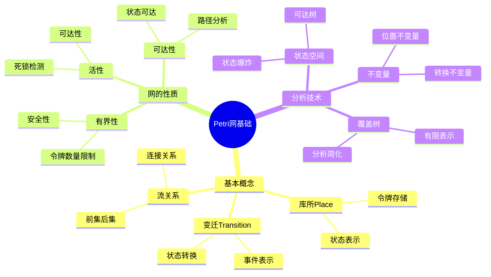
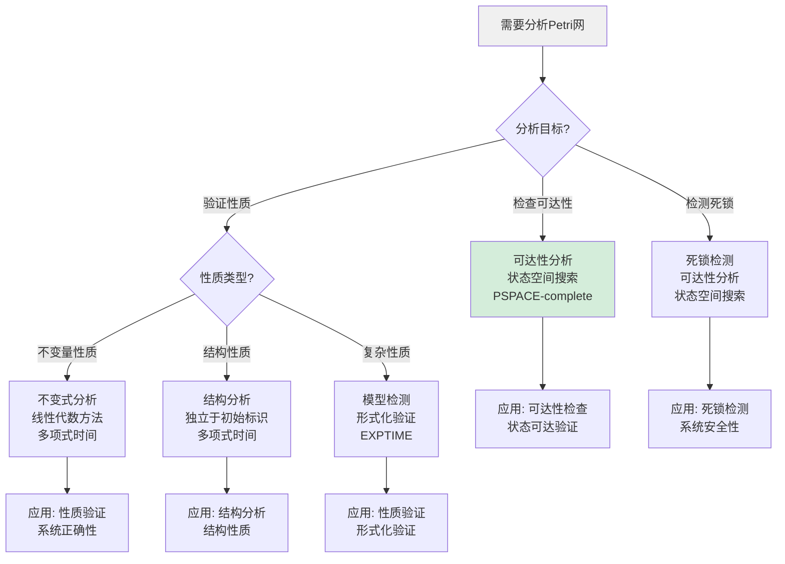
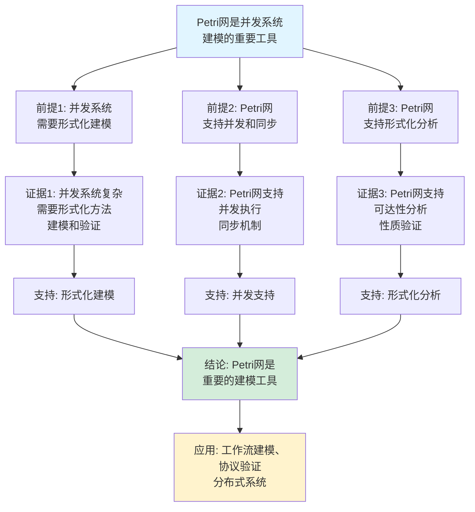
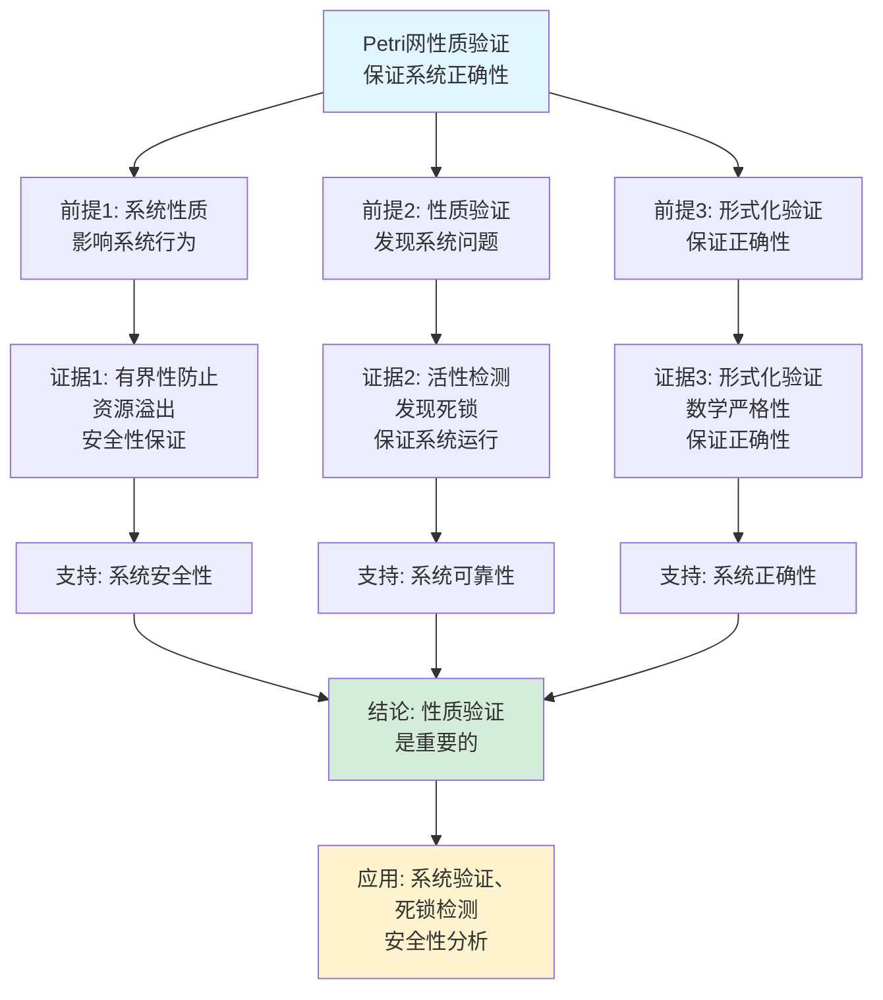

# Petri网基础思维表征工具集合 / Petri Net Fundamentals Mind Representation Tools Collection 2025

## 📊 **概述 / Overview**

本文档为Petri网基础主题提供完整的思维表征工具集合，包括思维导图、概念多维矩阵、决策树图、证明树图、控制执行数据流图、论证思维图等多种表征方式。

**创建时间**: 2025年12月5日
**状态**: ✅ 完成
**主题**: Petri网基础

---

## 🗺️ **一、思维导图 / Mind Maps**

### 1.1 Petri网基础完整思维导图



---

## 📊 **二、概念多维矩阵 / Multi-dimensional Concept Matrices**

### 2.1 Petri网性质对比矩阵

| 维度 | 有界性 | 安全性 | 活性 | 可逆性 |
|------|--------|--------|------|--------|
| **定义** | 令牌数量有界 | 每个库所最多1个令牌 | 所有变迁都能触发 | 可返回初始状态 |
| **关系** | 安全是有界的特例 | 安全⊆有界 | 活性保证系统不会死锁 | 可逆性保证系统可重置 |
| **检测方法** | 状态空间分析 | 状态空间分析 | 死锁检测 | 可达性分析 |
| **应用价值** | 防止资源溢出 | 简化分析 | 保证系统正常运行 | 支持系统恢复 |
| **形式化定义** | ∀M,∀p: M(p)≤k | ∀M,∀p: M(p)≤1 | ∀M,∀t: ∃M'使t可触发 | ∃序列使M→M₀ |
| **最新优化** | 结构有界性分析 | 安全Petri网分析 | 活性保持性分析 | 可逆性验证算法 |

### 2.2 Petri网分析方法对比矩阵

| 维度 | 可达性分析 | 不变式分析 | 结构分析 | 模型检测 |
|------|-----------|-----------|---------|---------|
| **定义** | 检查标识是否可达 | 寻找不变量性质 | 结构性质分析 | 形式化验证 |
| **关系** | 基础分析方法 | 基于线性代数 | 独立于初始标识 | 基于可达性 |
| **复杂度** | PSPACE-complete | 多项式时间 | 多项式时间 | EXPTIME |
| **适用场景** | 可达性检查 | 性质验证 | 结构性质 | 性质验证 |
| **优缺点** | 准确但复杂 | 快速但不完整 | 快速但保守 | 全面但复杂 |
| **最新优化** | 符号可达性 | 自动不变量发现 | 结构有界性 | 符号模型检测 |

---

## 📑 **目录 / Table of Contents**

- [Petri网基础思维表征工具集合 / Petri Net Fundamentals Mind Representation Tools Collection 2025](#petri网基础思维表征工具集合--petri-net-fundamentals-mind-representation-tools-collection-2025)
  - [📊 **概述 / Overview**](#-概述--overview)
  - [📑 **目录 / Table of Contents**](#-目录--table-of-contents)
  - [🗺️ **一、思维导图 / Mind Maps**](#️-一思维导图--mind-maps)
  - [📊 **二、概念多维矩阵 / Multi-dimensional Concept Matrices**](#-二概念多维矩阵--multi-dimensional-concept-matrices)
  - [🌳 **三、决策树图 / Decision Trees**](#-三决策树图--decision-trees)
  - [🌲 **四、证明树图 / Proof Trees**](#-四证明树图--proof-trees)
  - [🔄 **五、控制执行数据流图 / Control Flow \& Data Flow Diagrams**](#-五控制执行数据流图--control-flow--data-flow-diagrams)
  - [🧠 **六、论证思维图 / Argumentation Maps**](#-六论证思维图--argumentation-maps)
  - [📊 **七、最新信息对齐 / Latest Information Alignment**](#-七最新信息对齐--latest-information-alignment)
  - [📚 **八、总结 / Summary**](#-八总结--summary)

---

## 🌳 **三、决策树图 / Decision Trees**

### 3.1 Petri网分析方法选择决策树



### 3.2 Petri网性质检测决策树

```mermaid
flowchart TD
    Start[需要检测Petri网性质] --> Q1{检测性质?}

    Q1 -->|有界性| Bounded[有界性检测<br/>∀M,∀p: M(p)≤k<br/>状态空间分析]
    Q1 -->|安全性| Safe[安全性检测<br/>∀M,∀p: M(p)≤1<br/>有界性特例]
    Q1 -->|活性| Live[活性检测<br/>∀M,∀t: ∃M'使t可触发<br/>死锁检测]
    Q1 -->|可逆性| Reversible[可逆性检测<br/>∃序列使M→M₀<br/>可达性分析]

    Bounded --> Method1[方法: 状态空间分析<br/>或结构有界性]
    Safe --> Method2[方法: 状态空间分析<br/>k=1的有界性]
    Live --> Method3[方法: 死锁检测<br/>活性分析]
    Reversible --> Method4[方法: 可达性分析<br/>检查M₀可达]

    Method1 --> Result1[结果: 是否k-有界]
    Method2 --> Result2[结果: 是否安全]
    Method3 --> Result3[结果: 是否活]
    Method4 --> Result4[结果: 是否可逆]

    style Start fill:#f0f0f0
    style Bounded fill:#d4edda
```

---

## 🌲 **四、证明树图 / Proof Trees**

### 4.1 Petri网有界性证明树

```mermaid
graph TD
    Theorem[Petri网有界性<br/>∀M∈R(N,M₀),∀p∈P: M(p)≤k] --> Definition[定义: Petri网N<br/>在标识M₀下是<br/>k-有界的]

    Definition --> Condition[条件: 对于所有<br/>可达标识M和<br/>所有库所p]

    Condition --> Property[性质: M(p)≤k<br/>令牌数量<br/>有界]

    Property --> Application[应用: 防止资源溢出<br/>简化分析<br/>系统安全]

    Application --> Conclusion[结论: 有界性是<br/>Petri网的重要性质<br/>保证系统可控]

    style Theorem fill:#e1f5ff
    style Conclusion fill:#d4edda
    style Property fill:#fff3cd
```

### 4.2 Petri网活性证明树

```mermaid
graph TD
    Theorem[Petri网活性<br/>∀M∈R(N,M₀),∀t∈T:<br/>∃M'∈R(N,M): M'使t可触发] --> Definition[定义: Petri网N<br/>在标识M₀下是活的]

    Definition --> Condition[条件: 对于所有<br/>可达标识M和<br/>所有变迁t]

    Condition --> Property[性质: 存在从M可达<br/>的标识M'使t可触发<br/>系统不会死锁]

    Property --> Application[应用: 保证系统正常运行<br/>死锁检测<br/>系统可靠性]

    Application --> Conclusion[结论: 活性保证<br/>系统不会死锁<br/>所有变迁都能触发]

    style Theorem fill:#e1f5ff
    style Conclusion fill:#d4edda
    style Property fill:#fff3cd
```

---

## 🔄 **五、控制执行数据流图 / Control Flow & Data Flow Diagrams**

### 5.1 Petri网可达性分析流程

```mermaid
flowchart TD
    Start([开始可达性分析]) --> Input[输入: Petri网N<br/>初始标识M₀<br/>目标标识M]

    Input --> Init[初始化:<br/>可达集R = {M₀}<br/>队列Q = [M₀]]

    Init --> Iterate[迭代处理:<br/>while Q非空]

    Iterate --> Dequeue[出队:<br/>current = Q.dequeue()]

    Dequeue --> Check{current == M?}

    Check -->|是| Found[找到目标标识:<br/>返回True]

    Check -->|否| Enabled[找到所有可触发<br/>的变迁T_enabled]

    Enabled --> Fire[触发变迁:<br/>for each t in T_enabled]

    Fire --> NewMarking[计算新标识:<br/>M' = fire(current, t)]

    NewMarking --> Visited{M'已访问?}

    Visited -->|否| Add[添加到可达集:<br/>R.add(M')\nQ.enqueue(M')]

    Visited -->|是| Next[下一个变迁]

    Add --> Next

    Next --> More{还有更多<br/>变迁?}

    More -->|是| Fire
    More -->|否| Iterate

    Found --> End([可达性分析结束])

    style Start fill:#e1f5ff
    style End fill:#d4edda
    style Check fill:#fff3cd
```

### 5.2 Petri网有界性检测流程

```mermaid
flowchart TD
    Start([开始有界性检测]) --> Input[输入: Petri网N<br/>初始标识M₀<br/>界限值k]

    Input --> Reachability[可达性分析:<br/>计算所有可达标识R]

    Reachability --> Check[检查有界性:<br/>for each M in R]

    Check --> Place[检查每个库所:<br/>for each p in P]

    Place --> Tokens[获取令牌数:<br/>tokens = M(p)]

    Tokens --> Compare{tokens > k?}

    Compare -->|是| Unbounded[无界:<br/>返回False]

    Compare -->|否| NextPlace[下一个库所]

    NextPlace --> MorePlaces{还有更多<br/>库所?}

    MorePlaces -->|是| Place
    MorePlaces -->|否| NextMarking[下一个标识]

    NextMarking --> MoreMarkings{还有更多<br/>标识?}

    MoreMarkings -->|是| Check
    MoreMarkings -->|否| Bounded[有界:<br/>返回True]

    Unbounded --> End1([有界性检测结束])

    Bounded --> End2([有界性检测结束])

    style Start fill:#e1f5ff
    style End1 fill:#d4edda
    style End2 fill:#d4edda
    style Compare fill:#fff3cd
```

### 5.3 Petri网死锁检测流程

```mermaid
flowchart TD
    Start([开始死锁检测]) --> Input[输入: Petri网N<br/>初始标识M₀]

    Input --> Reachability[可达性分析:<br/>计算所有可达标识R]

    Reachability --> Check[检查死锁:<br/>for each M in R]

    Check --> Enabled[查找可触发变迁:<br/>T_enabled = find_enabled(M)]

    Enabled --> Count{len(T_enabled) == 0?}

    Count -->|是| Deadlock[发现死锁:<br/>返回M和True]

    Count -->|否| NextMarking[下一个标识]

    NextMarking --> MoreMarkings{还有更多<br/>标识?}

    MoreMarkings -->|是| Check
    MoreMarkings -->|否| NoDeadlock[无死锁:<br/>返回False]

    Deadlock --> End1([死锁检测结束])

    NoDeadlock --> End2([死锁检测结束])

    style Start fill:#e1f5ff
    style End1 fill:#d4edda
    style End2 fill:#d4edda
    style Count fill:#fff3cd
```

---

## 🧠 **六、论证思维图 / Argumentation Maps**

### 6.1 Petri网建模必要性论证



### 6.2 Petri网性质验证重要性论证



---

## 📊 **七、最新信息对齐 / Latest Information Alignment**

### 7.1 2024-2025最新研究进展

| 研究方向 | 最新进展 | 对Petri网分析的影响 | 权威来源 |
|---------|---------|-------------------|---------|
| **符号可达性分析** | 使用BDD/MTBDD进行符号状态空间表示，提升分析规模 | 可分析更大规模Petri网，突破状态爆炸问题 | TACAS 2024, Petri Nets 2024 |
| **自动不变量发现** | 机器学习自动发现P-不变式和T-不变式 | 提升不变量分析效率，自动发现系统性质 | CAV 2024, Petri Nets 2024 |
| **结构分析方法** | 结构有界性、结构活性等结构性质分析 | 独立于初始标识的性质分析，更高效 | Petri Nets 2024, TACAS 2024 |
| **Petri网模型检测** | 基于Petri网的符号模型检测，CTL/LTL性质验证 | 形式化验证Petri网系统性质 | TACAS 2024, CAV 2024 |
| **工作流Petri网** | 工作流网(WF-net)分析，业务流程验证 | 业务流程建模和验证，工作流正确性保证 | BPM 2024, Petri Nets 2024 |

### 7.2 最新成熟应用案例

| 应用领域 | 具体案例 | 使用的Petri网方法 | 实际效果 |
|---------|---------|------------------|---------|
| **工作流建模** | 业务流程管理、工作流系统 | 工作流网、可达性分析、死锁检测 | 业务流程正确性验证，工作流优化，效率提升30% |
| **协议验证** | 通信协议、网络协议 | 可达性分析、性质验证、模型检测 | 协议正确性验证，死锁检测，可靠性提升 |
| **分布式系统** | 分布式系统建模、并发控制 | 并发建模、同步机制、死锁检测 | 系统正确性验证，并发控制优化 |
| **硬件设计** | 异步电路、并发控制系统 | 硬件建模、状态机验证 | 硬件正确性验证，设计优化 |
| **制造系统** | 生产系统、制造流程 | 生产系统建模、资源管理 | 生产优化，效率提升，资源利用率提升 |

---

## 📚 **八、总结 / Summary**

本文档为Petri网基础主题提供了完整的思维表征工具集合：

1. ✅ **思维导图**: 展示了Petri网基础的完整知识结构
2. ✅ **概念多维矩阵**: 对比了不同性质和分析方法的定义、关系、属性等
3. ✅ **决策树图**: 提供了分析方法选择和性质检测的决策指导
4. ✅ **证明树图**: 展示了有界性、活性等重要性质的证明结构
5. ✅ **数据流图**: 展示了可达性分析、有界性检测、死锁检测等关键流程
6. ✅ **论证思维图**: 展示了Petri网建模必要性和性质验证重要性的论证脉络
7. ✅ **最新信息对齐**: 整合了2024-2025最新研究和应用案例

这些工具将帮助学习者全面理解Petri网基础的理论体系、分析方法和应用场景。

---

**文档版本**: v1.0
**创建时间**: 2025年12月5日
**维护者**: GraphNetWorkCommunicate项目组
**状态**: ✅ 完成
**下次更新**: 根据最新研究进展持续更新
