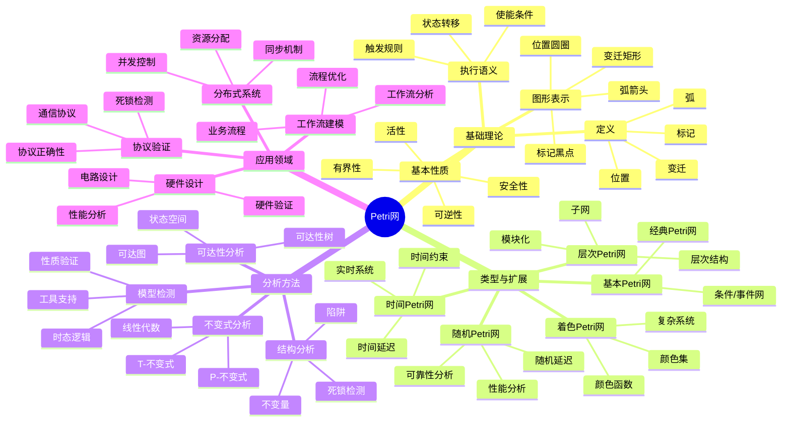
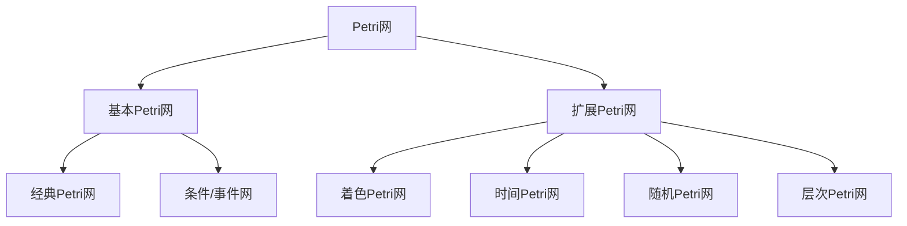
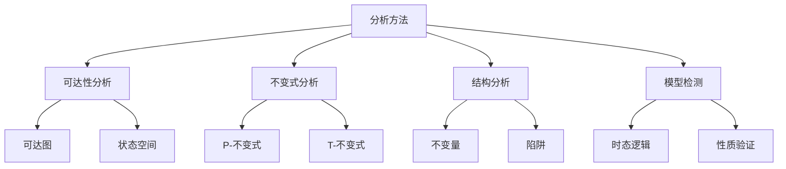
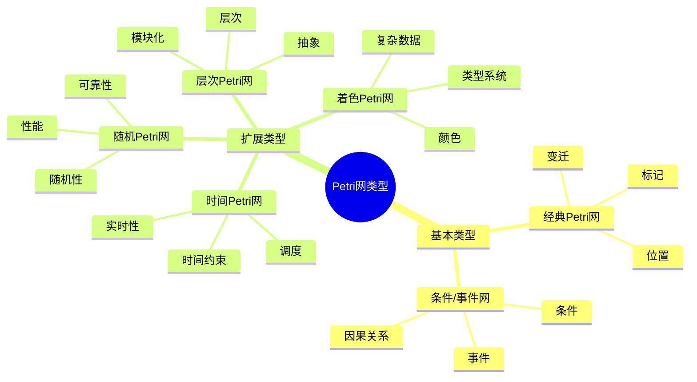
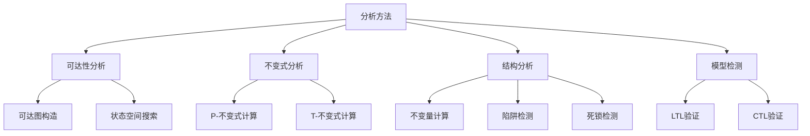
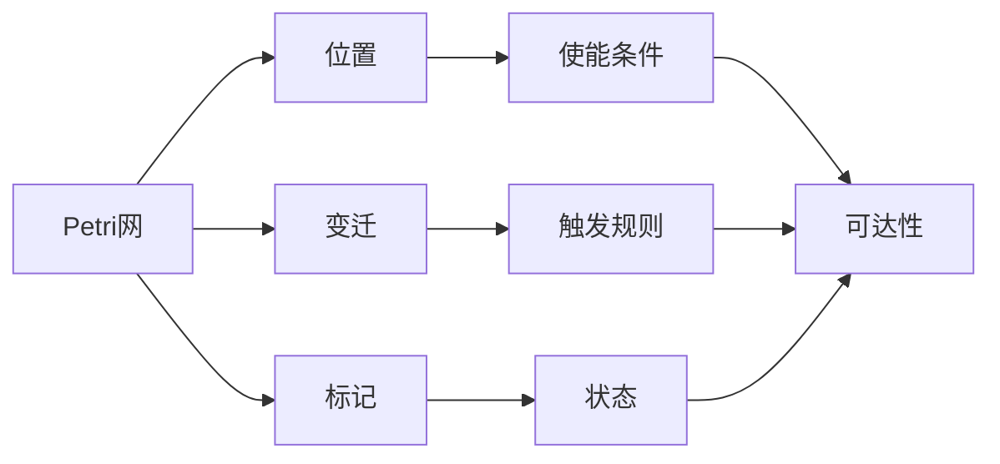
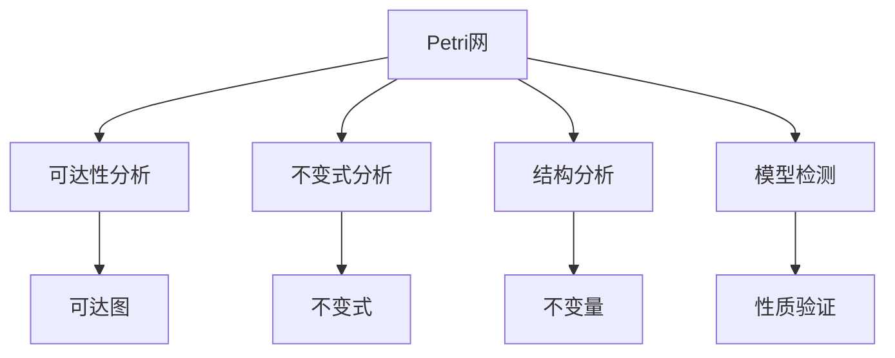
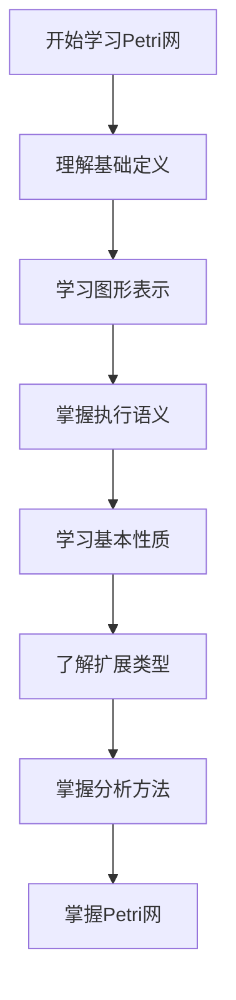
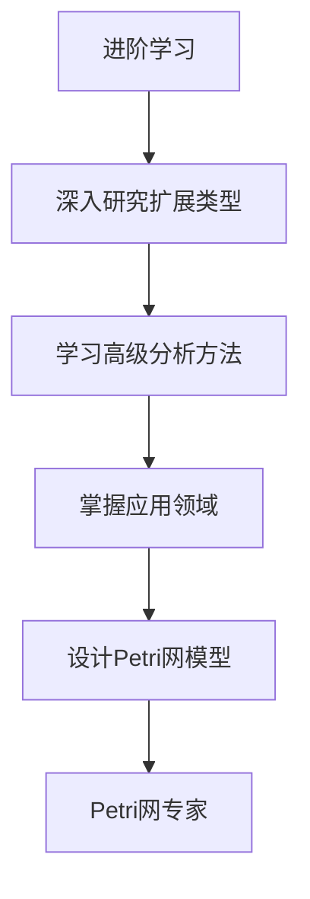

# Petri网理论模块知识结构思维导图 / Petri Net Theory Module Knowledge Structure Mind Map

## 📚 **概述 / Overview**

本文档提供Petri网理论模块的完整知识结构思维导图，帮助理解Petri网知识的层次结构和相互关系。

**创建时间**: 2025年1月
**模块**: Petri网理论
**状态**: 🚀 持续更新中

---

## 🗺️ **一、整体知识结构 / Overall Knowledge Structure**

---

## 📊 **二、核心概念层次结构 / Core Concept Hierarchy**

### 2.1 Petri网类型层次

### 2.2 分析方法层次

---

## 🔬 **三、Petri网类型结构 / Petri Net Type Structure**

### 3.1 类型分类

### 3.2 类型特性对比

| 类型 | 特点 | 复杂度 | 适用场景 |
|------|------|--------|---------|
| **经典Petri网** | 简单 | 低 | 基础建模 |
| **着色Petri网** | 数据 | 中 | 复杂系统 |
| **时间Petri网** | 时间 | 中 | 实时系统 |
| **随机Petri网** | 随机 | 高 | 性能分析 |
| **层次Petri网** | 层次 | 高 | 大型系统 |

---

## 📐 **四、分析方法结构 / Analysis Method Structure**

### 4.1 分析方法分类

### 4.2 分析方法对比

| 方法 | 原理 | 复杂度 | 适用性质 | 特点 |
|------|------|--------|---------|------|
| **可达性分析** | 状态搜索 | 指数 | 可达性 | 完整但复杂 |
| **不变式分析** | 线性代数 | 多项式 | 不变式 | 高效但有限 |
| **结构分析** | 图论 | 多项式 | 结构性质 | 快速但近似 |
| **模型检测** | 自动验证 | 指数 | 时态性质 | 自动化但复杂 |

---

## 🔗 **五、知识关联网络 / Knowledge Association Network**

### 5.1 概念关联图

### 5.2 方法关联图

---

## 📚 **六、学习路径 / Learning Path**

### 6.1 基础学习路径

### 6.2 进阶学习路径

---

## 🎯 **七、应用领域映射 / Application Domain Mapping**

### 7.1 应用领域

| Petri网概念 | 应用领域 | 具体应用 |
|------------|---------|---------|
| **工作流建模** | 业务流程 | 工作流分析、流程优化 |
| **协议验证** | 通信协议 | 协议正确性、死锁检测 |
| **分布式系统** | 并发系统 | 并发控制、资源分配 |
| **硬件设计** | 电路设计 | 硬件验证、性能分析 |

---

## 📋 **八、知识检查清单 / Knowledge Checklist**

### 8.1 基础概念

- [ ] 理解Petri网的定义（位置、变迁、弧、标记）
- [ ] 掌握图形表示方法
- [ ] 理解执行语义（使能、触发）
- [ ] 掌握基本性质（有界性、安全性、活性）

### 8.2 扩展类型

- [ ] 理解着色Petri网
- [ ] 掌握时间Petri网
- [ ] 了解随机Petri网
- [ ] 理解层次Petri网

### 8.3 分析方法

- [ ] 理解可达性分析
- [ ] 掌握不变式分析
- [ ] 了解结构分析
- [ ] 理解模型检测

### 8.4 应用领域

- [ ] 理解工作流建模
- [ ] 掌握协议验证
- [ ] 了解分布式系统应用
- [ ] 理解硬件设计应用

---

## 🔗 **相关链接 / Related Links**

- [Petri网理论README](README.md)
- [基础理论](01-基础理论/README.md)
- [类型与扩展](02-类型与扩展/README.md)
- [分析方法](03-分析方法/README.md)

---

**文档版本**: v1.0
**创建时间**: 2025年1月
**最后更新**: 2025年1月
**维护者**: GraphNetWorkCommunicate项目组
