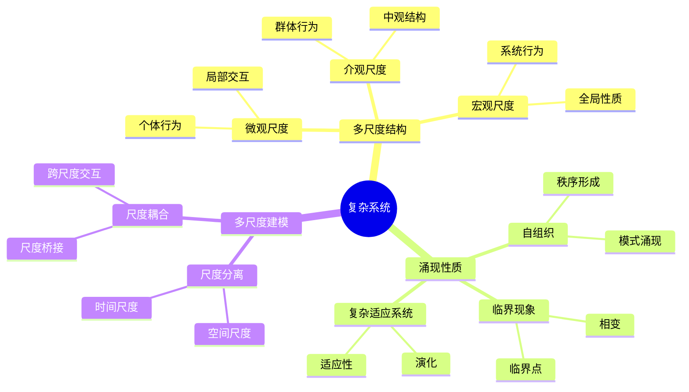
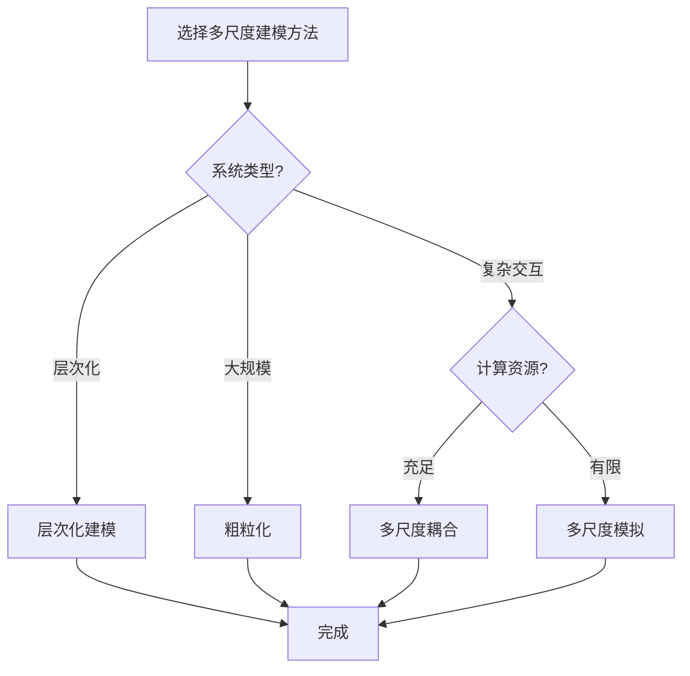

# 复杂系统与多尺度建模思维表征工具 / Complex Systems and Multi-Scale Modeling Mental Representation Tools

## 📚 **概述 / Overview**

本文档提供复杂系统与多尺度建模模块的多种思维表征工具，包括思维导图、对比矩阵、决策树、逻辑路径和概念地图，帮助更好地理解和应用复杂系统知识。

**创建时间**: 2025年1月
**模块**: 复杂系统与多尺度建模
**状态**: 🚀 持续更新中

---

## 🗺️ **一、思维导图 / Mind Maps**

### 1.1 复杂系统核心概念思维导图

---

## 📊 **二、对比矩阵 / Comparison Matrices**

### 2.1 多尺度建模方法对比矩阵

| 方法 | 原理 | 适用尺度 | 计算复杂度 | 特点 | 应用场景 |
|------|------|---------|-----------|------|---------|
| **多尺度模拟** | 不同尺度模型 | 多尺度 | 高 | 精确、计算量大 | 详细分析 |
| **粗粒化** | 尺度约简 | 宏观 | 中 | 简化、快速 | 大规模系统 |
| **多尺度耦合** | 尺度交互 | 多尺度 | 很高 | 完整、复杂 | 复杂系统 |
| **层次化建模** | 层次结构 | 多尺度 | 中-高 | 清晰、模块化 | 层次系统 |

**选择指南**：

- **详细分析**：多尺度模拟
- **大规模系统**：粗粒化
- **复杂交互**：多尺度耦合
- **层次系统**：层次化建模

---

## 🌳 **三、决策树 / Decision Trees**

### 3.1 多尺度建模方法选择决策树

---

**文档版本**: v1.0
**创建时间**: 2025年1月
**最后更新**: 2025年1月
**维护者**: GraphNetWorkCommunicate项目组
