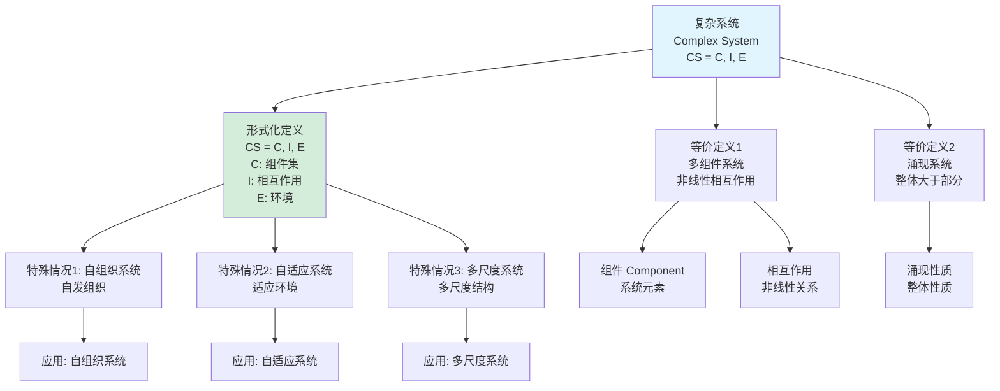
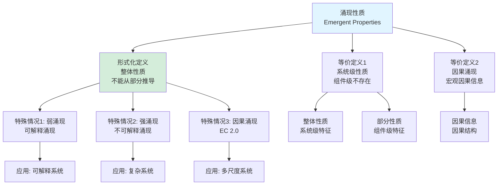
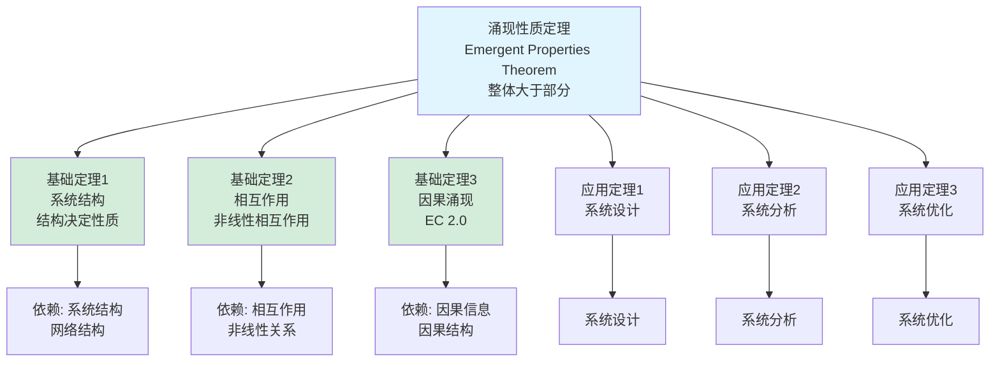
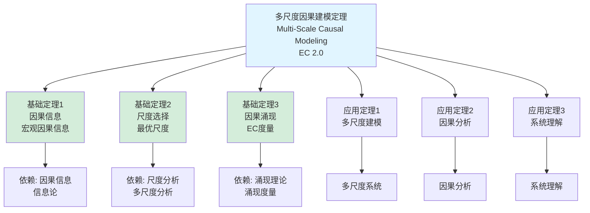
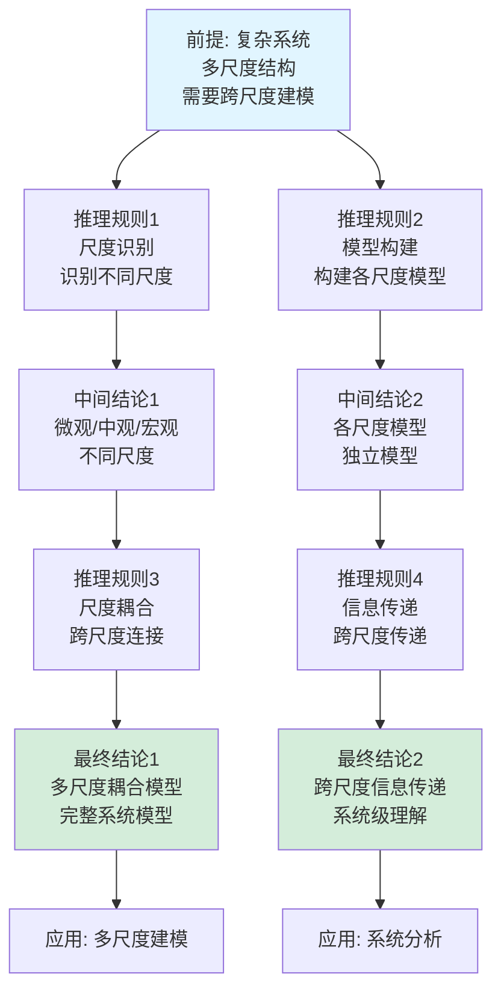

# 复杂系统定义树与定理树集合 / Complex System Definition Tree and Theorem Tree Collection 2025

## 📚 **概述 / Overview**

本文档提供复杂系统模块的核心概念定义树和重要定理依赖树，清晰展示概念的定义层次结构和定理之间的依赖关系。

**创建时间**: 2025年1月
**模块**: 复杂系统与多尺度建模
**状态**: ✅ 已完成
**版本**: v1.0

---

## 🌳 **一、定义树 / Definition Trees**

### 1.1 复杂系统定义树



### 1.2 涌现性质定义树



### 1.3 多尺度建模定义树

```mermaid
graph TD
    Root[多尺度建模<br/>Multi-Scale Modeling]

    Root --> D1[形式化定义<br/>多尺度模型<br/>M = {M₁, M₂, ..., Mₙ}]
    Root --> D2[等价定义1<br/>跨尺度建模<br/>不同尺度模型]
    Root --> D3[等价定义2<br/>尺度耦合<br/>跨尺度信息传递]

    D1 --> S1[特殊情况1: 微观尺度<br/>个体行为]
    D1 --> S2[特殊情况2: 中观尺度<br/>群体行为]
    D1 --> S3[特殊情况3: 宏观尺度<br/>系统行为]

    D2 --> A1[尺度 Scale<br/>空间/时间尺度]
    D2 --> A2[耦合 Coupling<br/>跨尺度连接]

    D3 --> A3[信息传递<br/>跨尺度传递]

    S1 --> App1[应用: 个体建模]
    S2 --> App2[应用: 群体建模]
    S3 --> App3[应用: 系统建模]

    style Root fill:#e1f5ff
    style D1 fill:#d4edda
```

---

## 🌳 **二、定理树 / Theorem Trees**

### 2.1 涌现性质定理树



### 2.2 多尺度因果建模定理树



---

## 🌳 **三、推理关系树 / Inference Relation Trees**

### 3.1 多尺度建模推理链



---

## 📊 **四、使用指南 / Usage Guide**

### 4.1 定义树使用指南

- **概念理解**: 通过定义树理解概念的层次结构
- **等价定义**: 理解同一概念的不同定义方式
- **特殊情况**: 识别概念的特殊情况和应用场景
- **知识整合**: 整合相关概念的知识

### 4.2 定理树使用指南

- **依赖关系**: 理解定理之间的依赖关系
- **证明路径**: 理解证明的逻辑路径
- **应用路径**: 理解定理的应用路径
- **知识体系**: 构建完整的知识体系

### 4.3 推理关系树使用指南

- **逻辑推理**: 理解逻辑推理的过程
- **因果关系**: 理解因果关系链
- **证明结构**: 理解证明的结构
- **知识连接**: 连接相关知识点

---

## 📚 **五、总结 / Summary**

本文档提供了复杂系统模块的三种重要思维表征工具：

1. ✅ **定义树**: 展示核心概念的定义层次结构（3个定义树）
2. ✅ **定理树**: 展示重要定理的依赖关系（2个定理树）
3. ✅ **推理关系树**: 展示逻辑推理链（1个推理关系树）

这些工具将帮助学习者：

- 理解概念的定义层次
- 理解定理的依赖关系
- 理解逻辑推理过程
- 构建完整的知识体系

---

**文档版本**: v1.0
**创建时间**: 2025年1月
**最后更新**: 2025年1月
**维护者**: GraphNetWorkCommunicate项目组
**状态**: ✅ **已完成**
