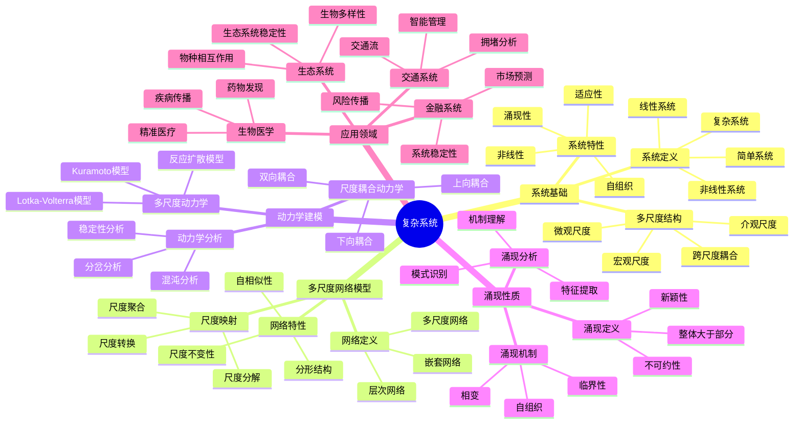
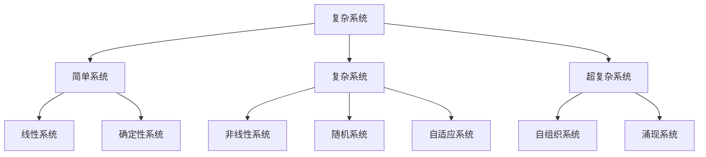
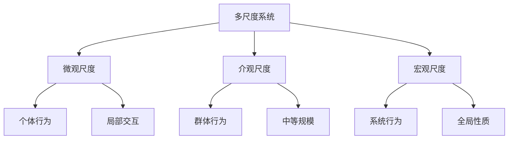
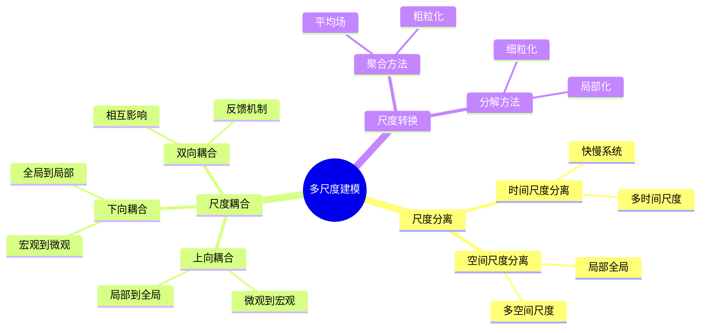
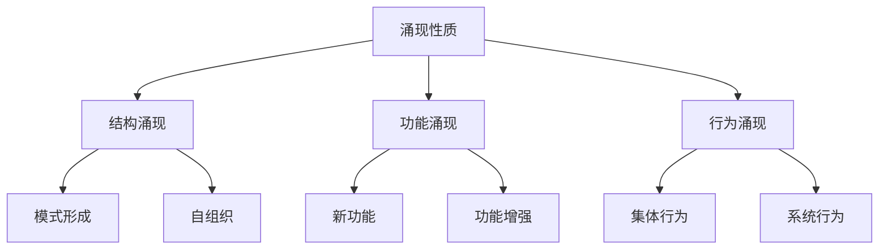
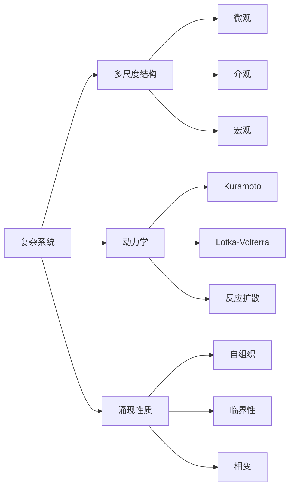
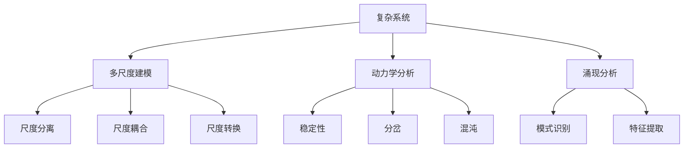
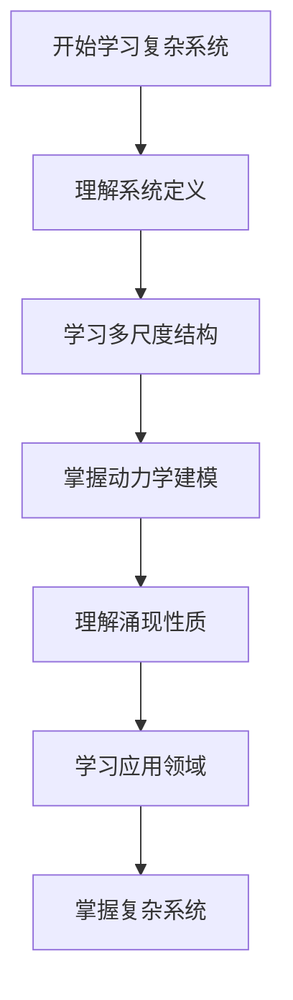
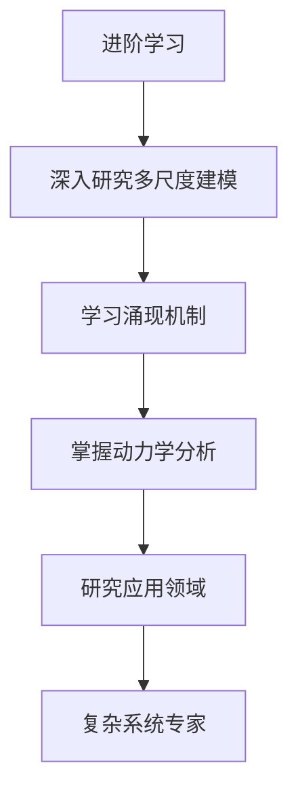

# 复杂系统与多尺度建模模块知识结构思维导图 / Complex Systems and Multi-Scale Modeling Module Knowledge Structure Mind Map

## 📚 **概述 / Overview**

本文档提供复杂系统与多尺度建模模块的完整知识结构思维导图，帮助理解复杂系统知识的层次结构和相互关系。

**创建时间**: 2025年1月
**模块**: 复杂系统与多尺度建模
**状态**: 🚀 持续更新中

---

## 🗺️ **一、整体知识结构 / Overall Knowledge Structure**

---

## 📊 **二、核心概念层次结构 / Core Concept Hierarchy**

### 2.1 系统类型层次

### 2.2 尺度层次

---

## 🔬 **三、多尺度建模方法结构 / Multi-Scale Modeling Method Structure**

### 3.1 建模方法分类

### 3.2 建模方法对比

| 方法 | 原理 | 复杂度 | 适用场景 | 特点 |
|------|------|--------|---------|------|
| **时间尺度分离** | 快慢分离 | 中 | 多时间尺度系统 | 简化分析 |
| **空间尺度分离** | 局部全局分离 | 中 | 多空间尺度系统 | 模块化 |
| **尺度耦合** | 跨尺度交互 | 高 | 复杂耦合系统 | 完整建模 |
| **尺度转换** | 尺度映射 | 高 | 跨尺度分析 | 统一框架 |

---

## 📐 **四、涌现性质结构 / Emergent Property Structure**

### 4.1 涌现类型

### 4.2 涌现机制

| 机制类型 | 定义 | 例子 | 特点 |
|---------|------|------|------|
| **自组织** | 系统自发形成有序结构 | 鸟群、鱼群 | 无需外部控制 |
| **临界性** | 系统处于临界状态 | 相变、雪崩 | 敏感性高 |
| **相变** | 系统状态突变 | 水结冰、磁化 | 不连续性 |

---

## 🔗 **五、知识关联网络 / Knowledge Association Network**

### 5.1 概念关联图

### 5.2 方法关联图

---

## 📚 **六、学习路径 / Learning Path**

### 6.1 基础学习路径

### 6.2 进阶学习路径

---

## 🎯 **七、应用领域映射 / Application Domain Mapping**

### 7.1 应用领域

| 复杂系统概念 | 应用领域 | 具体应用 |
|------------|---------|---------|
| **多尺度建模** | 生态系统 | 物种相互作用、生态系统稳定性 |
| **动力学分析** | 金融系统 | 风险传播、市场预测 |
| **涌现分析** | 交通系统 | 交通流、拥堵分析 |
| **系统优化** | 生物医学 | 疾病传播、药物发现 |

---

## 📋 **八、知识检查清单 / Knowledge Checklist**

### 8.1 基础概念

- [ ] 理解复杂系统的定义和特性
- [ ] 掌握多尺度结构概念
- [ ] 理解涌现性质
- [ ] 掌握系统分析方法

### 8.2 多尺度建模

- [ ] 理解尺度分离方法
- [ ] 掌握尺度耦合方法
- [ ] 了解尺度转换方法
- [ ] 理解多尺度建模应用

### 8.3 动力学分析

- [ ] 理解多尺度动力学模型
- [ ] 掌握尺度耦合动力学
- [ ] 了解动力学分析方法
- [ ] 理解动力学应用

### 8.4 涌现分析

- [ ] 理解涌现定义
- [ ] 掌握涌现机制
- [ ] 了解涌现分析方法
- [ ] 理解涌现应用

---

## 🔗 **相关链接 / Related Links**

- [复杂系统README](README.md)
- [复杂系统基础](01-复杂系统基础/README.md)
- [多尺度网络模型](02-多尺度网络模型/README.md)
- [动力学建模](03-动力学建模/README.md)
- [涌现性质](04-涌现性质/README.md)

---

**文档版本**: v1.0
**创建时间**: 2025年1月
**最后更新**: 2025年1月
**维护者**: GraphNetWorkCommunicate项目组
