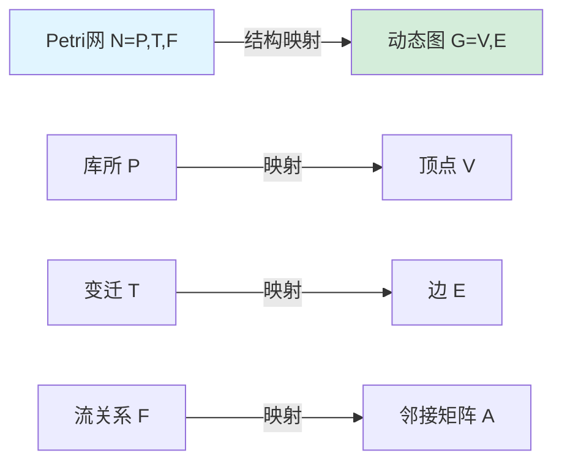
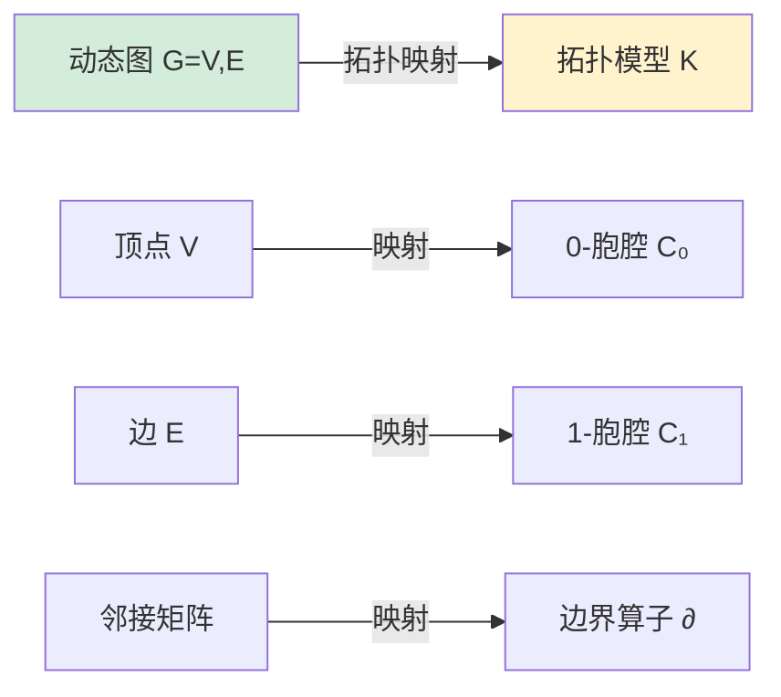
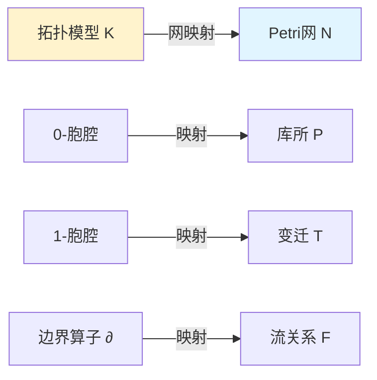
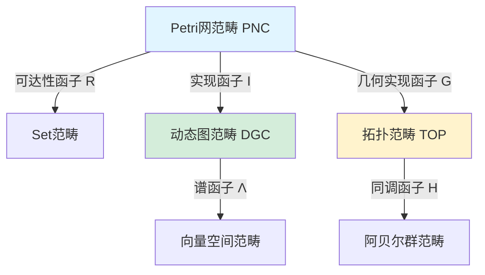
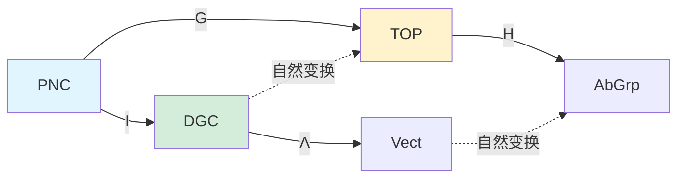

# 理论映射关系图谱 / Theoretical Mapping Relationship Atlas
## 📚 **概述 / Overview**

**文档目的**: 建立跨模块的理论映射关系认知图谱，揭示不同理论框架之间的内在联系和转换规律。

**核心主题**:

- Petri网、动态图论、拓扑模型的映射关系
- 范畴论统一框架下的理论转换
- 跨模块理论关系网络
- 理论选择的认知路径

**主要内容**:

- 三大理论的结构映射
- 状态空间映射关系
- 动态演化映射规律
- 守恒律与不变量的对应关系

**适用对象**: 理论研究者、系统工程师、算法开发者

---

## 📋 **目录 / Table of Contents**

- [理论映射关系图谱 / Theoretical Mapping Relationship Atlas](#理论映射关系图谱--theoretical-mapping-relationship-atlas)
  - [📚 **概述 / Overview**](#-概述--overview)
  - [📋 **目录 / Table of Contents**](#-目录--table-of-contents)
  - [🔗 **一、结构层面映射 / Part 1: Structural Level Mapping**](#-一结构层面映射--part-1-structural-level-mapping)
    - [1.1 Petri网 → 动态图映射](#11-petri网--动态图映射)
    - [1.2 动态图 → 拓扑模型映射](#12-动态图--拓扑模型映射)
    - [1.3 拓扑模型 → Petri网映射](#13-拓扑模型--petri网映射)
  - [📊 **二、状态空间映射 / Part 2: State Space Mapping**](#-二状态空间映射--part-2-state-space-mapping)
    - [2.1 标识空间 → 图快照序列](#21-标识空间--图快照序列)
    - [2.2 图快照序列 → 链复形](#22-图快照序列--链复形)
    - [2.3 链复形 → 标识空间](#23-链复形--标识空间)
  - [🔄 **三、动态演化映射 / Part 3: Dynamic Evolution Mapping**](#-三动态演化映射--part-3-dynamic-evolution-mapping)
    - [3.1 变迁点火 → 图重写规则](#31-变迁点火--图重写规则)
    - [3.2 图重写规则 → 同伦变形](#32-图重写规则--同伦变形)
    - [3.3 同伦变形 → 变迁点火](#33-同伦变形--变迁点火)
  - [⚖️ **四、守恒律映射 / Part 4: Conservation Law Mapping**](#️-四守恒律映射--part-4-conservation-law-mapping)
    - [4.1 S-不变量 → 拉普拉斯谱](#41-s-不变量--拉普拉斯谱)
    - [4.2 拉普拉斯谱 → 同调群](#42-拉普拉斯谱--同调群)
    - [4.3 同调群 → S-不变量](#43-同调群--s-不变量)
  - [🗺️ **五、统一映射框架 / Part 5: Unified Mapping Framework**](#️-五统一映射框架--part-5-unified-mapping-framework)
    - [5.1 范畴论函子映射](#51-范畴论函子映射)
    - [5.2 映射的复合与交换性](#52-映射的复合与交换性)
    - [5.3 映射的完备性与忠实性](#53-映射的完备性与忠实性)
  - [📚 **六、参考文档 / Part 6: Reference Documents**](#-六参考文档--part-6-reference-documents)
    - [6.1 内部参考文档](#61-内部参考文档)
    - [6.2 外部权威来源](#62-外部权威来源)

---

## 🔗 **一、结构层面映射 / Part 1: Structural Level Mapping**

### 1.1 Petri网 → 动态图映射

**映射规则**：

**形式化定义**：

给定Petri网 `N = (P, T, F)`，构造动态图 `G = (V, E)`：

- **顶点映射**: `V = P ∪ T`（库所和变迁都作为顶点）
- **边映射**: `E = F`（流关系直接作为边）
- **动态标注**: 令牌分布 `M: P → ℕ` 作为顶点属性

**工业应用**: Linux内核`lockdep`使用此映射将锁依赖关系转换为依赖图进行分析。

### 1.2 动态图 → 拓扑模型映射

**映射规则**：

**形式化定义**：

给定动态图 `G = (V, E)`，构造胞腔复形 `K = (C_i, ∂_i)`：

- **0-单形**: `C₀ = V`（顶点集）
- **1-单形**: `C₁ = E`（边集）
- **边界算子**: `∂₁: C₁ → C₀` 由邻接关系定义

**工业应用**: 持续同调用于分析服务依赖图的拓扑特征，识别异常环结构。

### 1.3 拓扑模型 → Petri网映射

**映射规则**：

**形式化定义**：

给定胞腔复形 `K = (C_i, ∂_i)`，构造Petri网 `N = (P, T, F)`：

- **库所**: `P = C₀`（0-胞腔）
- **变迁**: `T = C₁`（1-胞腔）
- **流关系**: `F = {(p, t) | ∂₁(t) = p}` ∪ `{(t, p) | ∂₁(t) = -p}`

---

## 📊 **二、状态空间映射 / Part 2: State Space Mapping**

### 2.1 标识空间 → 图快照序列

**映射规则**：

Petri网的标识演化序列 `M₀ → M₁ → ... → M_n` 映射为动态图的快照序列 `{G₀, G₁, ..., G_n}`。

**形式化定义**：

- **快照构造**: `G_i = (V_i, E_i)`，其中 `V_i = {p ∈ P | M_i(p) > 0}`（激活的库所）
- **边激活**: `E_i = {t ∈ T | M_i[enable t>}`（可触发的变迁）

**工业应用**: 分布式系统的状态快照算法使用此映射进行一致性检查。

### 2.2 图快照序列 → 链复形

**映射规则**：

动态图的快照序列映射为拓扑链复形的过滤序列。

**形式化定义**：

给定快照序列 `{G₀, G₁, ..., G_n}`，构造过滤复形：

- **过滤函数**: `f(σ) = min{i | σ ∈ G_i}`（单形首次出现的时刻）
- **链复形**: `C_i(K) = span{σ ∈ K | dim(σ) = i}`

### 2.3 链复形 → 标识空间

**映射规则**：

拓扑链复形映射回Petri网的标识空间。

**形式化定义**：

给定链复形 `C_*(K)`，定义标识 `M: P → ℕ`：

- **令牌分布**: `M(p) = |{σ ∈ C₀ | σ = p}|`（0-链的系数）

---

## 🔄 **三、动态演化映射 / Part 3: Dynamic Evolution Mapping**

### 3.1 变迁点火 → 图重写规则

**映射规则**：

Petri网的变迁点火 `t: M → M'` 映射为动态图的重写规则 `r: G → G'`。

**形式化定义**：

- **重写规则**: `r = (L, R, K)`，其中：
  - `L = •t ∪ t•`（变迁的前集和后集）
  - `R = •t' ∪ t'•`（新图结构）
  - `K = P \ (•t ∪ t•)`（不变部分）

**工业应用**: 图数据库的增量更新算法使用此映射。

### 3.2 图重写规则 → 同伦变形

**映射规则**：

图重写规则映射为拓扑空间的同伦变形。

**形式化定义**：

给定重写规则 `r: G → G'`，构造同伦 `H: |G| × [0,1] → |G'|`：

- **同伦路径**: `H(x, 0) = x`，`H(x, 1) = r(x)`

### 3.3 同伦变形 → 变迁点火

**映射规则**：

拓扑同伦变形映射回Petri网的变迁点火。

**形式化定义**：

给定同伦 `H: K × [0,1] → K'`，提取变迁 `t`：

- **变迁定义**: `t = {σ ∈ K | H(σ, 0) ≠ H(σ, 1)}`

---

## ⚖️ **四、守恒律映射 / Part 4: Conservation Law Mapping**

### 4.1 S-不变量 → 拉普拉斯谱

**映射规则**：

Petri网的S-不变量 `w^T C = 0` 映射为动态图的拉普拉斯矩阵的零特征值。

**形式化定义**：

- **拉普拉斯矩阵**: `L = D - A`（度矩阵 - 邻接矩阵）
- **零特征值**: `Lw = 0` 对应S-不变量 `w`

**工业应用**: 网络流分析中，拉普拉斯零特征值对应流量守恒。

### 4.2 拉普拉斯谱 → 同调群

**映射规则**：

拉普拉斯谱映射为拓扑同调群。

**形式化定义**：

- **Hodge理论**: `H₀(K) = Ker(∂₀) / Im(∂₁)`
- **拉普拉斯零空间**: `Ker(L₀) = H₀(K)`

### 4.3 同调群 → S-不变量

**映射规则**：

拓扑同调群映射回Petri网的S-不变量。

**形式化定义**：

- **S-不变量**: `w ∈ H₀(N)`（0-维同调类）

---

## 🗺️ **五、统一映射框架 / Part 5: Unified Mapping Framework**

### 5.1 范畴论函子映射

**核心函子**：

**函子定义**：

1. **可达性函子** `R: PNC → Set`：
   - `R(N) = Reach(N) = {M | M₀ →* M}`

2. **实现函子** `I: PNC → DGC`：
   - `I(N) = {G_M = (V_M, E_M) | M ∈ Reach(N)}`

3. **几何实现函子** `G: PNC → TOP`：
   - `G(N) = |N|`（CW复形）

4. **同调函子** `H_i: TOP → AbGrp`：
   - `H_i(K) = Ker(∂_i) / Im(∂_{i+1})`

### 5.2 映射的复合与交换性

**交换图**：

**交换条件**：

- `H_i ∘ G = U ∘ R`（同调 = 可达性的代数结构）

### 5.3 映射的完备性与忠实性

**完备性**：所有理论对象都能映射到统一框架

**忠实性**：不同理论对象映射到不同统一对象

**统一性定理**：三大理论在范畴论框架下完全等价

---

## 📚 **六、参考文档 / Part 6: Reference Documents**

### 6.1 内部参考文档

- [View文件夹概念关系网络](../../view/View文件夹概念关系网络-2025.md)
- [View文件夹对比矩阵集](../../view/View文件夹对比矩阵集-2025.md)
- [graph_view00-统一结构版](../../view/graph_view00-统一结构版-2025.md)

### 6.2 外部权威来源

- [Wikipedia: Category Theory](https://en.wikipedia.org/wiki/Category_theory)
- [Wikipedia: Petri Net](https://en.wikipedia.org/wiki/Petri_net)
- [Wikipedia: Topological Data Analysis](https://en.wikipedia.org/wiki/Topological_data_analysis)

---

**文档版本**: v1.0
**创建时间**: 2025年1月
**最后更新**: 2025年1月
**维护者**: GraphNetWorkCommunicate项目组
**状态**: ✅ 初始版本完成
