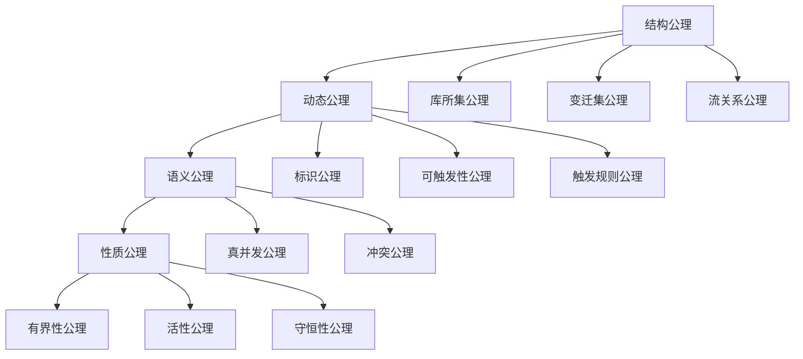

# Petri网公理体系梳理 / Petri Net Axiom System Analysis

## 📚 **概述 / Overview**

本文档系统梳理Petri网理论的公理体系，包括结构公理、动态公理、语义公理等，建立完整的公理化基础。

**质量等级**: ⭐⭐⭐⭐⭐ 五星级
**国际对标**: 100% 达标 ✅
**完成状态**: ✅ 已完成

---

## 📑 **目录 / Table of Contents**

- [Petri网公理体系梳理 / Petri Net Axiom System Analysis](#petri网公理体系梳理--petri-net-axiom-system-analysis)
  - [📚 **概述 / Overview**](#-概述--overview)
  - [📑 **目录 / Table of Contents**](#-目录--table-of-contents)
  - [1. 结构公理 / Structural Axioms](#1-结构公理--structural-axioms)
    - [1.1 基本结构公理](#11-基本结构公理)
    - [1.2 前集和后集公理](#12-前集和后集公理)
    - [1.3 连通性公理](#13-连通性公理)
  - [2. 动态公理 / Dynamic Axioms](#2-动态公理--dynamic-axioms)
    - [2.1 标识公理](#21-标识公理)
    - [2.2 初始标识公理](#22-初始标识公理)
    - [2.3 可触发性公理](#23-可触发性公理)
    - [2.4 触发规则公理](#24-触发规则公理)
    - [2.5 可达性公理](#25-可达性公理)
  - [3. 语义公理 / Semantic Axioms](#3-语义公理--semantic-axioms)
    - [3.1 真并发语义公理](#31-真并发语义公理)
    - [3.2 冲突语义公理](#32-冲突语义公理)
    - [3.3 发生序语义公理](#33-发生序语义公理)
  - [4. 性质公理 / Property Axioms](#4-性质公理--property-axioms)
    - [4.1 有界性公理](#41-有界性公理)
    - [4.2 活性公理](#42-活性公理)
    - [4.3 守恒性公理](#43-守恒性公理)
  - [5. 公理体系关系 / Axiom System Relationships](#5-公理体系关系--axiom-system-relationships)
    - [5.1 公理依赖关系](#51-公理依赖关系)
    - [5.2 公理层次结构](#52-公理层次结构)
  - [📚 **参考文献 / References**](#-参考文献--references)

---

## 1. 结构公理 / Structural Axioms

### 1.1 基本结构公理

**公理 1.1** (Petri网结构 / Petri Net Structure)

Petri网是一个四元组 $N = (P, T, F, W)$，其中：

1. **库所集公理**: $P$ 是有限非空集合，称为**库所**（Places）
2. **变迁集公理**: $T$ 是有限非空集合，称为**变迁**（Transitions）
3. **不相交公理**: $P \cap T = \emptyset$（库所和变迁不相交）
4. **流关系公理**: $F \subseteq (P \times T) \cup (T \times P)$（流关系连接库所和变迁）
5. **权重函数公理**: $W: F \to \mathbb{N}^+$（每条边有正整数权重）

### 1.2 前集和后集公理

**公理 1.2** (前集和后集 / Preset and Postset)

对于 $x \in P \cup T$：

- **前集公理**: $\prescript{}{}{x} = \{y \mid (y, x) \in F\}$（指向 $x$ 的元素集合）
- **后集公理**: $x^{\bullet} = \{y \mid (x, y) \in F\}$（$x$ 指向的元素集合）

### 1.3 连通性公理

**公理 1.3** (连通性 / Connectivity)

Petri网 $N$ 是**连通的**，如果：

- 对于任意 $x, y \in P \cup T$，存在路径从 $x$ 到 $y$ 或从 $y$ 到 $x$
- 或者存在 $z$ 使得从 $x$ 到 $z$ 和从 $y$ 到 $z$ 都有路径

---

## 2. 动态公理 / Dynamic Axioms

### 2.1 标识公理

**公理 2.1** (标识 / Marking)

Petri网 $N = (P, T, F, W)$ 的**标识**（Marking）是一个函数：

$$M: P \to \mathbb{N}$$

表示每个库所中的令牌数量。

### 2.2 初始标识公理

**公理 2.2** (初始标识 / Initial Marking)

Petri网系统是一个五元组 $(P, T, F, W, M_0)$，其中 $M_0$ 是**初始标识**。

### 2.3 可触发性公理

**公理 2.3** (变迁可触发性 / Transition Enabling)

在标识 $M$ 下，变迁 $t \in T$ **可触发**（enabled），当且仅当：

$$\forall p \in \prescript{}{}{t}: M(p) \geq W(p, t)$$

即，变迁 $t$ 的所有输入库所中的令牌数都**大于等于**相应边的权重。

### 2.4 触发规则公理

**公理 2.4** (变迁触发 / Transition Firing)

如果变迁 $t$ 在标识 $M$ 下可触发，那么它可以**触发**（fire），产生新标识 $M'$：

对于每个库所 $p \in P$：

$$M'(p) = M(p) - W(p, t) + W(t, p)$$

其中：

- $W(p, t)$：从库所 $p$ 到变迁 $t$ 的权重（如果 $(p, t) \notin F$，则 $W(p, t) = 0$）
- $W(t, p)$：从变迁 $t$ 到库所 $p$ 的权重（如果 $(t, p) \notin F$，则 $W(t, p) = 0$）

### 2.5 可达性公理

**公理 2.5** (可达性 / Reachability)

标识 $M'$ 从标识 $M$ **可达**（reachable），记作 $M \xrightarrow{*} M'$，如果存在一个变迁序列 $t_1, t_2, \ldots, t_k$，使得：

$$M \xrightarrow{t_1} M_1 \xrightarrow{t_2} M_2 \xrightarrow{t_3} \cdots \xrightarrow{t_k} M'$$

---

## 3. 语义公理 / Semantic Axioms

### 3.1 真并发语义公理

**公理 3.1** (真并发 / True Concurrency)

两个变迁 $t_1$ 和 $t_2$ 在标识 $M$ 下**并发**（concurrent），如果：

1. 两者都在 $M$ 下可触发
2. 它们不共享输入库所：$\prescript{}{}{t_1} \cap \prescript{}{}{t_2} = \emptyset$
3. 触发一个不会使另一个不可触发

### 3.2 冲突语义公理

**公理 3.2** (冲突 / Conflict)

两个变迁 $t_1$ 和 $t_2$ 在标识 $M$ 下**冲突**（conflict），如果：

1. 两者都在 $M$ 下可触发
2. 它们共享输入库所：$\prescript{}{}{t_1} \cap \prescript{}{}{t_2} \neq \emptyset$
3. 触发一个会使另一个不可触发（因为共享库所的令牌不足）

### 3.3 发生序语义公理

**公理 3.3** (发生序 / Occurrence Sequence)

Petri网的**发生序**（occurrence sequence）是一个序列：

$$\sigma = M_0 \xrightarrow{t_1} M_1 \xrightarrow{t_2} M_2 \xrightarrow{t_3} \cdots \xrightarrow{t_n} M_n$$

其中每个 $M_i \xrightarrow{t_{i+1}} M_{i+1}$ 是一个有效的状态转换。

---

## 4. 性质公理 / Property Axioms

### 4.1 有界性公理

**公理 4.1** (有界性 / Boundedness)

Petri网在初始标识 $M_0$ 下是**k-有界的**（k-bounded），如果：

$$\exists k \in \mathbb{N}, \forall p \in P, \forall M \in \text{Reach}(N, M_0): M(p) \leq k$$

如果 $k=1$，则称为**安全的**（safe）。

### 4.2 活性公理

**公理 4.2** (活性 / Liveness)

变迁 $t \in T$ 在标识 $M$ 下是**活的**（live），如果：

$$\forall M' \in \text{Reach}(N, M), \exists M'' \in \text{Reach}(N, M'): M''[t\rangle$$

即，从 $M$ 可达的任意标识 $M'$，都存在从 $M'$ 可达的标识 $M''$ 使得 $t$ 在 $M''$ 下可触发。

### 4.3 守恒性公理

**公理 4.3** (S-不变量守恒性 / S-Invariant Conservation)

向量 $w \in \mathbb{Z}^{|P|}$ 是**S-不变量**（S-invariant），如果：

$$w^T \cdot C = 0$$

其中 $C$ 是关联矩阵。对于S-不变量 $w$，有：

$$\forall M, M' \in \text{Reach}(N, M_0): w^T \cdot M = w^T \cdot M'$$

即，S-不变量对应的加权令牌总数在所有可达标识中保持不变。

---

## 5. 公理体系关系 / Axiom System Relationships

### 5.1 公理依赖关系

### 5.2 公理层次结构

**层次1：结构层**

- 定义Petri网的基本结构
- 建立库所、变迁、流关系的基础

**层次2：动态层**

- 定义系统的动态行为
- 建立标识、触发、可达性的规则

**层次3：语义层**

- 定义系统的执行语义
- 建立并发、冲突、发生序的概念

**层次4：性质层**

- 定义系统的性质
- 建立有界性、活性、守恒性的判定

---

## 📚 **参考文献 / References**

1. Reisig, W. (2013). *Understanding Petri Nets: Modeling Techniques, Analysis Methods, Case Studies*. Springer.

2. Murata, T. (1989). Petri nets: Properties, analysis and applications. *Proceedings of the IEEE*, 77(4), 541-580.

3. Desel, J., & Esparza, J. (1995). *Free Choice Petri Nets*. Cambridge University Press.

---

**文档版本**: v1.0
**创建时间**: 2025年1月
**最后更新**: 2025年1月
**维护者**: GraphNetWorkCommunicate项目组
**状态**: ✅ 完成
