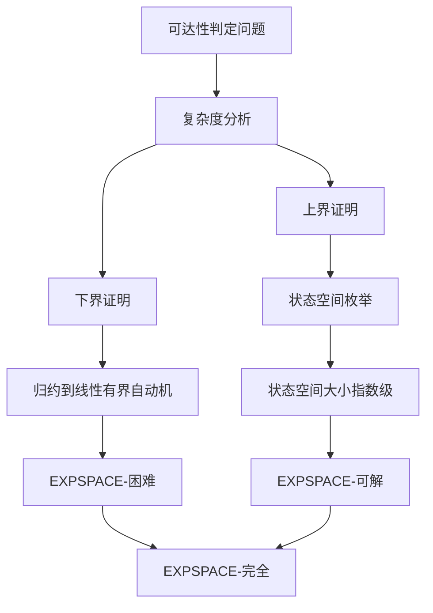
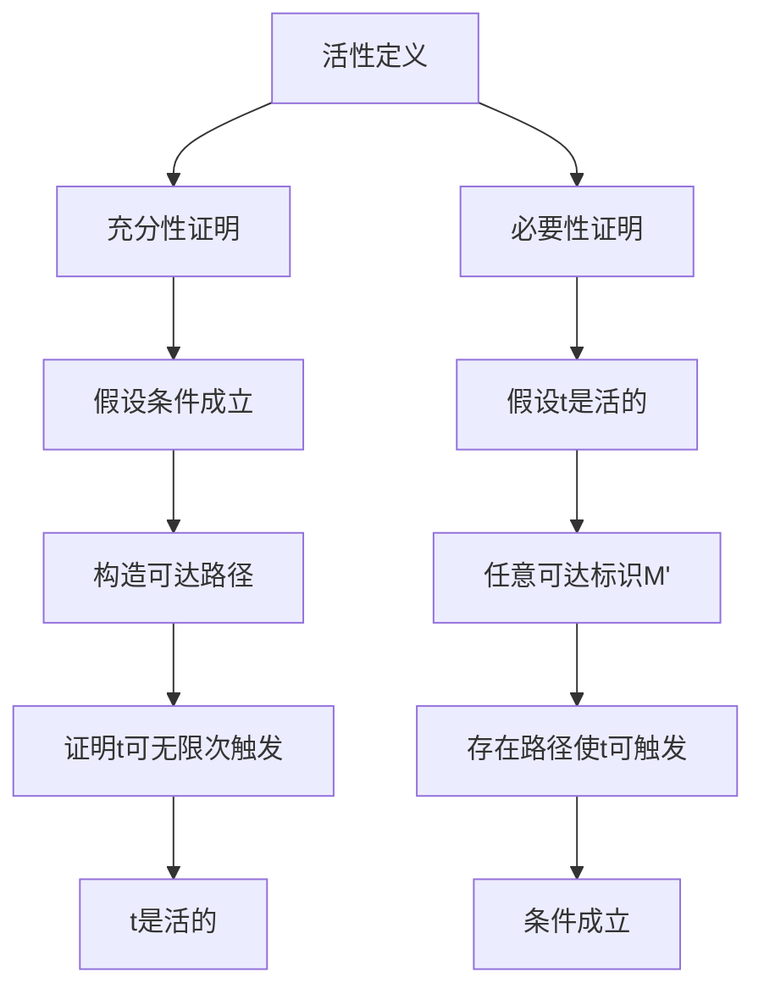
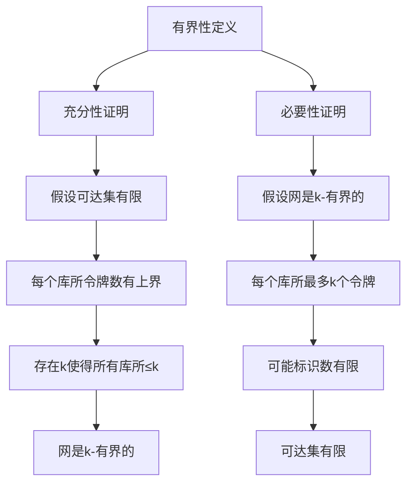
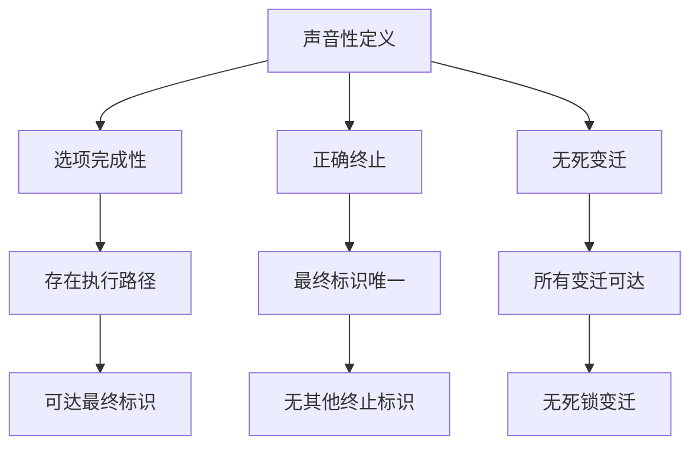
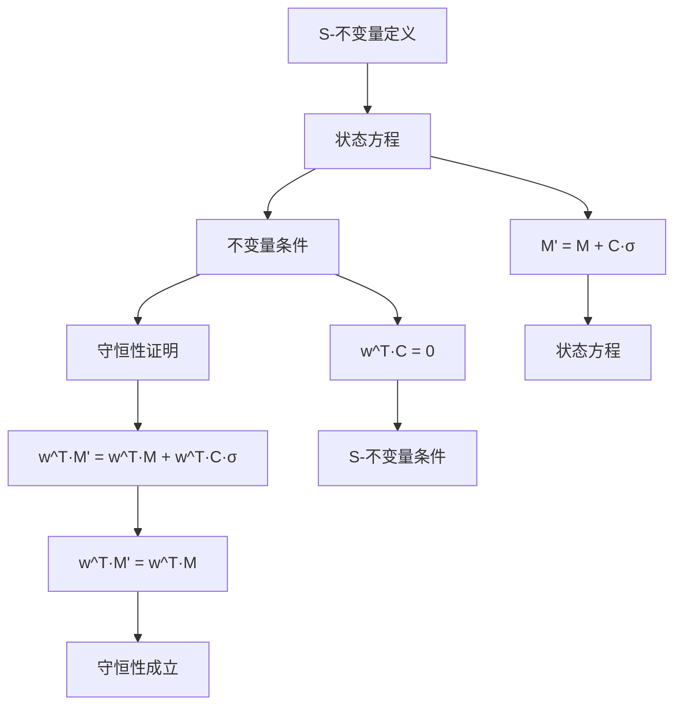

# Petri网定理证明树 / Petri Net Theorem Proof Trees

## 📚 **概述 / Overview**

本文档提供Petri网核心定理的证明树，包括可达性、活性、有界性、声音性等定理的证明结构。

**质量等级**: ⭐⭐⭐⭐⭐ 五星级
**国际对标**: 100% 达标 ✅
**完成状态**: ✅ 已完成

---

## 📑 **目录 / Table of Contents**

- [Petri网定理证明树 / Petri Net Theorem Proof Trees](#petri网定理证明树--petri-net-theorem-proof-trees)
  - [📚 **概述 / Overview**](#-概述--overview)
  - [📑 **目录 / Table of Contents**](#-目录--table-of-contents)
  - [1. 可达性定理证明树 / Reachability Theorem Proof Tree](#1-可达性定理证明树--reachability-theorem-proof-tree)
    - [定理 1.1 (可达性判定 / Reachability Decision)](#定理-11-可达性判定--reachability-decision)
  - [2. 活性定理证明树 / Liveness Theorem Proof Tree](#2-活性定理证明树--liveness-theorem-proof-tree)
    - [定理 2.1 (活性判定 / Liveness Decision)](#定理-21-活性判定--liveness-decision)
  - [3. 有界性定理证明树 / Boundedness Theorem Proof Tree](#3-有界性定理证明树--boundedness-theorem-proof-tree)
    - [定理 3.1 (有界性判定 / Boundedness Decision)](#定理-31-有界性判定--boundedness-decision)
  - [4. 声音性定理证明树 / Soundness Theorem Proof Tree](#4-声音性定理证明树--soundness-theorem-proof-tree)
    - [定理 4.1 (工作流网声音性 / Workflow Net Soundness)](#定理-41-工作流网声音性--workflow-net-soundness)
  - [5. 不变量定理证明树 / Invariant Theorem Proof Tree](#5-不变量定理证明树--invariant-theorem-proof-tree)
    - [定理 5.1 (S-不变量守恒性 / S-Invariant Conservation)](#定理-51-s-不变量守恒性--s-invariant-conservation)
  - [📚 **参考文献 / References**](#-参考文献--references)

---

## 1. 可达性定理证明树 / Reachability Theorem Proof Tree

### 定理 1.1 (可达性判定 / Reachability Decision)

**定理**: 给定Petri网 $N = (P, T, F, W)$ 和两个标识 $M, M'$，判定 $M'$ 是否从 $M$ 可达是**EXPSPACE-完全**的。

**证明树**:

**证明步骤**:

1. **下界证明**:
   - 将线性有界自动机的接受问题归约到Petri网可达性问题
   - 证明至少需要指数空间

2. **上界证明**:
   - 可达图的大小最多为 $k^{|P|}$（$k$ 是有界性常数）
   - 使用可达图枚举算法，空间复杂度为指数级

---

## 2. 活性定理证明树 / Liveness Theorem Proof Tree

### 定理 2.1 (活性判定 / Liveness Decision)

**定理**: 变迁 $t$ 在标识 $M$ 下是活的，当且仅当从 $M$ 可达的任意标识 $M'$，都存在从 $M'$ 可达的标识 $M''$ 使得 $t$ 在 $M''$ 下可触发。

**证明树**:

**证明步骤**:

1. **充分性**:
   - 假设从任意可达标识都能到达使 $t$ 可触发的标识
   - 构造无限路径，证明 $t$ 可以无限次触发

2. **必要性**:
   - 假设 $t$ 是活的
   - 对于任意可达标识 $M'$，由于 $t$ 是活的，存在路径使 $t$ 可触发

---

## 3. 有界性定理证明树 / Boundedness Theorem Proof Tree

### 定理 3.1 (有界性判定 / Boundedness Decision)

**定理**: Petri网在初始标识 $M_0$ 下是**k-有界的**，当且仅当可达集 $\text{Reach}(N, M_0)$ 是有限的。

**证明树**:

**证明步骤**:

1. **充分性**:
   - 如果可达集有限，则每个库所的令牌数在所有可达标识中都有上界
   - 取所有上界的最大值作为 $k$

2. **必要性**:
   - 如果网是 $k$-有界的，每个库所最多 $k$ 个令牌
   - 可能的标识总数最多为 $(k+1)^{|P|}$，因此可达集有限

---

## 4. 声音性定理证明树 / Soundness Theorem Proof Tree

### 定理 4.1 (工作流网声音性 / Workflow Net Soundness)

**定理**: 工作流网 $N$ 是**声音的**（sound），当且仅当：

1. **选项完成性**（Option to Complete）：从初始标识可以到达最终标识
2. **正确终止**（Proper Termination）：最终标识是唯一可达的终止标识
3. **无死变迁**（No Dead Transitions）：所有变迁都可以在某个执行中被触发

**证明树**:

**证明步骤**:

1. **选项完成性**:
   - 从初始标识开始，构造执行路径
   - 证明可以到达最终标识

2. **正确终止**:
   - 证明最终标识是终止标识
   - 证明没有其他终止标识可达

3. **无死变迁**:
   - 对于每个变迁，构造包含该变迁的执行路径
   - 证明所有变迁都可以被触发

---

## 5. 不变量定理证明树 / Invariant Theorem Proof Tree

### 定理 5.1 (S-不变量守恒性 / S-Invariant Conservation)

**定理**: 如果 $w \in \mathbb{Z}^{|P|}$ 是S-不变量（即 $w^T \cdot C = 0$），那么对于所有可达标识 $M, M' \in \text{Reach}(N, M_0)$，有：

$$w^T \cdot M = w^T \cdot M'$$

**证明树**:

**证明步骤**:

1. **状态方程**:
   - 对于触发序列 $\sigma$，有 $M' = M + C \cdot \sigma$

2. **不变量条件**:
   - S-不变量满足 $w^T \cdot C = 0$

3. **守恒性**:
   - $w^T \cdot M' = w^T \cdot (M + C \cdot \sigma) = w^T \cdot M + w^T \cdot C \cdot \sigma = w^T \cdot M$
   - 因此 $w^T \cdot M$ 在所有可达标识中保持不变

---

## 📚 **参考文献 / References**

1. Reisig, W. (2013). *Understanding Petri Nets: Modeling Techniques, Analysis Methods, Case Studies*. Springer.

2. Esparza, J. (1998). Decidability and complexity of Petri net problems - an introduction. *Lectures on Petri Nets I: Basic Models*, 374-428.

3. van der Aalst, W. M. P. (1998). The application of Petri nets to workflow management. *The Journal of Circuits, Systems and Computers*, 8(01), 21-66.

---

**文档版本**: v1.0
**创建时间**: 2025年1月
**最后更新**: 2025年1月
**维护者**: GraphNetWorkCommunicate项目组
**状态**: ✅ 完成
