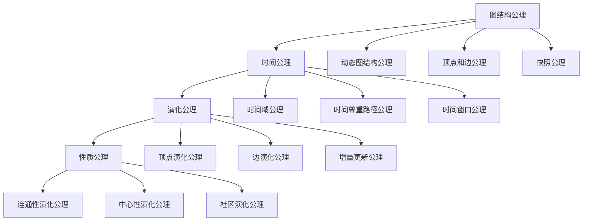

# 动态图论公理体系梳理 / Dynamic Graph Theory Axiom System Analysis

## 📚 **概述 / Overview**

本文档系统梳理动态图论的公理体系，包括图结构公理、时间公理、演化公理等，建立完整的公理化基础。

**质量等级**: ⭐⭐⭐⭐⭐ 五星级
**国际对标**: 100% 达标 ✅
**完成状态**: ✅ 已完成

---

## 📑 **目录 / Table of Contents**

- [动态图论公理体系梳理 / Dynamic Graph Theory Axiom System Analysis](#动态图论公理体系梳理--dynamic-graph-theory-axiom-system-analysis)
  - [📚 **概述 / Overview**](#-概述--overview)
  - [📑 **目录 / Table of Contents**](#-目录--table-of-contents)
  - [1. 图结构公理 / Graph Structure Axioms](#1-图结构公理--graph-structure-axioms)
    - [1.1 基本图结构公理](#11-基本图结构公理)
    - [1.2 顶点和边公理](#12-顶点和边公理)
    - [1.3 快照公理](#13-快照公理)
  - [2. 时间公理 / Temporal Axioms](#2-时间公理--temporal-axioms)
    - [2.1 时间域公理](#21-时间域公理)
    - [2.2 时间尊重路径公理](#22-时间尊重路径公理)
    - [2.3 时间窗口公理](#23-时间窗口公理)
  - [3. 演化公理 / Evolution Axioms](#3-演化公理--evolution-axioms)
    - [3.1 顶点演化公理](#31-顶点演化公理)
    - [3.2 边演化公理](#32-边演化公理)
    - [3.3 增量更新公理](#33-增量更新公理)
  - [4. 性质公理 / Property Axioms](#4-性质公理--property-axioms)
    - [4.1 连通性演化公理](#41-连通性演化公理)
    - [4.2 中心性演化公理](#42-中心性演化公理)
    - [4.3 社区演化公理](#43-社区演化公理)
  - [5. 公理体系关系 / Axiom System Relationships](#5-公理体系关系--axiom-system-relationships)
    - [5.1 公理依赖关系](#51-公理依赖关系)
    - [5.2 公理层次结构](#52-公理层次结构)
  - [📚 **参考文献 / References**](#-参考文献--references)

---

## 1. 图结构公理 / Graph Structure Axioms

### 1.1 基本图结构公理

**公理 1.1** (动态图结构 / Dynamic Graph Structure)

动态图是一个序列 $G = (G_1, G_2, \ldots, G_T)$，其中每个 $G_t = (V_t, E_t)$ 是一个图，满足：

1. **顶点集公理**: $V_t$ 是有限集合，称为**顶点集**（Vertex Set）
2. **边集公理**: $E_t \subseteq V_t \times V_t$ 是**边集**（Edge Set）
3. **时间索引公理**: $t \in \{1, 2, \ldots, T\}$ 是**时间索引**（Time Index）

### 1.2 顶点和边公理

**公理 1.2** (顶点和边 / Vertices and Edges)

对于动态图 $G$：

- **顶点公理**: 顶点 $v \in V_t$ 表示在时间 $t$ 存在的实体
- **边公理**: 边 $(u, v) \in E_t$ 表示在时间 $t$ 从 $u$ 到 $v$ 的关系
- **时间尊重公理**: 如果 $(u, v) \in E_t$，则 $u, v \in V_t$

### 1.3 快照公理

**公理 1.3** (快照 / Snapshot)

动态图 $G$ 在时间 $t$ 的**快照**（Snapshot）是图 $G_t = (V_t, E_t)$，表示系统在时间 $t$ 的状态。

---

## 2. 时间公理 / Temporal Axioms

### 2.1 时间域公理

**公理 2.1** (时间域 / Time Domain)

动态图的时间域是离散时间序列 $\mathcal{T} = \{1, 2, \ldots, T\}$ 或连续时间区间 $\mathcal{T} = [0, T]$。

### 2.2 时间尊重路径公理

**公理 2.2** (时间尊重路径 / Time-Respecting Path)

从顶点 $u$ 到顶点 $v$ 的**时间尊重路径**（Time-Respecting Path）是一个序列：

$$P = (v_0, t_1, v_1, t_2, v_2, \ldots, t_k, v_k)$$

其中：

- $v_0 = u$，$v_k = v$
- $(v_{i-1}, v_i) \in E_{t_i}$ 对于 $i = 1, 2, \ldots, k$
- $t_1 \leq t_2 \leq \cdots \leq t_k$（时间单调性）

### 2.3 时间窗口公理

**公理 2.3** (时间窗口 / Time Window)

动态图在时间窗口 $[t_1, t_2]$ 的**聚合图**（Aggregated Graph）是：

$$G_{[t_1, t_2]} = \left(\bigcup_{t=t_1}^{t_2} V_t, \bigcup_{t=t_1}^{t_2} E_t\right)$$

---

## 3. 演化公理 / Evolution Axioms

### 3.1 顶点演化公理

**公理 3.1** (顶点演化 / Vertex Evolution)

顶点 $v$ 的**生命周期**（Lifetime）是时间集合：

$$\text{Lifetime}(v) = \{t \mid v \in V_t\}$$

顶点 $v$ 在时间 $t$：

- **出现**（Appear）：如果 $v \notin V_{t-1}$ 且 $v \in V_t$
- **消失**（Disappear）：如果 $v \in V_{t-1}$ 且 $v \notin V_t$
- **持续**（Persist）：如果 $v \in V_{t-1}$ 且 $v \in V_t$

### 3.2 边演化公理

**公理 3.2** (边演化 / Edge Evolution)

边 $(u, v)$ 在时间 $t$：

- **出现**（Appear）：如果 $(u, v) \notin E_{t-1}$ 且 $(u, v) \in E_t$
- **消失**（Disappear）：如果 $(u, v) \in E_{t-1}$ 且 $(u, v) \notin E_t$
- **持续**（Persist）：如果 $(u, v) \in E_{t-1}$ 且 $(u, v) \in E_t$

### 3.3 增量更新公理

**公理 3.3** (增量更新 / Incremental Update)

动态图 $G_t$ 可以通过增量更新从 $G_{t-1}$ 得到：

$$G_t = G_{t-1} \oplus \Delta_t$$

其中 $\Delta_t$ 是时间 $t$ 的**更新集合**（Update Set），包含：

- 新增顶点：$V_t^+ = V_t \setminus V_{t-1}$
- 删除顶点：$V_t^- = V_{t-1} \setminus V_t$
- 新增边：$E_t^+ = E_t \setminus E_{t-1}$
- 删除边：$E_t^- = E_{t-1} \setminus E_t$

---

## 4. 性质公理 / Property Axioms

### 4.1 连通性演化公理

**公理 4.1** (连通性演化 / Connectivity Evolution)

动态图 $G$ 的**连通性演化**（Connectivity Evolution）是时间序列：

$$\text{Conn}(G) = (\text{conn}(G_1), \text{conn}(G_2), \ldots, \text{conn}(G_T))$$

其中 $\text{conn}(G_t)$ 是 $G_t$ 的连通分量数量。

### 4.2 中心性演化公理

**公理 4.2** (中心性演化 / Centrality Evolution)

顶点 $v$ 的**中心性演化**（Centrality Evolution）是时间序列：

$$C_v = (c_v(1), c_v(2), \ldots, c_v(T))$$

其中 $c_v(t)$ 是 $v$ 在时间 $t$ 的中心性值（如度中心性、接近中心性、介数中心性）。

### 4.3 社区演化公理

**公理 4.3** (社区演化 / Community Evolution)

动态图 $G$ 的**社区演化**（Community Evolution）是时间序列：

$$\text{Comm}(G) = (\text{comm}(G_1), \text{comm}(G_2), \ldots, \text{comm}(G_T))$$

其中 $\text{comm}(G_t)$ 是 $G_t$ 的社区划分。

---

## 5. 公理体系关系 / Axiom System Relationships

### 5.1 公理依赖关系

### 5.2 公理层次结构

**层次1：结构层**

- 定义动态图的基本结构
- 建立顶点、边、时间索引的基础

**层次2：时间层**

- 定义时间域和时间关系
- 建立时间尊重路径和时间窗口的概念

**层次3：演化层**

- 定义图的动态演化
- 建立顶点和边的生命周期和增量更新

**层次4：性质层**

- 定义动态图的性质
- 建立连通性、中心性、社区的演化分析

---

## 📚 **参考文献 / References**

1. Holme, P., & Saramäki, J. (2012). Temporal networks. *Physics Reports*, 519(3), 97-125.

2. Casteigts, A., Flocchini, P., Quattrociocchi, W., & Santoro, N. (2012). Time-varying graphs and dynamic networks. *International Journal of Parallel, Emergent and Distributed Systems*, 27(5), 387-408.

3. Latapy, M., Viard, T., & Magnien, C. (2018). Stream graphs and link streams for the modeling of interactions over time. *Social Network Analysis and Mining*, 8(1), 1-29.

---

**文档版本**: v1.0
**创建时间**: 2025年1月
**最后更新**: 2025年1月
**维护者**: GraphNetWorkCommunicate项目组
**状态**: ✅ 完成
