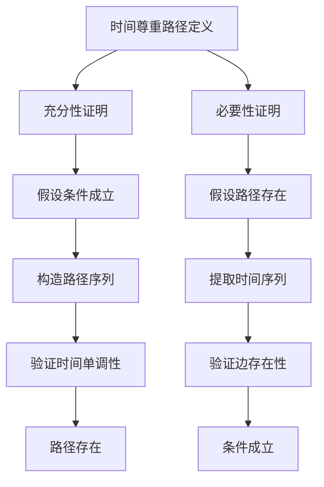
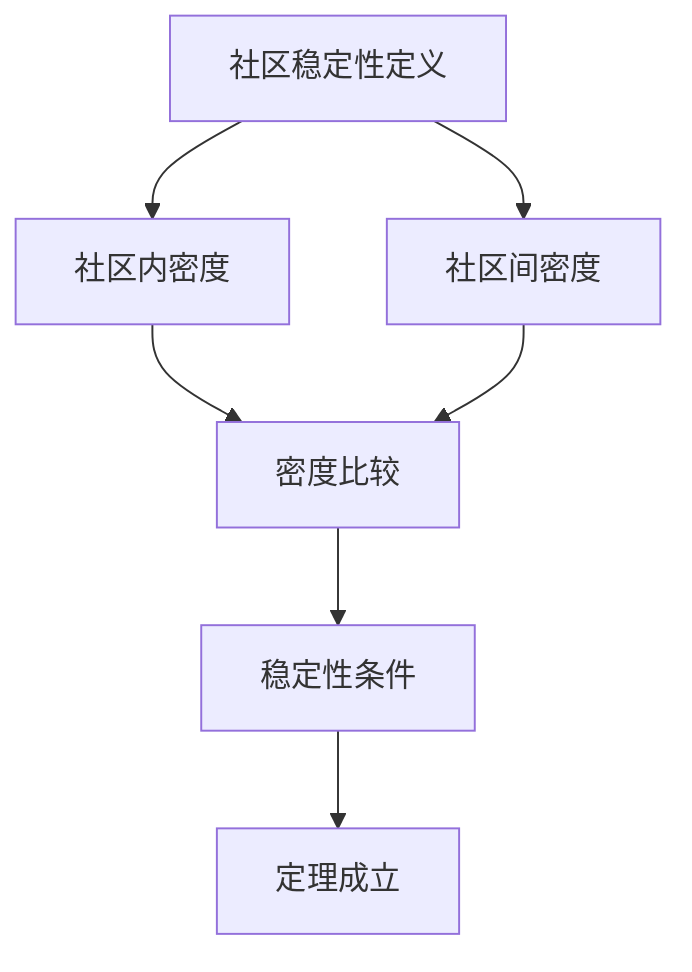
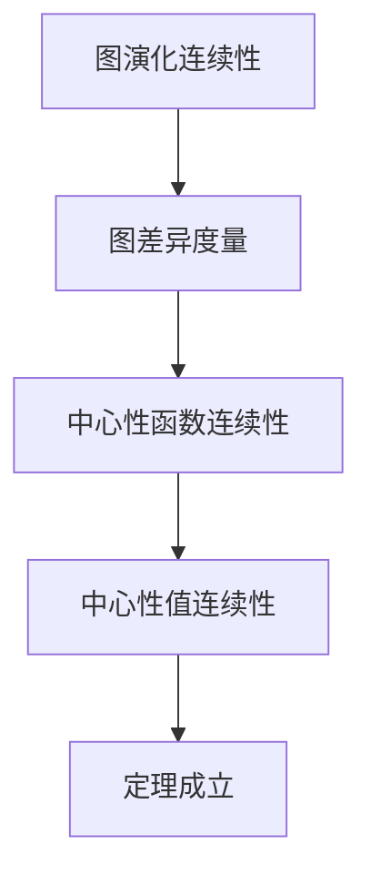
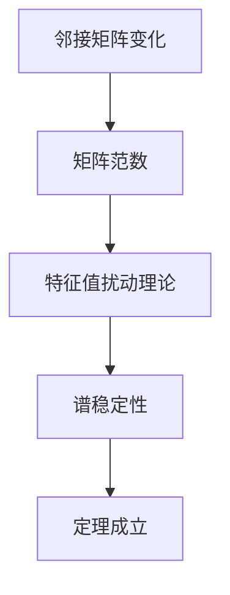

# 动态图论定理证明树 / Dynamic Graph Theory Theorem Proof Trees

## 📚 **概述 / Overview**

本文档提供动态图论核心定理的证明树，包括时间尊重路径、社区演化、中心性稳定性等定理的证明结构。

**质量等级**: ⭐⭐⭐⭐⭐ 五星级
**国际对标**: 100% 达标 ✅
**完成状态**: ✅ 已完成

---

## 📑 **目录 / Table of Contents**

- [动态图论定理证明树 / Dynamic Graph Theory Theorem Proof Trees](#动态图论定理证明树--dynamic-graph-theory-theorem-proof-trees)
  - [📚 **概述 / Overview**](#-概述--overview)
  - [📑 **目录 / Table of Contents**](#-目录--table-of-contents)
  - [1. 时间尊重路径定理证明树 / Time-Respecting Path Theorem Proof Tree](#1-时间尊重路径定理证明树--time-respecting-path-theorem-proof-tree)
  - [2. 社区演化稳定性定理证明树 / Community Evolution Stability Theorem Proof Tree](#2-社区演化稳定性定理证明树--community-evolution-stability-theorem-proof-tree)
  - [3. 中心性演化定理证明树 / Centrality Evolution Theorem Proof Tree](#3-中心性演化定理证明树--centrality-evolution-theorem-proof-tree)
  - [4. 谱演化定理证明树 / Spectral Evolution Theorem Proof Tree](#4-谱演化定理证明树--spectral-evolution-theorem-proof-tree)

---

## 1. 时间尊重路径定理证明树 / Time-Respecting Path Theorem Proof Tree

### 定理 1.1 (时间尊重路径存在性 / Time-Respecting Path Existence)

**定理**: 在动态图 $G$ 中，从顶点 $u$ 到顶点 $v$ 存在时间尊重路径，当且仅当存在时间序列 $t_1 \leq t_2 \leq \cdots \leq t_k$ 和顶点序列 $v_0 = u, v_1, \ldots, v_k = v$，使得 $(v_{i-1}, v_i) \in E_{t_i}$ 对于所有 $i = 1, 2, \ldots, k$。

**证明树**:

**证明步骤**:

1. **充分性**:
   - 假设存在满足条件的时间序列和顶点序列
   - 构造时间尊重路径 $P = (v_0, t_1, v_1, t_2, v_2, \ldots, t_k, v_k)$
   - 验证路径满足时间尊重条件

2. **必要性**:
   - 假设存在时间尊重路径 $P$
   - 从路径中提取时间序列和顶点序列
   - 验证序列满足条件

---

## 2. 社区演化稳定性定理证明树 / Community Evolution Stability Theorem Proof Tree

### 定理 2.1 (社区稳定性 / Community Stability)

**定理**: 如果动态图 $G$ 的社区结构在时间窗口 $[t_1, t_2]$ 内稳定（即社区划分变化很小），那么社区内的顶点在时间窗口内的连接密度高于社区间的连接密度。

**证明树**:

**证明步骤**:

1. **定义社区内密度**:
   - 社区 $C$ 在时间 $t$ 的内密度：$\rho_{\text{in}}(C, t) = \frac{|E_t(C)|}{|C|(|C|-1)/2}$
   - 其中 $E_t(C)$ 是社区 $C$ 内部的边

2. **定义社区间密度**:
   - 社区 $C_1$ 和 $C_2$ 在时间 $t$ 的间密度：$\rho_{\text{out}}(C_1, C_2, t) = \frac{|E_t(C_1, C_2)|}{|C_1||C_2|}$

3. **稳定性条件**:
   - 如果社区结构稳定，则 $\rho_{\text{in}}(C, t) > \rho_{\text{out}}(C, C', t)$ 对于所有社区 $C, C'$ 和时间 $t \in [t_1, t_2]$

---

## 3. 中心性演化定理证明树 / Centrality Evolution Theorem Proof Tree

### 定理 3.1 (中心性连续性 / Centrality Continuity)

**定理**: 如果动态图 $G$ 的演化是连续的（即相邻时间步的图差异很小），那么顶点的中心性值也是连续的（即相邻时间步的中心性值变化很小）。

**证明树**:

**证明步骤**:

1. **图差异度量**:
   - 定义图 $G_t$ 和 $G_{t+1}$ 的差异：$d(G_t, G_{t+1}) = |V_t \Delta V_{t+1}| + |E_t \Delta E_{t+1}|$
   - 其中 $\Delta$ 表示对称差

2. **中心性函数连续性**:
   - 中心性函数 $c: \mathcal{G} \to \mathbb{R}$ 是连续的，如果对于任意 $\epsilon > 0$，存在 $\delta > 0$，使得当 $d(G, G') < \delta$ 时，$|c(G) - c(G')| < \epsilon$

3. **中心性值连续性**:
   - 如果图演化连续且中心性函数连续，则中心性值也连续

---

## 4. 谱演化定理证明树 / Spectral Evolution Theorem Proof Tree

### 定理 4.1 (谱稳定性 / Spectral Stability)

**定理**: 如果动态图 $G$ 的邻接矩阵在时间窗口 $[t_1, t_2]$ 内的变化很小（即 $\|A_t - A_{t+1}\|$ 很小），那么图的谱（特征值）也变化很小。

**证明树**:

**证明步骤**:

1. **矩阵范数**:
   - 定义邻接矩阵 $A_t$ 和 $A_{t+1}$ 的差异：$\|A_t - A_{t+1}\|$

2. **特征值扰动理论**:
   - 使用Weyl不等式：$|\lambda_i(A_t) - \lambda_i(A_{t+1})| \leq \|A_t - A_{t+1}\|$
   - 其中 $\lambda_i$ 是第 $i$ 个特征值

3. **谱稳定性**:
   - 如果 $\|A_t - A_{t+1}\|$ 很小，则特征值变化也很小

---

## 📚 **参考文献 / References**

1. Holme, P., & Saramäki, J. (2012). Temporal networks. *Physics Reports*, 519(3), 97-125.

2. Palla, G., Barabási, A. L., & Vicsek, T. (2007). Quantifying social group evolution. *Nature*, 446(7136), 664-667.

3. Chung, F. (1997). *Spectral Graph Theory*. American Mathematical Society.

---

**文档版本**: v1.0
**创建时间**: 2025年1月
**最后更新**: 2025年1月
**维护者**: GraphNetWorkCommunicate项目组
**状态**: ✅ 完成
