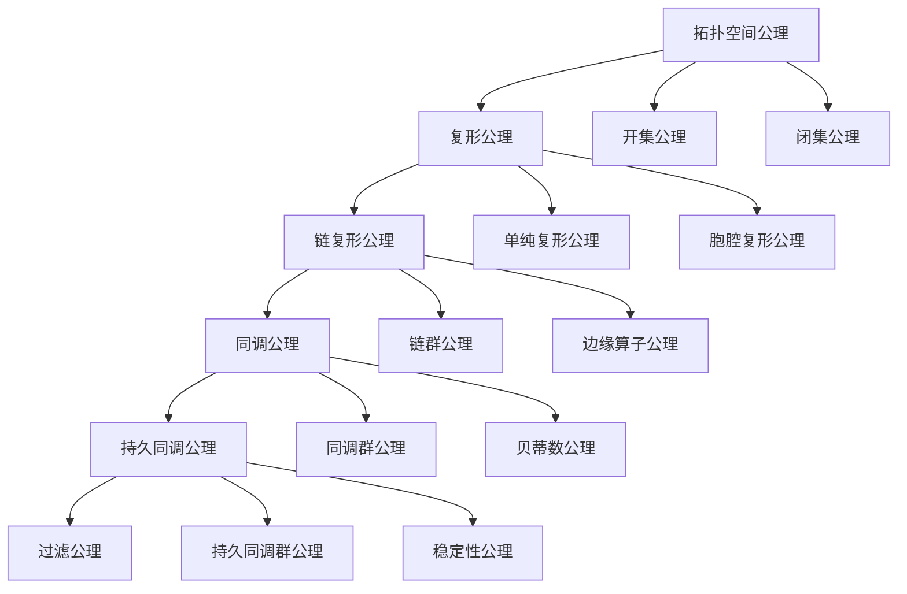

# 拓扑模型公理体系梳理 / Topological Models Axiom System Analysis

## 📚 **概述 / Overview**

本文档系统梳理拓扑模型的公理体系，包括拓扑空间公理、复形公理、同调公理等，建立完整的公理化基础。

**质量等级**: ⭐⭐⭐⭐⭐ 五星级
**国际对标**: 100% 达标 ✅
**完成状态**: ✅ 已完成

---

## 📑 **目录 / Table of Contents**

- [拓扑模型公理体系梳理 / Topological Models Axiom System Analysis](#拓扑模型公理体系梳理--topological-models-axiom-system-analysis)
  - [📚 **概述 / Overview**](#-概述--overview)
  - [📑 **目录 / Table of Contents**](#-目录--table-of-contents)
  - [1. 拓扑空间公理 / Topological Space Axioms](#1-拓扑空间公理--topological-space-axioms)
  - [2. 复形公理 / Complex Axioms](#2-复形公理--complex-axioms)
  - [3. 链复形公理 / Chain Complex Axioms](#3-链复形公理--chain-complex-axioms)
  - [4. 同调公理 / Homology Axioms](#4-同调公理--homology-axioms)
  - [5. 持久同调公理 / Persistent Homology Axioms](#5-持久同调公理--persistent-homology-axioms)
  - [6. 公理体系关系 / Axiom System Relationships](#6-公理体系关系--axiom-system-relationships)

---

## 1. 拓扑空间公理 / Topological Space Axioms

### 1.1 拓扑空间定义公理

**公理 1.1** (拓扑空间 / Topological Space)

集合 $X$ 上的**拓扑**（Topology）是 $X$ 的子集族 $\tau$，满足：

1. **空集和全集公理**: $\emptyset \in \tau$ 且 $X \in \tau$
2. **并集公理**: 对于任意子集族 $\{U_i\}_{i \in I} \subseteq \tau$，有 $\bigcup_{i \in I} U_i \in \tau$
3. **交集公理**: 对于有限子集族 $\{U_i\}_{i=1}^n \subseteq \tau$，有 $\bigcap_{i=1}^n U_i \in \tau$

有序对 $(X, \tau)$ 称为**拓扑空间**（Topological Space）。

### 1.2 开集和闭集公理

**公理 1.2** (开集和闭集 / Open and Closed Sets)

在拓扑空间 $(X, \tau)$ 中：

- **开集公理**: $U \in \tau$ 称为**开集**（Open Set）
- **闭集公理**: $X \setminus U$ 是开集时，$U$ 称为**闭集**（Closed Set）

---

## 2. 复形公理 / Complex Axioms

### 2.1 单纯复形公理

**公理 2.1** (单纯复形 / Simplicial Complex)

**单纯复形**（Simplicial Complex）$K$ 是有限个单纯形的集合，满足：

1. **面封闭性公理**: 如果 $\sigma \in K$ 且 $\tau \subseteq \sigma$ 是 $\sigma$ 的面，则 $\tau \in K$
2. **相交公理**: 如果 $\sigma, \tau \in K$，则 $\sigma \cap \tau$ 要么是空集，要么是 $\sigma$ 和 $\tau$ 的公共面

### 2.2 胞腔复形公理

**公理 2.2** (胞腔复形 / Cell Complex)

**胞腔复形**（Cell Complex）$K$ 是有限个胞腔的集合，满足：

1. **边界公理**: 每个胞腔的边界是低维胞腔的并集
2. **相交公理**: 两个胞腔要么不相交，要么在边界上相交

---

## 3. 链复形公理 / Chain Complex Axioms

### 3.1 链复形定义公理

**公理 3.1** (链复形 / Chain Complex)

**链复形**（Chain Complex）是一个序列：

$$\cdots \xrightarrow{\partial_{i+1}} C_{i+1} \xrightarrow{\partial_i} C_i \xrightarrow{\partial_{i-1}} C_{i-1} \xrightarrow{\partial_{i-2}} \cdots$$

其中：

1. **链群公理**: $C_i$ 是 $i$ 维链的**自由阿贝尔群**（Free Abelian Group）
2. **边缘算子公理**: $\partial_i: C_i \to C_{i-1}$ 是**群同态**（Group Homomorphism）
3. **边界条件公理**: $\partial_{i-1} \circ \partial_i = 0$（边界无边界）

### 3.2 边缘算子公理

**公理 3.2** (边缘算子 / Boundary Operator)

对于 $i$ 维单纯形 $\sigma = [v_0, v_1, \ldots, v_i]$，**边缘算子**定义为：

$$\partial_i(\sigma) = \sum_{j=0}^i (-1)^j [v_0, \ldots, \hat{v_j}, \ldots, v_i]$$

其中 $\hat{v_j}$ 表示删除顶点 $v_j$。

---

## 4. 同调公理 / Homology Axioms

### 4.1 同调群定义公理

**公理 4.1** (同调群 / Homology Group)

链复形 $C_*$ 的**$i$ 维同调群**（$i$-th Homology Group）定义为：

$$H_i(C_*) = \frac{\ker \partial_i}{\text{im } \partial_{i+1}}$$

其中：

- $\ker \partial_i = \{c \in C_i \mid \partial_i(c) = 0\}$ 是**$i$ 维闭链群**（$i$-th Cycle Group）
- $\text{im } \partial_{i+1} = \{\partial_{i+1}(c) \mid c \in C_{i+1}\}$ 是**$i$ 维边缘链群**（$i$-th Boundary Group）

### 4.2 贝蒂数公理

**公理 4.2** (贝蒂数 / Betti Number)

复形 $K$ 的**$i$ 维贝蒂数**（$i$-th Betti Number）定义为：

$$\beta_i(K) = \text{rank } H_i(K)$$

表示 $i$ 维同调群的**自由部分的秩**，即 $i$ 维洞的数量。

### 4.3 上同调公理

**公理 4.3** (上同调群 / Cohomology Group)

链复形 $C_*$ 的**$i$ 维上同调群**（$i$-th Cohomology Group）定义为：

$$H^i(C_*) = \frac{\ker \delta_i}{\text{im } \delta_{i-1}}$$

其中 $\delta_i: C^i \to C^{i+1}$ 是**上边缘算子**（Coboundary Operator），满足 $\delta_{i-1} \circ \delta_i = 0$。

---

## 5. 持久同调公理 / Persistent Homology Axioms

### 5.1 过滤公理

**公理 5.1** (过滤 / Filtration)

复形 $K$ 的**过滤**（Filtration）是一个嵌套序列：

$$K_0 \subseteq K_1 \subseteq K_2 \subseteq \cdots \subseteq K_n = K$$

其中每个 $K_i$ 是 $K$ 的子复形。

### 5.2 持久同调群公理

**公理 5.2** (持久同调群 / Persistent Homology Group)

过滤 $\{K_i\}$ 的**$i$ 维持久同调群**（$i$-th Persistent Homology Group）定义为：

$$H_i^{p,q}(K) = \text{im}(H_i(K_p) \to H_i(K_q))$$

表示在 $K_p$ 中出生并在 $K_q$ 中仍然存在的 $i$ 维特征。

### 5.3 持久条带公理

**公理 5.3** (持久条带 / Persistence Bar)

**持久条带**（Persistence Bar）是一个区间 $[b, d)$，其中：

- $b$ 是特征的**出生时间**（Birth Time）
- $d$ 是特征的**死亡时间**（Death Time）

特征的**持久性**（Persistence）定义为 $d - b$。

### 5.4 稳定性公理

**公理 5.4** (持久同调稳定性 / Persistent Homology Stability)

对于两个过滤 $\{K_i\}$ 和 $\{K'_i\}$，它们的持久条带之间的**瓶颈距离**（Bottleneck Distance）满足：

$$d_B(\text{PH}(\{K_i\}), \text{PH}(\{K'_i\})) \leq d_H(\{K_i\}, \{K'_i\})$$

其中 $d_H$ 是**Hausdorff距离**（Hausdorff Distance）。

---

## 6. 公理体系关系 / Axiom System Relationships

### 6.1 公理依赖关系

### 6.2 公理层次结构

**层次1：拓扑层**

- 定义拓扑空间的基本结构
- 建立开集、闭集的基础

**层次2：复形层**

- 定义单纯复形和胞腔复形
- 建立离散几何结构

**层次3：链复形层**

- 定义链复形和边缘算子
- 建立代数结构

**层次4：同调层**

- 定义同调群和贝蒂数
- 建立拓扑不变量

**层次5：持久同调层**

- 定义过滤和持久同调
- 建立多尺度拓扑分析

---

## 📚 **参考文献 / References**

1. Hatcher, A. (2002). *Algebraic Topology*. Cambridge University Press.

2. Edelsbrunner, H., & Harer, J. (2010). *Computational Topology: An Introduction*. American Mathematical Society.

3. Zomorodian, A., & Carlsson, G. (2005). Computing persistent homology. *Discrete & Computational Geometry*, 33(2), 249-274.

---

**文档版本**: v1.0
**创建时间**: 2025年1月
**最后更新**: 2025年1月
**维护者**: GraphNetWorkCommunicate项目组
**状态**: ✅ 完成
