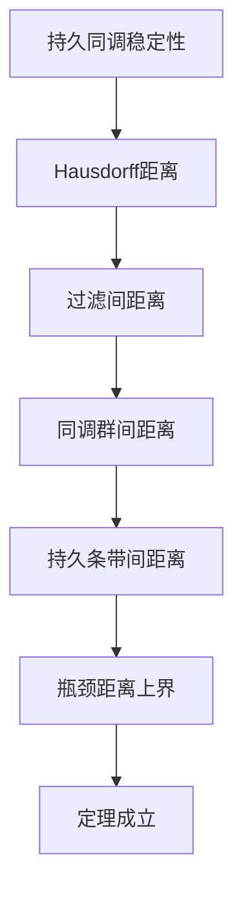
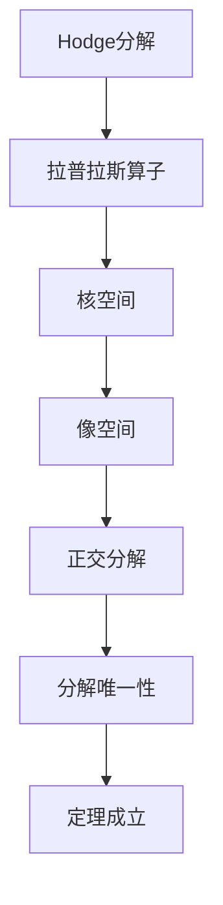
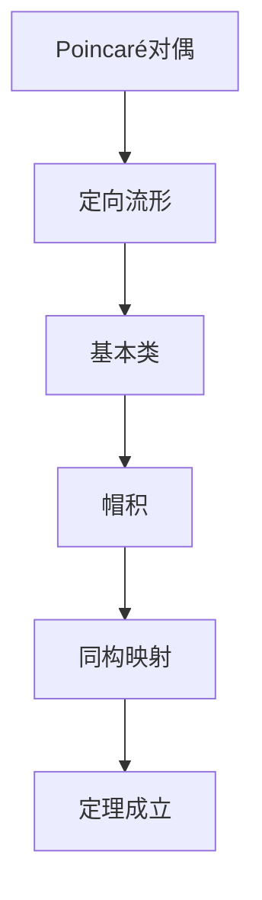
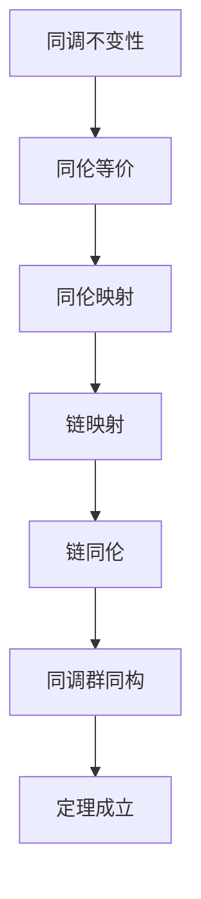

# 拓扑模型定理证明树 / Topological Models Theorem Proof Trees

## 📚 **概述 / Overview**

本文档提供拓扑模型核心定理的证明树，包括持久同调稳定性、Hodge分解、Poincaré对偶等定理的证明结构。

**质量等级**: ⭐⭐⭐⭐⭐ 五星级
**国际对标**: 100% 达标 ✅
**完成状态**: ✅ 已完成

---

## 📑 **目录 / Table of Contents**

- [拓扑模型定理证明树 / Topological Models Theorem Proof Trees](#拓扑模型定理证明树--topological-models-theorem-proof-trees)
  - [📚 **概述 / Overview**](#-概述--overview)
  - [📑 **目录 / Table of Contents**](#-目录--table-of-contents)
  - [1. 持久同调稳定性定理证明树 / Persistent Homology Stability Theorem Proof Tree](#1-持久同调稳定性定理证明树--persistent-homology-stability-theorem-proof-tree)
    - [定理 1.1 (持久同调稳定性 / Persistent Homology Stability)](#定理-11-持久同调稳定性--persistent-homology-stability)
  - [2. Hodge分解定理证明树 / Hodge Decomposition Theorem Proof Tree](#2-hodge分解定理证明树--hodge-decomposition-theorem-proof-tree)
    - [定理 2.1 (Hodge分解 / Hodge Decomposition)](#定理-21-hodge分解--hodge-decomposition)
  - [3. Poincaré对偶定理证明树 / Poincaré Duality Theorem Proof Tree](#3-poincaré对偶定理证明树--poincaré-duality-theorem-proof-tree)
    - [定理 3.1 (Poincaré对偶 / Poincaré Duality)](#定理-31-poincaré对偶--poincaré-duality)
  - [4. 同调不变性定理证明树 / Homology Invariance Theorem Proof Tree](#4-同调不变性定理证明树--homology-invariance-theorem-proof-tree)
    - [定理 4.1 (同调不变性 / Homology Invariance)](#定理-41-同调不变性--homology-invariance)
  - [📚 **参考文献 / References**](#-参考文献--references)

---

## 1. 持久同调稳定性定理证明树 / Persistent Homology Stability Theorem Proof Tree

### 定理 1.1 (持久同调稳定性 / Persistent Homology Stability)

**定理**: 对于两个过滤 $\{K_i\}$ 和 $\{K'_i\}$，它们的持久条带之间的瓶颈距离满足：

$$d_B(\text{PH}(\{K_i\}), \text{PH}(\{K'_i\})) \leq d_H(\{K_i\}, \{K'_i\})$$

其中 $d_H$ 是Hausdorff距离。

**证明树**:

**证明步骤**:

1. **Hausdorff距离定义**:
   - 定义两个过滤之间的Hausdorff距离
   - 度量过滤之间的差异

2. **同调群间距离**:
   - 证明过滤距离控制同调群间的距离
   - 使用同调群的连续性

3. **持久条带间距离**:
   - 证明同调群距离控制持久条带间的距离
   - 使用持久条带的定义

4. **瓶颈距离上界**:
   - 证明瓶颈距离不超过Hausdorff距离
   - 完成稳定性证明

---

## 2. Hodge分解定理证明树 / Hodge Decomposition Theorem Proof Tree

### 定理 2.1 (Hodge分解 / Hodge Decomposition)

**定理**: 对于链复形 $C_*$，$i$ 维链空间 $C_i$ 可以分解为：

$$C_i = \text{im } \partial_{i+1} \oplus \ker \Delta_i \oplus \text{im } \delta_{i-1}$$

其中 $\Delta_i = \partial_{i+1} \partial_{i+1}^* + \partial_i^* \partial_i$ 是**拉普拉斯算子**（Laplacian Operator）。

**证明树**:

**证明步骤**:

1. **拉普拉斯算子**:
   - 定义 $\Delta_i = \partial_{i+1} \partial_{i+1}^* + \partial_i^* \partial_i$
   - 证明 $\Delta_i$ 是自伴算子

2. **核空间**:
   - 证明 $\ker \Delta_i$ 是调和链空间
   - 证明 $\ker \Delta_i = \ker \partial_i \cap \ker \partial_{i+1}^*$

3. **像空间**:
   - 证明 $\text{im } \partial_{i+1}$ 和 $\text{im } \delta_{i-1}$ 正交
   - 证明它们与 $\ker \Delta_i$ 正交

4. **分解唯一性**:
   - 证明分解是唯一的
   - 完成Hodge分解证明

---

## 3. Poincaré对偶定理证明树 / Poincaré Duality Theorem Proof Tree

### 定理 3.1 (Poincaré对偶 / Poincaré Duality)

**定理**: 对于 $n$ 维紧致可定向流形 $M$，有：

$$H_i(M) \cong H^{n-i}(M)$$

即 $i$ 维同调群与 $(n-i)$ 维上同调群同构。

**证明树**:

**证明步骤**:

1. **基本类**:
   - 定义流形 $M$ 的**基本类**（Fundamental Class）$[M] \in H_n(M)$
   - 证明基本类的存在性和唯一性

2. **帽积**:
   - 定义**帽积**（Cap Product）$\cap: H_i(M) \times H^{n-i}(M) \to H_0(M)$
   - 证明帽积的双线性性

3. **同构映射**:
   - 构造映射 $\phi: H_i(M) \to H^{n-i}(M)$，$\phi(\alpha) = [M] \cap \alpha$
   - 证明 $\phi$ 是同构

---

## 4. 同调不变性定理证明树 / Homology Invariance Theorem Proof Tree

### 定理 4.1 (同调不变性 / Homology Invariance)

**定理**: 同调群是**同伦不变量**（Homotopy Invariant），即如果两个拓扑空间 $X$ 和 $Y$ 同伦等价，则 $H_i(X) \cong H_i(Y)$ 对于所有 $i$。

**证明树**:

**证明步骤**:

1. **同伦等价**:
   - 定义拓扑空间 $X$ 和 $Y$ 的同伦等价
   - 存在连续映射 $f: X \to Y$ 和 $g: Y \to X$ 使得 $g \circ f \simeq \text{id}_X$ 且 $f \circ g \simeq \text{id}_Y$

2. **链映射**:
   - 将连续映射提升为链复形之间的链映射
   - 证明链映射诱导同调群的同态

3. **链同伦**:
   - 定义链同伦（Chain Homotopy）
   - 证明同伦映射诱导链同伦的链映射

4. **同调群同构**:
   - 证明链同伦的链映射诱导同调群的同构
   - 完成不变性证明

---

## 📚 **参考文献 / References**

1. Hatcher, A. (2002). *Algebraic Topology*. Cambridge University Press.

2. Edelsbrunner, H., & Harer, J. (2010). *Computational Topology: An Introduction*. American Mathematical Society.

3. Cohen-Steiner, D., Edelsbrunner, H., & Harer, J. (2007). Stability of persistence diagrams. *Discrete & Computational Geometry*, 37(1), 103-120.

---

**文档版本**: v1.0
**创建时间**: 2025年1月
**最后更新**: 2025年1月
**维护者**: GraphNetWorkCommunicate项目组
**状态**: ✅ 完成
