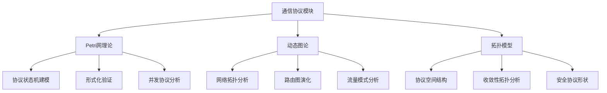
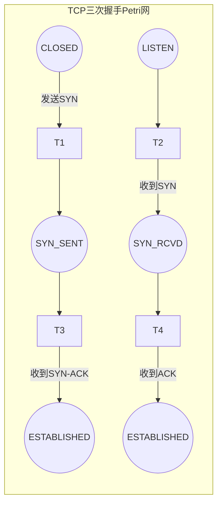
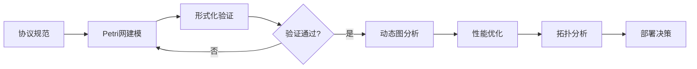

# 通信协议模块理论关系梳理 / Communication Protocol Module Theory Relationship Analysis

## 📚 **概述 / Overview**

**文档目的**: 梳理通信协议模块与三大理论（Petri网、动态图论、拓扑模型）的关系，揭示协议设计、验证和分析中的理论基础。

**核心内容**:

- 协议与Petri网的关系（状态机建模、形式化验证）
- 协议与动态图论的关系（网络拓扑、路由分析）
- 协议与拓扑模型的关系（协议空间结构）
- 跨理论应用模式

**适用对象**: 协议设计师、网络工程师、形式化验证研究者

---

## 📋 **目录 / Table of Contents**

- [通信协议模块理论关系梳理 / Communication Protocol Module Theory Relationship Analysis](#通信协议模块理论关系梳理--communication-protocol-module-theory-relationship-analysis)
  - [📚 **概述 / Overview**](#-概述--overview)
  - [📋 **目录 / Table of Contents**](#-目录--table-of-contents)
  - [🎯 **一、模块概述 / Part 1: Module Overview**](#-一模块概述--part-1-module-overview)
  - [🔗 **二、与Petri网理论的关系 / Part 2: Relationship with Petri Net Theory**](#-二与petri网理论的关系--part-2-relationship-with-petri-net-theory)
  - [📊 **三、与动态图论的关系 / Part 3: Relationship with Dynamic Graph Theory**](#-三与动态图论的关系--part-3-relationship-with-dynamic-graph-theory)
  - [🔬 **四、与拓扑模型的关系 / Part 4: Relationship with Topological Models**](#-四与拓扑模型的关系--part-4-relationship-with-topological-models)
  - [🔧 **五、跨理论应用模式 / Part 5: Cross-Theory Application Patterns**](#-五跨理论应用模式--part-5-cross-theory-application-patterns)
  - [📚 **六、参考文档 / Part 6: Reference Documents**](#-六参考文档--part-6-reference-documents)

---

## 🎯 **一、模块概述 / Part 1: Module Overview**

### 1.1 通信协议模块核心内容

| 子模块 | 核心概念 | 主要问题 |
|--------|----------|----------|
| **协议基础** | 协议栈、状态机、消息格式 | 协议正确性、互操作性 |
| **路由协议** | 路由表、路径选择、收敛性 | 路由效率、环路避免 |
| **安全协议** | 认证、加密、密钥交换 | 安全性、隐私保护 |
| **协议验证** | 模型检验、定理证明 | 形式化正确性证明 |

### 1.2 理论关联概览



---

## 🔗 **二、与Petri网理论的关系 / Part 2: Relationship with Petri Net Theory**

### 2.1 协议状态机建模

| 协议概念 | Petri网对应 | 映射说明 |
|----------|-------------|----------|
| **协议状态** | 库所(Place) | 每个库所表示一个协议状态 |
| **协议动作** | 变迁(Transition) | 消息发送/接收/处理 |
| **消息/资源** | 令牌(Token) | 消息、缓冲区、连接资源 |
| **状态转换** | 变迁点火 | 协议状态的转换 |

### 2.2 典型协议Petri网建模

**TCP三次握手建模**:

```
库所:
- P1: 客户端CLOSED
- P2: 客户端SYN_SENT
- P3: 服务器LISTEN
- P4: 服务器SYN_RCVD
- P5: 客户端ESTABLISHED
- P6: 服务器ESTABLISHED

变迁:
- T1: 客户端发送SYN
- T2: 服务器收到SYN，发送SYN-ACK
- T3: 客户端收到SYN-ACK，发送ACK
- T4: 服务器收到ACK

分析:
- 可达性: 验证ESTABLISHED状态可达
- 活性: 验证协议不会死锁
- 有界性: 验证缓冲区不会溢出
```

### 2.3 协议验证应用

| 验证类型 | Petri网方法 | 验证性质 |
|----------|-------------|----------|
| **安全性** | 可达性分析 | 不可达非法状态 |
| **活性** | 活性分析 | 协议最终完成 |
| **公平性** | T-不变量 | 所有参与者公平参与 |
| **无死锁** | 虹吸分析 | 协议不会卡住 |

### 2.4 Mermaid示意图



---

## 📊 **三、与动态图论的关系 / Part 3: Relationship with Dynamic Graph Theory**

### 3.1 网络拓扑映射

| 协议概念 | 动态图对应 | 映射说明 |
|----------|------------|----------|
| **网络节点** | 顶点(Vertex) | 路由器、主机、交换机 |
| **网络连接** | 边(Edge) | 物理/逻辑链路 |
| **路由表** | 边权重/属性 | 距离、带宽、延迟 |
| **拓扑变化** | 图演化 | 链路故障、节点加入/离开 |

### 3.2 路由协议图分析

**路由协议与图算法对应**:

| 路由协议 | 图算法基础 | 分析方法 |
|----------|------------|----------|
| **RIP** | Bellman-Ford | 距离向量，最短路径 |
| **OSPF** | Dijkstra | 链路状态，最短路径树 |
| **BGP** | 路径向量 | AS图，策略路由 |
| **SDN** | 集中式图算法 | 全局优化 |

### 3.3 动态网络分析

**时序网络分析**:

```
网络拓扑演化 → 时序图构建
         ↓
    节点: 网络设备
    边: 连接（带时间戳、状态）
    属性: 带宽、延迟、丢包率
         ↓
    分析: 连通性演化（网络分区检测）
          路径演化（路由收敛追踪）
          中心性演化（关键节点识别）
```

### 3.4 流量分析应用

| 分析类型 | 图方法 | 应用场景 |
|----------|--------|----------|
| **流量模式** | 社区检测 | 识别流量聚类 |
| **瓶颈检测** | 介数中心性 | 识别拥塞点 |
| **故障传播** | 级联分析 | 故障影响范围 |
| **负载均衡** | 最大流算法 | 流量优化分配 |

---

## 🔬 **四、与拓扑模型的关系 / Part 4: Relationship with Topological Models**

### 4.1 协议空间拓扑

| 协议概念 | 拓扑对应 | 映射说明 |
|----------|----------|----------|
| **协议配置空间** | 拓扑空间 | 所有可能配置的集合 |
| **协议演化** | 连续变形 | 协议版本演进 |
| **协议等价** | 同伦等价 | 功能等价的协议 |
| **协议不变量** | 拓扑不变量 | 协议核心特性 |

### 4.2 协议收敛性分析

**路由收敛的拓扑视角**:

```
路由状态空间 → 点云构建
              ↓
    过滤: 基于距离度量
    持久同调: 分析状态空间结构
              ↓
    分析: β₀（连通分量）→ 收敛域数量
          β₁（循环）→ 路由环路检测
          持久性 → 稳定状态识别
```

### 4.3 安全协议形状分析

| 分析类型 | 拓扑方法 | 应用 |
|----------|----------|------|
| **攻击面分析** | Mapper算法 | 可视化攻击面形状 |
| **协议漏洞** | 持久同调 | 检测协议空间的洞 |
| **安全边界** | 边界算子 | 分析安全域边界 |

---

## 🔧 **五、跨理论应用模式 / Part 5: Cross-Theory Application Patterns**

### 5.1 协议设计与验证流水线



### 5.2 理论组合应用

| 应用场景 | 理论组合 | 分析流程 |
|----------|----------|----------|
| **协议正确性** | Petri网 | 状态机建模→可达性分析→活性验证 |
| **网络优化** | 动态图论 | 拓扑建模→最短路径→负载均衡 |
| **安全分析** | Petri网+拓扑 | 协议建模→攻击面分析→漏洞检测 |
| **故障诊断** | 动态图+拓扑 | 拓扑演化→异常检测→根因分析 |

### 5.3 典型案例：BGP协议分析

**多理论综合分析**:

```
1. Petri网分析（协议正确性）:
   - 建模BGP状态机（Idle/Connect/Active/OpenSent/OpenConfirm/Established）
   - 验证状态转换正确性
   - 分析死锁和活锁可能性

2. 动态图分析（路由演化）:
   - 构建AS级别图
   - 追踪路由通告传播
   - 分析路由收敛时间

3. 拓扑分析（结构特性）:
   - 分析AS图的拓扑特性
   - 检测路由劫持的拓扑异常
   - 评估网络韧性
```

### 5.4 工具链对应

| 分析阶段 | 推荐工具 | 理论基础 |
|----------|----------|----------|
| **协议建模** | CPN Tools, TLA+ | Petri网 |
| **形式化验证** | Spin, NuSMV | 模型检验 |
| **拓扑分析** | NetworkX, igraph | 动态图论 |
| **性能仿真** | NS-3, OMNeT++ | 离散事件仿真 |
| **安全分析** | ProVerif, Tamarin | 形式化安全 |

---

## 📚 **六、参考文档 / Part 6: Reference Documents**

### 6.1 模块内文档

- [通信协议模块README](../../03-通信协议/README.md)
- [协议基础](../../03-通信协议/01-协议基础.md)
- [路由协议](../../03-通信协议/02-路由协议.md)
- [安全协议](../../03-通信协议/03-安全协议.md)

### 6.2 相关理论文档

- [Petri网理论逻辑脉络](01-Petri网理论逻辑脉络.md)
- [动态图论逻辑脉络](02-动态图论逻辑脉络.md)
- [拓扑模型逻辑脉络](03-拓扑模型逻辑脉络.md)

### 6.3 应用模式文档

- [分布式系统应用模式](../../13-应用模式归纳/02-分布式系统应用模式/)
- [网络安全应用模式](../../13-应用模式归纳/04-网络安全应用模式/)

---

**文档版本**: v1.0
**创建时间**: 2025年1月
**最后更新**: 2025年1月
**状态**: ✅ 完成
**维护者**: GraphNetWorkCommunicate项目组
