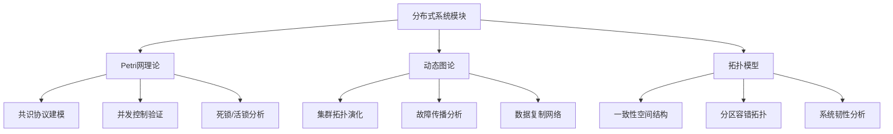
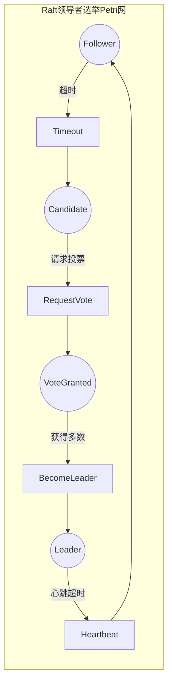
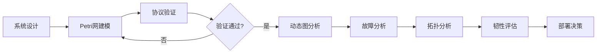

# 分布式系统模块理论关系梳理 / Distributed System Module Theory Relationship Analysis

## 📚 **概述 / Overview**

**文档目的**: 梳理分布式系统模块与三大理论（Petri网、动态图论、拓扑模型）的关系，揭示分布式系统设计、验证和分析中的理论基础。

**核心内容**:

- 分布式系统与Petri网的关系（并发建模、共识验证）
- 分布式系统与动态图论的关系（拓扑演化、故障传播）
- 分布式系统与拓扑模型的关系（一致性空间、韧性分析）
- 跨理论应用模式

**适用对象**: 分布式系统架构师、后端工程师、可靠性工程师

---

## 📋 **目录 / Table of Contents**

- [分布式系统模块理论关系梳理 / Distributed System Module Theory Relationship Analysis](#分布式系统模块理论关系梳理--distributed-system-module-theory-relationship-analysis)
  - [📚 **概述 / Overview**](#-概述--overview)
  - [📋 **目录 / Table of Contents**](#-目录--table-of-contents)
  - [🎯 **一、模块概述 / Part 1: Module Overview**](#-一模块概述--part-1-module-overview)
  - [🔗 **二、与Petri网理论的关系 / Part 2: Relationship with Petri Net Theory**](#-二与petri网理论的关系--part-2-relationship-with-petri-net-theory)
  - [📊 **三、与动态图论的关系 / Part 3: Relationship with Dynamic Graph Theory**](#-三与动态图论的关系--part-3-relationship-with-dynamic-graph-theory)
  - [🔬 **四、与拓扑模型的关系 / Part 4: Relationship with Topological Models**](#-四与拓扑模型的关系--part-4-relationship-with-topological-models)
  - [🔧 **五、跨理论应用模式 / Part 5: Cross-Theory Application Patterns**](#-五跨理论应用模式--part-5-cross-theory-application-patterns)
  - [📚 **六、参考文档 / Part 6: Reference Documents**](#-六参考文档--part-6-reference-documents)

---

## 🎯 **一、模块概述 / Part 1: Module Overview**

### 1.1 分布式系统模块核心内容

| 子模块 | 核心概念 | 主要问题 |
|--------|----------|----------|
| **分布式基础** | CAP定理、ACID、BASE | 一致性与可用性权衡 |
| **一致性协议** | Paxos、Raft、ZAB | 共识达成、领导者选举 |
| **区块链与共识** | PoW、PoS、PBFT | 拜占庭容错、去中心化 |
| **分布式事务** | 2PC、3PC、Saga | 原子性、隔离性 |

### 1.2 理论关联概览



---

## 🔗 **二、与Petri网理论的关系 / Part 2: Relationship with Petri Net Theory**

### 2.1 分布式概念映射

| 分布式概念 | Petri网对应 | 映射说明 |
|------------|-------------|----------|
| **节点状态** | 库所(Place) | 每个节点的状态空间 |
| **消息传递** | 变迁(Transition) | 消息发送/接收/处理 |
| **资源/锁** | 令牌(Token) | 分布式锁、资源配额 |
| **并发操作** | 并发变迁 | 多节点同时执行 |

### 2.2 共识协议Petri网建模

**Raft协议建模**:

```
库所（每个节点）:
- P_Follower: 跟随者状态
- P_Candidate: 候选者状态
- P_Leader: 领导者状态
- P_VoteGranted: 已投票
- P_LogEntry: 日志条目

变迁:
- T_Timeout: 选举超时
- T_RequestVote: 请求投票
- T_GrantVote: 授予投票
- T_BecomeLeader: 成为领导者
- T_AppendEntry: 追加日志
- T_Commit: 提交日志

分析:
- 安全性: 最多一个Leader（S-不变量）
- 活性: 最终选出Leader（活性分析）
- 日志一致性: 所有节点日志最终一致
```

### 2.3 一致性协议验证

| 协议 | Petri网分析 | 验证性质 |
|------|-------------|----------|
| **Paxos** | 多阶段状态机 | 安全性（Agreement） |
| **Raft** | 领导者选举+日志复制 | 领导者唯一性 |
| **2PC** | 协调者-参与者 | 原子性、阻塞检测 |
| **PBFT** | 拜占庭状态机 | f<n/3容错 |

### 2.4 Mermaid示意图



---

## 📊 **三、与动态图论的关系 / Part 3: Relationship with Dynamic Graph Theory**

### 3.1 集群拓扑映射

| 分布式概念 | 动态图对应 | 映射说明 |
|------------|------------|----------|
| **集群节点** | 顶点(Vertex) | 服务实例、数据节点 |
| **网络连接** | 边(Edge) | 节点间通信链路 |
| **复制关系** | 有向边 | 主从复制方向 |
| **拓扑变化** | 图演化 | 节点上下线、网络分区 |

### 3.2 故障传播分析

**级联故障分析**:

```
集群拓扑 → 动态图构建
         ↓
    节点: 服务实例（带健康状态）
    边: 依赖关系（带权重）
    属性: 负载、响应时间、错误率
         ↓
    分析: 故障传播路径（BFS/DFS）
          关键节点识别（介数中心性）
          故障域隔离（社区检测）
```

### 3.3 数据复制网络

| 分析类型 | 图方法 | 应用场景 |
|----------|--------|----------|
| **复制拓扑** | 有向图遍历 | 主从链路分析 |
| **同步延迟** | 最短路径 | 复制延迟估算 |
| **分区检测** | 连通性分析 | 网络分区发现 |
| **负载均衡** | 最大流算法 | 请求分发优化 |

### 3.4 集群演化追踪

| 演化事件 | 图操作 | 分析目标 |
|----------|--------|----------|
| **节点加入** | 添加顶点和边 | 容量扩展影响 |
| **节点故障** | 删除顶点 | 故障影响范围 |
| **网络分区** | 边删除 | 可用性影响 |
| **重平衡** | 边权重调整 | 负载分布变化 |

---

## 🔬 **四、与拓扑模型的关系 / Part 4: Relationship with Topological Models**

### 4.1 一致性空间拓扑

| 分布式概念 | 拓扑对应 | 映射说明 |
|------------|----------|----------|
| **一致性级别** | 拓扑空间 | 不同一致性的配置空间 |
| **状态演化** | 连续路径 | 系统状态的连续变化 |
| **最终一致** | 同伦收敛 | 最终到达一致状态 |
| **CAP边界** | 拓扑边界 | 不可同时达到的区域 |

### 4.2 分区容错拓扑分析

**网络分区的拓扑视角**:

```
集群状态空间 → 点云构建
              ↓
    过滤: 基于节点间距离/延迟
    持久同调: 分析连通性结构
              ↓
    分析: β₀（连通分量）→ 分区数量
          β₁（循环）→ 冗余路径
          持久性 → 分区稳定性
```

### 4.3 系统韧性分析

| 分析类型 | 拓扑方法 | 应用 |
|----------|----------|------|
| **韧性评估** | 贝蒂数分析 | 系统连通性鲁棒性 |
| **恢复路径** | 同伦分析 | 故障恢复可行性 |
| **容量边界** | Mapper算法 | 系统容量可视化 |

---

## 🔧 **五、跨理论应用模式 / Part 5: Cross-Theory Application Patterns**

### 5.1 分布式系统分析流水线



### 5.2 典型场景理论选择

| 场景 | 首选理论 | 分析方法 |
|------|----------|----------|
| **共识协议设计** | Petri网 | 状态机建模+形式化验证 |
| **故障传播分析** | 动态图论 | 级联故障+中心性分析 |
| **容量规划** | 拓扑模型 | Mapper可视化+边界分析 |
| **一致性验证** | Petri网+动态图 | 协议验证+状态追踪 |

### 5.3 典型案例：Kafka集群分析

**多理论综合分析**:

```
1. Petri网分析（协议正确性）:
   - 建模生产者-消费者-Broker交互
   - 验证消息不丢失（S-不变量）
   - 分析消费者组重平衡

2. 动态图分析（集群拓扑）:
   - 构建Broker-Partition-Consumer图
   - 追踪Partition重分配
   - 分析消费延迟传播

3. 拓扑分析（系统特性）:
   - 分析吞吐量边界
   - 检测热点Partition
   - 评估集群韧性
```

### 5.4 工具链对应

| 分析阶段 | 推荐工具 | 理论基础 |
|----------|----------|----------|
| **协议建模** | TLA+, CPN Tools | Petri网/时序逻辑 |
| **形式化验证** | TLC, Spin | 模型检验 |
| **拓扑分析** | NetworkX, Neo4j | 动态图论 |
| **监控追踪** | Prometheus, Jaeger | 可观测性 |
| **混沌测试** | Chaos Monkey, LitmusChaos | 故障注入 |

---

## 📚 **六、参考文档 / Part 6: Reference Documents**

### 6.1 模块内文档

- [分布式系统模块README](../../04-分布式系统/README.md)
- [分布式基础](../../04-分布式系统/01-分布式基础.md)
- [一致性协议](../../04-分布式系统/02-一致性协议.md)
- [区块链与共识](../../04-分布式系统/03-区块链与共识网络.md)

### 6.2 相关理论文档

- [Petri网理论逻辑脉络](01-Petri网理论逻辑脉络.md)
- [动态图论逻辑脉络](02-动态图论逻辑脉络.md)
- [拓扑模型逻辑脉络](03-拓扑模型逻辑脉络.md)

### 6.3 应用模式文档

- [分布式系统应用模式](../../13-应用模式归纳/02-分布式系统应用模式/)
- [区块链应用模式](../../13-应用模式归纳/05-区块链应用模式/)

---

**文档版本**: v1.0
**创建时间**: 2025年1月
**最后更新**: 2025年1月
**状态**: ✅ 完成
**维护者**: GraphNetWorkCommunicate项目组
