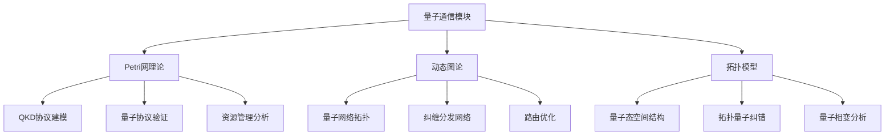
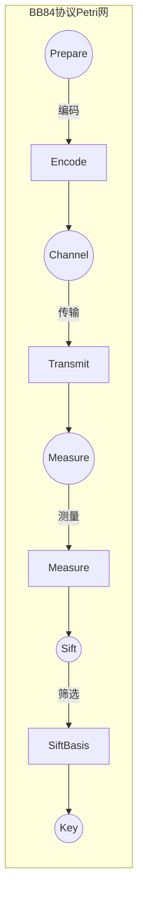
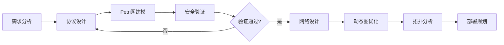

# 量子通信模块理论关系梳理 / Quantum Communication Module Theory Relationship Analysis

## 📚 **概述 / Overview**

**文档目的**: 梳理量子通信模块与三大理论（Petri网、动态图论、拓扑模型）的关系，揭示量子通信协议设计和量子网络分析中的理论基础。

**核心内容**:

- 量子通信与Petri网的关系（协议建模、安全验证）
- 量子通信与动态图论的关系（量子网络拓扑）
- 量子通信与拓扑模型的关系（量子态空间、纠错码）
- 跨理论应用模式

**适用对象**: 量子通信研究者、量子网络工程师、密码学研究者

---

## 📋 **目录 / Table of Contents**

- [量子通信模块理论关系梳理 / Quantum Communication Module Theory Relationship Analysis](#量子通信模块理论关系梳理--quantum-communication-module-theory-relationship-analysis)
  - [📚 **概述 / Overview**](#-概述--overview)
  - [📋 **目录 / Table of Contents**](#-目录--table-of-contents)
  - [🎯 **一、模块概述 / Part 1: Module Overview**](#-一模块概述--part-1-module-overview)
    - [1.1 量子通信模块核心内容](#11-量子通信模块核心内容)
    - [1.2 理论关联概览](#12-理论关联概览)
  - [🔗 **二、与Petri网理论的关系 / Part 2: Relationship with Petri Net Theory**](#-二与petri网理论的关系--part-2-relationship-with-petri-net-theory)
    - [2.1 量子协议概念映射](#21-量子协议概念映射)
    - [2.2 QKD协议Petri网建模](#22-qkd协议petri网建模)
    - [2.3 量子协议验证](#23-量子协议验证)
    - [2.4 Mermaid示意图](#24-mermaid示意图)
  - [📊 **三、与动态图论的关系 / Part 3: Relationship with Dynamic Graph Theory**](#-三与动态图论的关系--part-3-relationship-with-dynamic-graph-theory)
    - [3.1 量子网络拓扑映射](#31-量子网络拓扑映射)
    - [3.2 纠缠分发网络](#32-纠缠分发网络)
    - [3.3 量子网络路由](#33-量子网络路由)
    - [3.4 时变量子网络](#34-时变量子网络)
  - [🔬 **四、与拓扑模型的关系 / Part 4: Relationship with Topological Models**](#-四与拓扑模型的关系--part-4-relationship-with-topological-models)
    - [4.1 量子态空间拓扑](#41-量子态空间拓扑)
    - [4.2 拓扑量子纠错](#42-拓扑量子纠错)
    - [4.3 量子网络拓扑特性](#43-量子网络拓扑特性)
  - [🔧 **五、跨理论应用模式 / Part 5: Cross-Theory Application Patterns**](#-五跨理论应用模式--part-5-cross-theory-application-patterns)
    - [5.1 量子通信系统设计流水线](#51-量子通信系统设计流水线)
    - [5.2 理论选择指南](#52-理论选择指南)
    - [5.3 典型案例：量子密钥分发网络](#53-典型案例量子密钥分发网络)
    - [5.4 工具链对应](#54-工具链对应)
  - [📚 **六、参考文档 / Part 6: Reference Documents**](#-六参考文档--part-6-reference-documents)
    - [6.1 模块内文档](#61-模块内文档)
    - [6.2 相关理论文档](#62-相关理论文档)
    - [6.3 应用模式文档](#63-应用模式文档)

---

## 🎯 **一、模块概述 / Part 1: Module Overview**

### 1.1 量子通信模块核心内容

| 子模块 | 核心概念 | 主要问题 |
|--------|----------|----------|
| **量子基础** | 量子比特、叠加、纠缠 | 量子态表示与操作 |
| **量子密钥分发** | BB84、E91、QKD | 密钥安全性、窃听检测 |
| **量子网络** | 量子中继、纠缠交换 | 远距离量子通信 |
| **量子纠错** | 量子纠错码、容错计算 | 噪声对抗、保真度 |

### 1.2 理论关联概览



---

## 🔗 **二、与Petri网理论的关系 / Part 2: Relationship with Petri Net Theory**

### 2.1 量子协议概念映射

| 量子概念 | Petri网对应 | 映射说明 |
|----------|-------------|----------|
| **协议状态** | 库所(Place) | 量子协议的经典控制状态 |
| **量子操作** | 变迁(Transition) | 量子门、测量、通信 |
| **量子资源** | 令牌(Token) | 量子比特、纠缠对、密钥比特 |
| **并行操作** | 并发变迁 | 多方量子协议 |

### 2.2 QKD协议Petri网建模

**BB84协议建模**:

```
库所:
- P_AlicePrepare: Alice准备量子态
- P_QuantumChannel: 量子信道传输
- P_BobMeasure: Bob测量
- P_ClassicalChannel: 经典信道通信
- P_SiftedKey: 筛选后的密钥
- P_FinalKey: 最终密钥

变迁:
- T_Encode: Alice编码（基+比特）
- T_Transmit: 量子态传输
- T_Measure: Bob测量（随机基）
- T_SiftBasis: 基对比筛选
- T_ErrorEstimate: 错误率估计
- T_PrivacyAmplify: 隐私放大

分析:
- 安全性: 窃听导致错误率上升
- 完整性: 协议正确完成
- 密钥率: 最终密钥产出率
```

### 2.3 量子协议验证

| 协议 | Petri网分析 | 验证性质 |
|------|-------------|----------|
| **BB84** | 状态机+概率分析 | 无条件安全性 |
| **E91** | 纠缠态建模 | Bell不等式验证 |
| **QKD网络** | 多方协议 | 端到端安全性 |
| **量子隐形传态** | 纠缠消耗 | 保真度保证 |

### 2.4 Mermaid示意图



---

## 📊 **三、与动态图论的关系 / Part 3: Relationship with Dynamic Graph Theory**

### 3.1 量子网络拓扑映射

| 量子概念 | 动态图对应 | 映射说明 |
|----------|------------|----------|
| **量子节点** | 顶点(Vertex) | 量子处理器、中继器 |
| **量子信道** | 边(Edge) | 光纤、自由空间链路 |
| **纠缠连接** | 带属性边 | 纠缠对、保真度 |
| **网络演化** | 图演化 | 纠缠建立与衰减 |

### 3.2 纠缠分发网络

**纠缠交换网络分析**:

```
量子网络拓扑 → 动态图构建
              ↓
    节点: 量子节点（能力：存储、处理）
    边: 纠缠链路（保真度、生成率）
    属性: 距离、噪声、延迟
              ↓
    分析: 纠缠路由（最优路径）
          容量分析（纠缠生成率）
          网络连通性（覆盖范围）
```

### 3.3 量子网络路由

| 分析类型 | 图方法 | 应用场景 |
|----------|--------|----------|
| **纠缠路由** | 带权最短路径 | 最优纠缠分发路径 |
| **网络容量** | 最大流算法 | 纠缠分发速率上界 |
| **韧性分析** | 连通性分析 | 节点故障影响 |
| **多路径** | k-最短路径 | 冗余路由设计 |

### 3.4 时变量子网络

| 演化事件 | 图操作 | 分析目标 |
|----------|--------|----------|
| **纠缠建立** | 边添加+属性设置 | 链路质量 |
| **纠缠衰减** | 边权重更新 | 保真度追踪 |
| **节点故障** | 顶点删除 | 网络重构 |
| **纯化操作** | 边属性更新 | 保真度提升 |

---

## 🔬 **四、与拓扑模型的关系 / Part 4: Relationship with Topological Models**

### 4.1 量子态空间拓扑

| 量子概念 | 拓扑对应 | 映射说明 |
|----------|----------|----------|
| **量子态空间** | Bloch球/Hilbert空间 | 量子态的几何表示 |
| **量子演化** | 连续路径 | 幺正演化 |
| **量子相变** | 拓扑相变 | 量子相的拓扑分类 |
| **拓扑量子比特** | 拓扑不变量 | 拓扑保护的量子信息 |

### 4.2 拓扑量子纠错

**拓扑量子纠错码**:

```
量子纠错码 → 拓扑结构
            ↓
    Surface Code: 2D格点上的拓扑码
    拓扑不变量: 同调群编码逻辑比特
    错误模型: 局部错误对应链
            ↓
    分析: 错误阈值（拓扑保护强度）
          解码算法（同调匹配）
          逻辑门（拓扑操作）
```

### 4.3 量子网络拓扑特性

| 分析类型 | 拓扑方法 | 应用 |
|----------|----------|------|
| **网络结构** | 持久同调 | 量子网络形状特征 |
| **连通性** | 贝蒂数 | 网络冗余度 |
| **覆盖分析** | Čech复形 | 通信覆盖范围 |

---

## 🔧 **五、跨理论应用模式 / Part 5: Cross-Theory Application Patterns**

### 5.1 量子通信系统设计流水线



### 5.2 理论选择指南

| 场景 | 首选理论 | 分析方法 |
|------|----------|----------|
| **协议安全性** | Petri网 | 状态机建模+形式化验证 |
| **网络规划** | 动态图论 | 拓扑优化+路由算法 |
| **纠错码设计** | 拓扑模型 | 同调理论+拓扑码 |
| **资源管理** | Petri网+动态图 | 资源建模+分配优化 |

### 5.3 典型案例：量子密钥分发网络

**多理论综合分析**:

```
1. Petri网分析（协议验证）:
   - 建模BB84/E91协议状态机
   - 验证协议安全性（窃听检测）
   - 分析密钥生成率

2. 动态图分析（网络优化）:
   - 构建量子网络拓扑图
   - 优化纠缠分发路由
   - 分析网络容量和韧性

3. 拓扑分析（结构特性）:
   - 分析网络覆盖和冗余
   - 设计拓扑量子纠错
   - 评估量子网络形状
```

### 5.4 工具链对应

| 分析阶段 | 推荐工具 | 理论基础 |
|----------|----------|----------|
| **协议设计** | CPN Tools, TLA+ | Petri网/时序逻辑 |
| **安全分析** | ProVerif, Tamarin | 形式化安全 |
| **网络仿真** | NetSquid, SimulaQron | 量子网络仿真 |
| **拓扑分析** | NetworkX, GUDHI | 图论/拓扑 |
| **量子计算** | Qiskit, Cirq | 量子编程 |

---

## 📚 **六、参考文档 / Part 6: Reference Documents**

### 6.1 模块内文档

- [量子通信模块README](../../05-量子通信/README.md)
- [量子基础](../../05-量子通信/01-量子基础.md)
- [量子密钥分发](../../05-量子通信/02-量子密钥分发.md)
- [量子网络与路由](../../05-量子通信/03-量子网络与路由.md)

### 6.2 相关理论文档

- [Petri网理论逻辑脉络](01-Petri网理论逻辑脉络.md)
- [动态图论逻辑脉络](02-动态图论逻辑脉络.md)
- [拓扑模型逻辑脉络](03-拓扑模型逻辑脉络.md)

### 6.3 应用模式文档

- [网络安全应用模式](../../13-应用模式归纳/04-网络安全应用模式/)

---

**文档版本**: v1.0
**创建时间**: 2025年1月
**最后更新**: 2025年1月
**状态**: ✅ 完成
**维护者**: GraphNetWorkCommunicate项目组
