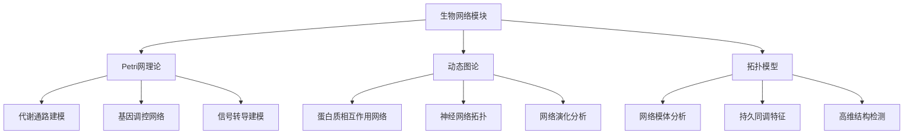
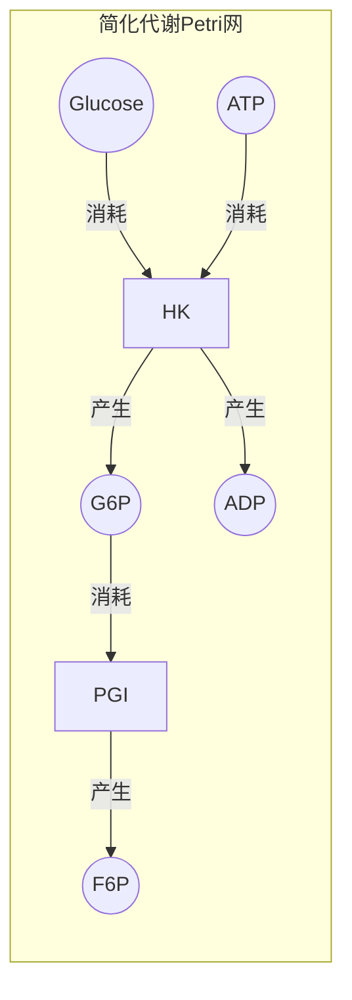
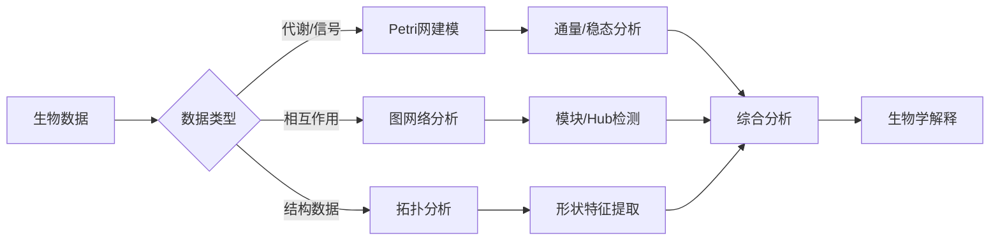

# 生物网络模块理论关系梳理 / Biological Network Module Theory Relationship Analysis

## 📚 **概述 / Overview**

**文档目的**: 梳理生物网络模块与三大理论（Petri网、动态图论、拓扑模型）的关系，揭示生物系统建模和分析中的理论基础。

**核心内容**:

- 生物网络与Petri网的关系（代谢通路、基因调控建模）
- 生物网络与动态图论的关系（蛋白质相互作用、神经网络拓扑）
- 生物网络与拓扑模型的关系（网络模体、持久同调分析）
- 跨理论应用模式

**适用对象**: 系统生物学研究者、生物信息学工程师、计算生物学家

---

## 📋 **目录 / Table of Contents**

- [生物网络模块理论关系梳理 / Biological Network Module Theory Relationship Analysis](#生物网络模块理论关系梳理--biological-network-module-theory-relationship-analysis)
  - [📚 **概述 / Overview**](#-概述--overview)
  - [📋 **目录 / Table of Contents**](#-目录--table-of-contents)
  - [🎯 **一、模块概述 / Part 1: Module Overview**](#-一模块概述--part-1-module-overview)
    - [1.1 生物网络模块核心内容](#11-生物网络模块核心内容)
    - [1.2 理论关联概览](#12-理论关联概览)
  - [🔗 **二、与Petri网理论的关系 / Part 2: Relationship with Petri Net Theory**](#-二与petri网理论的关系--part-2-relationship-with-petri-net-theory)
    - [2.1 生物概念映射](#21-生物概念映射)
    - [2.2 代谢网络Petri网建模](#22-代谢网络petri网建模)
    - [2.3 基因调控Petri网建模](#23-基因调控petri网建模)
    - [2.4 Mermaid示意图](#24-mermaid示意图)
  - [📊 **三、与动态图论的关系 / Part 3: Relationship with Dynamic Graph Theory**](#-三与动态图论的关系--part-3-relationship-with-dynamic-graph-theory)
    - [3.1 生物网络图映射](#31-生物网络图映射)
    - [3.2 蛋白质相互作用网络分析](#32-蛋白质相互作用网络分析)
    - [3.3 神经网络拓扑分析](#33-神经网络拓扑分析)
    - [3.4 网络动力学追踪](#34-网络动力学追踪)
  - [🔬 **四、与拓扑模型的关系 / Part 4: Relationship with Topological Models**](#-四与拓扑模型的关系--part-4-relationship-with-topological-models)
    - [4.1 网络拓扑特征](#41-网络拓扑特征)
    - [4.2 持久同调在生物网络中的应用](#42-持久同调在生物网络中的应用)
    - [4.3 网络模体的拓扑视角](#43-网络模体的拓扑视角)
  - [🔧 **五、跨理论应用模式 / Part 5: Cross-Theory Application Patterns**](#-五跨理论应用模式--part-5-cross-theory-application-patterns)
    - [5.1 生物网络分析流水线](#51-生物网络分析流水线)
    - [5.2 典型场景理论选择](#52-典型场景理论选择)
    - [5.3 典型案例：癌症网络分析](#53-典型案例癌症网络分析)
    - [5.4 工具链对应](#54-工具链对应)
  - [📚 **六、参考文档 / Part 6: Reference Documents**](#-六参考文档--part-6-reference-documents)
    - [6.1 模块内文档](#61-模块内文档)
    - [6.2 相关理论文档](#62-相关理论文档)

---

## 🎯 **一、模块概述 / Part 1: Module Overview**

### 1.1 生物网络模块核心内容

| 子模块 | 核心概念 | 主要问题 |
|--------|----------|----------|
| **神经网络** | 神经元、突触、信号传导 | 神经活动模式、信息编码 |
| **基因调控网络** | 转录因子、启动子、调控关系 | 基因表达调控、网络动力学 |
| **蛋白质相互作用** | 蛋白质复合物、信号通路 | 功能模块、疾病关联 |
| **代谢网络** | 代谢物、酶、反应通路 | 代谢流、稳态分析 |

### 1.2 理论关联概览



---

## 🔗 **二、与Petri网理论的关系 / Part 2: Relationship with Petri Net Theory**

### 2.1 生物概念映射

| 生物概念 | Petri网对应 | 映射说明 |
|----------|-------------|----------|
| **代谢物/底物** | 库所(Place) | 化学物质浓度 |
| **酶促反应** | 变迁(Transition) | 催化反应 |
| **分子数量** | 令牌(Token) | 分子计数/浓度 |
| **反应速率** | 变迁速率 | 动力学参数 |

### 2.2 代谢网络Petri网建模

**糖酵解通路建模**:

```
库所（代谢物）:
- P_Glucose: 葡萄糖
- P_G6P: 葡萄糖-6-磷酸
- P_F6P: 果糖-6-磷酸
- P_Pyruvate: 丙酮酸
- P_ATP: ATP
- P_ADP: ADP

变迁（酶促反应）:
- T_HK: 己糖激酶（葡萄糖→G6P）
- T_PGI: 磷酸葡萄糖异构酶（G6P→F6P）
- T_PK: 丙酮酸激酶（PEP→丙酮酸）

分析:
- 稳态分析: S-不变量→守恒定律
- 通量分析: T-不变量→基本通量模式
- 死锁检测: 代谢瓶颈识别
```

### 2.3 基因调控Petri网建模

| 调控元件 | Petri网对应 | 分析方法 |
|----------|-------------|----------|
| **基因** | 库所 | 表达状态（开/关） |
| **转录** | 变迁 | 基因激活/抑制 |
| **mRNA** | 令牌 | 转录产物数量 |
| **调控关系** | 弧 | 激活/抑制关系 |

### 2.4 Mermaid示意图



---

## 📊 **三、与动态图论的关系 / Part 3: Relationship with Dynamic Graph Theory**

### 3.1 生物网络图映射

| 生物概念 | 动态图对应 | 映射说明 |
|----------|------------|----------|
| **蛋白质/基因** | 顶点(Vertex) | 生物实体 |
| **相互作用** | 边(Edge) | 物理/功能关系 |
| **表达量** | 顶点属性 | 动态变化的节点权重 |
| **网络演化** | 图演化 | 发育/疾病过程 |

### 3.2 蛋白质相互作用网络分析

**PPI网络分析**:

```
蛋白质数据 → 动态图构建
            ↓
    节点: 蛋白质（带功能注释）
    边: 相互作用（实验/预测）
    属性: 表达量、亚细胞定位
            ↓
    分析: Hub蛋白识别（度中心性）
          功能模块检测（社区检测）
          必需基因预测（介数中心性）
```

### 3.3 神经网络拓扑分析

| 分析类型 | 图方法 | 应用场景 |
|----------|--------|----------|
| **连接组学** | 有向图分析 | 神经回路映射 |
| **小世界性** | 聚类+路径长度 | 信息传递效率 |
| **模块结构** | 社区检测 | 功能脑区识别 |
| **Hub节点** | 中心性分析 | 关键神经元识别 |

### 3.4 网络动力学追踪

| 演化事件 | 图操作 | 分析目标 |
|----------|--------|----------|
| **基因表达变化** | 节点属性更新 | 时序表达模式 |
| **蛋白质相互作用** | 边添加/删除 | 动态相互作用 |
| **发育过程** | 图结构演化 | 网络重塑 |
| **疾病进展** | 扰动分析 | 疾病机制 |

---

## 🔬 **四、与拓扑模型的关系 / Part 4: Relationship with Topological Models**

### 4.1 网络拓扑特征

| 生物概念 | 拓扑对应 | 映射说明 |
|----------|----------|----------|
| **网络模体** | 子图模式 | 基本功能单元 |
| **网络结构** | 单纯复形 | 高阶相互作用 |
| **功能模块** | 连通分量 | 功能聚类 |
| **网络洞** | 贝蒂数 | 结构特征 |

### 4.2 持久同调在生物网络中的应用

**蛋白质结构分析**:

```
蛋白质结构 → 点云构建（原子坐标）
            ↓
    过滤: Rips复形/Alpha复形
    持久同调: 计算拓扑特征
            ↓
    分析: β₀（连通分量）→ 结构域
          β₁（循环）→ 环状结构
          β₂（空腔）→ 口袋/空腔
```

### 4.3 网络模体的拓扑视角

| 分析类型 | 拓扑方法 | 应用 |
|----------|----------|------|
| **模体检测** | 子图同构 | 调控模体识别 |
| **高阶结构** | 单纯复形 | 多体相互作用 |
| **网络比较** | 持久图距离 | 跨物种比较 |
| **功能预测** | 拓扑特征 | 蛋白质功能 |

---

## 🔧 **五、跨理论应用模式 / Part 5: Cross-Theory Application Patterns**

### 5.1 生物网络分析流水线



### 5.2 典型场景理论选择

| 场景 | 首选理论 | 分析方法 |
|------|----------|----------|
| **代谢建模** | Petri网 | 通量平衡+不变量分析 |
| **PPI分析** | 动态图论 | 中心性+社区检测 |
| **蛋白质结构** | 拓扑模型 | 持久同调+形状分析 |
| **调控动力学** | Petri网+动态图 | 状态转换+网络演化 |

### 5.3 典型案例：癌症网络分析

**多理论综合分析**:

```
1. Petri网分析（信号通路）:
   - 建模关键信号通路（如p53通路）
   - 分析突变对通路的影响
   - 识别药物靶点

2. 动态图分析（相互作用网络）:
   - 构建癌症相关PPI网络
   - 识别驱动基因（Hub分析）
   - 检测功能模块（社区检测）

3. 拓扑分析（结构特征）:
   - 分析网络拓扑变化
   - 识别网络扰动模式
   - 预测疾病生物标志物
```

### 5.4 工具链对应

| 分析阶段 | 推荐工具 | 理论基础 |
|----------|----------|----------|
| **Petri网建模** | CellDesigner, Snoopy | Petri网 |
| **通量分析** | COBRA, COBRApy | 代谢建模 |
| **图分析** | Cytoscape, NetworkX | 动态图论 |
| **拓扑分析** | GUDHI, Ripser | TDA |
| **综合分析** | R/Bioconductor | 生物信息学 |

---

## 📚 **六、参考文档 / Part 6: Reference Documents**

### 6.1 模块内文档

- [生物网络模块README](../../06-生物网络/README.md)
- [神经网络](../../06-生物网络/01-神经网络.md)
- [基因调控网络](../../06-生物网络/02-基因调控网络.md)
- [网络模体与异质性](../../06-生物网络/03-网络模体与异质性.md)

### 6.2 相关理论文档

- [Petri网理论逻辑脉络](01-Petri网理论逻辑脉络.md)
- [动态图论逻辑脉络](02-动态图论逻辑脉络.md)
- [拓扑模型逻辑脉络](03-拓扑模型逻辑脉络.md)

---

**文档版本**: v1.0
**创建时间**: 2025年1月
**最后更新**: 2025年1月
**状态**: ✅ 完成
**维护者**: GraphNetWorkCommunicate项目组
